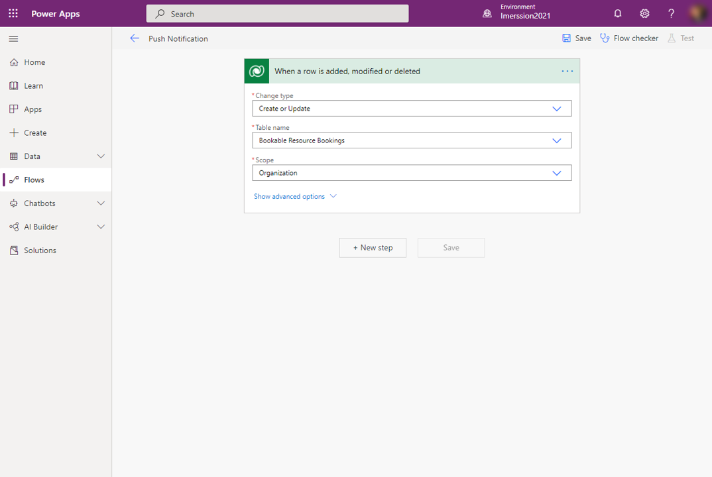
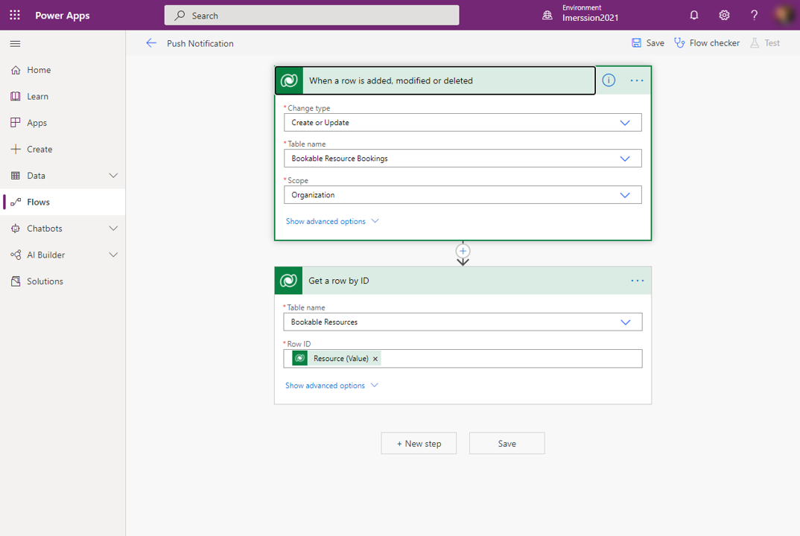
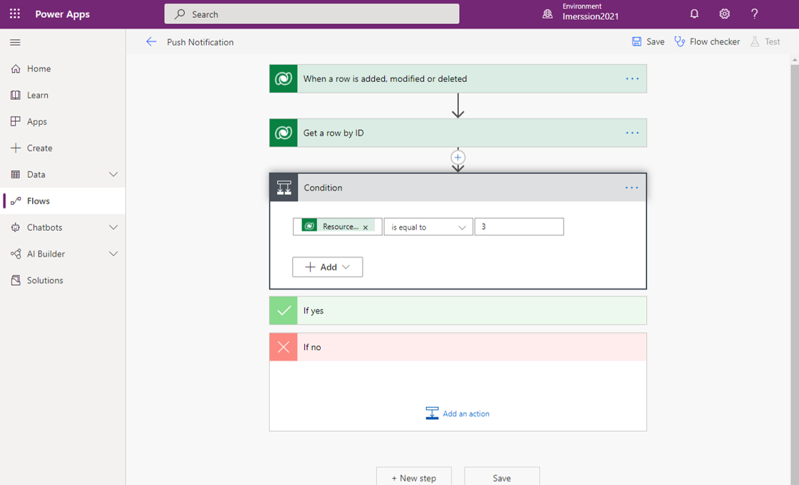
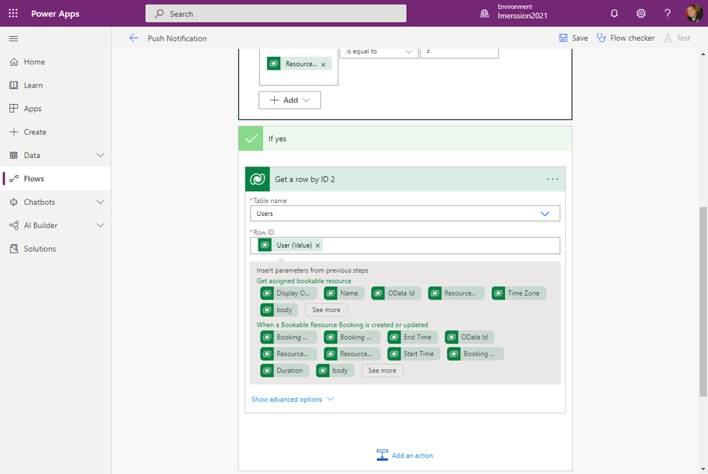
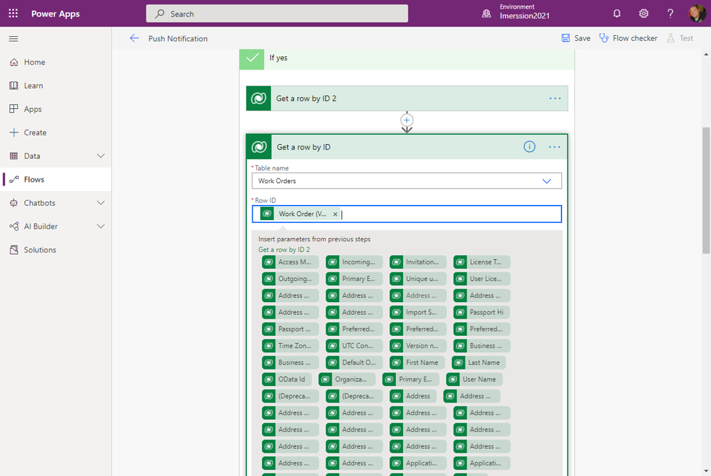
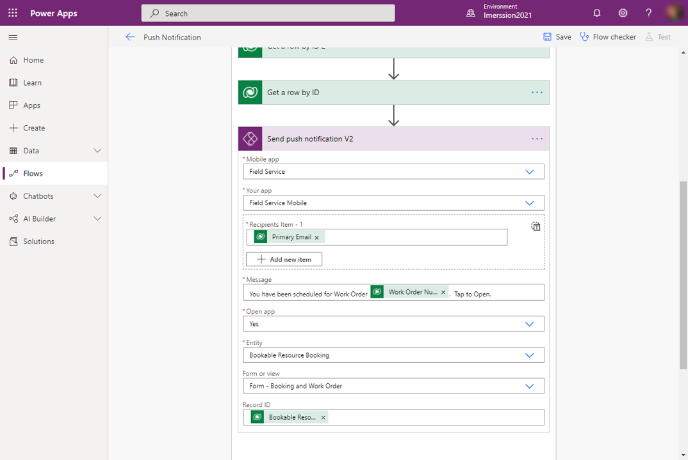

خلال اليوم، بما أن العاملين في الخطوط الأمامية في الحقل، قد تحدث مواقف معينة يجب أن يكونوا على دراية بها. على سبيل المثال، قد يتم تعيينهم للعمل على أمر عمل طارئ بدلاً من الأمر الذي تم جدولته في الأصل لأنهم أقرب أشخاص مؤهلين. إذا لم يتم تنبيههم بالتغيير، فمن المحتمل أن ينتقلوا إلى صنف العمل المجدول الأصلي الخاص بهم. في تطبيق Field Service Mobile، تتيح لك الإخطارات الفورية إرسال تحديثات للعاملين في الخطوط الأمامية من خلال أجهزتهم المحمولة أو أجهزة الكمبيوتر اللوحية.

يمكن استخدام الإخطارات الفورية في:

- إخطار العاملين عندما يتم تعيين حجز لهم.

- تذكير العاملين بإدخال بيانات العمل المهمة.

> [!IMPORTANT]
> يتطلب إعداد الإخطارات الفورية التعرف على كيفية إنشاء سير عمل المجموعة في Power Automate وكيفية استخدام موصل Dataverse.

لمزيد من المعلومات، راجع [نظرة عامة على سير عمل المجموعة](/power-automate/overview-cloud/?azure-portal=true).

لمزيد من المعلومات، راجع [Microsoft Dataverse](/connectors/commondataserviceforapps/?azure-portal=true).

## المتطلبات الأساسية

لاستخدام الإخطارات الفورية في تطبيق Field Service Mobile، ستحتاج إلى استيفاء المتطلبات الأساسية التالية:

- تم التثبيت [Microsoft Power Automate](https://flow.microsoft.com/?azure-portal=true)

- تنزيل تطبيق Dynamics 365 Field Service ‏Mobile ‏v13.20101.19+ لأجهزة iOS أو v3.20101.19+ لأجهزة Android

- تم تقديم الموافقة على الإخطارات في إعدادات جهازك لتطبيق Field Service Mobile

- تمت مراجعة [إشعارات الخصوصية لإخطارات Field Service الفورية](/dynamics365/field-service/mobile-push-notifications-privacy/?azure-portal=true)

## إنشاء إخطار دفع

في Field Service، عندما تتم جدولة عامل في الخطوط الأمامية لإحدى المهام، يقوم النظام بإنشاء ما يسمى بسجل **حجز المورد القابل للحجز**. يحتوي هذا السجل على بيانات لوجستية ومعلوماتية تتعلق بالحجز.
هذا السجل هو الذي يجب أن يكون بمثابة أساس لتشغيل ودفع الإخطار.

بعد تحديد السجل الذي سيتم استخدامه، قم بمراجعة المثال التالي لكيفية إنجاز هذه المهمة باستخدام سير عمل المجموعة في Power Automate.
في حين أن كل سيناريو سيكون مختلفاً قليلاً، في مستوى عال، ستشبه العملية مسار الإجراءات التالي:

1. إنشاء وقت تشغيل سير العمل وتحديده.

1. حدد المورد القابل للحجز الذي تم تعيينه للحجز.

1. حدد الشرط (اختياري).

1. حدد مستخدم Field Service Mobile للإخطار.

1. احصل على معلومات إضافية (اختياري).

1. استدعاء إجراء دفع الإخطار.

1. عرض في تطبيق الهاتف المحمول.

## إنشاء وقت تشغيل سير العمل وتحديده.

تتمثل الخطوة الأولى في إنشاء سير العمل ثم تحديد كيفية تشغيله، مثل الإشارة إلى أنه يجب تشغيل سير العمل عند إنشاء حجز مورد قابل للحجز أو تحديثه. ستضمن هذه المواصفات إخطار عامل الخط الأمامي عند إنشاء حجز جديد وإذا تم تغيير أحد التواريخ أو الأوقات في حجز موجود.

ونظراً لأنه يتم تخزين كافة معلومات Field Service المتعلقة بالحجز في Dataverse، فإن أبسط طريقة لتشغيل سير العمل هي استخدام موصل Dataverse. يوفر هذا الأسلوب مشغلات وإجراءات مختلفة يمكن استخدامها في مقابل مثيل Dataverse. في هذا المثال، نظراً لأنك تريد تشغيل سير العمل عند إنشاء حجز مورد قابل للحجز أو تحديثه لأي شخص في المؤسسة، فسوف تقوم بتكوين المشغل كما هو معروض في الصورة التالية.

> [!div class="mx-imgBorder"]
> 

لمزيد من المعلومات، راجع [‏‫المشغلات](/connectors/commondataserviceforapps/?azure-portal=true#triggers).

## حدد المورد القابل للحجز الذي تم تعيينه للحجز

يتم تعيين كل حجز لمورد قابل للحجز، والذي يمكن أن يمثل:

- مستخدم داخلي
- مقاول مستقل
- منشأة
- أحد المعدات يمكن استخدامها لإكمال أمر العمل

للتأكد من تعيين الإخطارات الفورية إلى الشخص الصحيح، ستحتاج إلى تحديد المورد الذي تم تعيين الحجز له.
يحتوي موصل Dataverse على إجراء يسمى **الحصول على صف من خلال المعرف**، والذي يمكنك استخدامه للإشارة إلى سجل معين. في هذا المثال، تقوم بالتمرير عبر المورد الذي تم تعيينه إلى الحجز للحصول على السجلات من جدول الموارد القابلة للحجز.

> [!div class="mx-imgBorder"]
> 

لمزيد من المعلومات، راجع [الحصول على صف من خلال المعرف](/connectors/commondataserviceforapps/?azure-portal=true#get-a-row-by-id).

## قم بإنشاء شرط لعزل الموارد التي تمثل المستخدمين فقط

يمكن أن تكون الموارد عبارة عن مستخدمين داخليين أو مقاولين مستقلين أو أداة إنشاء أو جزء من المعدات. المستخدمون الداخليون هم الموارد التي ستستخدم تطبيق الهاتف المحمول، لذلك نوصي بشدة بإضافة شرط إلى سير العمل الخاص بك للتحقق مما إذا كان تم تعيين **نوع المورد** على **مستخدم** في المورد. يساعد هذا الإعداد في ضمان إرسال الإخطارات الفورية فقط إلى الموارد التي تمثل المستخدمين، بدلاً من الموارد التي تمثل المعدات وتجميعات الموارد والمقاولين.

> [!div class="mx-imgBorder"]
> 

> [!IMPORTANT]
> على الرغم من أن تحديد الشرط ليس مطلوباً، إلا أنه من أفضل الممارسات التي ستساعدك على تقليل الأخطاء المحتملة في سير العمل الخاص بك والمساعدة في تسهيل استكشاف الأخطاء وإصلاحها في المستقبل.

لمزيد من المعلومات، راجع [إضافة شرط إلى سير عمل المجموعة](/power-automate/add-condition/?azure-portal=true).

## حدد مستخدم Field Service Mobile للإخطار

بعد التعرف على أن المورد هو المستخدم، ستحتاج إلى الحصول على معلومات من سجل المستخدم الخاص به حتى تتمكن من إرسال الإخطار إلى مستخدم تطبيق Field Service Mobile الصحيح. تتشابه هذه العملية مع ما قمت به عند تحديد المورد القابل للحجز الذي تم تعيين الحجز له في البداية. الاختلاف الرئيسي الوحيد في هذه العملية هو أنك ستضيف هذه المعلومات إلى منطقة **نعم** ثم تمرر قيمة المستخدم المخزنة في سجل المورد القابل للحجز إلى تحديد المستخدم الذي تريد الحصول عليه.

> [!div class="mx-imgBorder"]
> 

## الحصول على معلومات إضافية

قد ترغب في تضمين معلومات أخرى ذات صلة في الإخطار الفوري الذي تقوم بإرساله إلى المستخدم. على سبيل المثال، قد ترغب في تضمين رقم أمر العمل المرتبط بالحجز كجزء من الإخطار.
إذا كنت تخطط لتضمين تفاصيل أخرى من السجلات المرتبطة، مثل أمر العمل، فستحتاج إلى التقاط هذه المعلومات كما فعلت للمستخدم.
توضح الصورة التالية عملية الحصول على تفاصيل أمر العمل لأمر العمل المرتبط بالحجز.

> [!div class="mx-imgBorder"]
> 

## استدعاء إجراء دفع الإخطار

بعد تحديد المستخدم لإرسال الإخطار والبيانات المراد تضمينها، فإن خطوتك الأخيرة هي إنشاء وتحديد تفاصيل الإخطار. يشتمل موصل Microsoft Power Apps الخاص بالإخطارات V2 على إجراء **إرسال إخطار دفع V2** . يمكن استخدام هذا الإجراء لإرسال إخطارات الدفع إلى اللوحة والتطبيقات المستندة إلى النموذج. كما ذكرنا سابقاً، يعد Field Service Mobile تطبيقاً يستند إلى النموذج.

للتأكد من أن دفع الإخطارات يعمل على النحو المطلوب ويتم دفعه إلى التطبيق الصحيح، قم بتحديد المعلومات التالية:

- **تطبيق الأجهزة المحمولة** - يقوم بتحديد نوع التطبيق، مثل تطبيق من Power Apps أو Field Service. في هذا المثيل، ستقوم بتحديد "Field Service".

- **التطبيق الخاص بك** - يقوم بتعريف التطبيق المحدد الذي ترغب في إعداد الإخطار له.

ونظراً لأن عامل الخط الأمامي يتفاعل مع الإخطار، يمكنك تحديد السلوك المرتبط به. على سبيل المثال، إذا كان إخطار الدفع مرتبطاً بحجز جديد تم تعيينه، يمكنك فتح الحجز عندما يتفاعل المستخدم مع الإخطار.

وتساعد الحقول التالية في تحديد شكل هذا التفاعل:

- **فتح التطبيق** - يحدد ما إذا كان سيتم فتح تطبيق الجهاز المحمول عند تحديد الصنف أم لا.

- **الكيان** - يحدد الجدول الذي يحتوي على المعلومات المطلوب عرضها.
إذا كان حجزاً، فقم بتعيين هذا الحقل على **‏‫حجز المورد القابل للحجز**.

- **‏‫نموذج أو طريقة عرض** - يحدد النموذج أو طريقة العرض في التطبيق التي سيتم استخدامه لتقديم المعلومات. في هذا المثال، نظراً لأنك تريد عرض تفاصيل حول الحجز وأمر العمل، فستقوم بتحديد النموذج الحالي **النموذج - الحجز وطلب العمل**.

- **معرف السجل** - يحدد السجل الفعلي الذي تريد عرضه.

تتمثل الميزة الرئيسية لاستخدام مجموعات Power Automate في القدرة على استخدام المعلومات الديناميكية للخطوات السابقة. في هذا السيناريو، يمكنك إدراج المعلومات التي قمت بتجميعها سابقاً، مثل أمر العمل وتفاصيل المورد.
على سبيل المثال، يمكنك إدراج حقل **‏‫البريد الإلكتروني الأساسي** من سجل المستخدم في حقل **أصناف المستلمين** لتحديد الشخص الذي سيتم إرسال الإخطار إليه. يمكنك أيضاً إدراج قيمة ديناميكية، مثل رقم أمر العمل، في الرسالة التي سيتم إرسالها.

توضح لقطة الشاشة التالية عملية إنشاء إخطار بالدفع إلى عامل الخط الأمامي (مورد قابل للحجز) عند تعيين حجز جديد. وعند تحديد إخطار الدفع، سيقوم بفتح سجل **‏‫حجز المورد القابل للحجز** في نموذج **الحجز وأمر العمل**.

> [!div class="mx-imgBorder"]
> 

## عرض في تطبيق Field Service Mobile

لكي يتلقى عمال الخطوط الأمامية إخطارات الدفع، سيحتاجون إلى ضمان تمكينهم للإخطارات في التطبيق.
يمكنهم إنجاز هذه المهمة عند تشغيل التطبيق أو من منطقة **إعدادات** التطبيق.

بعد تمكين إخطارات الدفع، سيتم تشغيل سير عمل Power Automate عند إنشاء حجز أو تحديثه. سيتم عرض الإخطارات للعامل في الخط الأمامي الذي يستخدم الهاتف المحمول أو الكمبيوتر اللوحي. لا يلزم وجود العاملين في الخطوط الأمامية في الحقل في التطبيق أو استخدام أجهزتهم لتلقي الإخطارات الفورية.

> [!div class="mx-imgBorder"]
> 
