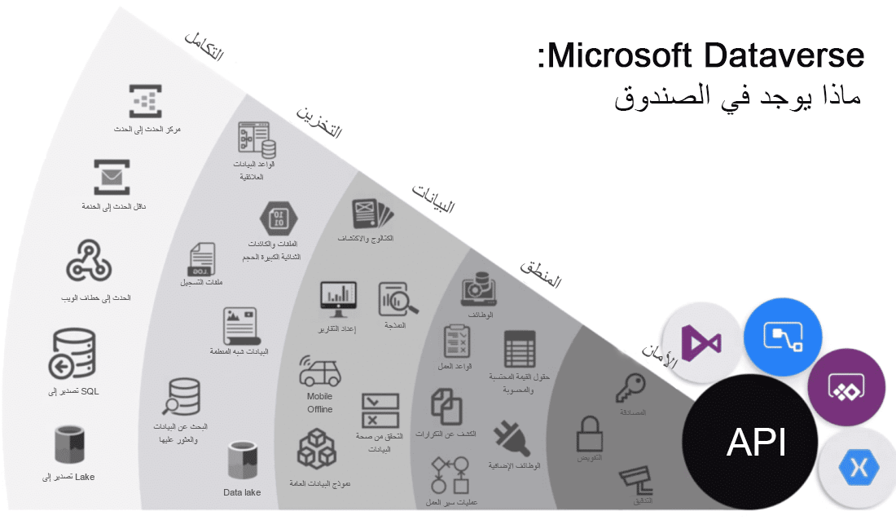
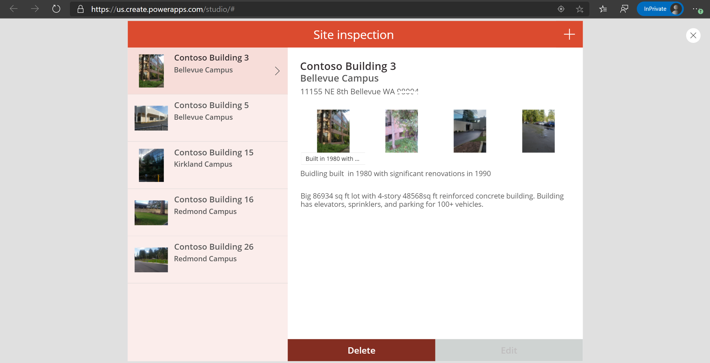

إن Microsoft Power Platform عبارة عن مجموعة من التطبيقات والخدمات والموصلات ومنصة البيانات التي توفر لك فرصة لإنشاء تطبيقات مخصصة لاحتياجات عملك. يتكون Microsoft Power Platform من أربعة منتجات رئيسية: Power Apps وPower Automate وPower BI وPower Virtual Agents.

تركز هذه الوحدة النمطية على Power Apps وتشرح كيف يمكنك استخدامه مع Microsoft Dynamics 365 Field Service. لا تشرح هذه الوحدة النمطية بشكل مفصل كيفية إنشاء الجداول أو التطبيقات.
توفر وحدة الملخص في هذه الوحدة النمطية ارتباطات إلى وحدات نمطية تعليمية أخرى لإنشاء التطبيقات في Power Apps.

يوفر Microsoft Power Apps بيئة تطوير سريعة ومنخفضة التعليمات البرمجية لإنشاء تطبيقات مخصصة لاحتياجات العمل. وهو يحتوي على خدمات وموصلات ونظام أساسي قابل للتطوير للتطبيقات وخدمة البيانات، Microsoft Dataverse، يمكنه مساعدتك من خلال تكامل وتفاعل بسيطين مع البيانات الموجودة. يمكّنك Power Apps من إنشاء تطبيقات الويب وتطبيقات الأجهزة المحمولة التي تعمل على جميع الأجهزة.

يستخدم الأشخاص التطبيقات في حياتهم اليومية، ولا ينبغي أن يكون سياق العمل استثناءً. معظم الحلول الجاهزة لا تلبي جميع احتياجات العمل ولا تتكامل بسهولة مع برامج الأعمال الأخرى. يسهل Power Apps على المستخدمين في تطوير التطبيقات باستخدام واجهة بسيطة بحيث يمكن لكل مستخدم أعمال أو مطور محترف إنشاء تطبيقات مخصصة.

## Microsoft Dataverse

إن Microsoft Dataverse عبارة عن نظام أساسي لخدمة البيانات والتطبيقات قائم على المجموعة ومنخفض التعليمات البرمجية يسمح لك بالاستفادة من ميزات الأمان والاتصال في خدمات Microsoft. يتصل Dataverse بجميع جوانب Microsoft Power Platform بحيث يمكنك التحكم في أعمالك وأتمتتها وتعزيزها. باستخدام الجداول والأعمدة القياسية، ومن خلال القدرة على تحديد العلاقات بين بياناتك، تم تصميم Dataverse للحلول الفعالة والقابلة للتطوير.

تم تصميم Dataverse ليكون مستودع البيانات المركزي لبيانات الأعمال، وربما تستخدمه بالفعل. تعمل خلف الكواليس على تشغيل العديد من حلول Microsoft Dynamics 365 مثل Field Service، Marketing، Customer Service، وSales. وهو متوفر أيضاً كجزء من Power Apps وMicrosoft Power Automate مع اتصال أصلي مدمج فيه.

تعرض الرسوم المرئية التالية عدداً كبيراً من عروض Microsoft Dataverse.

> [!div class="mx-imgBorder"]
> 

يقدم Microsoft Dataverse وظائف شاملة ويوفر الميزات التالية:

- **الأمان** - يعالج Dataverse المصادقة مع Microsoft Azure Active Directory (Azure AD) للسماح بالوصول المشروط والمصادقة متعددة العوامل. يدعم الأمان عملية المصادقة، وصولاً إلى مستوى الصفوف والعمود، ويوفر إمكانات تدقيق ثرية.

- **المنطق** - يسمح Dataverse لك بتطبيق منطق الأعمال على مستوى البيانات. تنطبق نفس القواعد، بغض النظر عن طريقة تفاعل المستخدم مع البيانات. قد تكون هذه القواعد مرتبطة الكشف عن التكرارات أو قواعد العمل أو مهام سير العمل أو أكثر.

- **البيانات** - يقدم لك Dataverse إمكانية التحكم في صياغة بياناتك، مما يسمح لك باكتشاف بياناتك وتصميمها والتحقق من صحتها وإعداد تقرير عنها.
تضمن هذه القدرة على التحكم ظهور بياناتك بالطريقة التي تريدها، بغض النظر عن كيفية استخدامها.

- **التخزين** - يخزّن Dataverse بياناتك الفعلية في مجموعة Azure.
يساعد هذا التخزين المستند إلى المجموعة على إزالة القلق بشأن مكان وجود بياناتك أو الطريقة التي تتوسع من خلالها. يتم التعامل مع هذه المخاوف نيابة عنك.

- **التكامل** - Dataverse يربط بطرق مختلفة لدعم احتياجات عملك. استمتع بمرونة في إدخال البيانات وإخراجها من خلال APIs، وخطافات الويب، والأحداث، وتصدير البيانات.

## الموصلات

يستخدم Microsoft Power Platform البيانات عبر العديد من الأنظمة الأساسية. للقيام بذلك، تستخدم مكونات Microsoft Power Platform الموصلات. يمكنك اعتبار الموصلات كجسر يمتد من مصدر بياناتك وصولاً إلى تطبيق أو سير عمل، مما يسمح بنقل المعلومات ذهاباً وإياباً.
وتتيح لك الموصلات إمكانية توسيع حلول الأعمال عبر المنصات وإضافة وظائف للمستخدمين.

يعد Microsoft Dataverse أحد هذه الموصلات. من خلال موصل Microsoft Dataverse، بإمكان Power Apps الوصول إلى البيانات المستخدمة في Dynamics 365 Field Service.

## Power Apps وDynamics 365 Field Service

باستخدام موصل Microsoft Dataverse، بإمكان Power Apps الاتصال بتطبيقات Dynamics 365، بما في ذلك تطبيقات Dynamics 365 Field Service.

يتم إنشاء الجداول والأعمدة المستخدمة لتخزين بيانات Field Service تلقائياً في Dataverse عند نشر Dynamics 365 Field Service.
يمكنك استخدام هذه الجداول والأعمدة في Power Apps. علاوةً على ذلك، يمكنك إنشاء جداول وأعمدة مخصصة في Dataverse لتلبية متطلبات معينة لم تتم تلبيتها بواسطة Dynamics 365 Field Service.

باستخدام الوظائف الأصلية لتطبيقات Dynamics 365 Field Service، يمكنك تضمين Power Apps. تسمح هذه الوظائف للمؤسسات باستخدام تطبيقات Field Service، جنباً إلى جنب مع Power Apps، لتلائم احتياجات العمل دون تخصيص كبير. علاوةً على ذلك، تسمح لك هذه الوظائف بالاتصال بخدمات ومصادر بيانات أخرى من دون الحاجة إلى خبرة في مجال التطوير.

## أنواع مختلفة من التطبيقات في Power Apps

يتضمن Power Apps Studio نوعين من التطبيقات: تطبيقات اللوحة والتطبيقات التي تستند إلى النموذج. يمكنك استخدام النوعين لإنشاء تطبيقات في Power Apps من شأنها أن تحل مشكلات العمل الخاصة بسيناريوهات المهام والأدوار.

يبدأ إنشاء **تطبيقات اللوحة** مع تجربة المستخدم، من خلال صياغة واجهة عالية التخصيص بفضل فعالية لوحة فارغة، ثم ربطها بأكثر من 500 مصدر بيانات من اختيارك. أحد مصادر البيانات هذه هو Microsoft Dataverse، حيث يمكنك إنشاء تطبيقات متصلة ببيانات Dynamics 365.

يمكنك إنشاء تطبيقات اللوحة لتطبيقات الويب والأجهزة المحمولة وأجهزة الكمبيوتر اللوحي، مع تصميم التطبيق عن طريق سحب العناصر وإفلاتها على اللوحة، تماماً كما تفعل مع تصميم شريحة في PowerPoint.
لا تُعد تطبيقات اللوحة بديلاً لجميع التخصيصات في Dynamics 365، ولكنها تعمل على توسيع إمكانياتك، خاصةً عندما تريد إنشاء تطبيقات موجهة نحو المهام.

> [!div class="mx-imgBorder"]
> 

يبدأ إنشاء **التطبيقات التي تستند إلى النموذج** مع نموذج بياناتك. يتم بناء التطبيقات التي تستند إلى النموذج بالاستناد إلى شكل بيانات العمل الأساسية ودورات العمل في Microsoft Dataverse لتصميم النماذج وطرق العرض والمكونات الأخرى.

على عكس تطوير تطبيق اللوحة، حيث يتمتع المصمم بالتحكم الكامل في تخطيط التطبيق، مع التطبيقات التي تستند إلى النموذج، ستحدد أنت الجزء الأكبر من التخطيط الذي يتم تصميمه بواسطة المكونات التي تضيفها إلى التطبيق. باستخدام التطبيقات التي تستند إلى النموذج، يمكنك إنشاء واجهة مستخدم رائعة تلقائياً تستجيب عبر الأجهزة وسيتم استخدام واجهة المستخدم هذه بواسطة تطبيقات Dynamics 365 Field Service. تصميم التطبيق الذي يستند إلى النموذج هو أسلوب يركز على المكونات لتطوير التطبيق ولا يتطلب تصميمه تعليمات برمجية.
بإمكان التطبيقات التي تستند إلى النموذج أن تكون بسيطة أو معقّدة.

> [!NOTE]
> تطبيقات Dynamics 365 Field Service هي تطبيقات تستند إلى النموذج وتستخدم Microsoft Dataverse لمخزن بياناتها.

**تطبيقات المدخل** هي تطبيقات ويب خارجية تتيح للمستخدمين من خارج المؤسسات تسجيل الدخول بهويات مختلفة بالإضافة إلى عرض البيانات وإنشائها في Dataverse.

بإمكان المستخدمين الداخليين والخارجيين لتطبيقات المدخل حماية الوصول المجهول إلى بياناتك. أو، يمكنهم اكتساب حق الوصول من خلال موفري المصادقة التجارية، مثل LinkedIn وMicrosoft وFacebook وGoogle أو من خلال موفري المؤسسات، مثل متاجرة عمل-مستهلك Azure AD. تسمح لك المداخل أيضاً بتعيين متطلبات المصادقة، وتخصيص البيانات لكل مستخدم، والسماح للمستخدمين بإرسال معلوماتهم بشكل خاص باستخدام عناصر تحكم إدارية مباشرة.

تقوم تطبيقات المدخل باستخدام Microsoft Dataverse للمحافظة على تكوينها، ويمكنك إضافة صفحات ويب وتغيير محتوى موقع المدخل من دون الحاجة إلى مطور ويب.

تتوفر القوالب لسيناريوهات مختلفة، بما في ذلك مدخل تجارب العملاء الذي يتم استخدامه مع Dynamics 365 Field Service.
