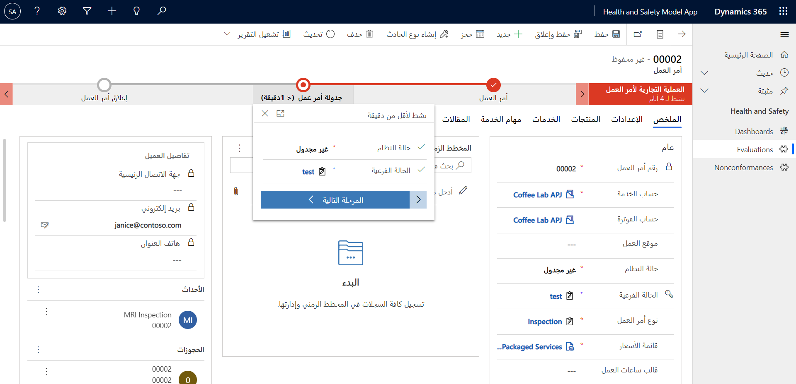
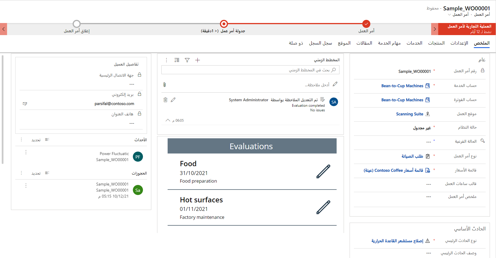

قد لا تتم تلبية متطلبات معينة لعمليات الخدمة الميدانية في الميزات الجاهزة من Dynamics 365 Field Service. يوفر كل من Dynamics 365 وMicrosoft Power Platform العديد من الخيارات لتخصيص Dynamics 365 Field Service وتوسيعه لتلبية هذه المتطلبات. 

فمثلاً، يمكنك استخدام Dynamics 365 وMicrosoft Power Platform لـ:

- للتحقق من صحة البيانات، استخدم الميزات المنطقية في Dataverse.

- أنشئ عمليات دفق Power Automate السحابية للتكامل مع الأنظمة الأخرى.

- استخدم مهام سير عمل Dataverse لتحديث الحالات وإرسال رسائل البريد الإلكتروني.

- إنشاء عناصر التحكم في Power Apps component framework لإنشاء تجارب UI غنية.

- يمكنك بناء المكونات الإضافية لتنفيذ منطق الأعمال.

> [!NOTE]
> تتم تغطية التخصيص والتوسيع مع Microsoft Power Platform بواسطة الشهادتين [PL-200](/learn/certifications/exams/pl-200?azure-portal=true) و[PL-400](/learn/certifications/exams/pl-400?azure-portal=true).

في العديد من السيناريوهات، قد تجد أنه من المفيد إنشاء تطبيقات جديدة باستخدام Power Apps بدلاً من تخصيص تطبيق Dynamics 365 Field Service.
مثلاً، يمكنك إنشاء تطبيق جديد يشارك البيانات من خلال تطبيق Microsoft Dataverse مع Dynamics 365 Field Service في حالة عدم توفير الوظيفة التي تطلبها بواسطة تطبيق Dynamics 365.

## سيناريو مثال

ضع في اعتبارك السيناريو التالي حيث تقوم المؤسسة بإجراء تدريب على الصحة والسلامة في مواقع العملاء. بينما يمكن لتطبيق الأجهزة المحمولة Field Service إدارة الحجوزات للمدرب، ويمكن لعمليات الفحص إجراء أسئلة وإجابات أساسية، فقد لا يتضمن تطبيق Field Service وظيفة المعالجة والتسجيل المطلوبين لتقييم التدريب. في المكتب، يتحقق المستخدمون من صحة النتائج ثم ينشؤون الشهادات والفشل، والتي تحتاج بعد ذلك إلى المعالجة وإعادة الاختبار.

قد يشمل الحل المحتمل لهذا المطلب ما يلي:

- الجداول والأعمدة المخصصة داخل Microsoft Dataverse.

- العلاقات من الجداول المخصصة إلى جدول أمر العمل وجدول جهة الاتصال.

- تطبيق اللوحة لالتقاط نتائج تقييم الصحة والسلامة مقابل أمر العمل.

- التطبيق المستند إلى النموذج لعرض نتائج التقييم.

- تدفق سحابة Power Automate لإنشاء الشهادات.

- سير إجراءات العمل لإدارة الخطوات في معالجة حالات الفشل.

- تعد لوحة معلومات Microsoft Power BI لإظهار الاتجاهات في التقييمات والسماح للإدارة بتحليل الدرجات.

- عمليات دفق Power Automate السحابية للإبلاغ عن حالات الفشل والتعامل مع موافقات إعادة الاختبار.

## تطبيقات اللوحة

يمثل إنشاء تطبيق اللوحة على الجداول التي يتم الاحتفاظ بها في Dataverse عملية مباشرة.
يمكنك إنشاء تطبيقات قائمة على المهام، مثل الحصول على نتائج التقييم، والتي تحفظ البيانات في Microsoft Dataverse.

تُظهر لقطة الشاشة التالية تطبيق اللوحة بسيط يرصد هذه البيانات.

> [!div class="mx-imgBorder"]
> 

## التطبيقات التي تستند إلى النموذج

تُظهر لقطة الشاشة التالية تطبيقاً بسيطاً يستند إلى النموذج يدير عملية أعمال التقييم.

> [!div class="mx-imgBorder"]
> 

## تضمين تطبيق اللوحة في نموذج مستند إلى نموذج

يمكنك إضفاء مرونة تطبيقات اللوحة إلى النماذج المستندة إلى نموذج، باستخدام تطبيقات اللوحة المضمنة. على سبيل المثال، باستخدام تطبيق اللوحة المضمن، يمكنك:

- عرض البيانات من مصادر مختلفة بجانب البيانات من Microsoft Dataverse.

- استخدام البيانات وتحديثها من مصادر البيانات الأخرى.

- التفاعل مع البيانات الموجودة في الحقول في نموذج التطبيق المستند إلى النموذج.

- يتم تشغيل عمليات دفق Power Automate من الأزرار في تطبيق اللوحة المضمّن.

- قم بتنفيذ منطق معقد غير ممكن في نماذج التطبيقات المستندة إلى نموذج دون الحاجة إلى التعليمات البرمجية.

- من خلال مجموعة معقدة من القرارات المستندة إلى البيانات، قم بإنشاء واجهة مستخدم شبيهة بالمعالج لتوجيه المستخدم.

> [!div class="mx-imgBorder"]
> 
