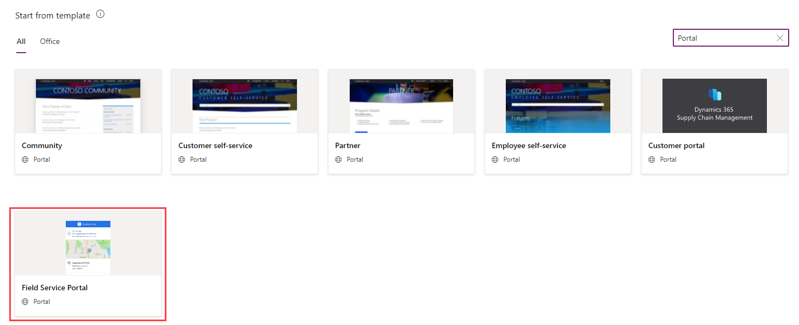
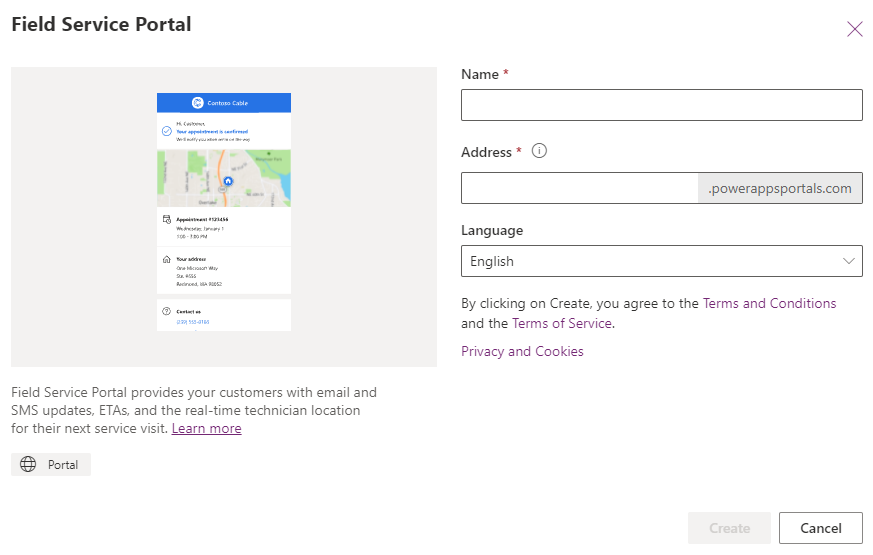
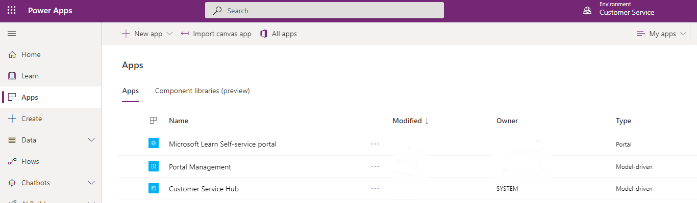
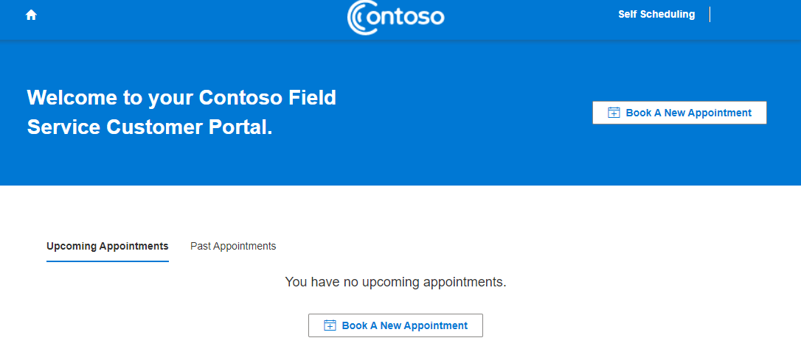
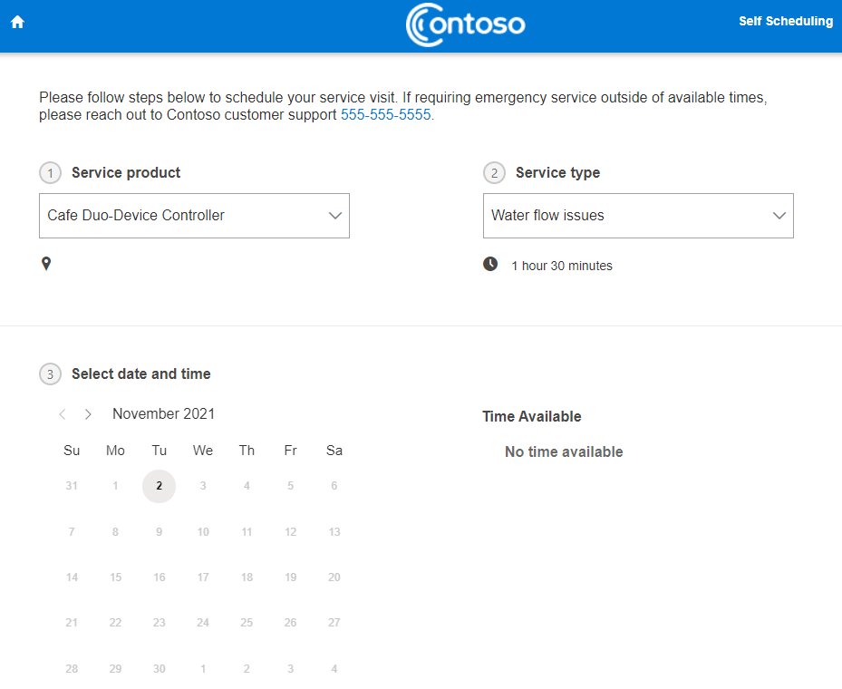
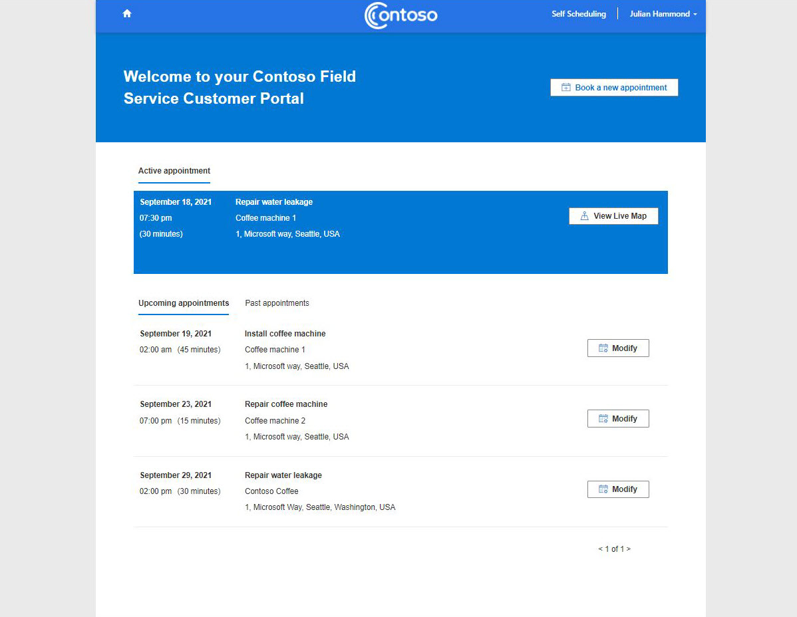
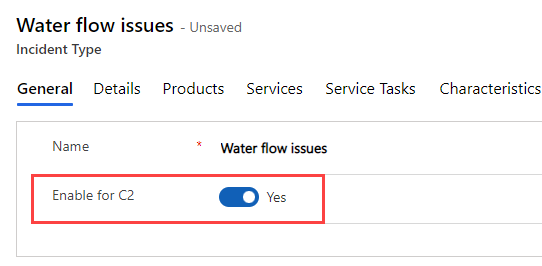

لإجراء حجوزات جديدة وإدارة الحجوزات الحالية وتتبع الفني الخاص بهم وتقديم التعليقات، توفر الصفحات الرئيسية لتجربة العملاء وجهة شاملة لعملائك.

## قوالب ‏‫المداخل

تتوفر قوالب المدخل وهي حلول مدخل مكوَّنة مسبقاً بهدف تسريع التوزيع. وتعد مداخل Power Apps قابلة للتخصيص، لكن سيوفر قالب المدخل بيئة مكونة مسبقاً وهي مناسبة على الفور لسيناريوهات محددة.

لتسريع تطوير الحل، يتضمن كل قالب مدخل إلكتروني مجموعة معينة من الميزات المصممة، والتي تستهدف الجمهور المحدد.

ينشئ قالب مدخل Field Service الصفحات الرئيسية لتجارب العملاء حتى يتمكن العملاء من حجز أوامر العمل بأنفسهم.

## توفير مدخل تجربة عملاء Field Service

الخطوات عالية المستوى لتوفير مدخل تجربة العملاء هي على النحو التالي:

1. انتقل إلى [مدخل منشئ Power Apps](https://make.powerapps.com?azure-portal=true).

1. باستخدام مُحدد البيئة في الزاوية العلوية اليُسرى من الشاشة، حدد بيئة Dynamics 365 Field Service.

1. في الجزء الأيمن، حدد **+ إنشاء**.

1. قم بالتمرير لأسفل إلى قسم **البدء من القالب**.

1. في مربع البحث على الجانب الأيسر من الشاشة، أدخل **مدخل**.

    > [!div class="mx-imgBorder"]
    > 

1. حدد قالب مدخل Field Service.

    > [!div class="mx-imgBorder"]
    > 

1. أدخل اسماً وعنواناً فريداً (URL) للمدخل الإلكتروني.

1. حدد اللغة.

1. حدد **إنشاء** لبدء عملية تزويد المدخل.

تستغرق عملية التزويد حوالي 45 دقيقة. وبعد اكتمال تزويد المدخل، سيظهر المدخل في القائمة كتطبيق من النوع مدخل.

> [!div class="mx-imgBorder"]
> 

## مدخل تجارب العملاء

توفر مدخل تجارب عملاء Field Service الميزات التالية للخدمة الذاتية للعملاء:

- حجوزات الجدول

- إدارة الحجوزات الموجودة

- تتبع فني المجال

- تقديم التعليقات

ستظهر شاشة مشابهة للصورة التالية عندما ينتقل العميل إلى المدخل.

> [!div class="mx-imgBorder"]
> 

## جدولة أحد الحجوزات

حدد الزر **حجز موعد جديد** إلى فتح صفحة الجدولة الذاتية.

> [!div class="mx-imgBorder"]
> 

يمكنك تحديد أصل العميل ثم تحديد نوع الخدمة. أصول العميل اختيارية. ستعرض الصفحة بعد ذلك فترات زمنية حيث تتوفر الموارد لتقديم الخدمة.

لإنشاء الحجز، حدد **الدفتر**.

> [!NOTE]
> يشار إلى الحجوزات بالمواعيد في الصفحات الرئيسية لتجربة العميل.

## إدارة الحجوزات

تسمح الصفحة الرئيسية لتجربة العميل للعملاء بتعديل الحجوزات وإلغائها.

## تعقب الفني

سيظهر الحجز على أنه نشط في مدخل تجربة العميل عندما يقوم الفني الميداني بتحديث حالة الحجز في حجز العميل إلى **السفر** أو **قيد التقدم**.

> [!div class="mx-imgBorder"]
> 

يمكن للعميل تحديد **عرض الخريطة المباشرة** لعرض موقع الفني الحالي ووقت وصوله المقدّر.

## التعليقات

إذا تم إنشاء استطلاع Microsoft Dynamics 365 Customer Voice وإعداده في إعدادات **مدخل العميل**، فسيكون العميل قادراً على تقديم تعليقات باستخدام مدخل تجارب العملاء عندما يتم تغيير حالة الحجز إلى **مكتمل**.

## العلامات التجارية

لتعيين العلامات التجارية للمدخل، انتقل إلى **الإعدادات > مدخل العميل > مدخل العميل** وحدد علامة التبويب **إعدادات العرض**.

في علامة التبويب هذه، يمكنك تعيين الخط والألوان للمدخل. لتغيير الشعار، يمكنك استخدام **محرر المدخل**.

## إعداد البريد الإلكتروني والرسائل النصية

سيصل العملاء إلى بوابة الخدمة الخاصة بهم من خلال ارتباط فريد يتم إرساله إلى بريدهم الإلكتروني أو كرسالة نصية. لإعداد هذه الميزة، ستحتاج إلى إعداد طريقة اتصال واحدة أو كلتيهما.

ستحتاج إلى تحرير بعض التدفقات السحابية لـ Power Automate وتشغيلها.
لتمكين هذه التدفقات في تطبيق Field Service، انتقل إلى **الإعدادات > مدخل العملاء > مدخل العملاء** وحدد الارتباطات أدناه.

> [!NOTE]
> بالنسبة للرسائل النصية، تحتاج إلى التسجيل للحصول على حساب Twilio.

## إعداد أنواع الحوادث

أنواع الخدمات التي يحددها العميل في المدخل هي أنواع الحوادث حيث تم تعيين مفتاح التبديل **تمكين لـ C2** إلى **نعم**.

> [!div class="mx-imgBorder"]
> 
