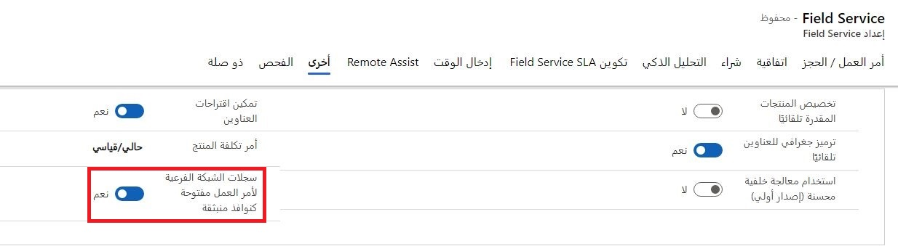
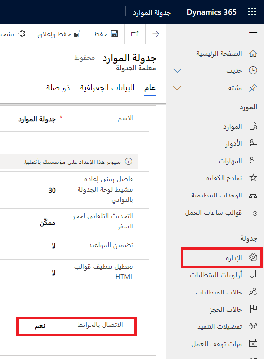
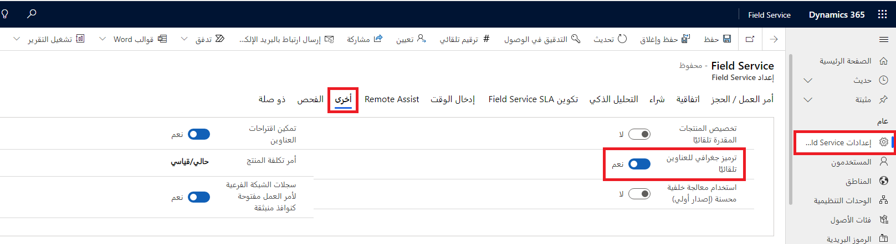
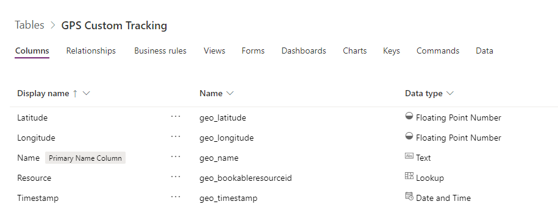
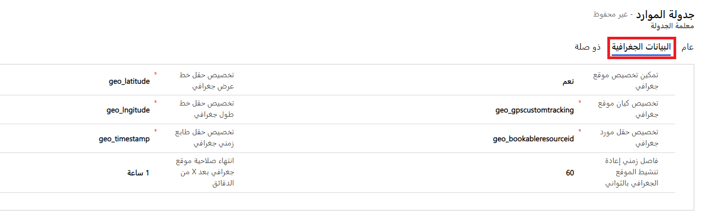

تضم Dynamics 365 Field Service العديد من المجالات حيث يمكنك تخصيص الوظيفة.
يمكنك إجراء هذه التخصيصات الموثقة في Dynamics 365 Field Service لتغيير طريقة عمل تطبيقات Field Service.

من بين الأمثلة الشائعة إضافة الحقول وإزالتها من نموذج أمر العمل، وكتابة مهام سير العمل، وإضافة JavaScript لملء البيانات تلقائياً، وتغيير شكل لوحة الجدولة، وتحرير خرائط موقع الويب وتطبيقات الأجهزة المحمولة.

تتضمن بعض التخصيصات المدعومة لـ Dynamics 365 Field Service ما يلي:

- **النماذج** - يمكنك إضافة أعمدة وإزالتها من النماذج. كن حريصاً عند إجراء التغييرات، خاصةً في نماذج أوامر العمل، بسبب وجود دالات JavaScript ومعالجة أخرى قد تعتمد على أعمدة معينة.

- **إعدادات واجهة مستخدم أمر العمل**‎ - يمكنك إعداد الشبكات الفرعية في أوامر العمل لفتح مربع حوار منبثق وعدم الانتقال إلى النموذج الرئيسي. يتحكم الإعداد **فتح سجلات طلب العمل الفرعي كنوافذ منبثقة** في كيفية فتح هذه السجلات. يمكنك تغيير هذا الإعداد بالانتقال إلى **إعدادات > عام > إعداد Field Service > أخرى**.

> [!div class="mx-imgBorder"]
> 

- **قواعد الحجز** - عرض التحذيرات أو رسائل الخطأ عند إنشاء حجز أو تحريره في لوحة الجدولة. يتم إنشاء قواعد الحجز باستخدام JavaScript ويتم تنفيذها باستخدام "موارد الويب".

- **مطابقة الموارد** - يمكنك توسيع البيانات المستخدمة لتصفية الموارد عند الجدولة باستخدام Universal FetchXML.

- **تطبيق Field service mobile**‎ - يتم دمج تطبيق Field service mobile مع Microsoft Power Platform ويمكن تخصيصه.

- **تقارير خدمة فنيي Field Service:** - حل لإنشاء أحد تقارير الخدمات لأمر عمل ما. لمزيد من المعلومات، راجع [تقارير خدمة فنيي Field Service](/dynamics365/field-service/mobile-powerapp-reporting?azure-portal=true).

- **الترميز الجغرافي**‎ - إنشاء خطوط الطول والعرض من العناوين وتتبع الموارد ومركباتها باستخدام خطوط الطول والعرض.

- **تمكين الجداول المخصصة للجدولة**‎ - يمكن جدولة السجلات المتوفرة في الجداول باستخدام Universal Resource Scheduling.

- **لوحات الجدولة** - تستخدم لإعداد لوحات الجدولة وتخصيصها.

لمزيد من المعلومات، راجع [تخصيص Dynamics 365 Field Service لتلبية احتياجات العمل الفريدة الخاصة بك](/dynamics365/field-service/field-service-customizations?azure-portal=true).

> [!IMPORTANT]
> لا يجب عليك إنشاء مكونات إضافية ومعالجة أخرى في الجداول الأساسية المستخدمة في جدولة الخدمات الميدانية (أمر العمل، وحجز الموارد القابل للحجز، ومتطلبات الموارد) لأنها قد تسبب مشكلات في المعالجة الجاهزة لإنشاء الحجوزات وتحديثها.

## تطبيق الأجهزة المحمولة Field Service

تم إنشاء تطبيق الأجهزة المحمولة Microsoft Dynamics 365 Field Service على Microsoft Power Platform. نتيجة لذلك، يمكنك تكييفها لتناسب الاحتياجات المحددة لمؤسستك.

المكونات الأساسية الثلاثة التي يمكن تعديلها هي:

- **مخطط الموقع**‎ - تحديد التنقل للتطبيق. يمكنك إضافة الجداول وإزالتها وتجميع الجداول المتشابهة للمساعدة على تسهيل تحديد المعلومات التي يحتاج الفني للعمل معها.

- **النماذج** - تقديم تفاصيل سجل واحد، مثل الحجز أو أمر العمل.

- **طرق العرض** - تقديم قائمة سجلات لجدول ما.

لمزيد من المعلومات، راجع [تخصيص وتكوين تطبيق Dynamics 365 Field Service Mobile](/learn/modules/configure-field-service-mobile/?azure-portal=true) و[استخدام Microsoft Power Platform لتكوين تطبيق الأجهزة المحمولة Field Service (Dynamics 365)](/dynamics365/field-service/mobile-power-utilize-platform?azure-portal=true).

## الترميز الجغرافي

من المهم تطبيق الترميز الجغرافي على كل حساب خدمة وموقع عمل بقيَم خطوط الطول والعرض حتى تتمكن من مطابقة أوامر العمل بالموارد القريبة.

تحتاج أولاً إلى تمكين تكامل "خرائط Bing" في تطبيق **Resource Scheduling**. لتمكين الخرائط، انتقل إلى **إعدادات > جدولة > إدارة** وحدد **معلمات الجدولة**. حدد النموذج **معلومات** وقم بتعيين الخيار **الاتصال بالخرائط** على **نعم**.

> [!div class="mx-imgBorder"]
> 

> [!NOTE]
> يمكنك أيضاً الاتصال بالخرائط في تطبيق Field Service بالانتقال إلى **الموارد > إدارة > معلمات الجدولة**.

يمكنك تغيير الإعداد لتطبيق عناوين الرمز الجغرافي تلقائياً في تطبيق Field Service. لتمكين الترميز الجغرافي التلقائي، انتقل إلى **إعدادات > عام > إعدادات Field Service**، ثم حدد علامة التبويب **أخرى** ثم قم بتعيين **ترميز جغرافي للعناوين تلقائياً** على **نعم**.

> [!div class="mx-imgBorder"]
> 

### إعداد الموقع الجغرافي لأحد الجداول المخصصة

يتعقب Field Service موقع الفنيين الميدانيين الذين يستخدمون تطبيق Field Service للأجهزة المحمولة. يتم عرض مواقعهم في الوقت الفعلي على الخريطة في لوحة الجدولة.

يمكن دمج Field Service مع موفري GPS الخارجيين للسماح بتحديد الموقع في الوقت الفعلي للموارد أو المركبات على الخرائط. لاستخدام هذه الميزة، قم بإنشاء جدول مخصص في Microsoft Dataverse بالأعمدة التالية:

- **خط العرض** - خط عرض الموقع كـ "رقم فاصلة عائمة" إلى 5 منازل عشرية بحد أدنى للقيمة 90- وقيمة قصوى 90.

- **خط الطول** - خط طول الموقع كـ "رقم فاصلة عائمة" إلى 5 منازل عشرية بحد أدنى للقيمة 180- وقيمة قصوى 180.

- **الطابع الزمني** - عمود التاريخ والوقت للمسار. هذا العمود موجود حتى تتمكن الخريطة من عرض أحدث موقع جغرافي.

- **المورد** - عمود بحث في جدول المورد القابل للحجز لتسجيل هوية المورد الذي يتم تعقبه.

> [!div class="mx-imgBorder"]
> 

لإظهار هذه المواقع على الخرائط، افتح تطبيق **Resource Scheduling**، وانتقل إلى **إعدادات > جدولة > **إدارة**، ثم حدد **معلمات الجدولة**. حدد نموذج **المعلومات** وحدد علامة التبويب **البيانات الجغرافية**. قم بتعيين الخيار **تمكين الموقع الجغرافي المخصص** على **نعم** ومن ثم يمكنك إدخال أسماء المخططات إلى الجدول المخصص وأعمدتها على النحو الموضح في لقطة الشاشة التالية.

> [!div class="mx-imgBorder"]
> 

> [!NOTE]
> يمكنك أيضاً إعداد الموقع الجغرافي المخصص في تطبيق Field Service بالانتقال إلى **موارد > إدارة > معلومات الجدولة**.

سيحتاج التطبيق الخارجي إلى إنشاء سجلات في الجدول المخصص وسيتم عرض الموقع على الخريطة باستخدام رمز الشاحنة.
