يتم توفير الجدولة في Microsoft Dynamics 365 بواسطة Universal Resource Scheduling، وهي ميزة تُستخدم عبر Dynamics 365 Field Service، وCustomer Service وProject Operations لجدولة أوامر العمل وأنشطة الخدمة والمشاريع، على التوالي. توفر Universal Resource Scheduling معظم وظائف الجدولة التي ستختبرها في Field Service، مثل الموارد والخصائص وتفضيلات التنفيذ ووقت العمل والحجوزات ولوحات الجدولة. يمكنك استخدام Universal Resource Scheduling لجدولة السجلات لأي جدول ضمن Microsoft Dataverse.

## استخدام حالات من أجل Universal Resource Scheduling

قد تتضمن العديد من عمليات الخدمة الميدانية وظائف أخرى يحتاج الفنيون الميدانيون إلى حجزها، مثل الدورات التدريبية الداخلية. الآن، يمكنك استخدام ميزة الإجازة؛ ومع ذلك، سوف تواجه مشكلتين مع هذا الأسلوب. أولاً، على لوحة الجدولة، تظهر الإجازة على أنها أوقات غير عمل بلون رمادي فاتح بدون تفاصيل. نتيجة لذلك، فإن المعلومات الوحيدة التي يعرفها المجدول هي أن المورد غير متوفر.

ثانياً، عند تدريب العديد من الموارد الميدانية، ستحتاج إلى جدولة تدريبهم وفقاً لتوافرهم. تعرض سجلات الجدولة لجدول مخصص الدورة التدريبية كحجز على لوحة الجدولة، مما يمكّن المجدول من معرفة سبب عدم توفر المورد.

مثال آخر وهي مهام الصيانة الداخلية التي ينفذها فنيون ميدانيون للمؤسسة بدلاً من العملاء.
بدلاً من تخصيص أوامر العمل لتلبية هذا المطلب، يكون إنشاء جدول مخصص وجدولة سجلات الوظائف لأعمال الصيانة الداخلية أكثر كفاءة.

يمكنك استخدام ألوان مختلفة للجداول الأخرى لتوضيح عدم توفر الموارد لعمل العميل على لوحة الجدولة.

## كيفية عمل Universal Resource Scheduling

تُستخدم ثلاثة جداول لجدولة عنصر:

- العنصر المراد جدولته (على سبيل المثال، أمر العمل)

- متطلب المَورد

- حجز الموارد القابلة للحجز

عندما يتم إنشاء صنف يلزم جدولته، كأمر عمل في Dynamics 365، فإنه يتضمن عادةً معلومات ستؤثر في كيفية جدولته بما في ذلك الموقع والمهارات والإطار الزمني والتفضيلات. بعد إنشاء سجل أمر عمل، يتم إنشاء سجل متطلبات المَورد تلقائياً. عندما تقوم بجدولة عنصر، لا تتم جدولة أمر العمل؛ بدلاً من ذلك، هو سجل متطلبات المورد الذي يتم استخدامه بواسطة Universal Resource Scheduling الذي تتم جدولته. متطلب المورد يحدد المعلومات المعينة المطلوبة للصنف الذي ستتم جدولته.

قد تتضمن متطلبات المورد لأمر العمل ما يلي:

- موقع العميل مثل خطوط الطول والعرض

- منطقة الخدمة

- الخصائص (المهارات) و/ أو الأدوار المطلوبة

- المدة

- نافذتا التاريخ والوقت أو التعهدات

- تفضيلات التنفيذ

- تفضيلات الموارد

يتم عرض متطلبات الموارد أسفل لوحة الجدولة في لوحة **المتطلبات** حيث يمكنك عرض عناصر مثل **أوامر العمل غير المجدولة**.

بعد جدولة متطلبات المورد، يتم إنشاء حجز الموارد القابلة للحجز (يتم اختصاره عادةً إلى *الحجز* في تطبيق Field Service) والذي يحدد التاريخ والوقت المحدد والمورد (الموارد) الذي تم اختياره لتسليم عنصر. يتم تضمين التفاصيل المحددة حول المَورد المسؤول عن إكمال العنصر. يوفر مزيداً من التفاصيل، مثل أوقات الوصول المقدرة والفعلية وحالة الحجز.

يتضمن حجز الموارد لمتطلبات المورد ما يلي:

- المصدر المسؤول عن استكمال العمل

- الوقت والمسافة المُقدَّريْن للسفر

- المدة

- أوقات البدء والانتهاء الفعلية

- المسافة الفعلية للسفر

- حالة الحجز

يتم عرض الحجوزات في الخلايا الموجودة في الجزء الرئيسي من لوحة الجدولة وهي العناصر الرئيسية التي يمكن للفنيين عرضها في تطبيق Field Service للأجهزة المحمولة.

## أعمدة الجدول

لتتمكن من جدولة جدول باستخدام Universal Resource Scheduling، تأكد من تضمين الأعمدة التالية في الجدول الخاص بك داخل Microsoft Dataverse:

- **خط العرض** - خط عرض الموقع حيث سيتم العمل كرقم فاصلة عائمة إلى 5 منازل عشرية بحد أدنى للقيمة -90 وأقصى قيمة 90.

- **خط الطول** - خط الطول للموقع حيث سيتم العمل كرقم فاصلة عائمة إلى 5 منازل عشرية بأقل قيمة -180 وأقصى قيمة 180.

- **من التاريخ** - عمود التاريخ والوقت لبدء العمل المطلوب.

- **إلى تاريخ** - مود التاريخ والوقت لنهاية العمل المطلوبة.

- **المدة** - عمود رقم كامل من النوع المدة. يشير هذا العمود إلى عدد الدقائق المطلوبة لأداء العمل.

- **الإقليم** - بحث في جدول المنطقة الإقليمية. هذا العمود اختياري ومطلوب فقط إذا كنت بحاجة إلى تصفية الموارد حسب المنطقة عند الجدولة.

- **موقع العمل** - عمود اختيار يستخدم اختيار موقع العمل العالمي. يجب أن يكون موقع العمل افتراضياً على OnSite ليتم جدولته.

> [!div class="mx-imgBorder"]
> [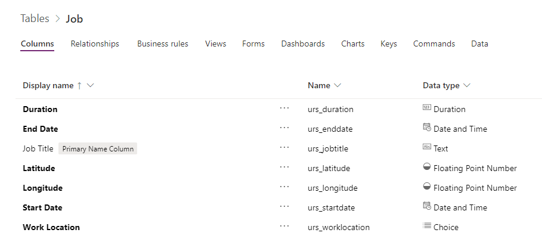](../media/5-custom-urs-table.png#lightbox)

## علاقات الجدول

يتطلب الجدول الذي تريد جدولته علاقتين واحد إلى متعدد من الجدول:

- متطلب المَورد

- حجز الموارد القابلة للحجز

> [!div class="mx-imgBorder"]
> [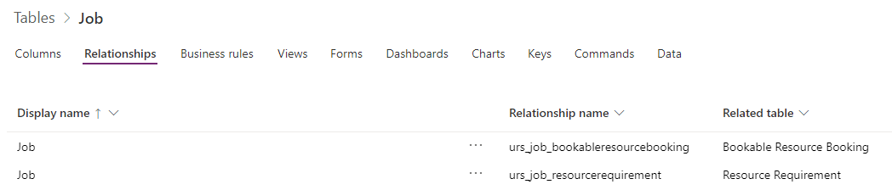](../media/5-custom-urs-relationships.png#lightbox)

أضف تعيينات إلى هذه العلاقات للمساعدة في ملء سجلات المتطلبات والحجز.

## حالات الحجز

تأكد من تحديد حالات الحجز لجدولك. تتم مشاركة هذا الجدول بواسطة جداول أخرى ممكّنة لـ Universal Resource Scheduling-لذا تأكد من تقييد عناصر حالة الحجز لجدولك عن طريق إضافة عمود اختيار إلى جدول حالة الحجز.

> [!div class="mx-imgBorder"]
> [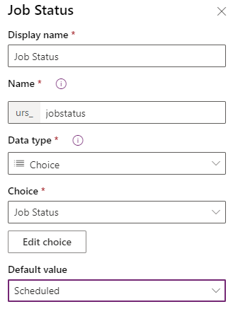](../media/5-booking-status-choice.png#lightbox)

عد إنشاء عمود الاختيار وإضافته إلى النموذج، يمكنك إضافة حالات الحجز في تطبيق **Field Service** بالانتقال إلى **الموارد> إعدادات الحجز> حالات الحجز**.

إنشاء حالات الحجز للكيانات التالية على الأقل:

- مجدول

- قيد التقدم

قم بتحرير حالة الحجز الحالية لـ **مكتمل** وقم بتعيين عمود الاختيار الخاص بك على **مكتمل**، ثم قم بتحرير حالة الحجز الحالية لـ **تم الإلغاء** وقم بتعيين عمود اختيارك إلى **تم الإلغاء**.

> [!div class="mx-imgBorder"]
> [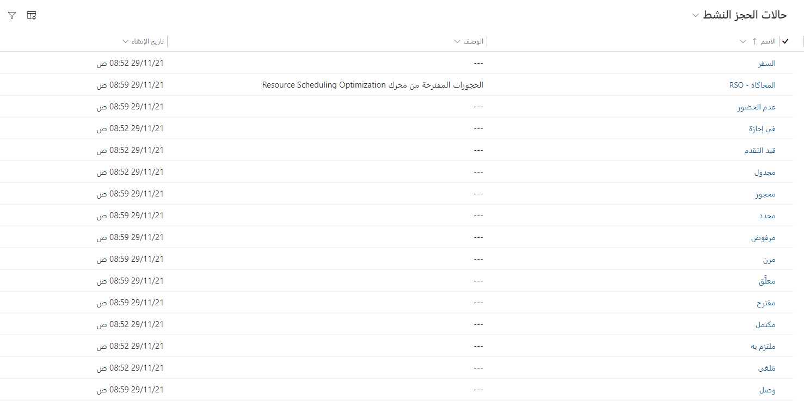](../media/5-booking-statuses.png#lightbox)

> [!NOTE]
> يمكنك ربط الألوان والرموز بكل حالة حجز.
سيتم استخدام هذه الألوان والرموز عند عرض الحجوزات على لوحة الجدولة.

## تمكين جدول للجدولة

بعد إنشاء الأعمدة والعلاقات، يمكنك تمكين الجدول للجدولة في تطبيق **جدولة الموارد**. لتمكين الجدول، انتقل إلى **الإعدادات> الجدولة> الإدارة** وحدد **تمكين جدولة الموارد للكيانات**.

حدد الجدول والعلاقتين، كما هو موضح في لقطة الشاشة التالية.

> [!div class="mx-imgBorder"]
> [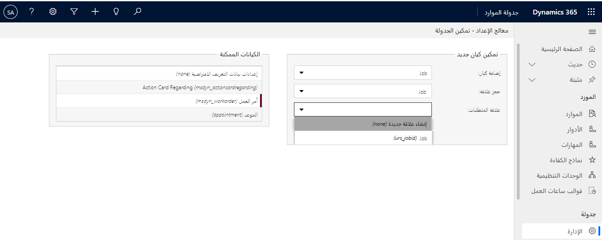](../media/5-enable-table-urs.png#lightbox)

حدد **نشر التخصيص** لفتح نموذج **البيانات التعريف لإعداد الحجز**.

في القسم الأول، أدخل اسم المخطط لعمود الاختيار الذي أضفته إلى جدول حالة الحجز في **الاسم المنطقي لحقل حالة الحجز**، كما هو موضح في لقطة الشاشة التالية.

> [!div class="mx-imgBorder"]
> [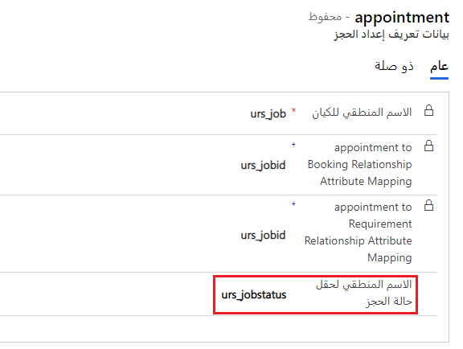](../media/5-booking-setup-metadata-general.png#lightbox)

في قسم **الإعدادات**، حدد هذه الخيارات، كما هو موضح في لقطة الشاشة التالية:

- **مدة الحجز الافتراضية** - اضبط وقت بدء العمل، على سبيل المثال **30 دقيقة**.

- **إلغاء الحجوزات عند الانتقال** - اضبط هذا الخيار على **نعم**.

- **حالة الحجز الافتراضية** - حدد حالة الحجز المجدولة التي قمت بإنشائها.

- **حالة إلغاء الحجز الافتراضية** - حدد حالة الحجز الملغاة.

- **الحالة النشطة للمتطلبات الافتراضية** - حدد **نشط**.

- **حالة إلغاء المتطلبات الافتراضية** - حدد **تم الإلغاء**.

- **حالة اكتمال المتطلبات الافتراضية** - حدد **مكتمل**.

- **تعطيل الإنشاء التلقائي لمتطلبات الحجوزات** - اضبط هذا الخيار على **لا** مبدئياً.

- **حد استرداد توفر الموارد** - يحد هذا الخيار من عدد الموارد التي يتم إرجاعها في مساعد الجدولة.

- **الحد الأدنى للمدة المتاحة (%)** - اترك هذا الخيار مضبوطاً على **100%**.

- **تمكين الحجز السريع** - اضبط هذا الخيار على **لا** مبدئياً.

> [!div class="mx-imgBorder"]
> [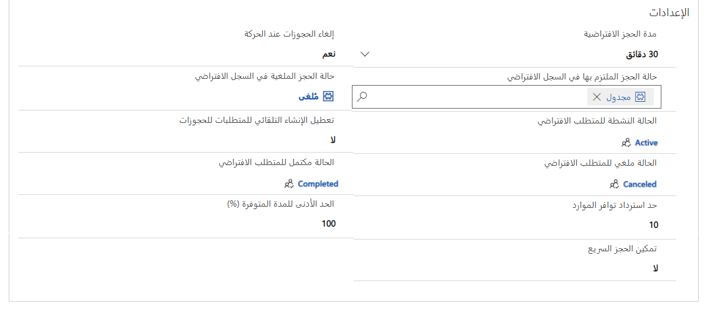](../media/5-booking-setup-metadata-settings.png#lightbox)

في قسم **تعيين السمات** حدد الخيارات التالية باستخدام الأعمدة التي أنشأتها في الجدول الخاص بك:

- من تاريخ

- إلى تاريخ

- المدة

- المنطقة

- خط العرض

- خط الطول

- موقع العمل

حدد **حفظ**.

> [!div class="mx-imgBorder"]
> [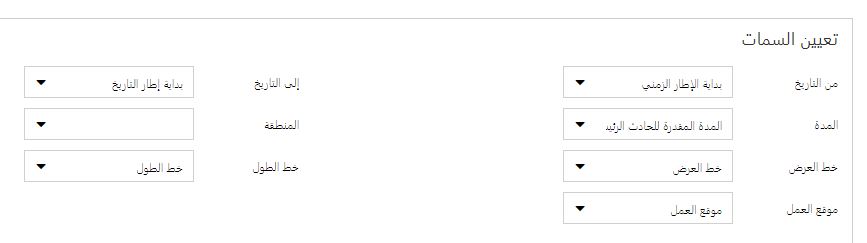](../media/5-booking-setup-metadata-mapping.png#lightbox)

> [!NOTE]
> يجب أن يتم تعيين الأعمدة تلقائياً بناءً على أنواع بيانات الأعمدة.

### عرض متطلبات الموارد

قبل أن تتمكن من جدولة السجلات للجدول، تحتاج إلى إنشاء طريقة عرض جديدة في جدول متطلبات الموارد لإظهار قائمة السجلات التي لم يتم حجزها.

يجب أن تتضمن طريقة العرض هذه أعمدة من جدول متطلبات المورد والجدول.

> [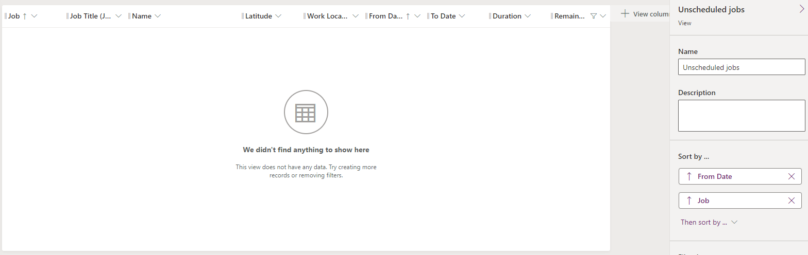](../media/5-view-columns.png#lightbox)

يجب أن تقوم طريقة العرض بتصفية متطلبات الموارد لجدولك فقط وبحيث تكون المدة المتبقية أكبر من الصفر.

> [!div class="mx-imgBorder"]
> [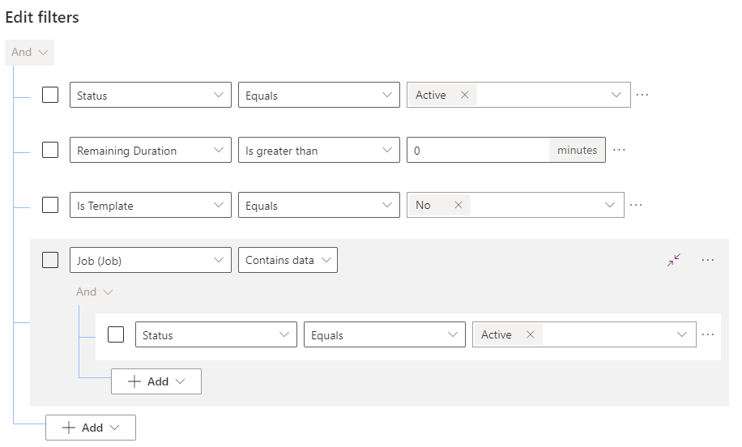](../media/5-view-filter.png#lightbox)

حدد **حفظ**، ثم حدد **نشر**.

### أضف العرض إلى لوحة الجدولة

الآن، تحتاج إلى إضافة العرض إلى لوحة الجدولة.
انتقل إلى لوحة الجدولة وحدد أيقونة الترس.

> [!div class="mx-imgBorder"]
> [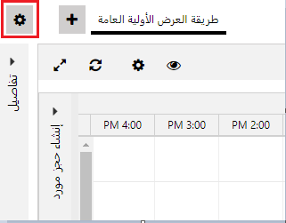](../media/5-schedule-board-gear.png#lightbox)

وسّع **لوحات المتطلبات**، وأدخل عنواناً. حدد طريقة العرض التي أنشأتها، وحدد أيقونة علامة الجمع (**+**)، ثم حدد **تطبيق**.

> [!div class="mx-imgBorder"]
> [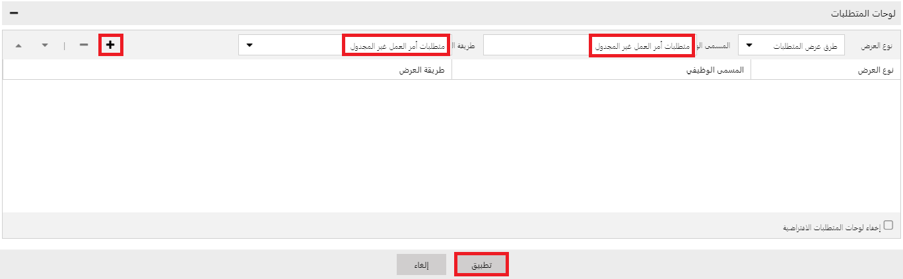](../media/5-add-view.png#lightbox)

يجب أن يتم عرض طريقة العرض الخاصة بك في لوحة المتطلبات على لوحة الجدولة.

> [!div class="mx-imgBorder"]
> 

### حجز السجلات

يمكنك الآن حجز السجلات باستخدام زر **حجز**.

> [!div class="mx-imgBorder"]
> [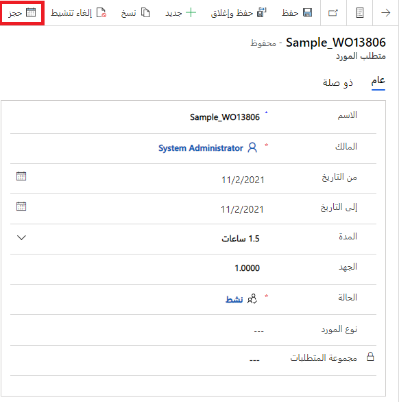](../media/5-book-button.png#lightbox)

سيؤدي تحديد هذا الزر إلى فتح مساعد الجدولة، حيث يمكنك حجز مورد.

> [!div class="mx-imgBorder"]
> [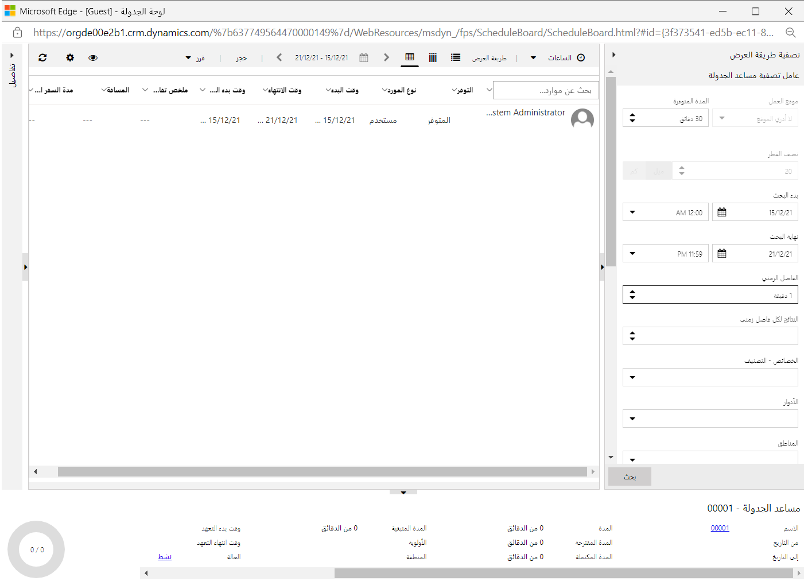](../media/5-schedule-assistant.png#lightbox)

يؤدي حجز مورد إلى إنشاء متطلبات المورد وحجز المورد القابل للحجز، وستتمكن من عرض الحجز على لوحة الجدولة.

> [!div class="mx-imgBorder"]
> 

### الحجز السريع

يمكن أن يساعد خيار **الحجز السريع** في تبسيط عملية اختيار الموارد. لاستخدام هذا الخيار، قم بتحرير **البيانات التعريف لإعداد الحجز** ثم اضبط **تمكين الحجز السريع** على **نعم**. سيؤدي تحديد زر **حجز** إلى فتح جزء **الحجز السريع**، كما هو موضح في لقطة الشاشة التالية.

> [!div class="mx-imgBorder"]
> [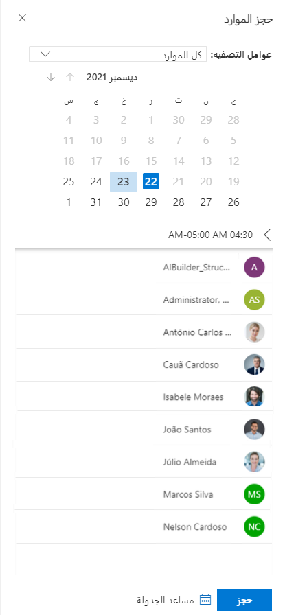](../media/5-quick-book.png#lightbox)

### استخدم Power Automate لملء متطلبات المورد

يتضمن Dynamics 365 Field Service معالجة لإنشاء متطلبات المورد تلقائياً عند إنشاء أمر عمل.
يقوم Field Service أيضاً بتحديث متطلبات المورد عند تغيير أمر العمل.

الإعداد الذي تم إجراؤه لجدولك حتى الآن سيسمح لك بالحجز من داخل نموذج السجل فقط؛ لا يأخذ في الاعتبار المهارات أو خصائص الجدولة الأخرى. يتم إنشاء سجل متطلبات المورد فقط عندما تحجز سجلك. إذا كنت تريد الاستفادة الكاملة من الجدولة، فستحتاج إلى تكرار المعالجة على أمر عمل لجدولك.
يتمثل أحد الخيارات في إنشاء متطلبات الموارد باستخدام التدفقات السحابية لـ Power Automate.

يتم عرض مثال عمليات سير عمل السحابة في لقطة الشاشة التالية.

> [!div class="mx-imgBorder"]
> [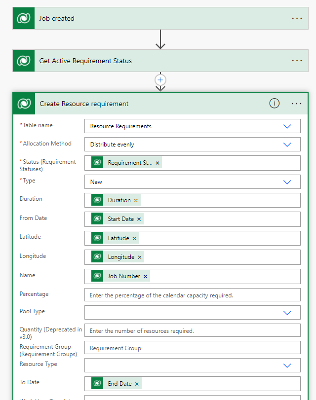](../media/5-requirement-flow.png#lightbox)

بعد تنفيذ التدفق، سيتم عرض متطلبات الجدول في قسم **لوحات المتطلبات** في لوحة الجدولة.

> [!div class="mx-imgBorder"]
> [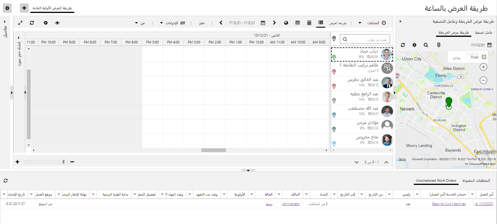](../media/5-schedule-board-requirement.png#lightbox)

> [!IMPORTANT]
> تحتاج إلى تحرير **البيانات التعريف لإعداد الحجز** وتعيين **تعطيل الإنشاء التلقائي لمتطلبات الحجز** إلى **نعم**; خلاف ذلك، سيكون لديك شرط مكرر عند حجز السجل الخاص بك.

لمزيد من المعلومات، راجع [Universal Resource Scheduling في Microsoft Dynamics 365 for Field Service](/learn/paths/universal-resource-scheduling/?azure-portal=true) و[تمكين كيان للجدولة في Dynamics 365 Field Service](/dynamics365/field-service/schedule-new-entity?azure-portal=true).

## الطوابع الزمنية للحجز

في Dynamics 365 Field Service، تسجل الطوابع الزمنية للحجز التاريخ والوقت اللذين تتغير فيهما **حالة الحجز** لأمر عمل. الطوابع الزمنية للحجز مفيدة من أجل:

- إعداد التقارير، لمعرفة كيف يقضي الفنيون وقتهم.

- حفظ الوقت لتوفير مستوى من التفاصيل لإعداد الفواتير.

- حجز الدفاتر اليومية، للاطلاع على نظرة شاملة للوقت الذي يقضيه في أي أمر عمل معين.

يمكنك عرض الطوابع الزمنية من خلال **حجز الموارد القابلة للحجز** سجل من **الطوابع الزمنية للحجز**.

> [!div class="mx-imgBorder"]
> [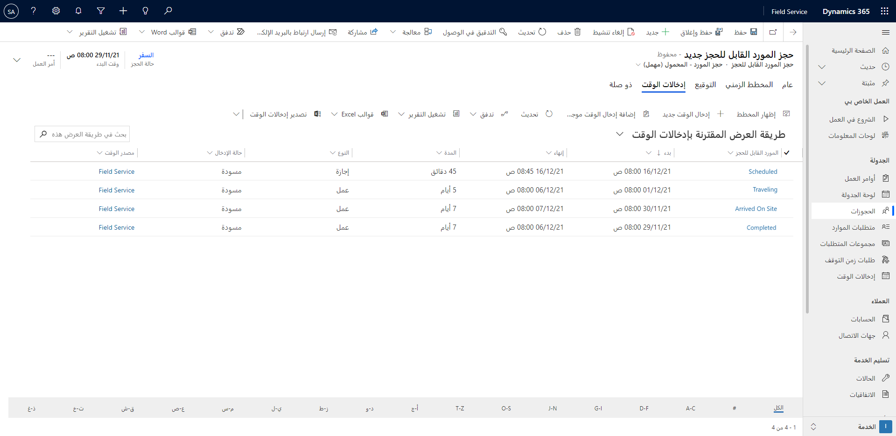](../media/5-booking-timestamps.png#lightbox)

بشكل افتراضي، لا يتم إنشاء الطوابع الزمنية للحجز إلا عندما تعرض حالة الحجز التي تقوم بتغييرها لإظهار قيمة اختيار حالة خدمة حقل مختلفة من حالة الحجز الحالية. 

### إعداد تكرار الطابع الزمني

يمكنك فرض إنشاء الطوابع الزمنية للحجز عن طريق تغيير إعداد **تردد الطابع الزمني** في قسم **إعداد Field Service**.

> [!div class="mx-imgBorder"]
> [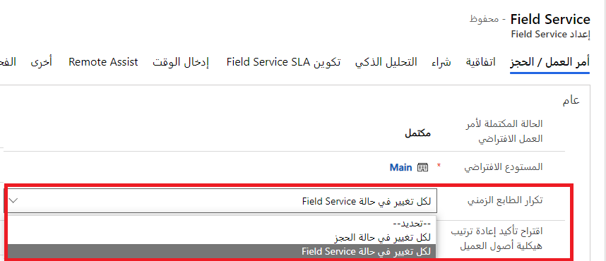](../media/5-timestamp-frequency.png#lightbox)

في الحقل **تردد الطابع الزمني**، اختر أحد الخيارات التالية:

- **حسب تغيير حالة Field Service** - إنشاء الطوابع الزمنية فقط عندما يؤدي تغيير حالة الحجز إلى تغيير حالة الخدمة الميدانية.
هذا الإعداد هو الافتراضي.

- **حسب تغيير حالة الحجز** - يُنشئ طوابع زمنية مع كل تغيير في حالة الحجز.

### دفاتر يومية الحجز

يتم إنشاء دفاتر يومية الحجز تلقائياً من الطوابع الزمنية للحجز عندما يتم تعيين حالة الحجز على **مكتمل**. تسجل دفاتر يومية الحجز إجمالي وقت السفر ووقت العمل للحجز ويمكن استخدامها لإنشاء إدخالات الوقت.

يمكنك إنشاء إدخالات الوقت تلقائياً عن طريق تعيين **إستراتيجية إنشاء دخول الوقت** إلى **الإنشاء التلقائي من الطوابع الزمنية للحجز** في قسم **إعدادات Field Service**.

> [!div class="mx-imgBorder"]
> [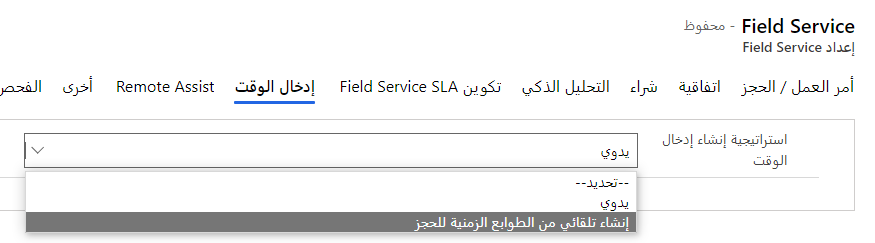](../media/5-time-entry-generation.png#lightbox)

لعرض الدفاتر اليومية من خلال سجل **حجز الموارد القابلة للحجز**، انتقل إلى **ذات الصلة> دفاتر اليومية الحجز**.
