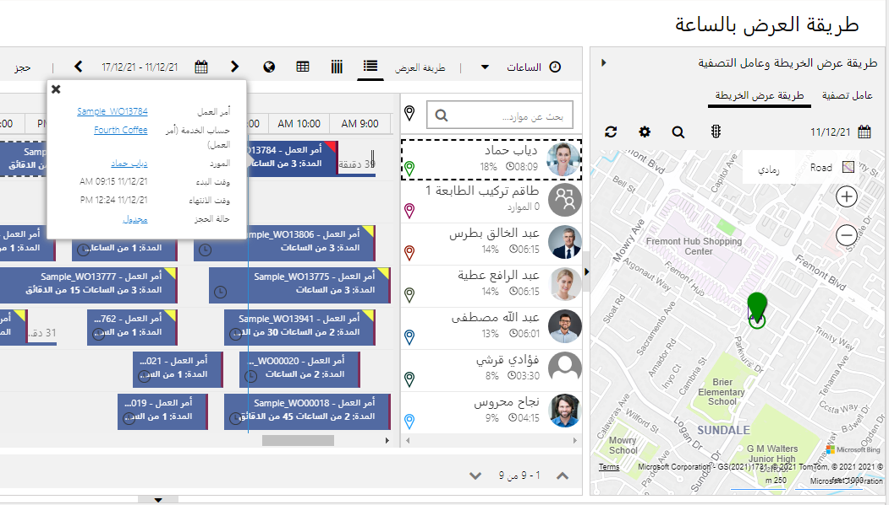

يتم توفير الجدولة في Microsoft Dynamics 365 عن طريق Universal Resource Scheduling (URS). تعد URS ميزة يتم استخدامها في Dynamics 365 Field Service وCustomer Service وProject Operations لجدولة أوامر العمل وأنشطة الخدمة والمشاريع على التوالي. توفر URS معظم وظائف الجدولة التي ستشاهدها في Field Service مثل الموارد والخصائص وتفضيلات التنفيذ ووقت العمل والحجوزات ولوحات الجدولة. يمكنك بسهولة استخدام URS لجدولة السجلات لأي جدول في Microsoft Dataverse.

## استخدام حالات من أجل Universal Resource Scheduling

في العديد من عمليات الخدمة الميدانية، قد تكون هناك مهام أخرى يحتاج الفنيون الميدانيون إلى حجزها. على سبيل المثال، للدورات التدريبية الداخلية. والآن، يمكنك ببساطة استخدام ميزة "زمن التوقف" ولكن توجد مشكلات خاصة بهذا النهج. أولاً، زمن التوقف في لوحة الجدولة يظهر وقت عدم العمل باللون الرمادي الفاتح دون تفاصيل، ومن ثمَّ يعلم جميع المُجدولين أن المَورد غير متوفر. ثانياً، عند تدريب العديد من الموارد الميدانية، سترغب في تدريبهم على مدى توفرهم. تعرض سجلات الجدولة لجدول مخصص الدورة التدريبية كحجز في لوحة الجدولة، ما يمكّن المجدول من معرفة سبب عدم توفر المورد.

مثال آخر وهي مهام الصيانة الداخلية التي ينفذها فنيون ميدانيون للمؤسسة بدلاً من العملاء. وبدلاً من تخصيص أوامر العمل لتلبية هذا المطلب، يكون من الأسرع والأنظف إنشاء جدول مخصص وجدولة سجلات المهام لعمل الصيانة الداخلي.

يمكنك استخدام ألوان مختلفة للجداول الأخرى لتوضيحها في لوحة الجدولة حيث تكون الموارد غير متوفرة لأداء عمل العميل.

## كيف يعمل URS

هناك ثلاثة جداول يتم استخدامها لجدولة صنف. وإليك هذه الجداول:

- الصنف المراد جدولته (على سبيل المثال، أمر العمل)

- متطلب المَورد

- حجز الموارد القابلة للحجز

عندما يتم إنشاء صنف يلزم جدولته كأمر عمل في Dynamics 365، فإنه يتضمن عادةً معلومات ستؤثر في كيفية جدولته بما في ذلك الموقع والمهارات والإطار الزمني والتفضيلات. بعد إنشاء سجل أمر عمل، يتم إنشاء سجل متطلبات المَورد تلقائياً. وعند الجدولة لا يكون أمر العمل هو الذي تمت جدولته بالفعل، لكن يكون سجل متطلبات المَورد الذي يستخدمه URS عند جدولة الصنف. متطلب المورد يحدد المعلومات المعينة المطلوبة للصنف الذي ستتم جدولته.

قد تتضمن متطلبات المورد لأمر العمل ما يلي:

- موقع العميل مثل خطوط الطول والعرض

- منطقة الخدمة

- الصفات المميزة (المهارات) و/أو الأدوار المطلوبة

- المدة

- نافذتا التاريخ والوقت أو التعهدات

- تفضيلات التنفيذ

- تفضيلات الموارد

يتم عرض متطلبات الموارد في الجزء السفلي من لوحة الجدولة في لوحة المتطلبات حيث يمكنك رؤية طرق العرض مثل أوامر العمل غير المجدولة.

وبعد جدولة متطلبات المورد، يتم إنشاء حجز مورد قابل للحجز، يُختصر عادةً إلى الحجز في تطبيقات Field Service، والذي يحدد التاريخ والوقت المحددين والمورد (الموارد) المختار لتوصيل الصنف. يتم تضمين التفاصيل المحددة حول المَورد المسؤول عن إكمال الصنف. يوفر مزيدًا من التفاصيل مثل أوقات الوصول المقدرة والفعلية وحالة الحجز.

يتضمن حجز الموارد لمتطلبات المورد ما يلي:

- المورد مسؤول عن إكمال العمل

- الوقت والمسافة المُقدَّريْن للسفر

- المدة

- أوقات البدء والانتهاء الفعلية

- المسافة الفعلية للسفر

- حالة الحجز

يتم عرض الحجوزات في الخلايا الموجودة في النص الرئيسي من لوحة الجدولة وهي الأصناف الرئيسية المعروضة في تطبيق Field Service للأجهزة المحمولة للفنيين.

## أعمدة الجدول

لتتمكن من جدولة جدول باستخدام URS، قم بتضمين الأعمدة التالية الموجودة بالجدول في Microsoft Dataverse:

- **خط العرض**: خط عرض الموقع الذي سيُنفذ خلاله العمل كـ "رقم فاصلة عائمة" إلى 5 منازل عشرية بحد أدنى للقيمة -90 وقيمة قصوى 90.

- **خط الطول**: خط طول الموقع الذي سيُنفذ خلاله العمل كـ "رقم فاصلة عائمة" إلى 5 منازل عشرية بحد أدنى للقيمة -180 وقيمة قصوى 180.

- **تاريخ البدء**: عمود التاريخ والوقت لبدء العمل المطلوب.

- **تاريخ الانتهاء**: عمود التاريخ والوقت للانتهاء من العمل المطلوب.

- **المدة**: عمود عدد صحيح من نوع "المدة". هذا هو عدد الدقائق المطلوبة لتنفيذ العمل.

- **المنطقة**: بحث عن جدول المناطق. هذا العمود اختياري ومطلوب فقط إذا كنت بحاجة إلى تصفية الموارد حسب المنطقة عند الجدولة.

- **موقع العمل**: عمود اختيار يستخدم اختيار موقع العمل العام. يجب أن يكون موقع العمل مضبوط افتراضياً على "في الموقع" حتى تتم جدولته.

> [!div class="mx-imgBorder"]
> 

## علاقات الجدول

الجدول الذي ترغب في جدولته يتطلب علاقتي رأس بأطراف من الجدول إلى:

- متطلب المَورد

- حجز الموارد القابلة للحجز

> [!div class="mx-imgBorder"]
> 

ينبغي عليك إضافة تعيينات إلى هذه العلاقات للمساعدة على ملء المتطلبات وسجلات الحجز.

## حالات الحجز

سيتعين عليك تحديد حالات الحجز لجدولك. تتم مشاركة هذا الجدول بواسطة جداول أخرى ممكّنة لـ URS، لذلك تحتاج إلى تقييد أصناف حالات الحجز لجدولك عن طريق إضافة عمود اختيار إلى جدول حالة الحجز.

> [!div class="mx-imgBorder"]
> 

بمجرد إنشاء عمود اختيار وإضافته إلى النموذج، يمكنك إضافة حالات حجز في تطبيق **Field Service**. انتقال إلى **الموارد** > **إعدادات الحجز** > **حالات الحجز**.

يجب أن تقوم بإنشاء حالات حجز على الأقل مما يلي:

- مجدولة

- قيد التقدم

يجب عليك تحرير حالة الحجز الحالية إلى "مكتمل" وتعيين عمود اختيار إلى "مكتمل" وتعديل حالة الحجز الحالية إلى "تم الإلغاء" وتعيين عمود اختيار إلى "تم الإلغاء".

> [!div class="mx-imgBorder"]
> 

> [!NOTE]
> يمكنك إقران الألوان والأيقونات بكل حالة حجز ويتم استخدامها عند عرض الحجوزات في لوحة الجدولة.

## تمكين جدول للجدولة

بمجرد إنشاء الأعمدة والعلاقات، يمكنك تمكين الجدول للجدولة في تطبيق **Resource Scheduling**. لتمكين الجدول، انتقل إلى **إعدادات** > **الجدولة** > **الإدارة** وانقر فوق **تمكين جدولة الموارد للكيانات**.

حدد الجدول والعلاقتين كما هو موضح في لقطة الشاشة التالية.

> [!div class="mx-imgBorder"]
> 

انقر فوق **تخصيص النشر** وسيتم فتح نموذج **بيانات تعريف إعداد الحجز**.

في القسم الأول، أدخل اسم المخطط الخاص بعمود الاختيار الذي قمت بإضافته إلى جدول حالة الحجز في **اسم منطقي لحقل حالة الحجز** كما هو موضح في لقطة الشاشة التالية.

> [!div class="mx-imgBorder"]
> 

في القسم **إعدادات**، حدد التالي كما هو موضح في لقطة الشاشة التالية:

- **مدة الحجز الافتراضي**: تعيين إلى وقت البدء للعمل؛ مثال 30 دقيقة.

- يجب تعيين **إلغاء الحجوزات عند الانتقال** إلى "نعم".

- **حالة الحجز الافتراضي الملتزم بها**: تحديد حالة الحجز المجدولة التي قمت بإنشائها.

- **حالة إلغاء الحجز الافتراضي**: تحديد حالة الحجز التي تم إلغاؤها.
- **‬‏‫‏‫الحالة النشطة للمتطلب الافتراضي‬‏‫**: تحديد "نشطة".

- **الحالة ملغي للمتطلب الافتراضي‬‏‫**: تحديد "ملغي".

- **الحالة مكتملة للمتطلب الافتراضي‬‏‫**: تحديد "مكتملة".

- **تعطيل الإنشاء التلقائي للمتطلبات الخاصة بالحجوزات**: تعيين على "ليس في البداية".

- **‏‫حد استرداد توافر الموارد**: وهذا يُحدُّ عدد الموارد التي سيتم استردادها في مساعد الجدولة.

- **الحد الأدنى للمدة المتوفرة (%)**: اترك 100%.

- عَيّن **تمكين الحجز السريع** على "ليس في البداية".

> [!div class="mx-imgBorder"]
> 

في قسم **تعيين السمات**، حدد الخيارات التالية باستخدام الأعمدة التي تم إنشاؤها في الجدول:

- تاريخ البدء

- تاريخ الانتهاء

- المدة

- المنطقة

- خط العرض

- خط الطول

- موقع العمل

حدد **حفظ**.

> [!div class="mx-imgBorder"]
> 

> [!NOTE]
> يجب أن يتم تعيين الأعمدة تلقائياً بناءً على أنواع بيانات الأعمدة.

### عرض متطلبات الموارد

قبل أن تتمكن من جدولة السجلات للجدول، تحتاج إلى إنشاء طريقة عرض جديدة في جدول متطلبات الموارد لإظهار قائمة السجلات التي لم يتم حجزها.

ومن المفترض أن تشتمل طريقة العرض هذه على أعمدة من كل من جدول متطلبات الموارد وجدولك.

> 

يجب أن تقوم طريقة العرض بتصفية متطلبات الموارد لجدولك فقط وبحيث تكون المدة المتبقية أكبر من الصفر.

> [!div class="mx-imgBorder"]
> 

حدد **حفظ**، ثم حدد **نشر**.

### إضافة طريقة عرض إلى لوحة الجدولة

من المفترض الآن أن تقوم بإضافة طريقة العرض هذه إلى لوحة الجدولة. انتقل إلى لوحة الجدولة وحدد أيقونة "الترس".

> [!div class="mx-imgBorder"]
> 

قم بتوسيع **لوحات المتطلبات** وقم بإدخال عنوان وحدد طريقة العرض الذي قمت بإنشائها ثم حدد الأيقونة **+** ثم انقر فوق **تطبيق**.

> [!div class="mx-imgBorder"]
> 

يجب الآن أن تشاهد طريقة العرض في لوحات المتطلبات في لوحة الجدولة.

> [!div class="mx-imgBorder"]
> 

### حجز السجلات

يمكنك الآن حجز السجلات باستخدام زر **الحجز**.

> [!div class="mx-imgBorder"]
> 

يؤدي ذلك إلى فتح "مساعد الجدولة" ويسمح لك بحجز أحد الموارد.

> [!div class="mx-imgBorder"]
> 

يؤدي حجز مورد إلى إنشاء متطلبات المورد وحجز المورد القابل للحجز ويمكنك رؤية الحجز في لوحة الجدولة.

> [!div class="mx-imgBorder"]
> 

### الحجز السريع

هناك خيار يسمي "الحجز السريع" يسهل عليك تحديد الموارد. لاستخدام هذا الخيار، يجب أن تقوم بتحرير **بيانات تعريف إعداد الحجز** وتعيين **تمكين الحجز السريع** إلى **نعم**. يؤدي النقر فوق زر **الحجز** إلى فتح جزء "الحجز السريع" كما هو موضح في لقطة الشاشة التالية.

> [!div class="mx-imgBorder"]
> 

### استخدام Power Automate لملء متطلب المَورد

يشتمل Dynamics 365 Field Service على معالجة لإنشاء متطلب المورد تلقائيا عند إنشاء أمر عمل. يقوم Field Service أيضاً بتحديث متطلبات المورد عند تغيير أمر العمل.

يسمح لك التكوين الذي تم إجراؤه حتى الآن لجدولك بالحجز من داخل نموذج السجل ولا يأخذ في الاعتبار المهارات أو خصائص الجدولة الأخرى. يتم إنشاء سجل متطلبات المورد فقط عندما تحجز سجلك. إذا كنت تريد الاستفادة الكاملة من الجدولة، فستحتاج إلى تكرار المعالجة في أمر العمل لجدولك. أحد الخيارات هو إنشاء متطلب المورد باستخدام عمليات سير عمل السحابة Power Automate.

يتم عرض مثال عمليات سير عمل السحابة في لقطة الشاشة التالية.

> [!div class="mx-imgBorder"]
> 

بمجرد تنفيذ مثل سير العمل هذا، سترى متطلبات الجدول في لوحات "المتطلبات" في لوحة الجدولة.

> [!div class="mx-imgBorder"]
> 

> [!IMPORTANT]
> يجب عليك تحرير **بيانات تعريف إعداد الحجز** وتعيين **تعطيل الإنشاء التلقائي للمتطلبات لعمليات الحجز** إلى **نعم** وإلا سيكون لديك متطلبات مكررة عند حجز سجلك.

للحصول على مزيد من التفاصيل حول جدولة الجداول المخصصة، راجع [Universal Resource Scheduling في Microsoft Dynamics 365 for Field Service](/learn/paths/universal-resource-scheduling/?azure-portal=true) و[تمكين أحد الكيانات للجدولة في Dynamics 365 Field Service](/dynamics365/field-service/schedule-new-entity?azure-portal=true).

## الطوابع الزمنية للحجز

في Dynamics 365 Field Service، تقوم "الطوابع الزمنية للحجز" بتسجيل التاريخ والوقت اللذين تتغير فيهما حالة الحجز لأمر عمل. الطوابع الزمنية للحجز مفيدة من أجل:

- إعداد التقارير، لمعرفة كيفية قضاء الفنيين لوقتهم.

- الاحتفاظ بالوقت، لتوفير مستوى من التفاصيل للفوترة.

- دفاتر يومية للحجز، لرؤية طريقة عرض شاملة للوقت المستغرق في أي أمر عمل محدد.

يمكنك رؤية الطوابع الزمنية من خلال سجل حجز مورد قابل للحجز من **الطوابع الزمنية للحجز**.

> [!div class="mx-imgBorder"]
> 

بشكلٍ افتراضي، لا يتم إنشاء الطوابع الزمنية للحجز إلا عندما يكون لحالة الحجز التي قمت بالتغيير إليها قيمة اختيار حالة الخدمة الميدانية مختلفة عن حالة الحجز الحالية. 

### إعداد تكرار الطابع الزمني

يمكن فرض إنشاء الطوابع الزمني للحجز عن طريق تغيير إعداد **تكرار الطابع الزمني** في إعداد الخدمة الميدانية.

> [!div class="mx-imgBorder"]
> 

في حقل تكرار الطابع الزمني، اختر أحد الخيارات التالية:

- **لكل تغيير حالة الخدمة الميدانية**: إنشاء طوابع زمنية فقط عندما ينتج عن تغيير حالة الحجز تغييراً في حالة الخدمة الميدانية. ويكون ذلك هو الإعداد الافتراضي.

- **لكل تغيير في حالة الحجز**: إنشاء طوابع زمنية مع كل تغيير لحالة الحجز.

### دفاتر يومية الحجز

يتم إنشاء دفاتر يومية الحجز تلقائياً من الطوابع الزمنية للحجز عند تعيين حالة الحجز إلى "مكتملة". تقوم دفاتر يومية الحجز بتسجيل إجمالي وقت السفر ووقت العمل الحجز ويمكن استخدامها لإنشاء إدخالات الوقت.

يمكنك إنشاء إدخالات الوقت تلقائياً عن طريق اعداد **استراتيجية إنشاء إدخال الوقت** من أجل **الإنشاء التلقائي للطوابع الزمنية للحجز** في إعداد الخدمة الميدانية.

> [!div class="mx-imgBorder"]
> 

يمكنك رؤية دفاتر اليومية من خلال سجل حجز مورد قابل للحجز من **دفاتر اليومية الخاصة بالحجز** > **ذات الصلة**.
