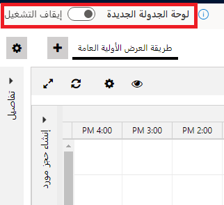
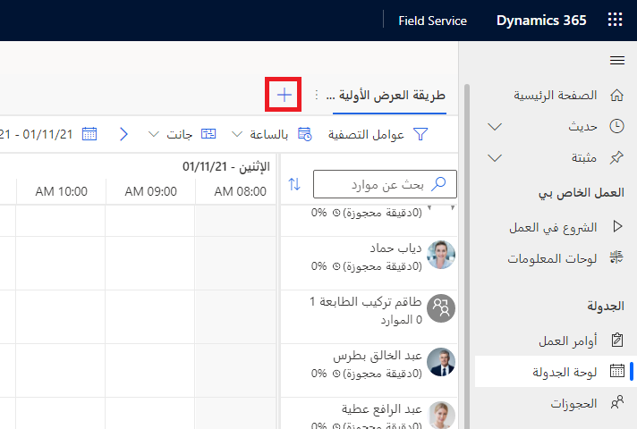
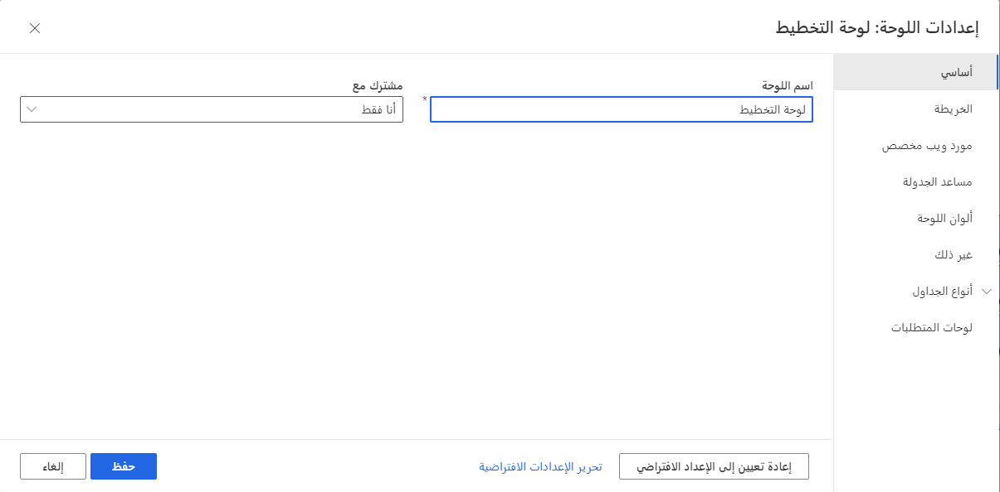
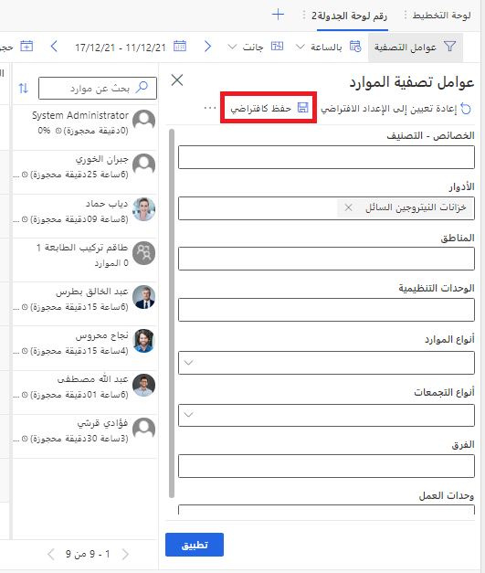
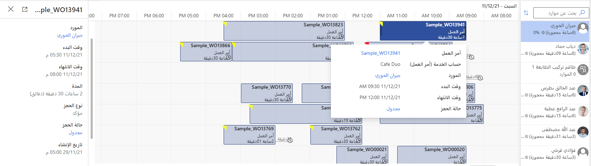
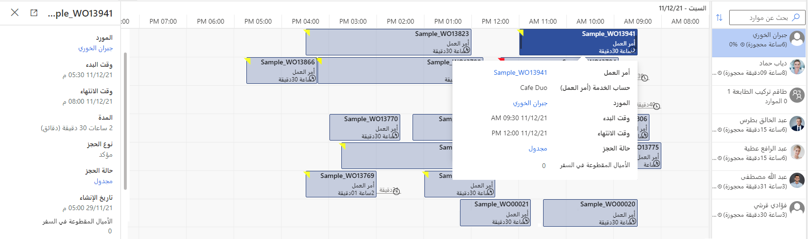
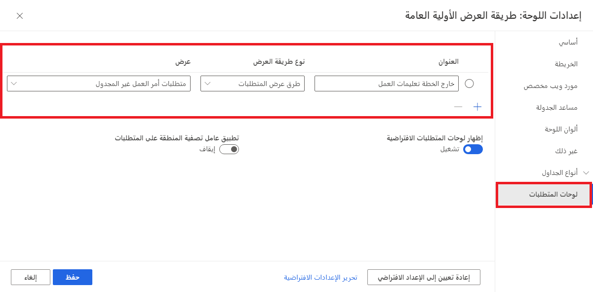
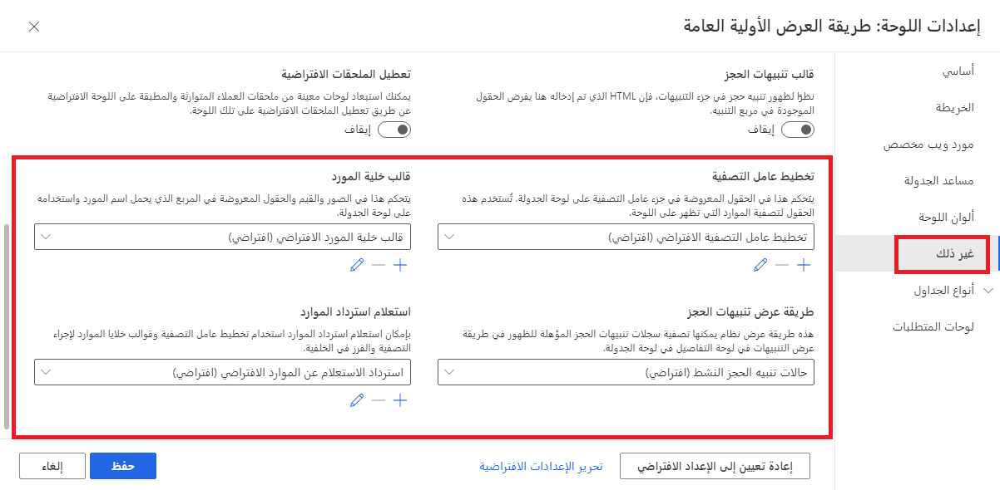

توفر لوحة جدولة Dynamics 365 Field Service نظرة عامة على توفر الموارد والحجوزات. يمكنك تخصيص لوحة الجدولة لإعداد العروض والفلاتر لتفضيلاتك، ويمكنك تخصيص لوحة الجدولة لتلبي متطلبات العمل.

يمكنك الوصول إلى لوحة الجدولة في تطبيق Field Service بالانتقال إلى **الخدمة> الجدولة> لوحة الجدولة** وفي تطبيق جدولة الموارد بالانتقال إلى **جدولة الموارد> الأدوات> لوحة الجدولة**.

## لوحة جدولة جديدة

أصدرت Microsoft لوحة جدولة جديدة تُعد أكثر سرعة واستجابة. اعتباراً من أكتوبر 2021، أصبحت لوحة الجدولة الجديدة ميزة-متوافقة مع لوحة الجدولة الحالية.

يمكنك تمكين لوحة الجدولة الجديدة عن طريق تشغيل مفتاح التبديل **لوحة الجدولة الجديدة** في الزاوية العلوية اليمنى من لوحة الجدولة.

> [!div class="mx-imgBorder"]
> 

لمزيد من المعلومات، راجع [تجربة لوحة الجدولة الجديدة والمحسّنة في Dynamics 365 Field Service (متوفرة بشكل عام)](/dynamics365/field-service/preview-schedule-board?azure-portal=true).

## إنشاء لوحات الجدولة

عادةً ما يكون المجدول الفردي مسؤولاً عن تصفية مجموعات مختلفة من الموارد حسب الموقع الجغرافي أو المهارات. بينما تتيح لوحة الجدولة للمجدول تصفية الموارد حسب المنطقة والأدوار والمهارات، فإن الحاجة إلى التبديل بين مجموعات مختلفة من الموارد تعني أن المجدول سيغير المرشحات باستمرار، وهو أمر غير فعال ويستغرق وقتاً طويلاً. من الأسهل إنشاء لوحات جدولة منفصلة تمت تصفيتها مسبقاً لكل مجموعة من الموارد.

يمكنك إنشاء لوحات جدولة عن طريق تحديد زر **إضافة علامة تبويب** إضافة علامة تبويب (**+**) في الزاوية العلوية اليسرى من لوحة الجدولة الجديدة.

> [!div class="mx-imgBorder"]
> 

يؤدي التحديد فوق زر علامة التبويب لوحة جدولة جديدة إلى فتح مربع الحوار التالي.

> [!div class="mx-imgBorder"]
> 

أدخل اسماً للوحة ثم حدد **إضافة**. بعد ذلك، يمكنك تطبيق المرشحات على اللوحة الجديدة التي قمت بإنشائها وتحديد **حفظ كافتراضي**.

> [!div class="mx-imgBorder"]
> 

كلما تم استخدام اللوحة، ستستخدم تلك المرشحات.

## شارك لوحة الجدولة

بشكلٍ افتراضي: ستكون علامة التبويب "لوحة الجدولة" مرئية للشخص الذي أنشأها فقط. باستخدام القائمة المنسدلة **مشاركة مع**، يمكنك إتاحة لوحة للكيانات التالية:

- **أنا فقط** - ستكون علامة التبويب لوحة الجدولة مرئية للمستخدم الذي أنشأها فقط.

- **الكل** - ستكون علامة تبويب "لوحة الجدولة" مرئية لجميع الأشخاص الذين يتمتعون بحق الوصول إلى لوحة الجدولة.

- **أشخاص محددون** - ستكون علامة تبويب لوحة الجدولة متاحة فقط للمستخدمين الذين تمت مشاركة سجل **إعدادات لوحة الجدولة** معهم. يمكنك العثور على هذه السجلات ومشاركتها باستخدام **بحث متقدم**.

## تخصيص لوحات الجدولة

يتم التحكم في محتويات العديد من المكونات الموجودة في لوحة الجدولة من خلال طرق العرض في الجداول التالية:

- الموارد القابلة للحجز

- حجوزات الموارد القابلة للحجز

- الوحدات التنظيمية

- متطلبات الموارد

تعمل طرق العرض هذه على تغيير محتويات جزء التفاصيل وتلميحات الأدوات والمكونات الأخرى. بتغيير الأعمدة المستخدمة في طرق العرض هذه، يمكنك تغيير التفاصيل التي تعرضها هذه المكونات في اللوحة.

يمكنك تخصيص طرق العرض التي تستخدمها لوحة الجدولة أو إنشاء طرق العرض الخاصة بك. على سبيل المثال، ضع في اعتبارك جدول الوظيفة الذي قمت بتمكينه لـ Universal Resource Scheduling في القسم السابق. تُظهر طرق العرض الافتراضية المعلومات التالية لتعريفات الأدوات وجزء التفاصيل.

> [!div class="mx-imgBorder"]
> 

بإجراء بعض التغييرات في طرق عرض حجز الموارد القابلة للحجز، يمكنك إضافة المزيد من التفاصيل، كما هو موضح في لقطة الشاشة التالية.

> [!div class="mx-imgBorder"]
> 

يمكنك تغيير طرق العرض والإعدادات الأخرى عن طريق تحديد علامة الحذف (**...**) بجوار اسم اللوحة. يمكنك تخصيص المناطق التالية من إعدادات لوحة الجدولة:

- **أساسي** - اسم اللوحة ومَن يمكنه استخدام اللوحة.

- **خريطة** - طرق العرض المستخدمة للموارد والمتطلبات والوحدات التنظيمية والحجوزات في طريقة عرض "الخريطة".

- **مورد ويب مخصص** - مورد ويب يمكنه توفير المزيد من إمكانيات لوحة الجدولة.

- **مساعد الجدولة** - يحدد الإعدادات المستخدمة في مساعد الجدولة. أحد الإعدادات الأكثر أهمية هو **حجز على أساس**، الذي يحدد ما إذا كان الحجز يبدأ من الوصول المقدر أو من بداية السفر.

- **ألوان اللوحة** - تحديد الألوان المستخدمة للإشارة إلى مستوى حجوزات المورد بما في ذلك ساعات عدم الحجز أو المحجوزة جزئياً أو المحجوزة بالكامل أو المحجوزة بشكلٍ زائد أو غير ساعات العمل.

- **أخرى** - التحكم في عدد الصفوف والأعمدة التي يتم عرضها في اللوحة.

- **أنواع الجدولة** - طرق العرض المستخدمة للموارد والمتطلبات والحجوزات في اللوحة. يمكنك تحديد طرق عرض مختلفة لكل جدول تم تمكينه للجدولة.

- **لوحات المتطلبات** - العروض المستخدمة لإظهار المتطلبات التي يجب جدولتها. لإضافة جدول جديد، حدد رمز علامة الجمع (**+**)، وأدخل عنواناً، وحدد طريقة العرض، ثم حدد **حفظ**.

> [!div class="mx-imgBorder"]
> 

يمكنك تغيير لوحة الجدولة بتخصيص طرق العرض، ولكن هناك مكونات أخرى ستتطلب المزيد من مهارات التخصيص الفنية.

- **خلايا المَورد** - يعرض الاسم والصورة والاستخدام لمورد.

- **جزء عامل التصفية** - الحقول المستخدمة لتصفية الموارد.

- **استرجاع استعلام الموارد** - يحدد كيفية مطابقة وفرز الموارد مع المتطلبات في عامل التصفية.

تستخدم هذه المكونات HTML وUniversal FetchXML لتخصيص وظائفها. يمكنك العثور على هذه المكونات وتحريرها في منطقة **أخرى** في إعدادات لوحة الجدولة.

> [!div class="mx-imgBorder"]
> 

لمزيد من المعلومات، راجع [تخصيص لوحة الجدولة بسمة مورد مخصصة](/dynamics365/field-service//extend-schedule-board-custom-resource-attribute?azure-portal=true).
