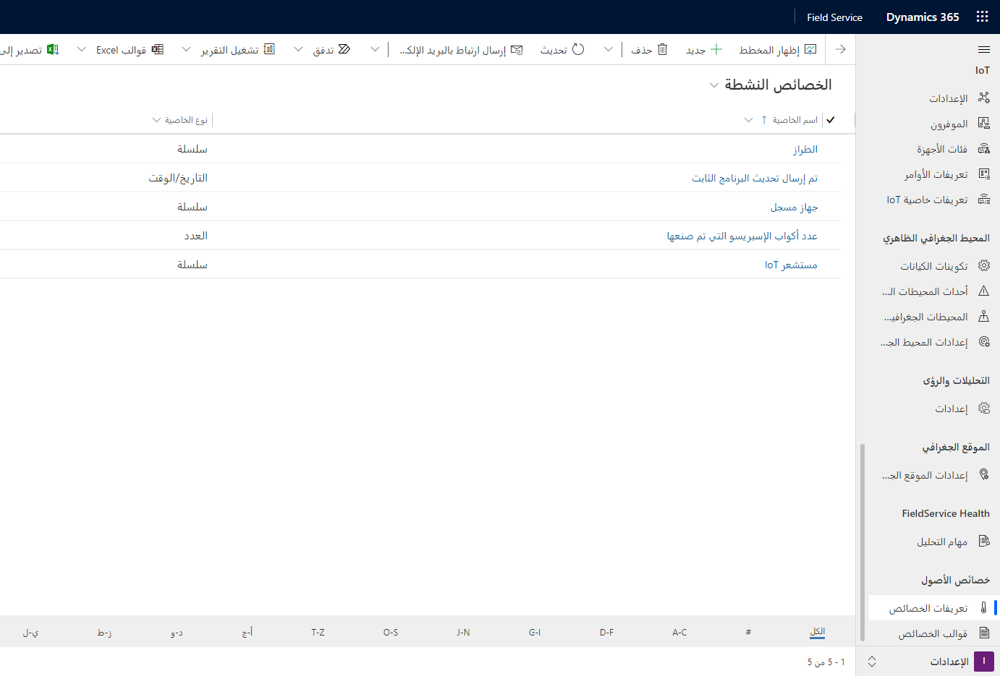
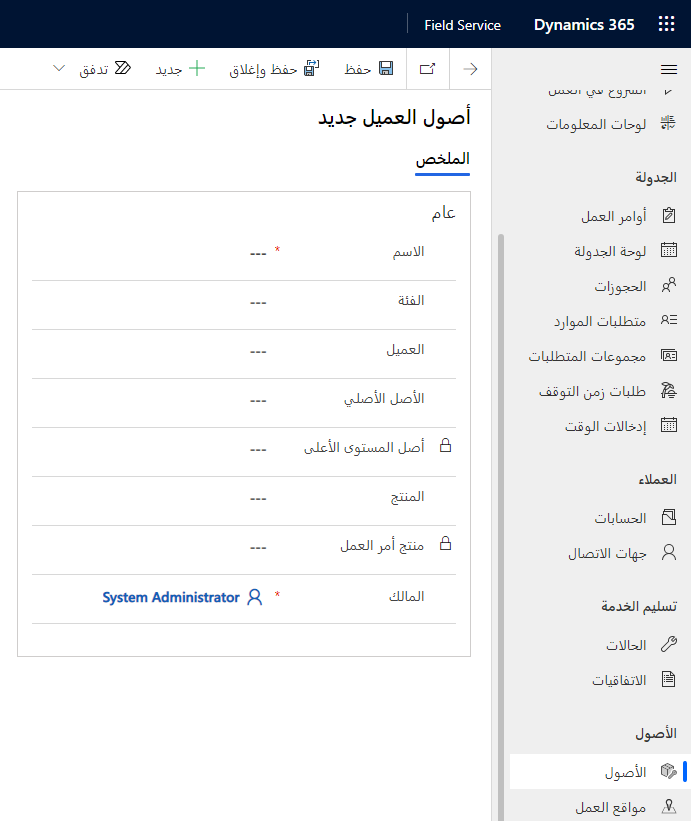
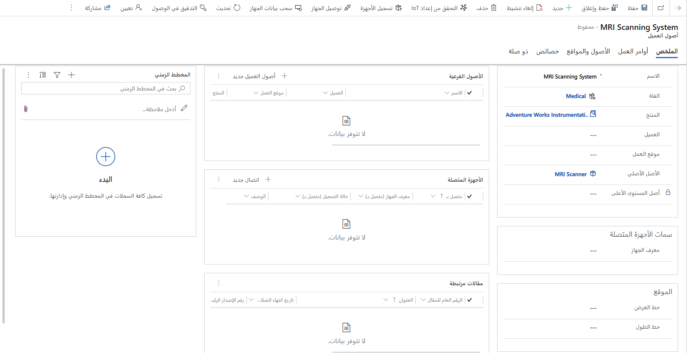
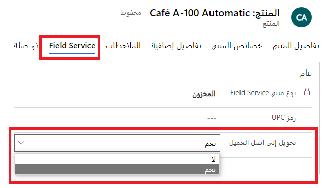
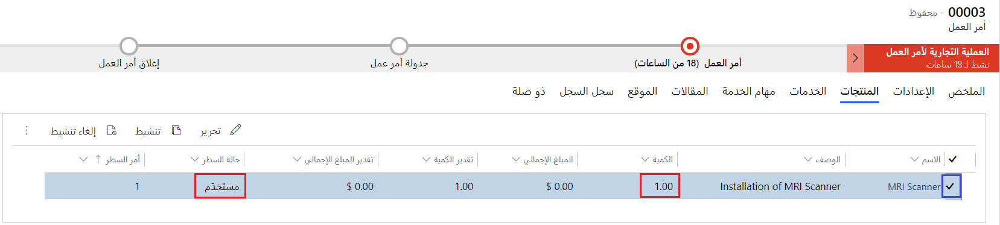
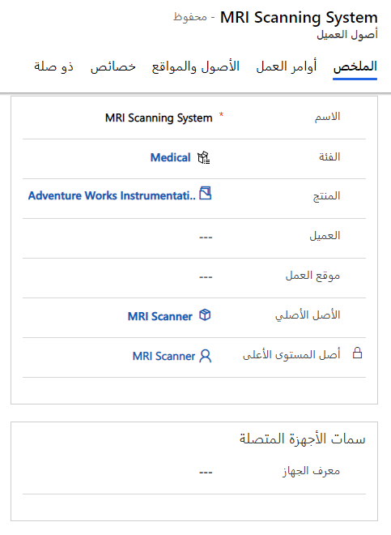
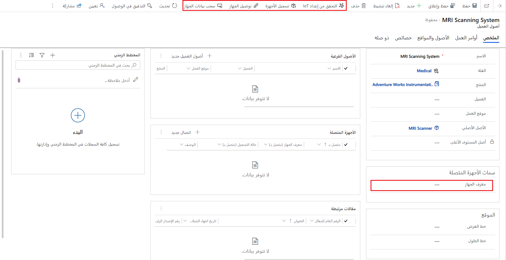
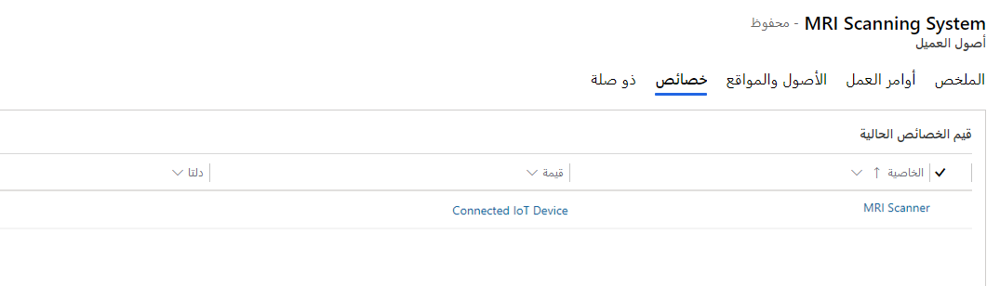
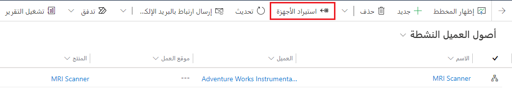

يمكنك إنشاء أصول العميل بالطرق التالية:

- **يدوياً** - قم بإنشاء أصول العميل يدوياً في تطبيق Field Service.

- **استيراد** - قم باستيراد أصول العميل من ملف يحتوي على الأصول إلى تطبيق Field Service.

- **تلقائياً** - اختر أن يتم إنشاء أصول العميل تلقائياً عندما يتم وضع علامة على منتجات أمر العمل على أنها مستخدمة.

## فئات الأصول

قبل إنشاء الأصول، تأكد من إنشاء فئات أصول لتجميع الأصول الخاصة بك.

يمكنك ربط فئات الأصول بخصائص الأصل التي تسمح بالتقاط معلومات معينة عن الأصل.
لمزيد من المعلومات، راجع [خصائص الأصول في Dynamics 365 Field Service](/dynamics365/field-service/asset-properties?azure-portal=true).

> [!div class="mx-imgBorder"]
> 

يمكنك تحديد فئات الأصول في تطبيق Field Service من خلال الانتقال إلى **الإعدادات > عام > فئات الأصول**.

> [!NOTE]
> يمكنك أيضاً استخدام فئات الأصول مع استحقاقات أوامر العمل.

## إنشاء أصول العميل

يمكنك إدارة أصول العملاء في تطبيق Field Service. لإنشاء أصول العملاء يدوياً، انتقل إلى **الخدمة > الأصول > الأصول**.

بعد إنشاء أصل العميل، سيتضمن المعلومات التالية في علامة التبويب **عام**:

- **الاسم** - أدخل اسماً مرجعياً أو عنواناً للأصل الخاص بالعميل.

- **اسم العرض** - أدخل اسماً وصفياً للأصل. يمكن أن يكون الاسم هو اسم الأصل وطرازه، أو اسم المنتج في كتالوج المنتجات، أو اسماً عاماً مثل *وحدة التدفئة والتهوية وتكييف الهواء (HVAC)*، أو حتى يحتوي على معلومات وصفية مثل *وحدة التدفئة والتهوية وتكييف الهواء (HVAC) للطابق الثاني*.

- **الفئة** - حدد فئة أصل عميل لتجميع الأصل مع الأصول المتشابهة.

- **الحساب** - حدد حساباً لتمثيل العميل والموقع الخاص بالأصل. يجب أن يكون هذا الحساب هو حساب الخدمة لأوامر العمل التي تم رفعها للأصل.

- **الأصل الأساسي** - إذا كان هذا جزءاً من تجميع أو بنية أصل، فحدد الأصل الأساسي الذي ينتمي اليه هذا الأصل.

- **المنتج** - إذا كان أصل العميل يرتبط بمنتج في كتالوج المنتجات الخاص بك، فحدد المنتج.

> [!div class="mx-imgBorder"]
> 

عند الانتهاء من إدخال المعلومات، حدد **حفظ**.

> [!div class="mx-imgBorder"]
> 

بعد إنشاء أصل العميل، ستتمكن من ربط الأصل بأوامر العمل وتسجيل الأصل كجهاز IoT.

## استيراد أصول العميل

يمكن استيراد أصول العميل باستخدام أدوات الاستيراد المتوفرة مع Dynamics 365 Field Service وMicrosoft Dataverse. عند استيراد البيانات، يجب تحديد سجل أصل العميل لمنع التكرارات ومطابقتها بشكل صحيح عند إعداد سجل الأصل الأساسي. لإكمال هذا الإجراء، يكون معرف الأصول الفريد مطلوباً عادةً لك. يمكنك استخدام العمود **الاسم** لمعرّف الأصل وإضافة مفتاح بديل لفرض هذا العمود ليكون فريداً. بدلاً من ذلك، قد ترغب في إنشاء عمودك المخصص كنوع بيانات ترقيم تلقائي.

## إعداد الإنشاء التلقائي لأصول العميل

يمكنك أيضاً اختيار إنشاء أصول العميل تلقائياً عند استخدام منتج أمر العمل عند تنفيذ العمل. لتمكين الإنشاء التلقائي للأصول، قم بتحرير **المنتج** وحدد علامة التبويب **Field Service** وقم بتعيين القيمة **تحويل إلى أصل العميل** إلى **نعم**.

> [!div class="mx-imgBorder"]
> 

لاحقاً، في أمر عمل، إذا قمت بتعيين الحقل "منتج أمر العمل" **الكمية**، قم بتعيين **حالة الخط** إلى **المستخدَم**، ثم قم بتعيين "حالة أمر العمل" إلى **مفتوح - مكتمل**، سيتم إنشاء أصل العميل.

> [!div class="mx-imgBorder"]
> 

سيكون أصل العميل مرتبطاً بمنتج أمر العمل الذي تم إنشاؤه منه.

> [!div class="mx-imgBorder"]
> 

> [!IMPORTANT]
> يمكن تحويل المنتجات فقط حيث يتم تعيين **نوع منتج Field Service** الخاص به إلى **المخزون** أو **غير المخزون** تلقائياً إلى أصول العملاء.

## تسجيل أصول العميل

يمكنك ربط أصول العميل بأجهزة الاستشعار المتصلة بالإنترنت في Connected Field Service من خلال سجل جهاز IoT المرتبط.

عدة أزرار في شريط الأوامر مرتبطة بالجهاز:

- **التحقق من إعداد IoT** - يتحقق هذا الزر لمعرفة ما إذا تم إعداد Connected Field Service وتوصيله بخدمة IoT.

- **تسجيل الأجهزة** - إنشاء سجل جهاز IoT، وإقرانه بأصل العميل ومحاولة تسجيل الجهاز بخدمة IoT.

- **توصيل الجهاز** - يربط سجل أصل العميل بسجل جهاز IoT.

- **سحب بيانات الجهاز** - استرداد بيانات تتبع الاستخدام لجهاز IoT متصل وعرض البيانات في علامة التبويب **محفوظات بيانات الجهاز**.

> [!div class="mx-imgBorder"]
> 

في حالة تسجيل جهاز IoT بنجاح، يتم عرض **معرّف الجهاز** يتم ملؤها جنباً إلى جنب مع حالة التسجيل الخاصة به، والتي يتم عرضها في الزاوية اليسرى السفلية من نموذج **أصل العميل**.

يمكنك إقران أصل العميل بالجهاز عن طريق تحديد علامة التبويب **الاتصالات** ثم استخدام دور الاتصال **جهاز IoT متصل**.

> [!div class="mx-imgBorder"]
> 

### استيراد الأجهزة

إذا قمت بتوصيل Field Service بمركز Azure IoT موجود، فيمكنك ملء أصول العميل بتحديد زر **استيراد الأجهزة** في شريط الأوامر في **الخدمة > الأصول > الأصول**. سيؤدي هذا الإجراء إلى إنشاء الأجهزة في الخلفية.

> [!div class="mx-imgBorder"]
> 

## Supply Chain Management

بينما يتضمن Dynamics 365 Field Service محفوظات خدمة إدارة الأصول الأساسية وإدارتها، لا تزال العديد من مؤسسات الخدمة الميدانية تدمج Field Service مع أنظمة تخطيط موارد المؤسسات (ERP) الخاصة بها.

يمكنك إجراء تكامل Dynamics 365 Field Service مع Dynamics 365 Supply Chain Management باستخدام الكتابة المزدوجة لإدارة الأصول المحسنة. على سبيل المثال، عند إنشاء أمر عمل لأصل عميل سيسمح التكامل للمرسلين بالاختيار من قائمة كاملة بأصول العميل، بغض النظر عن النظام الذي تم إنشاؤه فيه.

الجداول التي تحتاج إلى تكاملها مع Supply Chain Management هي:

- أصل العميل‬

- فئة أصل العميل

لمزيد من المعلومات، راجع [تكامل Dynamics 365 Field Service وSupply Chain Management](/dynamics365/field-service/supply-chain-field-service-integration?azure-portal=true).
