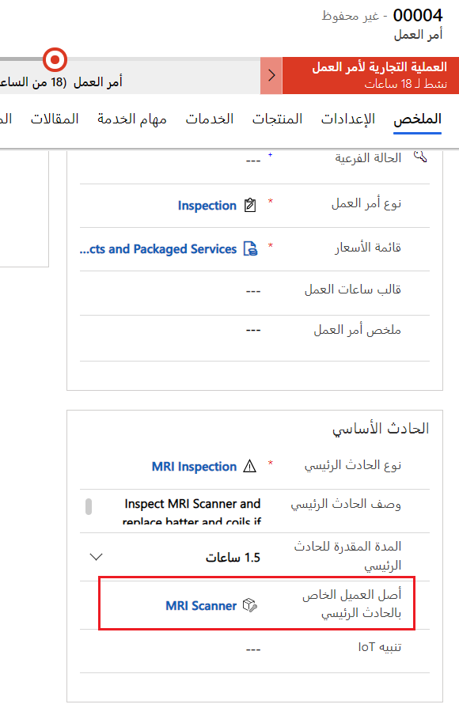
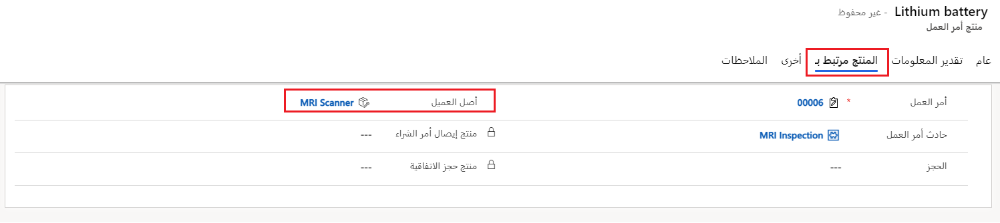
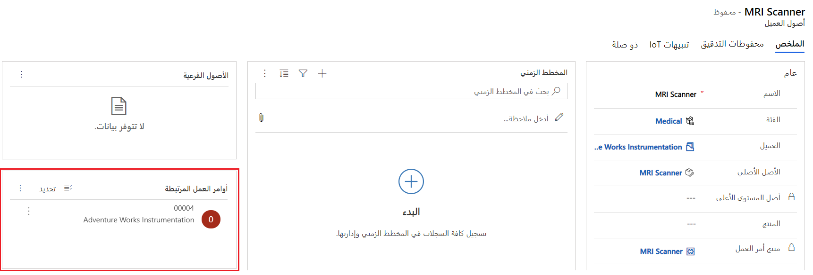
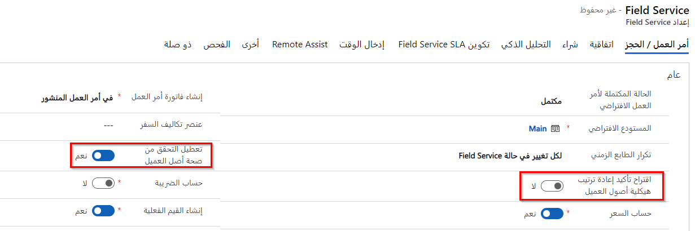

يمكنك إقران أصول العميل بأوامر العمل والاتفاقيات وأجهزة IoT لإنشاء سجل خدمة.

## إنشاء تاريخ الخدمة

بعد إنشاء أصول العميل، يمكنك تعقب الإصلاحات وعمليات الفحص والاختبارات وبيانات IoT والمشكلات لإنشاء سجل خدمة كامل.
يعد فهم سجل الخدمة أمراً مهماً لاتخاذ قرارات إصلاح أفضل، والحفاظ على عمر الأصول ووقت التشغيل، وفي النهاية إرضاء العملاء. 

تتضمن الطرق التي يمكنك من خلالها إنشاء سجل خدمة ما يلي:

- **ملاحظات** - أضف ملاحظات إلى الجدول الزمني لأصل العميل. يمكن للفني الميداني إضافة الملاحظات والصور ومقاطع الفيديو والتسجيلات الصوتية إلى المخطط الزمني لأصل العميل في تطبيق الأجهزة المحمولة Field Service.

- **الاتفاقيات** - يمكنك إقران أصل العميل بحادث اتفاقية لإنشاء أوامر عمل صيانة وقائية لأصل العميل تلقائياً.

- **أوامر العمل** - إقران أصل العميل بأمر عمل.

## أوامر العمل

تتمثل الطريقة القياسية والأكثر تنظيماً لإنشاء محفوظات الخدمة في إقران أصل العميل بحادث أمر العمل.

يمكنك إقران أحد أصول العميل بأمر عمل عن طريق تحديد أصل العميل كـ **أصل عميل الحوادث الحادث** في أمر العمل.

> [!div class="mx-imgBorder"]
> 

> [!NOTE]
> يؤدي تعيين أصل العميل في أمر العمل إلى ربط أصل العميل تلقائياً بأي منتجات وخدمات ومهام لأمر العمل.

إذا كنت لا تستخدم أنواع الحوادث، فيمكنك إقران أصل العميل في علامة التبويب **المنتج يتصل بـ** في منتج أمر العمل.

> [!div class="mx-imgBorder"]
> 

يظهر أمر العمل في قسم **أوامر العمل ذات الصلة** من أصل العميل، عندما يظهر فيه أحد أصول العميل في حادثة أمر عمل.

> [!div class="mx-imgBorder"]
> 

## أضف أصول العميل من حسابات مختلفة إلى أوامر العمل

يمكنك إعداد النظام للسماح بأصول العميل المرتبطة بحسابات أخرى غير حساب الخدمة في أمر العمل، ليتم ربطها بأمر العمل. يساعد هذا التكوين في السيناريوهات التي قد يكون فيها أحد الأصول مملوكاً لموفر الخدمة، ومع ذلك يلزم إنشاء أوامر العمل للعميل الذي يستخدم الأصل حالياً، مثل التأجير أو الإيجار.

لتمكين هذا السلوك في تطبيق Field Service، انتقل إلى **الإعدادات > إعداد Field Service > أمر العمل / الحجز** وقم بتعيين **تعطيل التحقق من صحة أصول العملاء** إلى **نعم**.

> [!div class="mx-imgBorder"]
> 

يمكنك تعيين الخيار **اقتراح تأكيد إعادة ترتيب هيكلية أصول العميل** إلى **نعم** لتوفير المستخدمين من إنشاء أوامر العمل، وخيار تغيير حساب الخدمة الخاص بأمر العمل لمطابقة حساب أصل العميل.
