تدعم Field Service هياكل أصول العملاء الهرمية. على سبيل المثال، يمكن أن يكون الجزء تابعاً لعنصر واجهة مستخدم، وهو عنصر تابع لجهاز. يمكن أيضاً تمثيل الأصول بنماذج ثلاثية الأبعاد.

## التدرج الهرمي لأصول العميل

ضع في الاعتبار السيناريو التالي من أجل تثبيت الماسح الضوئي بالرنين المغناطيسي الذي يحتوي عادةً على ثلاثة قاعات متجاورة:

- **غرفة المغناطيس** - يحتوي على مغناطيس الماسح الضوئي بالرنين المغناطيسي، وملفات التدرج، وجدول المريض.

- **غرفة المعدات** - يحتوي على مزود الطاقة والمبرد وتردد الراديو وأجهزة أخرى.

- **غرفة التحكم** - يحتوي على الكمبيوتر ووحدة تحكم المشغل.

يمكنك إنشاء كل جهاز في هذه الغرف كأصل يمكن تتبعه بشكل منفصل. عند إنشاء أصل، يمكن تحديد **الأصل الرئيسي**، والذي هو الأصل المباشر لأصل العميل هذا.

> [!div class="mx-imgBorder"]
> [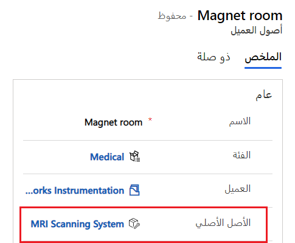](../media/4-parent-asset.png#lightbox)

يمكنك أيضاً عرض الأصول الفرعية وإنشاؤها باستخدام الشبكة الفرعية **للأصول الفرعية** في نموذج **أصول العميل**.

> [!div class="mx-imgBorder"]
> [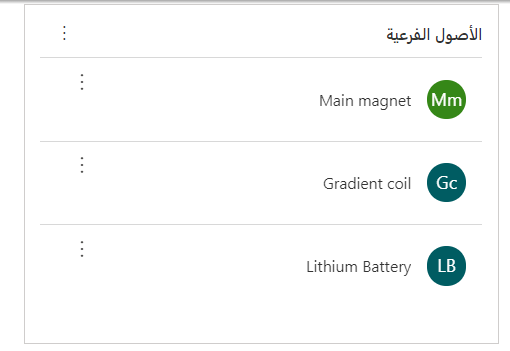](../media/4-sub-assets.png#lightbox)

يمكنك عرض التدرج الهرمي لأصول العميل كرسوم مرئية.

> [!div class="mx-imgBorder"]
> [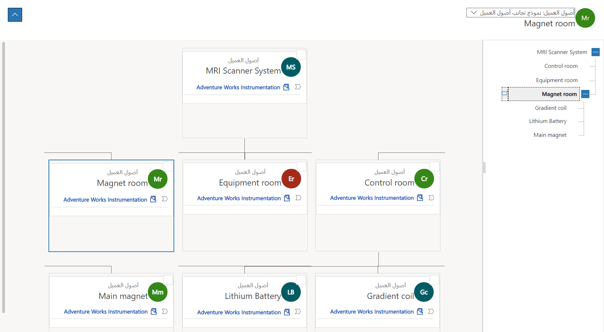](../media/4-asset-hierarchy.png#lightbox)

لعرض التدرج الهرمي، انتقل إلى علامة التبويب **الأصول والمواقع** في الحساب وتحديد المربع **إظهار الأصول**.

> [!div class="mx-imgBorder"]
> [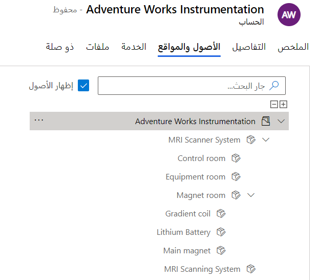](../media/4-account-asset-hierarchy.png#lightbox)

يتم تعيين حقل **‬‏‫أصل المستوى الأعلى‬‏‫** تلقائيا وهو الأصل الرئيسي الذي يمثل الأصل ذو المستوى الأعلى في التدرج الهرمي.

> [!div class="mx-imgBorder"]
> [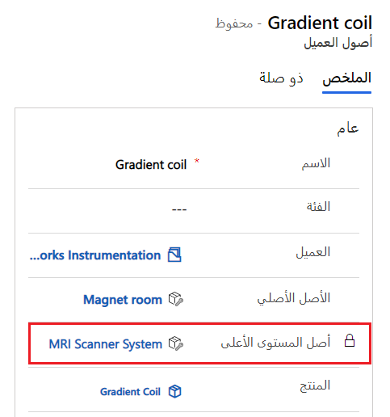](../media/4-top-level-asset.png#lightbox)

## نماذج الأصول ثلاثية الأبعاد

تسمح Dynamics 365 Field Service للمؤسسات بتحميل النماذج ثلاثية الأبعاد لفنيي المجال للإشارة في المجال. عادةً ما يرتبط النموذج ثلاثي الأبعاد بمنتج معين أو أصل عميل ويساعد فنيين المجال في إصلاح المعدات والمهام الأخرى.

يمكنك تكوين نماذج ثلاثية الأبعاد باستخدام علاقة متعدد إلى متعدد بين النموذج ثلاثي الأبعاد وجداول أصول العميل لربط نموذج ثلاثي الأبعاد بأصل العميل.

> [!div class="mx-imgBorder"]
> [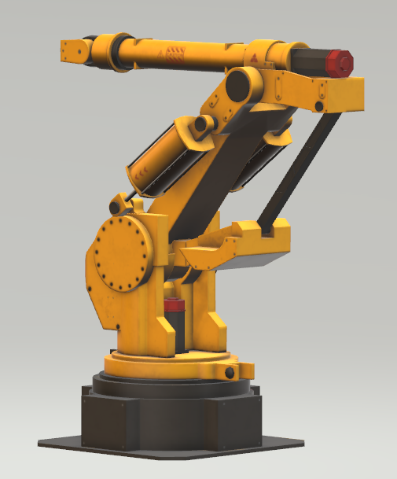](../media/4-robot-arm-3d-model.png#lightbox)

### أنواع الملفات ثلاثية الأبعاد

أنواع الملفات المدعومة للنماذج ثلاثية الأبعاد: GLB وGLTF وOBJ. تأكد من أن هذه الملحقات غير مدرجة في الملحقات المحظورة في **الإعدادات < الخصوصية + الأمان** للبيئة في مركز إدارة Microsoft Power Platform.

> [!div class="mx-imgBorder"]
> [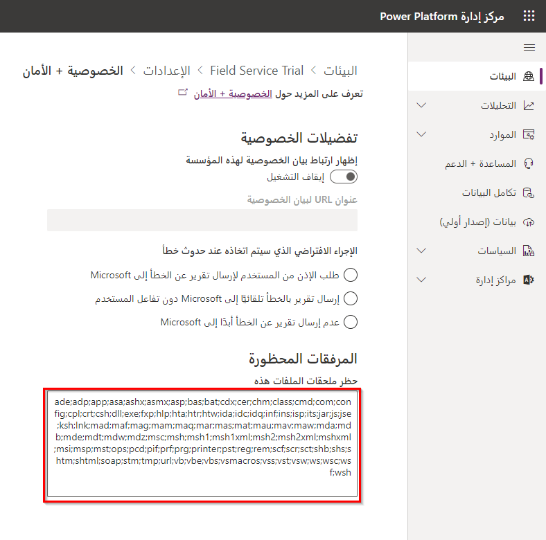](../media/4-blocked-extensions.png#lightbox)

### إقران أصول العميل بنماذج ثلاثية الأبعاد

لإضافة ملف نموذج ثلاثي الأبعاد إلى أصل عميل، افتح سجل أصول العميل وحدد علامة التبويب **ذات الصلة**، وحدد **نماذج ثلاثية الأبعاد** من القائمة المنسدلة وحدد **إضافة نموذج ثلاثي الأبعاد حالي**.

حدد **+ سجل جديد** وحدد **النماذج ثلاثية الأبعاد** ثم انقر فوق **موافق**.

أدخل **اسم** للنموذج ثلاثي الأبعاد وحدد **مرفق ملاحظة** لـ **نوع التخزين** وحدد **حفظ**. وبعد حفظ السجل، سيظهر القسم **المخطط الزمني**. حدد أيقونة مشبك الورق لإضافة ملاحظة مع مرفق وحدد الملف ثلاثي الأبعاد ثم انقر فوق **فتح**.
بعد تحديد أحد الملفات، يمكنك إضافة عنوان ثم حدد **إضافة ملاحظة**.

> [!div class="mx-imgBorder"]
> [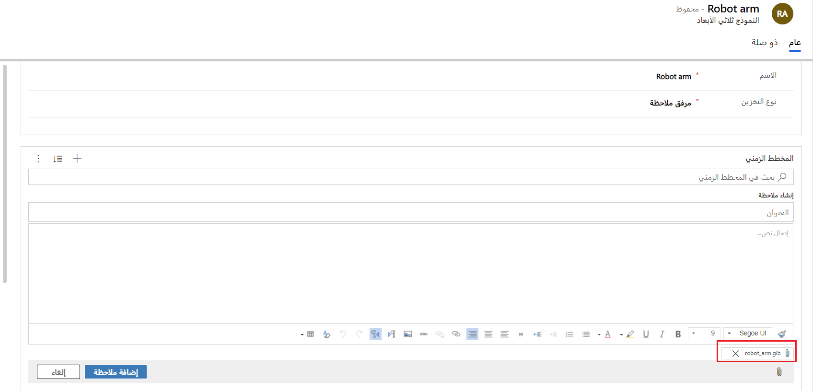](../media/4-3d-model.png#lightbox)

ستظهر الملاحظة في المخطط الزمني مع الملف ثلاثي الأبعاد المرفق بعد حفظها.

لعرض النموذج ثلاثي الأبعاد، قم بالتمرير لأسفل النموذج. يمكنك التفاعل مع العارض ثلاثي الأبعاد بالتمرير والنقر بزر الماوس الأيسر والنقر بزر الماوس الأيمن والسحب.

> [!div class="mx-imgBorder"]
> [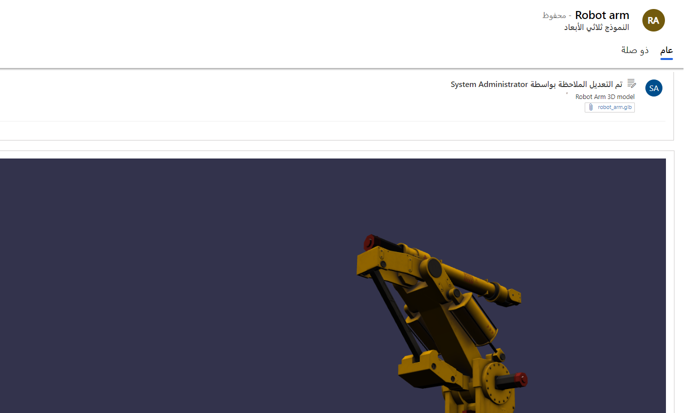](../media/4-view-3d-model.png#lightbox)

افتح سجل أصول العميل مرة أخرى وحدد علامة التبويب **ذات الصلة**، وحدد **نماذج ثلاثية الأبعاد** من القائمة المنسدلة وحدد **إضافة نموذج ثلاثي الأبعاد حالي**. ثم حدد النموذج ثلاثي الأبعاد وانقر فوق **إضافة**.

> [!div class="mx-imgBorder"]
> [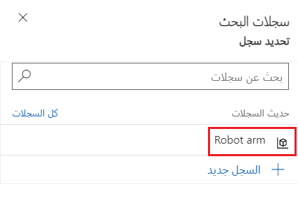](../media/4-select-3d-model.png#lightbox)

يمكن عرض الصورة ثلاثية الأبعاد والتفاعل معها في تطبيق الأجهزة المحمولة Field Service.

> [!div class="mx-imgBorder"]
> [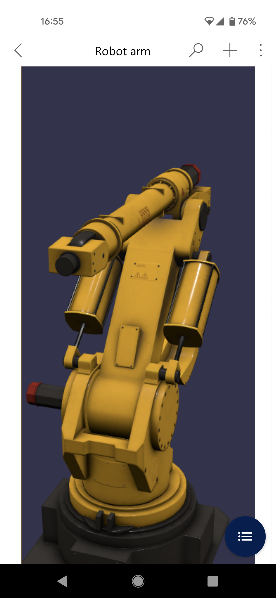](../media/4-mobile-app-3d-model.png#lightbox)
