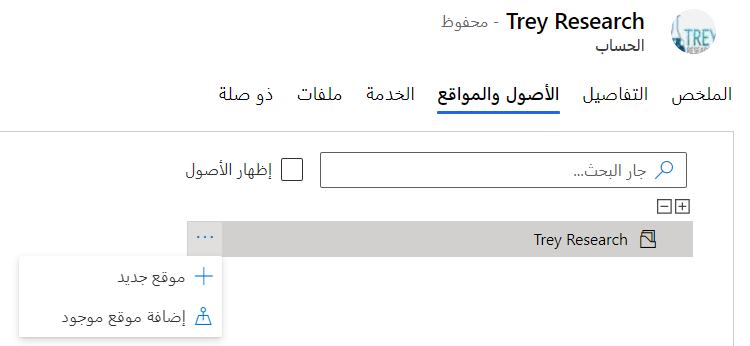
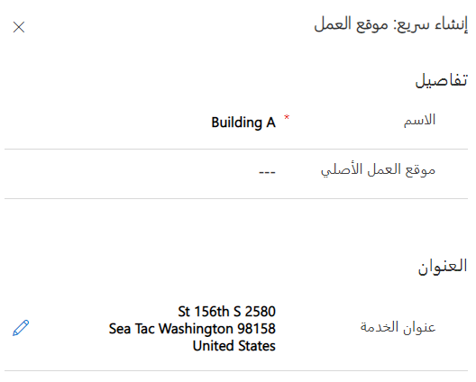
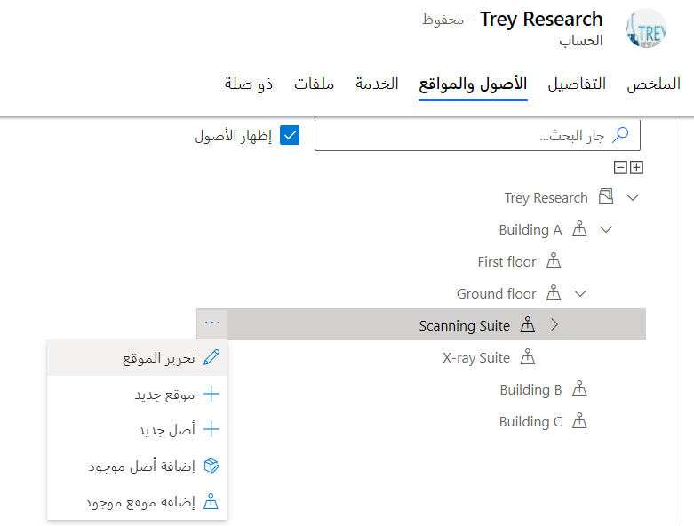
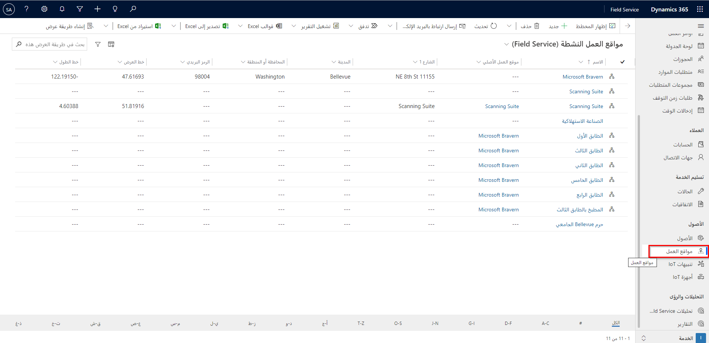
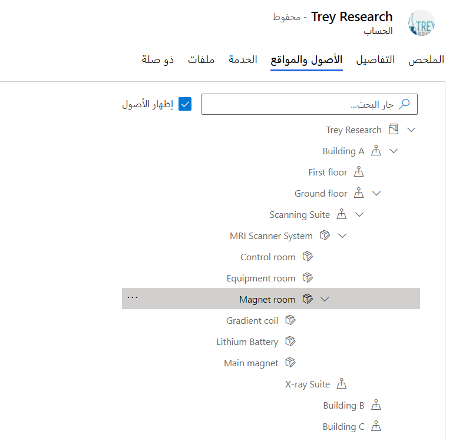
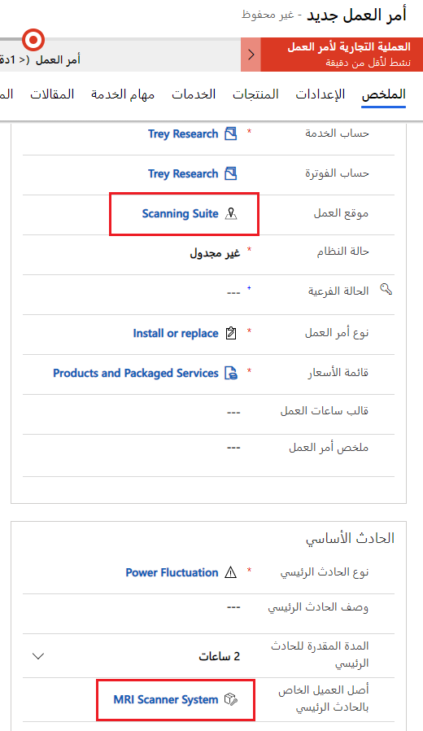
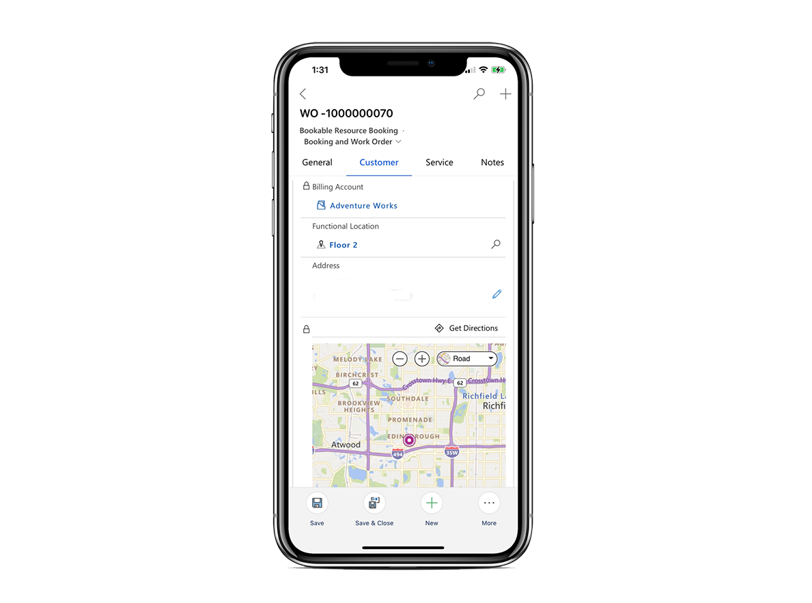

في كثير من الأحيان، تقدم مؤسسات Field Service الخدمة للعملاء الذين لديهم مواقع عمل كبيرة أو معقدة مع مبانٍ متعددة أو مباني مكاتب متعددة الطوابق. في مثل هذه الحالات، من المهم أن يتمكن الفنيون من العثور على مواقع محددة حيث سيؤدون عملهم.

تتيح ميزة **موقع العمل** في Field Service مزيداً من التفاصيل الدقيقة للموقع أكثر من حساب الخدمة:

- داخل حساب خدمة

- للبحث عن أصل العميل

- في حالات خدمة العملاء

- في الاتفاقيات

- في أوامر العمل

يمكن تمثيل مواقع العمل في علاقة هرمية.
على سبيل المثال، قد توجد الطابعة في الطابق الثالث، في المبنى A، في موقع العميل.

عادةً ما تقوم بإقران مواقع العمل بحساب الخدمة.
بالإضافة إلى ذلك، يمكنك إنشاء مواقع عمل بشكل مستقل، ولا تحتاج إلى إقرانها بحساب خدمة. ومع ذلك، نظراً لأن حساب الخدمة مطلوب لإنشاء أمر عمل، فلا يمكنك استخدام موقع عمل مع أمر عمل في Field Service.

## إنشاء مواقع عمل

لإنشاء مواقع العمل، انتقل إلى علامة التبويب **الأصول والمواقع** في نموذج حساب الخدمة.

> [!div class="mx-imgBorder"]
> 

حدد علامة الحذف (**...**) ثم حدد **+ موقع جديد**.

امنح الموقع **الاسم** و **عنوان الخدمة** ثم حدد **حفظ وإغلاق**.

> [!div class="mx-imgBorder"]
> 

سيظهر الموقع الجديد في القائمة، وبعد ذلك يمكنك إضافة المزيد من مواقع العمل وإضافة الأصول إلى موقع العمل.

> [!div class="mx-imgBorder"]
> 

> [!NOTE]
> لتطبيق رمز جغرافي على العنوان تلقائياً، قم بتعيين الحقل **عناوين الرمز الجغرافي التلقائي** على **نعم** بالانتقال إلى **الإعدادات> عام> إعدادات Field Service> أخرى**.

يمكنك أيضاً عرض جميع مواقع العمل في تطبيق Field Service بالانتقال إلى **الخدمة> الأصول> مواقع العمل**.

> [!div class="mx-imgBorder"]
> 

> [!NOTE]
> يمكنك إقران موقع عمل بحسابات متعددة.

### أضف الأصول إلى شجرة موقع العمل

يتمثل الاستخدام الأساسي لدالة ما هي في مساعدة الفنيين الميدانيين في العثور على الموقع المحدد لأصل العميل عندما يؤدون عملهم.

يمكنك إقران أصول العميل مباشرةً بموقع عمل.
من علامة التبويب **الأصول والمواقع**، حدد خانة الاختيار **إظهار الأصول** لعرض قائمة بأصول العملاء المرتبطة. يمكنك سحب الأصول وإفلاتها في مواقع العمل.

يمكنك إنشاء وإضافة أصول موجودة إلى موقع عمل عن طريق تحديد علامة الحذف (**...**) ثم تحديد **إضافة أصل موجود**.

> [!div class="mx-imgBorder"]
> 

## استخدام موقع العمل مع أوامر العمل

عندما تقوم بتعبئة أمر عمل، إذا قمت بتحديد أصل حادث أساسي للعميل، فستتم إضافة موقع العمل تلقائياً إلى أمر العمل.

> [!div class="mx-imgBorder"]
> 

بعد تحديد موقع العمل، ستظهر معلومات أكثر تفصيلاً في علامة التبويب **المواقع** لأمر العمل. إذا كان لموقع العمل عنوان محدد، فسيتم ملء هذه المعلومات في علامة التبويب **المواقع** إذا كان موقع العمل لا يحتوي على عنوان ولكن له خط عرض وخط طول، فلن يتم ملء أي عنوان، ولكن سيتم ملء خط العرض وخط الطول.

### استخدم مواقع العمل على تطبيق الهاتف المحمول

يمكن للفنيين عرض موقع العمل لأمر العمل على تطبيق الأجهزة المحمولة Dynamics 365 Field Service.

بالإضافة، أنهم يمكنهم عرض موقع العمل والتدرجات الهرمية لأصول العميل والتفاعل معها على تطبيق الهاتف المحمول.

> [!div class="mx-imgBorder"]
> 
