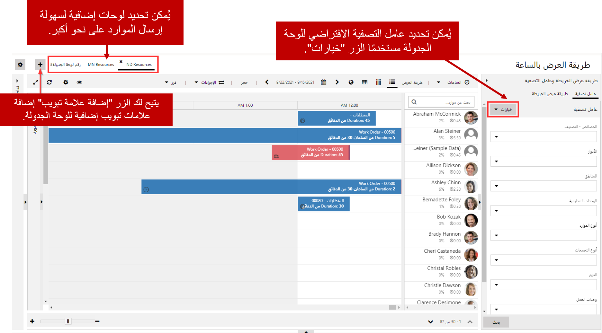
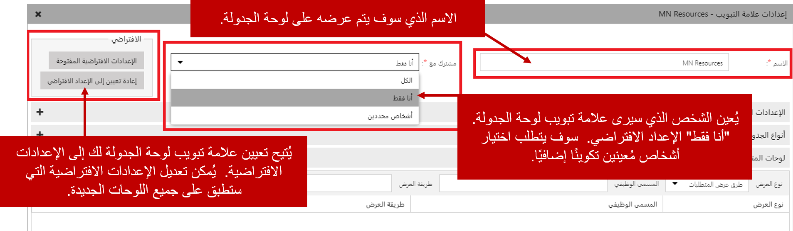
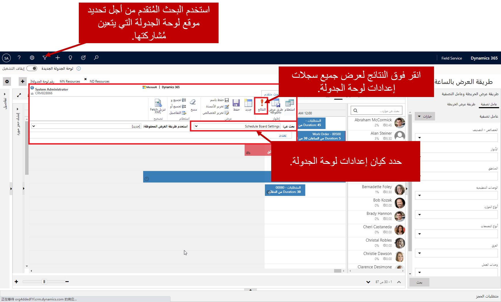

من الشائع أن يقوم مرسل واحد بجدولة كميات كبيرة من الموارد عبر مناطق متعددة أو مراكز خدمة. على الرغم من أن لوحة الجدول الزمني توفر القدرة على تصفية الموارد المعروضة استناداً إلى بعض العوامل مثل المهارات والأقاليم، يمكن أن يكون تعهداً مضنياً وعرضة للخطأ لاستخدام معايير التصفية الصحيحة لإرسال كمية كبيرة من الموارد بكفاءة.

على سبيل المثال، لنفترض أن المرسل يقوم بجدولة الموارد لثلاثة أقاليم مختلفة؛ داكوتا الشمالية، داكوتا الجنوبية، ومينيسوتا. يمكنهم تصفية لوحة الجدولة إلى موارد العرض لكل منطقة على حدة حسب الحاجة إلى جدولتها، ولكن إذا كانوا يقومون بجدولة مئات العناصر يومياً، فإنهم سيغيرون عوامل التصفية باستمرار. سيكون من الأسهل والأكثر كفاءة أن يمتلك المرسل العديد من لوحات الجدولة التي تمت تصفيتها مسبقاً لكل من المناطق (داكوتا الشمالية وداكوتا الجنوبية ومينيسوتا) التي يقوم بجدولتها. في هذه الحالة، يمكن للمرسل ببساطة تحديد لوحة الجدول الزمني للإقليم الذي يريد العمل معه.

يمكن إنشاء علامات تبويب إضافية للوحة الجدولة بالنقر على زر "إضافة علامة تبويب" الموجود في أعلى يسار لوحة الجدولة. بعد إنشاء اللوحة، يمكن تعديل المعايير الافتراضية لتلك اللوحة لتعكس الموارد التي يجب عرضها. على سبيل المثال، يمكن تصفية لوحة موارد مينيسوتا لإظهار الموارد المخصصة لإقليم مينيسوتا فقط.

بشكل افتراضي، ستكون علامة تبويب لوحة الجدولة مرئية فقط للشخص الذي أنشأها ولكن يمكن جعلها مرئية للمستخدمين الآخرين إذا لزم الأمر. باستخدام الحقل "مشاركة مع"، يمكن توفير اللوحة لما يلي:

-   **أنا فقط**: ستكون علامة التبويب لوحة الجدولة مرئية فقط للشخص الذي أنشأها. (افتراضي)
-   **الكل**: سيتم الوصول إلى علامة تبويب لوحة الجدولة لأي شخص في المؤسسة التي لديها إمكانية وصول لوحة الجدولة.
-   **أشخاص محددين**: ستتوفر علامة التبويب لوحة الجدولة فقط لمستخدمين بعينهم تم منحهم حق الوصول لقراءة هذا السجل الخاص بلوحة الجدولة. (يتطلب تكويناً إضافياً)

### مشاركة لوحة جدولة

يتضمن Universal Resource Scheduling كيان يسمى إعدادات لوحة الجدولة. سيكون لكل علامة تبويب لوحة جدولة تم إنشاؤها بواسطة سجل إعدادات لوحة الجدولة المطابق الذي تم إنشاؤه لها. يمكن تعديل معظم إعدادات علامة تبويب لوحة الجدولة عن طريق فتح إعدادات علامة التبويب والنقر المزدوج على علامة تبويب لوحة الجدولة. ومع ذلك، عند تعيين علامة تبويب لوحة جدولة لمشاركتها مع أشخاص معينين، لا يمكن تعديل الأشخاص المحددين لمشاركتها من إعدادات علامة التبويب. يجب مشاركة سجل "إعدادات لوحة الجدولة" الفعلي مع الأشخاص المحددين الذين يحتاجون إلى الوصول.

يمكن القيام بذلك في البداية باستخدام البحث المتقدم وتغيير البحث عن الحقل ليكون كيان إعدادات لوحة الجدولة. عند النقر على زر النتائج، سيتم عرض جميع علامات تبويب لوحة الجدولة التي تم إنشاؤها. بمجرد تحديد موقع لوحة الجدولة التي تريد توفير الوصول إليها، انقر فوق الزر المشاركة، وسيتم عرض شاشة المشاركة القياسية Dynamics 365. يمكنك توفير حق الوصول للقراءة إلى أي مستخدمين أو فرق يجب أن يكون لها حق الوصول إلى اللوحة. سيتم الآن توفير علامة تبويب "لوحة الجدولة" المحددة لأي شخص تمت المشاركة معه.

> [!VIDEO https://www.microsoft.com/videoplayer/embed/RE2Kewx]

### تلميحات مفيدة

إذا كان لدى المؤسسة العديد من علامات تبويب لوحة الجدولة التي تم إنشاؤها، يمكن إضافة معايير تصفية إضافية إلى معايير البحث المتقدمة لعرض لوحات الجدولة التي تستوفي هذه الشروط فقط مثل عرض لوحات الجدولة لمالك سجل معين.

لتسهيل عملية مشاركة اللوحات، يمكن إنشاء فرق في Dynamics 365. يمكن مشاركة علامات تبويب لوحة الجدولة لهذه الفرق. على سبيل المثال، يمكن إنشاء فريق مرسلي MN، ويمكن مشاركة لوحة جدول مينيسوتا مع ذلك الفريق. عندما يحتاج المرسل إلى الوصول إلى تلك اللوحة، يمكن إضافتها ببساطة إلى فريق مرسلي MN.
