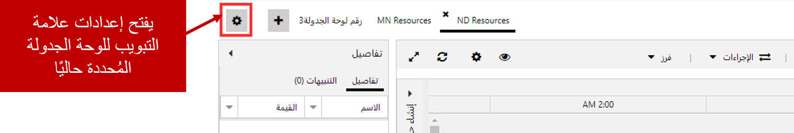
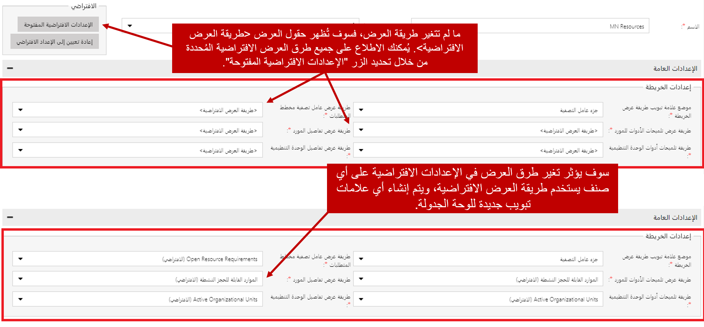
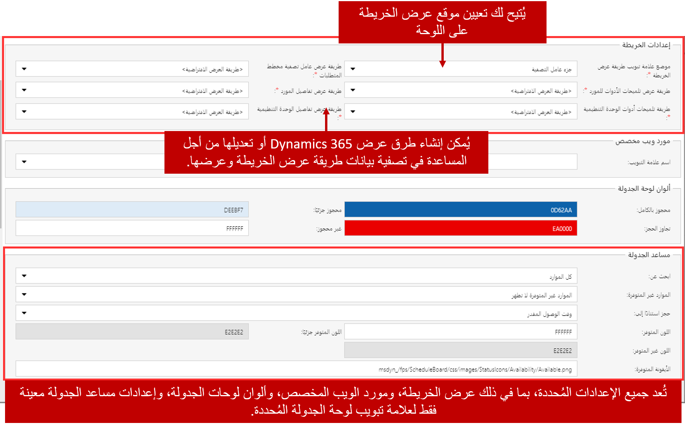
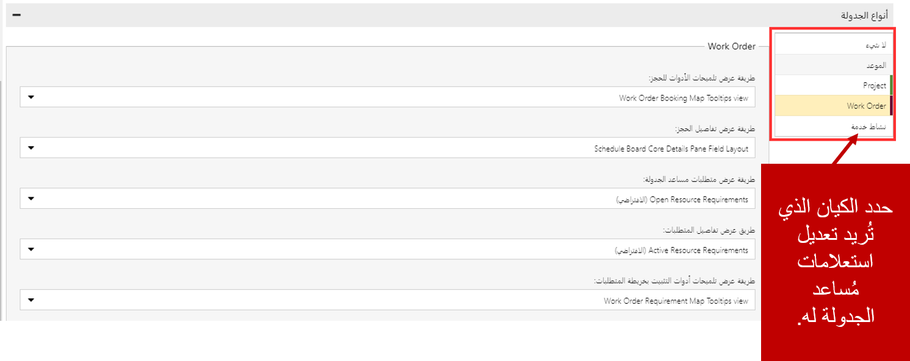
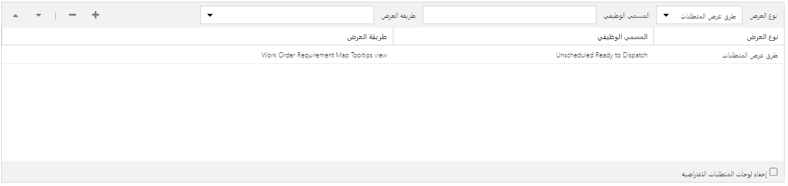

تحتوي كل علامة تبويب للوحة الجدولة التي تمت إضافتها على خيارات يمكن تعديلها لها. يمكن تعديل خيارات لوحة الجدولة إما بالنقر المزدوج على علامة التبويب لوحة الجدولة التي تريد تعديل الإعدادات لها، أو بالنقر على الزر إعدادات علامة التبويب. عند النقر على الزر إعدادات علامة التبويب سيتم عرض إعدادات لوحة الجدولة للوحة الجدولة المحددة حالياً.

تحتوي كل علامة تبويب للوحة الجدولة على ثلاث مناطق يمكن استخدامها للمساعدة في تكوين هذه اللوحة المحددة. توفر هذه المناطق خيارات من موضع الكائنات إلى طرق العرض التي يتم استخدامها لتقديم البيانات على اللوحة. وإليك علامات التبويب هذه:

-   **الإعدادات العامة:** تقوم بتعريف عناصر مثل طرق العرض المستخدمة لعناصر اللوحة، ووضع العناصر على اللوحة، والألوان.
-   **أنواع الجداول:** تتيح تحديد طرق العرض المستخدمة لعرض الأصناف وتصفيتها، مثل الحجوزات والمتطلبات الخاصة بكل كيان تم تمكينه لـ Universal Resource Scheduling.
-   **لوحة المتطلبات:** تسمح للمؤسسة بإضافة علامات تبويب متطلبات إضافية إلى لوحة المتطلبات الموجودة أسفل لوحة الجدولة.
    -   على سبيل المثال، يمكنك إنشاء علامة تبويب لوحة تقوم فقط بإظهار أوامر العمل غير المجدولة حيث تحتوي أوامر العمل على حالة فرعية للنظام من الأجزاء التي تم وصولها.

بينما يتم تكوين كل علامة تبويب للوحة الجدولة بشكل مستقل، فإن هناك إعدادات افتراضية يمكن تعريفها. تستخدم هذه الإعدادات لكل علامات تبويب لوحة الجدولة ما لم يتم تحديد غير ذلك. يمكن الوصول إلى الإعدادات الافتراضية بالنقر على الزر "فتح الإعدادات الافتراضية".

### الإعدادات العامة

يحتوي قسم "الإعدادات العامة" على خمسه أقسام متوفرة يتم استخدامها لتكوين اللوحة.

وإليك الأقسام هذه:

-   **إعدادات الخريطة**: تحدد الإعدادات المرتبطة بموضع عرض الخريطة والبيانات المتاحة للمساعدة في جدولة الأصناف.
-   **مورد الويب المخصص**: يعرف علامة تبويب مخصصة يمكن ربطها بمورد ويب والتي يمكن أن توفر إمكانات إضافية للوحة الجدولة.
-   **ألوان لوحة الجدولة**: يحدد الألوان المستخدمة للإشارة إلى كيفية ظهور الموارد المحجوزة ضمن اللوحة.
-   **مساعد الجدولة**: يتيح تحديد الإعدادات المستخدمة عند استخدام مساعد الجدولة من علامة التبويب لوحة الجدولة. تتضمن هذه الإعدادات:
    -   **البحث عن**: يقوم بتعريف الموارد التي سيتم البحث فيها وفقاً للمعايير المتوفرة. يمكنك البحث في الموارد المرئية حالياً فقط أو كافة الموارد.
    -   **الموارد غير المتوفرة**: يحدد ما إذا كان سيتم عرض الموارد غير المتاحة في نتائج البحث.
    -   **الحجز المستند إلى**: يحدد كيفية حجز مورد لأحد الأصناف. يمكنك اختيار الحجز استناداً إلى الوصول المقدر أو ‏‫بدء السفر‬.
    -   **ألوان الإتاحة**: يحدد الألوان المستخدمة لتمثيل الموارد المتوفرة وغير المتوفرة والموارد المتوفرة جزئياً.
    -   **رموز الإتاحة**: تحدد الرموز المستخدمة لتمثيل الموارد المتوفرة وغير المتوفرة والموارد المتوفرة جزئياً. (يجب أن يتم تحميل الرموز إلى Dynamics 365 كمورد ويب أولاً)
-   **الإعدادات الأخرى**: تحدد الإعدادات الأخرى التي تتعلق بلوحة الجدولة المحددة. تتضمن هذه الإعدادات:
    -   **عدد صفحات المتطلبات**: يحدد عدد سجلات المتطلبات التي يتم إرجاعها في الصفحة.
    -   **طريقة عرض تنبيهات الحجز**: تحدد طريقة عرض Dynamics 365 التي ستقوم بملء تنبيهات الحجز التي يتم عرضها على اللوحة.
    -   **ألوان الساعات غير المخصصة للعمل**: تحدد لون الخلفية المستخدم في اللوحة لتمثيل الساعات التي لا يعمل فيها المورد.
    -   **لون المخطط الزمني الحالي**: يحدد لون السطر المستخدم للإشارة إلى الوقت الحالي في لوحة الجدولة.
    -   **قالب تنبيهات الحجز**: يحدد القالب المستخدم لتنبيهات الحجز.
    -   **استعلام تخطيط عامل التصفية**: يحدد عناصر التحكم المُتاحة للاستخدام باعتبارها عوامل تصفية.
    -   **استرداد الاستعلام عن الموارد‬**: يتحكم في النتائج التي يتم إرجاعها عند النقر فوق زر البحث.  
    -   **قالب خلية المورد**: يتحكم في ما يتم عرضه في خلية المورد على لوحة الجدولة.

    

### أنواع الجداول

يوفر القسم نوع الجدول القدرة على تحديد طرق العرض التي سيتم استخدامها لملء المكونات المختلفة في لوحة الجدولة، مثل تفاصيل السجل عند إنشاء سجل. لكل كيان تم تمكينه لـ Universal Resource Scheduling إعدادات فردية خاصة به يمكن تعديلها.

تتضمن إعدادات نوع الجدول التي يمكن تعريفها:

-   **طريقة عرض تلميحات أدوات الحجز**: يعرف طريقة العرض التي سيتم استخدامها لملء محتويات تلميح الأدوات التي يتم عرضها عند إجراء حجز قد تحوم فوق على لوحة الجدولة.
-   **طريقة عرض تفاصيل الحجز**: يعرف طريقة العرض التي سيتم استخدامها لعرض تفاصيل السجل في جزء التفاصيل عند تحديد الحجز.
-   **طريقة عرض متطلبات مساعد الجدولة**: يعرف طريقة العرض التي سيتم استخدامها لملء المتطلبات في مساعد الجدولة.
-   **طريقة عرض تفاصيل المتطلبات**: يعرف طريقة العرض التي سيتم استخدامها لعرض تفاصيل السجل في جزء التفاصيل عند تحديد متطلبات المورد.
-   **عرض تلميحات أدوات دبوس مخطط المتطلبات**: يعرف طريقة العرض التي سيتم استخدامها لملء محتويات تلميح الأدوات الذي يتم عرضه عند تمرير أحد المتطلبات فوق طريقة عرض الخريطة.
-   **طريقة عرض الإتاحة الافتراضية**: تحدد طريقة العرض المستخدمة لعرض إتاحة المورد. يمكن تعيين ذلك لأي من الشبكات أو اللوح.
-   **قالب الحجز**: يحدد القالب المستخدم لعرض حجز على لوحة الجدولة.

    

عند فتح الإعدادات الافتراضية، يتم عرض إعدادات نوع جدولة إضافية مرتبطة بمساعد الجدولة. وكما هو الحال في العناصر الأخرى الموجودة في إعدادات نوع الجدول، يمكن تكوينها لكل وحدة يتم تمكينها للوحة الجدولة. تتضمن الإعدادات الإضافية:

-   تخطيط عامل تصفية مساعد الجدولة: يتحكم فقط في أنواع عناصر التحكم المتوفرة لاستخدامها كعوامل تصفية على اللوحة. ستتغير شاشة التصفية استناداً إلى العناصر المضمنة في استعلام إحضار XML.
-   قالب خلية المورد لمساعد الجدولة: يتحكم في ما يتم عرضه في خلية المورد المعروضة على لوحة الجدولة.
-   ‏‫استعلام استرداد الموارد لمساعد الجدولة‬‬‬: يتحكم في النتائج التي يتم إرجاعها من خلال النقر على زر البحث في التطبيق.
-   *‏‫استعلام استرداد القيود لمساعد الجدولة: يقوم باسترداد أي قيود من سجل متطلبات الموارد وتعبئتها لعناصر تحكم عوامل التصفية المقابلة.

### لوحة المتطلبات

لوحة المتطلبات: السماح للمؤسسة بإضافة علامات تبويب متطلبات إضافية إلى لوحة المتطلبات الموجودة أسفل لوحة الجدولة.

> [!Note]
>  يتضمن تعديل طرق العرض المستخدمة في علامة التبويب إعدادات نوع الجدولة ولوحة المتطلبات عمل تخصيصات لطرق عرض كيانات Dynamics 365. كيفية تعديل بالإضافة إلى تحديد الكيانات المستخدمة لأنواع الجدول وتتم تغطية لوحة المتطلبات باستخدام طرق العرض مع لوحة الجدولة.
