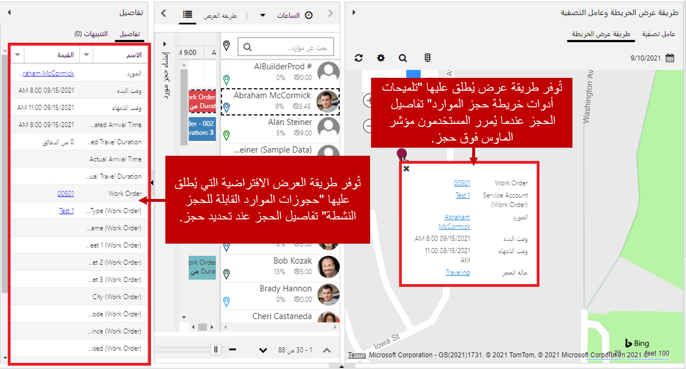
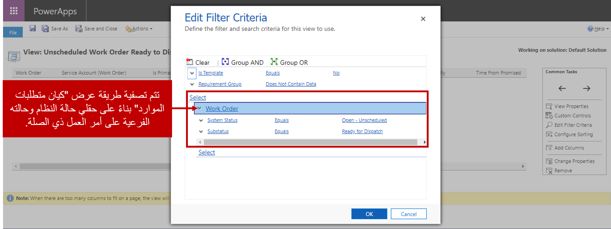
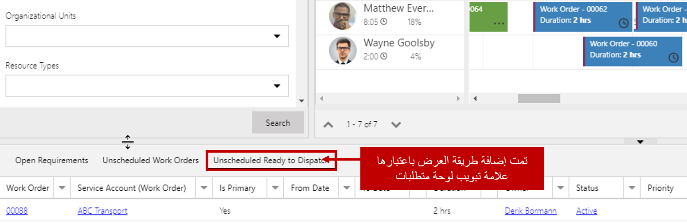
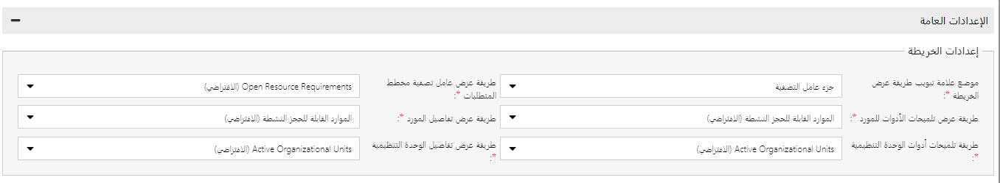
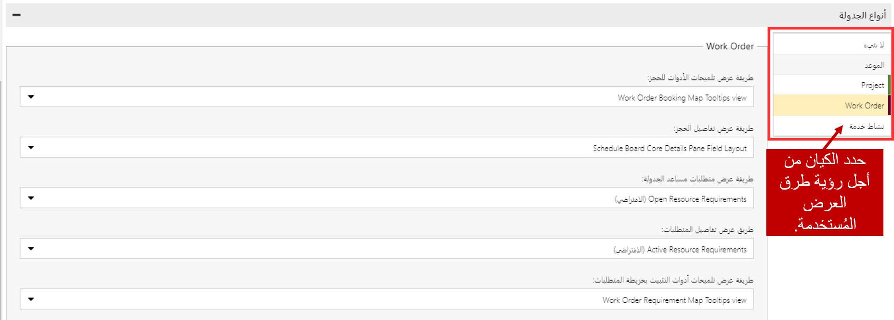
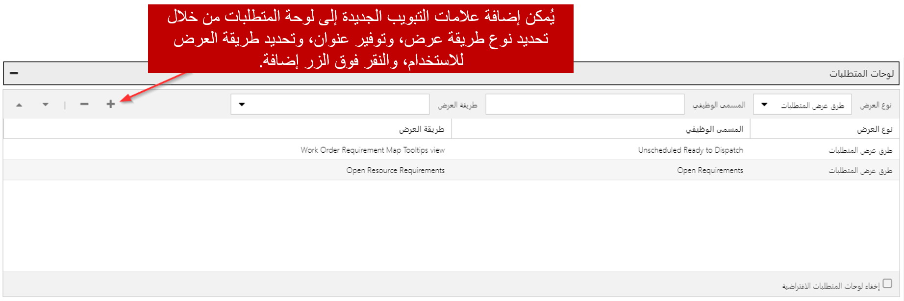

تستخدم لوحة الجدولة طرق عرض كيان Dynamics 365 للمساعدة على تصفية البيانات المعروضة على اللوحة وعرضها. على سبيل المثال، في الصورة أدناه، يستخدم المرسل طريقة عرض الخريطة للمساعدة على جدولة الأصناف.

-   عندما يحوم المرسل فوق حجز معين، يتم عرض تلميح منبثق يوفر معلومات عامة عالية المستوى حول الحجز.
    -   البيانات الموجودة في تلميح الأداة هذا عبارة عن بيانات مملوءة من طريقة عرض Dynamics 365 المقترنة بكيان حجز الموارد القابل للحجز المسمى تلميحات أدوات خريطة حجز الموارد.
-   عندما يحدد المرسل الحجز، يتم ملء جزء التفاصيل بنظرة أكثر تفصيلاً في الحجز.
    -   تفاصيل الحجز المقدمة تستخدم طريقة عرض مختلفة لكيان حجز المورد القابل للحجز تسمى حجوزات الموارد النشطة القابلة للحجز.

قد ترغب المؤسسات في التحكم في البيانات المحددة التي يتم تقديمها عندما يحوم المرسلون فوق كائنات لوحة الجدولة ويتفاعلون معها. للقيام بذلك، يمكنهم تخصيص طرق العرض المقترنة بكيانات معينة واستخدام تلك العروض على لوحة الجدولة.

لا يمكن أن تكون طرق العرض مفيدة فقط عند تقديم البيانات إلى المرسلين، بل يمكنها أيضاً المساعدة في تحديد متى يكون الصنف جاهزاً للجدولة. بشكل افتراضي، عند إنشاء أمر عمل جديد، يتم أيضاً إنشاء سجل متطلبات المورد المرتبط بأمر العمل. يتم عرض سجل المتطلبات في لوحة المتطلبات على لوحة الجدولة، بحيث يمكن جدولتها. في كثير من الأحيان، قد تكون هناك حاجة إلى المزيد قبل أن تتمكن من جدولة الصنف.

على سبيل المثال، ربما لا يمكن جدولة الصنف لأن الأجزاء المطلوبة لتنفيذ أمر العمل لم تصل. يمكننا منعه من الظهور على لوحة الجدولة حتى وصول الأجزاء وتم وضع علامة على أمر العمل على أنه جاهز للإرسال. في Dynamics 365، سننشئ طريقة عرض مخصصة تعرض فقط متطلبات الموارد لأوامر العمل غير المجدولة مع استعداد للإرسال.

يمكن استخدام طريقة العرض الجديدة في لوحة "المتطلبات" لتقييد متطلبات الموارد المعروضة على المتطلبات التي تم إرجاعها في هذا العرض فقط.

هناك خمسة كيانات عادةً ما يتم استخدامها لعرض البيانات المعروضة في لوحة الجدولة وتصفيتها. يسمح تحرير أو إنشاء طرق عرض جديدة في Dynamics 365 المقترنة بهذه الكيانات للمؤسسة بالتأكد من أن البيانات المقدمة مطلوبة تماماً لجدولة فعالة.

تحدد القائمة أدناه كيان Dynamics 365 المستخدم، وتوفر نظرة عامة حول كيفية استخدامه في لوحة الجدولة:

-   **كيان موارد قابلة للحجز**: تُستخدم طرق عرض الموارد القابلة للحجز من أجل:
    -   توفير بيانات تعريف الأدوات عند المرور فوق أحد الموارد.
    -   عرض بيانات الموارد التفصيلية عند تحديد مورد.
-   **كيان الوحدات التنظيمية**: تُستخدم طرق عرض الوحدة التنظيمية لما يلي:
    -   توفير بيانات تعريف الأدوات عند المرور فوق إحدى الوحدات التنظيمية.
    -   عرض بيانات مفصلة حول وحدة تنظيمية عند تحديدها.
-   **كيان متطلبات الموارد**: تُستخدم طرق عرض متطلبات الموارد‏‎ من أجل:
    -   تعبئة تفاصيل المتطلبات المعروضة في لوحة المتطلبات.
    -   تصفية المتطلبات المفتوحة التي يتم عرضها في عرض الخريطة.
    -   توفير بيانات تعريف الأدوات عند المرور فوق أحد المتطلبات.
    -   عرض معلومات مفصلة عند تحديد أحد المتطلبات.
    -   عرض المتطلبات المفتوحة عند استخدام مساعد الجدولة.
-   **كيان حجوزات الموارد القابلة للحجز**: تُستخدم طرق عرض حجز الموارد القابلة للحجز من أجل:
    -   توفير بيانات تعريف الأدوات عند المرور فوق وحدة الحجز.
    -   عرض بيانات الحجز التفصيلية عند تحديد الحجز.
-   **كيان حالة تنبيه الحجز**: يُستخدم لتوفير معلومات حول تنبيهات الحجز التي تم إنشاؤها.

لكل كيان طرق عرض يتم استخدامها بشكل افتراضي لكل من السيناريوهات المذكورة أعلاه. يمكن تعديل طرق العرض المستخدمة لهذه الإعدادات حسب الحاجة. توضح القائمة أدناه أين يمكن تغيير طرق العرض وأي طريقة عرض يتم استخدامها بشكل افتراضي:

<!--- video needs updating [!VIDEO https://www.microsoft.com/videoplayer/embed/RE2Ku4w] -->

### إعدادات الخريطة
يقع ضمن الإعدادات العامة
- **طريقة عرض عامل تصفية خريطة المتطلبات**: فتح متطلبات الموارد
- **طريقة عرض تعريف أدوات الموارد**: الموارد النشطة القابلة للحجز
- **طريقة عرض تفاصيل الموارد**: الموارد النشطة القابلة للحجز
- **طريقة عرض تلميحات الوحدة التنظيمية**: الوحدات التنظيمية النشطة
- **طرق عرض تفاصيل الوحدات التنظيمية**: الوحدات التنظيمية النشطة

  

### أنواع الجداول
سيكون لكل كيان ممكّن لـ Universal Resource Scheduling طرق عرض محددة. طرق العرض التي تم تحديدها لكيان أمر العمل مذكورة أدناه:

- **عرض تلميحات أدوات الحجز**: عرض تلميحات خريطة حجز أمر العمل
- **طريقة عرض تفاصيل الحجز**: تخطيط جزء حقل تفاصيل اللوحة
- **طريقة عرض متطلبات مساعد الجدولة**: فتح متطلبات الموارد
- **طريقة عرض متطلبات مساعد الجدولة**: فتح متطلبات الموارد
- **طريقة عرض تفاصيل المتطلبات**: متطلبات الموارد النشطة
- **طريقة عرض تلميحات الأدوات لخريطة المتطلبات**: تلميحات خريطة متطلبات أمر العمل

  

### لوحة المتطلبات
تحدد طرق العرض التي سيتم استخدامها لملء السجلات المعروضة في علامات التبويب المختلفة للوحة المتطلبات أسفل لوحة الجدولة. تدعم لوحة المتطلبات نوعين من طرق العرض:
- **طرق عرض المتطلبات**: تعرض المتطلبات التي يكون فيها مورداً واحداً مطلوباً.
    -  **طرق عرض مجموعة المتطلبات**: عرض مجموعات المتطلبات حيث تكون هناك حاجة لموارد متعددة.
    -   تحتوي مجموعة المتطلبات على متطلبات فردية متعددة ذات صلة تحتها.
    -   يتم تحديث كل متطلب عند جدولة مجموعة المتطلبات.
    -   تُستخدم طرق عرض كيان مجموعة متطلبات الموارد لتعبئة مجموعات المتطلبات المعروضة. بشكل افتراضي، تتضمن لوحة المتطلبات طرق العرض التالية:
-  **المتطلبات المفتوحة**: فتح متطلبات الموارد
-  **أوامر العمل غير المجدولة**: متطلبات أمر العمل غير المجدولة
    - (موجود فقط عند تثبيت Field Service)
-  **المشاريع**: متطلبات المشروع غير المجدولة
    - (موجود فقط عند تثبيت Project Service Automation)

يمكن العثور علي طرق العرض الافتراضية لكل من المناطق المذكورة أعلاه بالنقر فوق الزر فتح الإعدادات الافتراضية في أي علامة تبويب لوحة جدولة. يمكنك استبدال أي من طرق العرض الافتراضية بطريقة عرض أخرى من ذلك الكيان إذا لزم الأمر. ستستخدم أي علامات تبويب جديدة للوحة الجدولة يتم إنشاؤها طرق العرض الافتراضية، ولكن يمكن تعديل طريقة العرض هذه حسب الحاجة. إذا كنت بحاجة إلى العودة إلى طرق العرض الافتراضية لأي سبب من الأسباب، يمكنك تحديد زر إعادة التعيين إلى الافتراضي.

يعد تعديل طرق العرض أو إضافتها لاستخدامها مع لوحة الجدولة طريقة فعالة لتصميم لوحات جدولة محددة لتلبية احتياجات مؤسستك. في الوقت نفسه، إذا كانت الآراء التي يتم الاستفادة منها غير مناسبة وكافي، فإنها يمكن أن تخلق مشاكل.

على سبيل المثال، تذكر عندما أنشأنا طريقة العرض المخصصة التي عرضت فقط متطلبات الموارد لأوامر العمل غير المجدولة مع الحالة الفرعية للاستعداد للإرسال؟ ماذا يحدث إذا نسينا الجزء غير المجدول في طريقة العرض ؟ الآن حتى بعد جدولة الصنف، سيظل موجوداً في المتطلبات غير المجدولة على لوحة الجدولة. قد يبدو هذا مثالاً مبسطاً بشكل للغاية، لكن أشياء صغيرة من هذا القبيل يمكن أن تحدث فرقاً كبيراً. تأكد من أنك تنظر إلى الأشياء من جميع الزوايا وتستخدم ممارسات إنشاء طريقة عرض Dynamics 365 جيدة عند تصميم طرق العرض هذه.

للحصول علي مزيد من المعلومات، راجع [إنشاء طرق عرض Dynamics 365](/dynamics365/customer-engagement/customize/create-edit-views).

