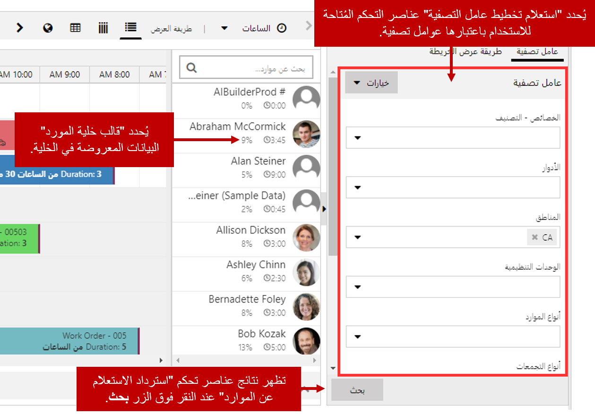
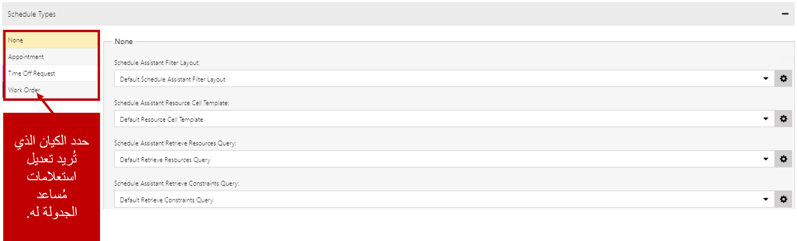
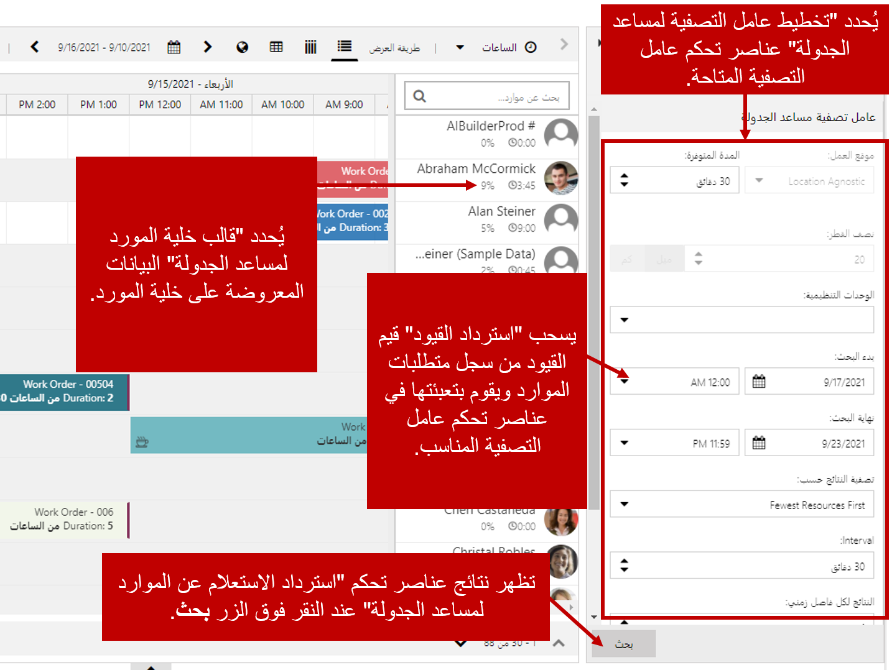

القدرة على تصفية الموارد والبحث عنها هي أحد الميزات العديدة لاستخدام لوحة الجدولة. يمكن اجراء البحث يدوياً باستخدام عامل التصفية في جزء عرض الخريطة وعامل التصفية، أو من خلال مساعد الجدولة.

وبطريقة مبتكرة، يمكن استخدام عناصر التحكم التالية كعوامل تصفية:

-   **الخصائص:** يمكن استخدامها لنموذج المهارات التي يمتلكها المورد. كما أنها تدعم أيضاً قيم التصنيف الاختيارية لتقييم مدى كفاءة المورد في كل مهارة.
-   **الفئات**: يمكن ربط الموارد بفئات.
-   **المناطق**: لتعيين موارد إلى المناطق الإقليمية.
-   **الوحدات التنظيمية**: لوضع نموذج التسلسل الهرمي للمؤسسة.
-   **نوع المورد**: يحدد نوع المورد.
-   **نوع المجموعة**: يحدد نوع مجموعة الموارد.
-   **الفرق**: هي الفرق التي يكون المورد عضواً فيها.
-   **وحدات الأعمال**: وحدة العمل التي يعتبر المورد جزءاً منها.

على سبيل المثال، قد يحتاج المرسل إلى تحديد موقع مقاول من الباطن والذي يكون كهربائياً معتمداً يعمل في منطقة معينة. عند استخدام عوامل التصفية المتاحة يمكن القيام بما يلي:

-   تعيين عامل تصفية الخصائص لإظهار الموارد وهم فنيو الكهرباء المعتمدين.
-   قم بتعيين عامل تصفية المنطقة إلى المنطقة المحددة التي يريدونها.
-   قم بتعيين نوع المورد لإظهار الموارد التي تمثل جهات اتصال أو حسابات فقط.

لمزيد من المعلومات حول كيفية مطابقة الموارد، راجع [فهم وتخصيص مطابقة الموارد في Universal Resource Scheduling (URS)](/dynamics365/customer-engagement/common-scheduler/developer/understanding-and-customizing-resource-matching-in-urs).

توفر عوامل التصفية الجاهزة معايير تصفية كافية لمعالجة نطاق واسع من المتطلبات. وفي بعض الأحيان، قد يكون لدى المؤسسات احتياجات محددة لا يمكن تحقيقها من خلال عوامل التصفية الجاهزة. على سبيل المثال، قد تدعم العملاء الذين يتحدثون العديد من اللغات المختلفة. لضمان أفضل تجربة لهؤلاء العملاء، فقد يحتاجون إلى البحث عن موارد استناداً إلى اللغة (اللغات) التي يتحدثونها. يمكن تحقيق ذلك من خلال تخصيصات كيان Dynamics 365 وإجراء تحديثات على الاستعلامات المستخدمة بواسطة لوحة الجدولة لتحديد موقع الموارد.

ستحتوي كل علامة تبويب للوحة الجدولة على ثلاثة استعلامات يمكن تعديلها:

-   **استعلام تخطيط عامل التصفية**: يحدد عناصر التحكم المُتاحة للاستخدام باعتبارها عوامل تصفية.
-   **استرداد الاستعلام عن الموارد‬**: يتحكم في النتائج التي يتم إرجاعها عند النقر فوق زر البحث.  
-   **قالب خلية المورد**: يتحكم فيما يتم عرضه في خلية المورد على لوحة الجدولة.

    

تعديل عوامل التصفية والاستعلامات المستخدمة للتحكم في هذه المكونات باستخدام FetchXML العالمي (UFX). UFX هي لغة استعلام متقدمة تسمح لك بالاستعلام عن البيانات باستخدام FetchXML الديناميكي وشكل وتحضير البيانات الناتجة للاستهلاك من خلال **Universal Resource Scheduling حل (URS)**. تمكنك لغة الاستعلام هذه من إنشاء استعلامات مخصصة لتخصيص لوحة الجدولة وتوسيعها، كما تقوم بجدولة عوامل تصفية المساعدة لتفي باحتياجات العمل الفريدة للمؤسسة.
 
إن تصميم الاستعلامات باستخدام UFX خارج نطاق هذه الوحدة، ومع ذلك فإن المستخدمين الذين يتطلعون إلى توسيع إمكانات لوحة الجدولة قد يرغبون في التعرف عليها بأنفسهم.

لمعرفة المزيد حول UFX، راجع [FetchXML العالمي](/dynamics365/customer-engagement/common-scheduler/developer/universal-fetchxml).

بالإضافة إلى إمكانية استخدام UFX لتعديل عوامل التصفية والاستعلامات الخاصة بلوحة الجدولة، يمكن أيضاً استخدامها لتعديل عوامل التصفية والاستعلامات التي يستخدمها مساعد الجدولة. يوفر مساعد الجدولة العديد من الخيارات نفسها. يمكن الوصول إلى الاستعلامات التي يستخدمها مساعد الجدولة عن طريق تحديد زر "الإعدادات الافتراضية المفتوحة" والانتقال إلى قسم أنواع الجدولة.

يمكن تحديد إعدادات استعلام مساعد الجدولة لكل كيان يتم تمكينه للجدولة.

تتضمن استعلامات مساعد الجدولة المتاحة للتعديل ما يلي:

-   **تخطيط عامل تصفية مساعد الجدولة**: يتحكم فقط في أنواع عناصر التحكم المتوفرة لاستخدامها كعوامل تصفية على اللوحة. ستتغير شاشة التصفية استناداً إلى العناصر المضمنة في استعلام إحضار XML.
-   **قالب خلية المورد لمساعد الجدولة**: يتحكم فيما يتم عرضه في خلية المورد المعروضة على لوحة الجدولة.
-   **‏‫استعلام استرداد الموارد لمساعد الجدولة‬‬‬**: يتحكم في النتائج التي يتم إرجاعها من خلال النقر على زر البحث في التطبيق.
-   **‏‫استعلام استرداد القيود لمساعد الجدولة** استرداد أي قيود من سجل متطلبات الموارد وتعبئتها لعناصر تحكم عوامل التصفية المقابلة.

    

يمثل تعديل الاستعلامات المستخدمة من خلال لوحة الجدولة ومساعد الجدولة جزءاً واحداً من توسيع لوحه الجدولة وظيفياً. ويجب أن تكون سمات الأصناف والعلاقات التي سيتم اكتسابها في الاستعلامات موجودة في التطبيق أيضاً.

لنعود إلى مثال اللغة الذي ذكرناه سابقاً. لتقديم هذه الوظيفة بفعالية على لوحة الجدولة، سنحتاج إلى ما يلي:

### تخصيص كيان Dynamics 365

-   **إنشاء كيان مخصص باسم اللغة**: سيتم استخدامه لتخزين كافة اللغات المطلوبة
-   **تحديد علاقة متعدد إلى متعدد مع كيان المورد القابل للحجز**: يوفر القدرة على إقران موارد متعددة بلغات متعددة.
-   **إضافة حقول بحث عن اللغة إلى كيان متطلبات الموارد**: توفر القدرة على إضافة لغة إلى سجل المتطلبات.
    -   وفي بعض الحالات، يمكنك استخدام حقلي بحث مثل اللغة الأساسية والثانوية.
-   **إضافة حقول البحث إلى نموذج متطلبات المورد**: تضمن إمكانية توفير معلومات اللغة في المتطلب.

### تعديلات لوحة الجدولة

-   **تحديث تكوين تخطيط عامل التصفية**: إنشاء سجل تكوين يقوم بتخزين تخطيطات عوامل التصفية والاستعلامات المستخدمة بواسطة لوحة الجدولة.
-   **تحديث استعلام مورد لوحة الجدولة**: سيؤكد ذلك على أنه سيتم تضمين عامل التصفية الجديد عند استرداد الموارد.

### تعديلات مساعد الجدولة.

-   **تحديث تكوين تخطيط عامل تصفية مساعد الجدولة**: إنشاء سجل تكوين يقوم بتخزين تخطيطات عوامل التصفية والاستعلامات التي يستخدمها مساعد الجدولة.
-   **تحديث استرداد الاستعلام عن القيود لمساعد الجدولة‬**: يضمن تشغيل معلومات اللغة من سجل المتطلبات.
-   **تحديث قالب خلية المورد**: يوفر القدرة على الإشارة إلى أن المورد يطابق قيود اللغة في خلية المورد.

لتجربة هذا المثال بنفسك، راجع [توسيع البحث عن موارد URS حسب اللغة—دليل خطوة بخطوة](/dynamics365/customer-engagement/common-scheduler/developer/extending-urs-step-by-step).
