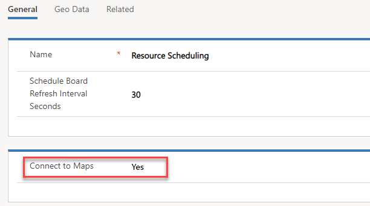

يقوم Universal Resource Scheduling بتمكين المؤسسة من جدولة أي شيء قد يكون مطلوباً لخدمة عملائهم بشكل أفضل. قد يتضمن ذلك أصناف مثل أوامر العمل في Microsoft Dynamics 365 for Field Service.

الغرض من هذا التمرين العملي هو تعريفك بتكوين Universal Resource Scheduling.

### الأهداف التعليمية

في نهاية هذه التمارين، ستتمكن من تحقيق الأهداف التالية:

-   وظيفة التعيين الممكنة
-   تم تحديد ‏مورد قابل للحجز‬
-   جدولة العناصر باستخدام لوحة الجدولة
-   تمكين كيان طلب زمن التوقف الخاص بالجدولة

الوقت المقدر لإكمال هذا التمرين العملي: *60 إلى 75* دقيقة

### قبل البدء

تعمل المعامل والتمارين في هذه الوحدة بشكل أفضل عندما تتوفر لديك بعض البيانات النموذجية للعمل معها. اعتماداً على البيئة التي تعمل بها، قد ترغب في تثبيت بعض البيانات النموذجية للمساعدة في التمارين. يوفر Dynamics 365 القدرة على إضافة بيانات نموذجية حسب الحاجة. إذا لم تتوفر لدى البيئة التي تعمل بها أي بيانات نموذجية مثبتة، فاتبع الخطوات التالية لتثبيت البيانات النموذجية في بيئتك.

> [!IMPORTANT]
> البيانات التجريبية التي سنستفيد منها في هذا التمرين، هي مجموعة أصغر من البيانات التي ستساعد في توضيح مفاهيم التكوين المتوفرة في التطبيق. تتوفر المزيد من البيانات التجريبية الكاملة التي يمكن استخدامها لكل من Project Service Automation وField Service.

### تثبيت بيانات العرض التوضيحي لـ Field Service—الخطوات التفصيلية

1. في Dynamics 365، حدد السهم لأسفل بجوار **Dynamics 365**، ثم حدد **Field Service**.
2. باستخدام خريطة الموقع، حدد علامة القطع (...)، وحدد **إعدادات Field Service**.
3. ضمن *إعدادات الجدول*، حدد **الخصائص**.
4. حدد **جديد**.
5. أدخل *MSCE* في حقل **الاسم**، وحدد **الشهادة** في حقل **الشهادة** **النوع**، ثم حدد **حفظ**.
6. حدد **جديد**.
7. أدخل *MCSA* في حقل **الاسم**، وحدد **الشهادة** في حقل **الأنواع**، ثم حدد **حفظ وإغلاق**.

### تمكين خرائط Bing لاستخدام Resource Scheduling

لضمان قدرتك على الاستفادة الكاملة من إمكانات الجدولة الكاملة والتخطيط المتاحة مع Universal Resource Scheduling، تحتاج إلى التأكد من تكوينه لاستخدام موفر التعيين. تعد خرائط Bing هي موفر الخريطة الافتراضي، ولكن يمكن تمكين الموفرين الإضافيين. سيتم استخدام خرائط Bing.

1.  في **Dynamics 365**، انقر فوق السهم بجوار نص **Dynamics 365**، ثم حدد **Universal Resource Scheduling**.
2.  انقر فوق رمز **خريطة الموقع** لتوسيع **التنقل**. من القائمة التي ستظهر، حدد **إدارة**.
3.  حدد **معلمات الجدولة**.
4.  حدد موقع **الاتصال بالخرائط**، وقم بتعيينه إلى **نعم**.

5.  **احفظ وأغلق** الإعدادات.

### إنشاء موارد قابلة للحجز

قبل أن تتمكن من البدء في جدولة العناصر وتعيينها لموارد محددة في مؤسستك، تحتاج أولاً إلى إنشاء موارد قابلة للحجز في التطبيق. يمكن أن يكون المورد القابل للحجز مستخدماً داخلياً أو جهة اتصال خارجية أو حساباً أو قطعة من المعدات. عند تحديد مورد قابل للحجز، يمكنك أيضاً تقديم تفاصيل مثل المهارات التي يمتلكونها، وأين يبدأون يومهم وينتهون به وما إلى ذلك.

في هذه المهمة الأولى، سننشئ سجل موارد قابل للحجز لحساب المستخدم الخاص بك.

1.  في **Dynamics 365**، انقر فوق السهم بجوار نص **Dynamics 365**، ثم حدد **Universal Resource Scheduling**.
2.  انقر فوق رمز **خريطة الموقع** لتوسيع **التنقل**. من القائمة التي تظهر، حدد **الموارد**.
3.  انقر فوق الزر **جديد** لإنشاء **مورد قابل للحجز**.
4.  قم بتكوين المورد على النحو التالي:
    -   **نوع المورد**: مستخدم
    -   **المستخدم**: *سجل* المستخدم الخاص بك
    -   اترك القيمة الافتراضية في حقل المنطقة الزمنية.
5.  حدد علامة التبويب جدولة وقم بالتكوين على النحو التالي:
    -   **الوحدة التنظيمية**: سياتل
    -   **موقع البدء**: عنوان الوحدة التنظيمية
    -   **موقع الانتهاء**: عنوان الوحدة التنظيمية
6.  حدد علامة التبويب Field Service وقم بالتكوين على النحو التالي:
    -   **المعدل بالساعة**:‏ 175
7.  **احفظ** سجل المورد القابل للحجز، واتركه مفتوحاً.
8.  حدد موقع الشبكة الفرعية **الخصائص**، وانقر فوق **إضافة خاصية مورد جديد قابل للحجز**
9.  قم بالتكوين على النحو التالي:
    -   **الخصائص**: الوصول إلى المبنى 12
    -   **قيمة التقييم**: ممتاز

10. يمكن إضافة المزيد من الخصائص للمورد إذا كان لديهم مهارات متعددة.
11. **احفظ وأغلق** سجل الخصائص.
12. **احفظ وأغلق** سجل المورد القابل للحجز. 

### إنشاء أمر عمل جديد باستخدام نوع الحدث

يحتوي Dynamics 365 for Field Service على كيان أمر العمل الذي تم تمكينه للاستخدام مع ميزة جدولة الموارد. في هذه المهمة، سنقوم بإنشاء أمر عمل جديد يمكننا جدولته باستخدام التطبيق.

1.  في **Dynamics 365**، انقر فوق السهم الموجود بجانب النص **Dynamics 365** ثم حدد **Field Service**.
2.  انقر فوق رمز **خريطة الموقع** لتوسيع **التنقل**. من القائمة التي تظهر، حدد **أمر العمل**.
3.  انقر فوق الزر **جديد**.
4.  قم بتكوين أمر العمل على النحو التالي:
    -   **حساب الخدمة**:‏ Adventure Works (نموذج)
    -   **نوع أمر العمل**: فحص‏‎
    -   **‏‫خاضع للضريبة**: لا
    -   **نوع الحدث الرئيسي**: فحص‏‎ بالرنين المغناطيسي
5.  انقر فوق علامة التبويب ‏‫الإعدادات‬، وقم بالتكوين كالآتي:
    -   **الأولوية**: متوسطة
    -   **منطقة الخدمة**: واشنطن‏‎
    -   **وقت بدء التعهد**: اليوم في 1:00 مساءً
    -   **وقت انتهاء التعهد**: اليوم في 3:00 مساءً
6.  **حفظ وإغلاق** أمر العمل

### جدولة أمر العمل باستخدام لوحة الجدولة

تقدم Universal Resource Scheduling العديد من الأصناف التي يمكن استخدامها للمساعدة على جدولة الموارد لأصناف محددة. المكونان الأساسيان المستخدمان هما لوحة الجدولة ومساعد الجدولة. توفر لوحة الجدولة القدرة على جدولة العناصر يدوياً، ويقدم المساعد اقتراحات حول الموارد بناءً على عوامل مثل الموقع والمهارات والتوافر. في هذه المهمة، سوف ندرس كيف يمكنك استخدام لوحة الجدولة لجدولة الأصناف وعلى مستوى عالٍ.

1.  انقر فوق رمز **خريطة الموقع** لتوسيع **التنقل**. من القائمة التي تظهر، حدد **لوحة الجدولة**.
2.  توفر لوحة الجدولة خيارات متعددة يمكن استخدامها لجدولة العناصر وأيضاً كعامل تصفية وطريقة عرض الخريطة.
3.  قم بتوسيع جزء **متطلبات الحجز**.
4.  حدد **أوامر العمل غير المجدولة**.
5.  حدد موقع **أمر العمل** لـ Adventure Works (نموذج) الذي قمت بإنشائه في المهمة السابقة. اسحبه إلى أليسون ديكسون على لوحة الجدولة. لاحظ أن النص سيظهر باللون الأحمر حتى تجد الوقت الذي يقع ضمن النافذة الزمنية المنتظرة.
6.  حرر زر الماوس وسيتم وضع العنصر على لوحة الجدولة.
7.  حدد موقع وحدد أمر العمل الخاص بـ **Fourth Coffee (نموذج)** ضمن **أوامر العمل غير المجدولة.**  انقر فوق **بحث عن التوافر**.
8.  سيقوم Dynamics 365 بتحليل المتطلبات لهذا الصنف وسيعمل في العناصر الأخرى مثل أي مهارات مطلوبة وأمر العمل ومواقع الموارد، وتوافر الموارد لإنشاء قائمة بالموارد المقترحة التي من شأنها أن تكون قادرة على العمل على هذا الصنف.
9.  عند تمرير مؤشر الماوس فوق الكتلة الزمنية المحددة لـ **Van Amundson**، سوف تظهر أيقونة **الدفتر**. انقر فوق أيقونة **الدفتر** لجدولة الشاحنة لأمر العمل.
10. انقر فوق أيقونة **إنهاء البحث** للعودة إلى لوحة الجدولة.

### إنشاء علامة تبويب للوحة الجدولة تعرض الموارد حسب المنطقة

بصفتك مرسلاً، فإنك تقضي الكثير من الوقت في الجدولة للأقاليم المتعددة التي تدعمها مؤسساتك. أحد السيناريوهات التي تظهر في كثير من الأحيان، هو الحاجة إلى تحديد موعد لعملاء واشنطن. نظراً لأن المجلس سيركز على عملاء واشنطن، فإنك ترغب في ضمان ما يلي:
-   يتم عرض المتطلبات المفتوحة فقط في منطقة واشنطن في لوحة المتطلبات.
-   يتم عرض المتطلبات المفتوحة فقط في منطقة واشنطن في طريقة عرض الخريطة.
-   تظهر طريقة العرض فقط موارد واشنطن.
-   عندما يتم تحديد مورد، فإن طريقة عرض التفاصيل تتضمن المنطقة.

### تخصيص طرق عرض متطلبات الموارد

1.  في Dynamics 365، حدد Dynamics 365 - مخصص. انتقل إلى **الإعدادات** \> **التخصيصات** \> **تخصيص النظام**.
2.  قم بتوسيع **الكيانات**، وقم بتوسيع كيان **متطلبات الموارد**، ثم حدد **طرق العرض**.
3.  حدد موقع طريقة عرض **متطلبات أمر العمل غير المجدولة** وافتحها.
4.  انقر فوق **حفظ باسم** واحفظ طريقة العرض كـ **متطلبات أمر عمل واشنطن غير المجدولة**.
5.  حدد الزر **تحرير معايير عامل التصفية**.
6.  حدد موقع الحقل **تحديد** وانقر فوقه أسفل النظام--يساوي--فتح غير مجدول.
7.  قم بتكوين العناصر على النحو التالي:
    -   **الحقل**: منطقة الخدمة
    -   **عامل التشغيل**: يساوي
    -   **القيمة**: واشنطن
8.  بعد تحديد المعايير، انقر فوق **موافق**.
9.  **احفظ وأغلق** طريقة عرض متطلبات أمر عمل واشنطن غير المجدولة.
10. تحديد موقع طريقة عرض **متطلبات الموارد النشطة** وفتحها
11. انقر فوق **حفظ باسم** لحفظ طريقة العرض كـ **متطلبات موارد نشطة (مع المنطقة)**
12. انقر فوق الزر **إضافة الأعمدة**.
13. من القائمة، حدد حقل **المنطقة**، ثم انقر فوق **موافق**.
14. تأكد من أن حقل المنطقة يحتوي على حد أخضر حوله، واستخدام الأسهم التي تضع حقل المنطقة بين حقلي المدة والأولوية.
15. **حفظ وإغلاق** **متطلبات الموارد النشطة (مع طريقة عرض المنطقة)**
16. انقر فوق **نشر كل التخصيصات**

### إنشاء علامة التبويب لوحة جدولة موارد وشنطن وتكوينها

1.  حدد السهم لأسفل بجوار نص **Dynamics 365** الموجود في الزاوية العلوية اليسرى.
2.  من القائمة التي ستظهر، حدد **Field Service.**
3.  في خريطة الموقع، انتقل إلى **لوحة الجدولة** ضمن عنوان **أمر العمل والجداول**.
4.  انقر فوق الزر **إضافة علامة تبويب** في الزاوية العلوية اليمني من الشاشة المتداخلة إلى طريقة العرض العامة الأولية.
5.  في حقل **الاسم**، أدخل **موارد واشنطن**. تأكد من تعيين حقل **تمت المشاركة مع** إلى **أنا فقط.**
6.  ضمن **إعدادات الخريطة**، قم بتعيين **طريقة عرض عامل تصفية تعيين المتطلبات** إلى **متطلبات أوامر عمل واشنطن غير المجدولة.**
7.  انقر فوق علامة التبويب **أنواع الجدولة**.
8.  انقر لتحديد كيان **أمر العمل**. في حقل **طريقة عرض تفاصيل المتطلبات**، حدد **متطلبات الموارد النشطة (مع المنطقة)**
9.  انقر لتحديد علامة التبويب **لوحات المتطلبات**.
10. قم بتكوين طريقة عرض لوحة المتطلبات الجديدة كما يلي:
    -   **نوع طريقة العرض**: طرق عرض المتطلبات
    -   **العنوان**: أوامر عمل واشنطن غير المجدولة
    -   **طريقة العرض**: متطلبات أوامر عمل واشنطن غير المجدولة
11. انقر فوق الزر **إضافة لوحة جديدة** لإضافة متطلبات أوامر عمل واشنطن غير المجدولة.
12. حدد **إخفاء لوحات المتطلبات الافتراضية**.
13. انقر فوق الزر **إضافة** لإضافة علامة تبويب لوحة الجدولة الجديدة.
14. بعد تحميل علامة التبويب "موارد واشنطن"، حدد موقع علامة التبويب **عامل التصفية** في طريقة العرض "تصفية وتعيين".
15. في عنصر تحكم عامل التصفية **المناطق**، حدد واشنطن.
16. تأكد من أن كافة معايير التصفية الأخرى فارغة ويمكنك النقر فوق **بحث**.
17. حدد موقع الزر **خيارات** على علامة التبويب **عامل التصفية**. انقر فوق الزر خيارات وحدد **حفظ عوامل التصفية الحالية كافتراضية**.
18. قم بالتبديل إلى علامة التبويب **طريقة العرض العامة الأولية**.
19. قم بالتبديل مرة أخرى إلى علامة التبويب **موارد واشنطن**.
20. يجب أن تُظهر لوحة المتطلبات فقط علامة التبويب **أوامر عمل واشنطن غير المجدولة**.
21. حدد متطلباً من علامة التبويب أوامر عمل واشنطن غير المجدولة. لاحظ أنها تعرض المنطقة في قسم التفاصيل.

