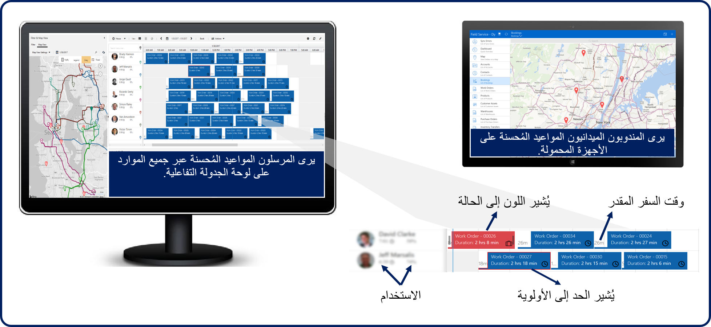
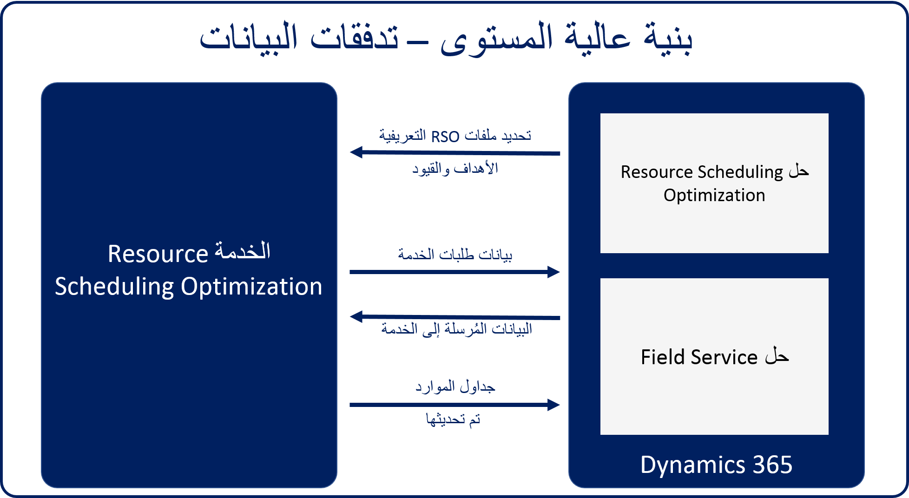

يمكن للمؤسسات التي تستخدم Dynamics 365 Field Service جدولة العناصر بطريقتين:

-   **يدوياً** - جدولة العناصر يدوياً باستخدام لوحة الجدولة بتنسيق Universal Resource Scheduling.

-   **شبه تلقائي** - يحدد مساعد الجدولة الموارد المؤهلة ويقدم اقتراحات الوقت.

كلتا الطريقتين خيارات ممتازة لجدولة العناصر. يتمثل التحدي في كلا الخيارين في أنه يكاد يكون من المستحيل للأفراد جدولة كميات كبيرة من أوامر العمل يدوياً بطريقة تزيد من إنتاجية الوكيل وتقليل النفقات لإبقاء التكاليف منخفضة. تلجأ العديد من المؤسسات إلى حلول الجدولة التلقائية للمساعدة في سيناريوهات الجدولة الأكثر تعقيداً هذه. من خلال الجدولة التلقائية، يمكن للمرسلين تركيز انتباههم على التعامل مع اختلالات الجدولة التي تحدث على مدار اليوم.

يعد تحسين جدولة الموارد Resource Scheduling Optimization (‏RSO) إمكانية إضافية لتطبيق Dynamics 365 Field Service الذي يمكّن المؤسسات من جدولة أوامر العمل تلقائياً لأنسب الموارد.
يمكن للمؤسسات تحسين الحجوزات لتقليل وقت السفر، وزيادة ساعات العمل، وجدولة أكثر الفنيين المؤهلين، وأكثر من ذلك، بناءً على أهدافهم المكونة مثل "تقليل وقت السفر" و "زيادة ساعات العمل".

### مزايا استخدام Resource Scheduling Optimization
مزايا استخدام RSO هي:
-   **الجدولة التلقائية** - جدولة معظم المتطلبات تلقائياً لتوفير الوقت والسماح للمرسلين بالتركيز على الاستثناءات والفواتير.

-   **تحقيق النطاق** - يمكن للمرسلين إدارة المزيد من الموارد، مما يمكّن الشركة من توسيع نطاق الموارد التي يديرونها.

-   **رضا العميل** - تؤدي الكفاءة المحسّنة إلى زيادة إمكانية التنبؤ بأوقات الوصول والإنجاز، كما تعمل على جدولة الفنيين المناوبين بسلاسة في المواقف العاجلة.

-   **كفاءات فنية وتقليل التكلفة** - يؤدي ملاءمة المزيد من المواعيد في ساعات العمل إلى زيادة الإيرادات وتقليل تكاليف العمل الإضافي.

    كما أن مطابقة أوامر العمل ومجموعات المهارات الفنية تقلل من تكلفة المواعيد المفقودة.

-   **انخفاض استهلاك الوقود وصيانة أقل للمركبة** - إن التأكد من أن الفنيين يسلكون أقصر طريق ممكن باتجاهات منعطف بمنعطف يقلل من استهلاك الوقود وتآكل المركبات.

    على سبيل المثال، في العديد من المؤسسات، إذا وفر كل فني ميداني خزاناً واحداً من الغاز شهرياً، يمكن أن تتجاوز المدخرات عادةً تكلفة RSO. 

-   **تحسين الاحتفاظ بالعملاء** - يساعد إعطاء الأفضلية لأوامر العمل ذات الأولوية الأعلى في تجنب عقوبات اتفاقية مستوى الخدمة (SLA) ويساعدك على الوفاء بالتزامات خدمة العملاء.

### كيفية عمل Resource Scheduling Optimization

يبدأ Resource Scheduling Optimization (‏RSO) بالنظر في موارد المؤسسة وما يجعلها فريدة. بعد ذلك، يبحث في متطلبات الجدولة للعناصر التي تحتاج إلى جدولتها. يوفر جدولاً محسناً استناداً إلى أهداف التحسين التي تحددها الشركة مثل زيادة ساعات عمل الفنيين إلى الحد الأقصى، واستخدام أكثر الفنيين المؤهلين، وتقليل وقت السفر.

على سبيل المثال، تتلقى المنظمة التي تقدم خدمات مكيفات الهواء مكالمة تفيد بتعطل جهاز تكييف الهواء في منشأة معيشية مساعدة في اليوم الأكثر سخونة في العام. نظراً لأنه من المحتمل أن يعاني العديد من السكان من مشكلات صحية تتأثر بالحرارة والرطوبة، فمن الأهمية بمكان إرسال أقرب فني مؤهل على الفور.

بعد إنشاء أمر عمل لهذا الطلب، يمكن تشغيل RSO.
سوف ينظر في متطلبات الجدولة لإصلاح مكيف الهواء. ستأخذ RSO أيضاً في الاعتبار المهارات والشهادات المطلوبة لإصلاح هذا العنصر. كما أنها عوامل تتعلق بمكان وجود العميل وما إذا كانت توجد أي قيود إضافية قد تؤثر على الشخص المجدول.

بعد ذلك، يحدد RSO الموارد الماهرة و/أو المعتمدة للعمل على تلك العلامة التجارية لمكيفات الهواء. إذا حددت موارد متعددة، فسوف تنظر في عوامل مثل توفر الفني والموقع فيما يتعلق بالعنصر الذي يجب جدولته.

يقوم RSO بإرجاع جدول محسن حيث تتم جدولة المورد الأنسب لإصلاح مكيف الهواء المعطل.

### كيفية استخدام RSO

على الرغم من أن كل مؤسسة لديها احتياجات جدولة مختلفة ونتائج مرغوبة، يمكن اعتبار العديد من المواقف الشائعة نقاط انطلاق لسيناريوهات أكثر تحديداً حيث قد تستخدم المؤسسة RSO.

تتضمن هذه السيناريوهات عادةً ما يلي:

-   **الجدولة بين عشية وضحاها** - عادةً ما يتضمن إنشاء جدول تحسين يعمل في المساء أو بعد ساعات.
    عادةً ما تتضمن الوظائف بعد ساعات العمل كميات أكبر من البيانات، مثل تحسين الموارد والمتطلبات والحجوزات لليوم التالي أو الأسبوع التالي في بعض الحالات.

-   **جدولة خلال اليوم** - تُستخدم لجدولة العناصر أو تحسينها مع تقدم اليوم. يتضمن هذا السيناريو عادةً إنشاء جدول يتم تشغيله عدة مرات خلال يوم معين، مثل كل ساعة. يمكن استخدام هذا السيناريو لجدولة العناصر الجديدة ذات الأولوية العالية.

-   **جدولة على أساس الشرط** - لا يستخدم هذا الخيار الجداول المحددة مسبقاً للتشغيل. يتم جدولة العناصر الجديدة أو يتم تعديل العناصر الموجودة بناءً على الشروط التي يتم استيفائها. على سبيل المثال، قد تتم جدولة عنصر تم وضع علامة عليه كحالة طوارئ على الفور.

-   **الإلغاء وحالات التأخير** - تُستخدم عندما يؤثر الإلغاء أو التأخير على مورد فردي واحد فقط. يمكن للمؤسسات تحسين الجدول الزمني لمورد معين، حسب الحاجة، للأطر الزمنية التي تحددها.

-   **عمليات المحاكاة** - يتيح للمؤسسات تشغيل وظائف محددة مسبقاً بطريقة محاكاة لتقييم النتائج قبل إلزامها بالجدول. إذا أعجبهم ما يرونه، يمكنهم اختيار تطبيق المحاكاة.

## الشروع في العمل

ويجب أن تكون المؤسسات قد قامت بتثبيت Resource Scheduling Optimization وتكوينه في بيئة Dynamics 365 التي تقوم بتشغيل Field Service. بعد تثبيت الحل وتكوينه، سيبدأ RSO في تحسين العناصر وجدولتها استناداً إلى كيفيه تكوينها.

توفر الصورة التالية نظرة عامة عالية المستوى لتدفقات البيانات.

 
بعد أن يتم نشر الحل إلى مؤسسة، يجب أن تتخذ الخطوات التالية، والتي توفر مزيداً من التفاصيل حول الرسم السابق.

1.  **تكوين Resource Scheduling Optimization**

    -   وتحدد المؤسسة الأهداف والقيود الهامة لأعمالهم. علي سبيل المثال، ستقوم المؤسسة بترتيب الأهمية في تقليل وقت السفر مقابل زيادة ساعات العمل مقابل المواعيد ذات الأولوية العالية. يتم تنفيذ هذه العملية بدون القيام بتكوينات التعليمات البرمجية.

    -   وتحدد المؤسسة الموارد والمتطلبات والحجوزات التي يجب تحسينها من خلال اشتقاق تكوينات التعليمات البرمجية التي لم يتم ترميزها.

2.  **تشغيل ملفات تعريف Resource Scheduling Optimization** - يتم إرسال مهام التحسين إلى خدمة Resource Scheduling Optimization. يمكن إكمال هذه المهمة بطرق متعددة:

      -  باستخدام الجدولة، علي سبيل المثال، كل صباح في 8:00 صباحاً

      -  باستخدام المشغلات، علي سبيل المثال، عند إلغاء أحد العملاء لوظيفة

      -  عند الأمر مع خيار **تشغيل الآن**

3.  **تقوم الخدمة بطلب البيانات وتتلقي البيانات** - كافة السجلات (الموارد والمتطلبات و/أو الحجوزات) في Dynamics 365 والتي تطابق الشروط التي تم تعريفها في نطاق التحسين يتم إرسالها إلى الخدمة لتحسين الأداء.

4.  **عرض النتائج** - عرض النتائج على لوحة الجدولة والأجهزة المحمولة. سيرى المرسلون المواعيد المُحسنة عبر جميع الموارد على لوحة الجدولة التفاعلية. سوف يري مندوبو المجالات المواعيد المخصصة والأسبوعية الخاصة بهم على الجهاز المحمول الخاص بهم.

