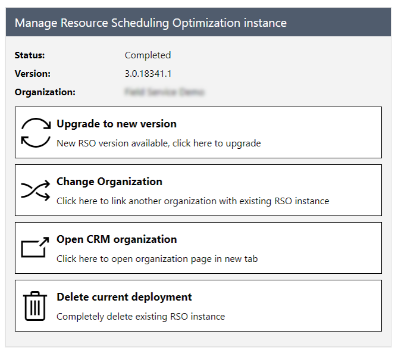
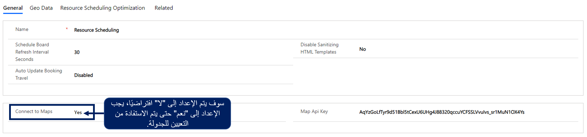

بعد شراء Resource Scheduling Optimization، يمكن نشره إلى مثيل Dynamics 365 المحدد من خلال علامة التبويب **التطبيقات** في مركز إدارة Dynamics 365. يمكن الوصول إلى مركز إدارة Dynamics 365 من [Microsoft Power Platformمركز الإدارة](https://admin.powerplatform.microsoft.com/?azure-portal=true). سيكون Resource Scheduling Optimization متوفراً في قائمة التطبيقات.

إذا كان لدى المؤسسة أكثر من بيئة Dynamics 365، فستحتاج إلى الإشارة إلى البيئة التي سيتم نشر الحل لها. كما يتم نشر RSO، يتم نشر مثيل Azure المستضاف من قِبل Microsoft، والذي يستخدم لاستضافة محرك وخدمة التحسين. يتم إدارة هذا المثيل والاحتفاظ به من قِبل Microsoft ويستخدم فقط لنشر RSO.

بعد أن يتم نشر RSO في منظمة، يمكن إدارتها من نفس المنطقة للمضي قدماً.

بالإضافة إلى ذلك، بعد نشر RSO، توفر شاشة إدارة مثيل RSO القدرات التالية:

-   **الترقية إلى الإصدار الجديد** - يتم تحديث حل RSO بانتظام، بالإضافة إلى توفر إصدارات أحدث، يمكن تطبيق التحديثات من شاشة الإدارة.

-   **تغيير المؤسسة** - توفر القدرة على ربط مثيل RSO الموجود بمؤسسة أخرى.

    على سبيل المثال، يمكنك تغيير المؤسسة إذا أردت الانتقال من مرحلة الاختبار إلى مؤسسة إنتاج.

-   **مؤسسه CRM المفتوحة** - يتيح لك الوصول إلى مؤسسة Dynamics 365 المقترنة بمثيل RSO.

-   **حذف النشر الحالي** - سيؤدي هذا الخيار إلى حذف موارد RSO Azure. سيبقي حل RSO في بيئة Dynamics 365 الخاصة بك. لا يؤثر في أي شيء ضمن منظمة Dynamics 365.

### التكوين الأولي

بعد نشر الحل، سوف تحتاج إلى تكوينه داخل مثيل Dynamics 365. وبشكل افتراضي، لن يتم تمكين RSO، لذا يجب تشغيلها. يتم إكمال هذه المهمة من تطبيق جدولة الموارد. قم بتغيير المنطقة من **جدولة الموارد** إلى **الإعدادات**.

أثناء العمل في صفحة **الإعدادات**، يمكنك تمكين RSO من خلال الانتقال إلى صفحة **معلمات الإدارة والجدولة**. وعند تثبيت الحل، تتم إضافته إلى علامة التبويب **Resource Scheduling Optimization**، حيث يمكنك تمكين RSO عن طريق تعيين حقل **تمكين Resource Scheduling Optimization** إلى **نعم**.

بالإضافة إلى ذلك، يمكنك تحديد هدف تحسين الأداء الافتراضي للمؤسسة، إذا لزم الأمر. يساعد الهدف الافتراضي على تسريع التفاعلات مع RSO من خلال لوحة الجدولة من خلال تحديد كيفية تحسين المحرك للبيانات مسبقاً. وعلى الرغم من وضع الهدف الافتراضي، يظل بإمكان المستخدمين انتقاء أهداف مختلفة. *(يمكن العثور على المزيد من المعلومات حول إنشاء هدف ضمن إنشاء أهداف الوحدة النمطية Resource Scheduling Optimization.)*

### تمكين الخرائط

يستخدم RSO وظيفة التعيين لتحديد موقع أقرب مورد للعمل على عنصر. لهذا السبب، يجب أن تقوم المؤسسات بتمكين وظيفة التعيين. افتراضياً، سيتم تعيين الحقل **الاتصال بالخرائط** إلى **لا**. لتمكين التعيين، قم بضبط الحقل إلى **نعم**. يضمن تمكين هذا الخيار أن لوحة الجدولة ومساعد الجدولة سيتمكنان من استخدام الخرائط لجدولة العناصر. يتم استخدام خرائط Bing بشكل افتراضي. يمكن للمؤسسات أيضاً تكوين كيان تعيين مخصص لتعبئة عناصر مثل خط الطول والعرض، إذا لزم الأمر.

> [!VIDEO https://www.microsoft.com/videoplayer/embed/RE4ksp9]

