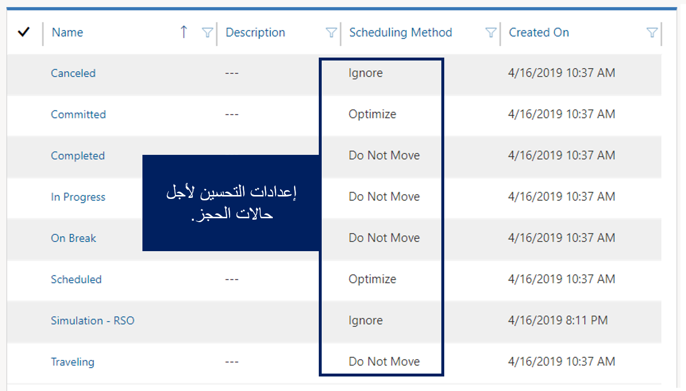
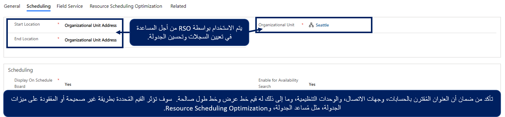
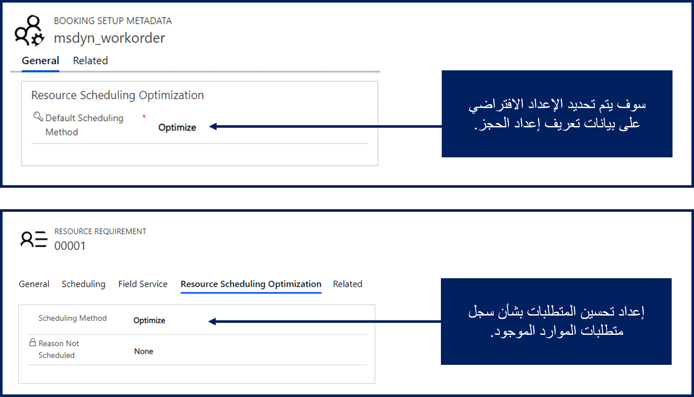

## أدوار وإعدادات الأمان

عند نشر RSO، يقوم الحل بإنشاء مستخدم جديد يسمى Resource Scheduling Optimization. يتم استخدام هذا المستخدم لتحسين العناصر مثل المتطلبات والحجوزات المتعلقة بأمر العمل. يجب تعيين هذا المستخدم إلى Field Service - دور أمان المسؤول وإضافته إلى Field Service - ملف تعريف أمان حقل المسؤول. يُطلق على دور الأمان اسم مرسل RSO ويسمى ملف تعريف أمان الحقل Resource Scheduling Optimization - تتم إضافة المرسل أيضاً إلى المؤسسة. يجب إضافة هذه الأدوار إلى أي مرسلين سيتفاعلون مع RSO للتأكد من أنه يمكنهم التفاعل مع مكونات RSO على لوحة الجدولة وتنفيذ المهام مثل تشغيل عمليات المحاكاة وبدء وظائف التحسين.

يمكن تعيين المستخدمين لدور الأمان المطلوب من خلال [مركز إدارة Power Platform](https://admin.powerplatform.microsoft.com/?azure-portal=true).
في قائمة **البيئات**، حدد علامة الحذف بجوار البيئة التي تريد العمل معها، ثم حدد **الإعدادات**.

عندما تكون في إعدادات البيئة، يمكنك إضافة مستخدمين إلى أدوار الأمان عن طريق تحديد **المستخدمين**. حدد المستخدمين الذين تريد العمل معهم، ثم حدد **إدارة الأدوار** لتعيينهم لأدوار الأمان الضرورية التي يحتاجون إليها.

يتم تعيين المستخدمين لملفات تعريف الأمان الميدانية من خلال الإعدادات المتقدمة. في تطبيق Dynamics 365 Resource Scheduling Optimization، حدد الزر **إعدادات** (يبدو مثل الترس).
في القائمة التي تظهر، حدد **إعدادات متقدمة**، التي ستفتح التطبيق في نافذة جديدة. يمكنك إضافة مستخدمين إلى ملفات تعريف الأمان الميدانية الضرورية بالانتقال إلى **الإعدادات > الأمان > ملفات تعريف أمان المجال**.

### تكوين تحسين حالة الحجز

ترتبط حالات الحجوزات بجميع الحجوزات التي تم إنشاؤها.
تمثل الحجوزات العناصر المجدولة على لوحة الجدولة. وفقاً للجدول الذي تم تكوينه، يمكن لـ RSO إنشاء حجوزات جديدة وتحسين الحجوزات الحالية. تذكر، لا يجب تحسين جميع الحجوزات. من الأفضل أن يترك النظام بعض الحجوزات بمفردها. على سبيل المثال، عندما يعمل أحد الفنيين حالياً على عنصر ما، فلا ينبغي تحسينه لأن الفني يعمل بنشاط عليه. ومع ذلك، إذا تمت جدولة أحد الفنيين للعمل على شيء ما ولكنه لم يبدأ فيه بعد، فمن المحتمل أن يتم تحسينه.

يمكن للمؤسسات تكوين إعدادات التحسين لأي حالة حجز يتم تحديدها في النظام من خلال الانتقال إلى **حالات الحجوزات** في تطبيق Resource Scheduling Optimization.

تتوفر ثلاثة خيارات للتحسين:

-   **تحسين** - إن RSO مجاني في نقل هذا الحجز.

-   **عدم النقل** - لا يغير RSO الحجز.

    -   يحتفظ RSO بوقت الوصول المقدر والمورد المعين.

    -   قد يتم تغيير وقت بدء الحجز ومدة السفر المقدرة إذا قامت RSO بجدولة حجز في موقع جديد قبل عدم نقل الحجز.

    -   يعمل هذا الخيار كما لو كان المستخدم قد قام بتعيين الحجز إلى **مؤمن على المورد + الوقت** في حقل **خيارات جدولة التأمين**.

-   **تجاهل** - سيتجاهل RSO هذا الحجز تماماً.

    سيتجاهل RSO الحجز لكل من الموقع والوقت، مما يعني حدوث تداخلات. يبدو الأمر كما لو أن الحجز غير موجود. استخدم هذا الخيار عندما تكون حالة الحجز في حالة مقترح أو ملغى.

في كثير من الأحيان، بعد أن تقوم المؤسسات بتكوين طرق الجدولة، فإنها تجد أن عناصر مثل الحجوزات المكتملة أو الملغاة أو أنواع أخرى من الحجوزات يتم تحسينها في حين أنه في الواقع لا ينبغي نقلها. السبب هو أن طريقة الجدولة لحالات الحجز لم يتم تكوينها بشكل صحيح.

الإعداد النموذجي يشبه المواقف التالية:

-   **مجدول = محسن** - يجب تعيين حالات الحجز التي تشير إلى أنه قد تمت جدولة شيء ما أو يجب النظر في نقله إلى  **تحسين**. بشكل جاهز، يتم تعيين حالتي الحجز المجدول والمُلزَم على **تحسين** لأن هذه العناصر تمثل الحالات التي يمكن أن تكون انتقلت.

-   **ملغى = تجاهل** - يجب تعيين حالات الحجز التي تمثل شيئاً تم إلغاؤه على **تجاهل**. نظراً لإلغاء العنصر، يمكن أن تفترض RSO أن الفترة الزمنية التي تمت جدولة العنصر لها متاحة الآن. يضمن هذا الأسلوب إمكانية ملء الفتحة بحجز آخر يحتوي على حالة تحسين يمكن نقلها.

-   **قيد التقدم = عدم النقل** - يجب تعيين حالات الحجز التي تشير إلى اكتمال الزيارة أو أنها في مرحلة ما من التقدم حالياً على  **عدم النقل**. من المهم أن يعلم RSO أنه لا ينبغي نقله. ستضمن هذه الطريقة أيضاً عدم نقل الحجوزات الأخرى إلى تلك الفترة الزمنية ومن المحتمل أن تنشئ حجوزات متداخلة.

    على سبيل المثال، تشير حالة الحجز التي تمثل السفر بشكل عام إلى أن الفني في طريقه إلى الموقع. يجب تعيين هذا العنصر على **عدم النقل** لأن الفني يعمل بنشاط على هذا الحجز.

من المحتمل أن يتم تطبيق المبدأ نفسه على الحالات التي تمثل العناصر التي يجب أخذها في الاعتبار ولكن لا يجب نقلها مثل الحالات المخصصة التي تم إنشاؤها لتمثيل عناصر مثل الإجازة.

من خلال قضاء بعض الوقت الإضافي في فهم حالات الحجز التي تمتلكها المؤسسة وكيف يمكن أن تتأثر عند تشغيل RSO، سيضمن نقل الحجوزات أو عدم نقلها بشكل مناسب.

> [!VIDEO https://www.microsoft.com/videoplayer/embed/RE4kuSP]

### تكوين تحسين الموارد

يعمل تحسين RSO فقط على تحسين جداول الموارد التي تم تمكينها للتحسين. كل مورد سيتم تحسين جداوله يجب أن يكون لديه هذا المؤشر في سجل موارده. يتم إجراء هذا المؤشر في تطبيق Resource Scheduling Optimization. سيحتاج كل سجل مورد إلى تعيين حقل **تحسين الجدولة** إلى **نعم** في علامة تبويب **Resource Scheduling Optimization** الخاصة بسجل الموارد الخاص به.

بعد تمكين الموارد الخاصة بك لـ RSO، تحتاج إلى التأكد من أن كل مورد له خط عرض وخطوط طول صالحان تم تحديدهما بناءً على مواقع البداية والنهاية.

-   **موقع البدء** - تحديد أين يبدأ المورد يومه.
    يُستخدم هذا الإعداد للمساعدة في تعيين المسار للمورد.

-   **موقع الإنهاء** - تحديد أين ينهي المورد يومه. يُستخدم هذا الإعداد للمساعدة في تعيين المسار للمورد.

-   **الوحدة التنظيمية** - تحديد الوحدة التنظيمية المحددة التي ينتمي إليها المورد والتي سيتم جدولتها للخروج منها.

عند تحديد موقع البدء والانتهاء، لديك ثلاثة خيارات يمكنك تحديدها:

-   **عنوان الوحدة التنظيمية** - استخدام خط الطول وخط العرض المرتبطين بالوحدات التنظيمية التي ينتمي إليها المورد.

-   **عنوان المورد** - استخدام خط الطول وخط العرض المرتبطين بالسجل المقابل بناءً على نوع المورد:

    -   **نوع المورد - المستخدم** - استخدام خط الطول وخط العرض المرتبطين بالعنوان المحدد في سجل مستخدم Microsoft 365 الخاص به.

    -   **نوع المورد - جهة الاتصال** - استخدام خط الطول وخط العرض المرتبطين بالعنوان المحدد في سجل جهة اتصال Dynamics 365 الخاصة به.

    -   **نوع المورد - الحساب** - استخدام خط الطول وخط العرض المرتبطين بالعنوان المحدد في سجل حساب Dynamics 365 الخاص به.

-   **غير محدد الموقع** - ليس له موقع معين محدد.
    يمكن أن يكون هذا الإعداد مفيداً عندما لا يكون لدى الموارد موقع بداية ونهاية محدد بوضوح.

> [!IMPORTANT]
> يجب أن يكون لمواقع البدء والانتهاء نفس الإعداد. على سبيل المثال، لا يمكن أن يكون موقع البدء عنواناً شخصياً ويكون موقع الانتهاء غير محدد الموقع.

> [!VIDEO https://www.microsoft.com/videoplayer/embed/RE4kspa]

### تكوين تحسين المتطلبات

تحدد المتطلبات ما هو مطلوب لجدولة عنصر في النظام. على سبيل المثال، عند إنشاء أمر عمل، يتم أيضاً إنشاء سجل متطلبات المورد. لضمان إمكانية جدولة متطلبات الموارد التي تم إنشاؤها بواسطة محرك التحسين، يجب تمكينها للتحسين. يمكن إكمال هذه المهمة عن طريق تكوين بيانات تعريف إعداد الحجز لكيان أمر العمل. لتكوين بيانات التعريف لإعداد الحجز، انتقل إلى **Resource Scheduling Optimization > الإدارة > تمكين الكيانات للجدولة**. بعد تحديد الكيان الذي تريد تكوينه، يمكنك تعيين طريقة الجدولة الافتراضية إلى **تحسين**. على سبيل المثال، إذا تم تعيين بيانات تعريف إعداد الحجز الخاصة بكيان أمر العمل إلى **تحسين**، سيتم تكوين كل أمر عمل تم إنشاؤه حديثاً ومتطلبات الموارد ذات الصلة للتحسين تلقائياً.

إذا كان لديك سجلات متطلبات الموارد الحالية التي تم إنشاؤها قبل تحديد إعداد التحسين، فستحتاج إلى تحديث طريقة جدولة متطلبات الموارد لتحسينها. انتقل إلى **Resource Scheduling Optimization > متطلبات الموارد**، انتقل إلى عرض متطلبات أمر العمل غير المجدولة، وحدد المتطلبات الحالية التي تريد تحسينها، وحدد **تحرير**، ثم قم بتعيين حقل **تحسين الجدولة** إلى **لا**.

> [!IMPORTANT]
> يجب تعيين موقع العمل إلى في الموقع أو غير محدد الموقع. إذا كان المتطلب في الموقع هو المطلوب، فيجب أن توجد قيم خطوط الطول والعرض. ستتم عادةً تعبئة هذه الإعدادات تلقائياً في أمر العمل استناداً إلى عنوان الحساب المرتبط به أمر العمل. تأكد من أن هذه القيم يتم ملؤها لأي من متطلبات الموارد التي تريد جدولتها.

