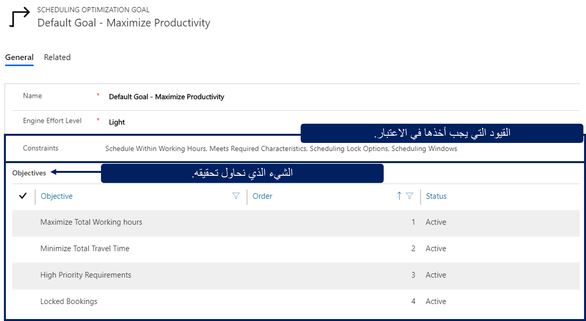
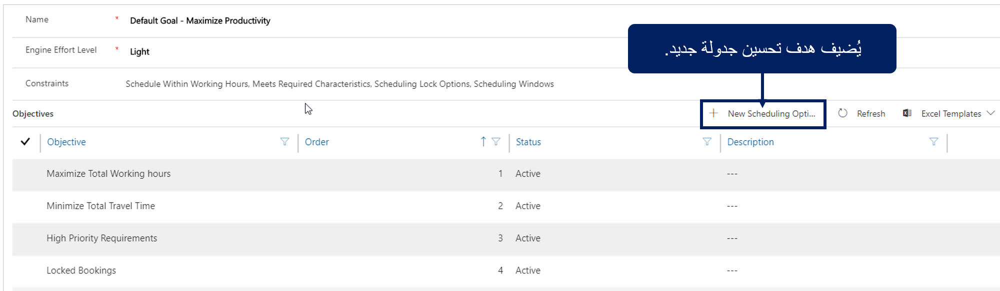
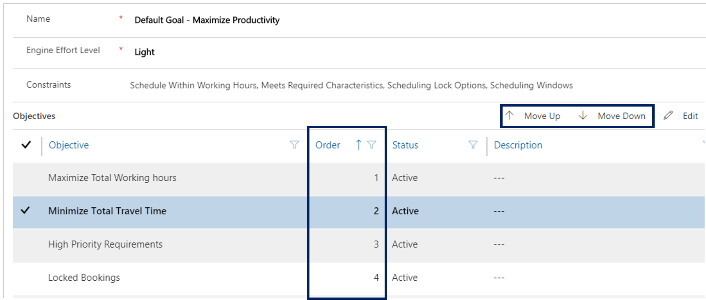
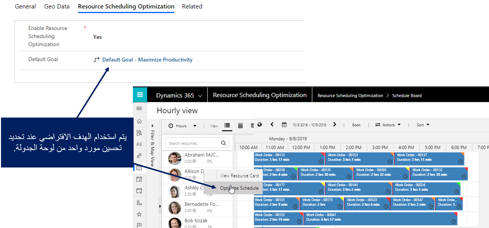

يجب ربط أي مهمة من مهمات RSO يتم تشغيلها بهدف. يحدد الهدف النتيجة التي يحاول حل RSO تحقيقها. على سبيل المثال، قد يكون أحد أهداف المؤسسة هو التأكد من أن الفنيين يقومون بزيادة ساعات العمل المتاحة مع تقليل مقدار الوقت الذي يقضونه في السفر.

تحدد المؤسسات كيفية تحسين العناصر بناءً على عاملين:

-   **الأهداف** - تحدد النتيجة التي تحاول تحقيقها مثل زيادة ساعات العمل.

-   **القيد** - يحدد العوامل التي يجب مراعاتها أثناء محاولة تحقيق الهدف، مثل ضمان جدولة العناصر خلال ساعات عمل الفني فقط.

عند تشغيل مهمة RSO، يعالج محرك RSO قائمة الموارد.
بالإضافة إلى ذلك، تتم معالجة متطلبات الموارد الجديدة والحجوزات الحالية بناءً على نطاق محدد مسبقاً لإنشاء المسار الأمثل أو قائمة الحجوزات الخاصة بالموارد.

تعتبر الحجوزات مجدولة بشكل مثالي عندما:

-   تفي بجميع القيود التي تم تحديدها في الهدف.

-   تحصل على أعلى نتيجة ممكنة لكافة أهداف الشركة.

### الأهداف

تحدد الأهداف ما يحاول الهدف تحقيقه، مثل زيادة ساعات العمل إلى الحد الأقصى أو تقليل إجمالي وقت السفر. ضمن الهدف، يمكنك تحديد أهداف متعددة عن طريق تحديد زر **إضافة أغراض جديدة لتحسين الجدولة** في الشبكة الفرعية **أهداف**.

يتضمن حل RSO ستة أهداف يمكنك تطبيقها:

-   **زيادة إجمالي ساعات العمل للحد الأقصى** - مجموعة نتائج المحرك (التكرار) مع إجمالي وقت العمل الأعلى.

-   **تقليل إجمالي وقت السفر** - إصدار نتائج المحرك (التكرار) مع إجمالي وقت السفر الأدنى.

-   **الحجوزات المؤمّنة** - عند تحديد هذا الخيار، سيحاول RSO تضمين الحجوزات المؤمّنة في المسار الأمثل.

-   **المتطلبات ذات الأولوية القصوى** - سيقوم RSO بتقييم هذا الهدف ومنح الأولوية لمجموعة المورد/الحجز ذات الأولوية القصوى.

-   **زيادة الموارد المفضلة للحد الأقصى** - سيقوم RSO بتقييم الموارد المفضلة التي تم تحديدها لأحد المتطلبات ومحاولة استخدام الموارد المحددة المفضلة.

-   **أفضل مطابقة لمستوى المهارة** - سيقوم RSO بتقييم كفاءة الموارد المتعلقة بالمهارات المحددة في سجل المتطلبات.
    سيتم وضع الموارد ذات الكفاءة العالية في مهارة معينة أولاً.

عند إضافة هدف، يمكنك تحديد أمر الأهمية له. يتم النظر في الأهداف ذات الأولوية الأعلى قبل الأهداف ذات العدد الأقل. يمكن إعادة ترتيب الأهداف حسب الحاجة.

على سبيل المثال، قد يكون للهدف الأهداف المحددة التالية (بحسب ترتيب التفضيل):

1.  زيادة ساعات العمل للحد الأقصى

2.  تقليل وقت السفر للحد الأدنى

3.  أفضل مطابقة لمستوى المهارة

عند تشغيل إحدى مهام RSO التي تستخدم هذا الهدف، ستحاول أولاً زيادة وقت عمل الموارد التي يتم تحسينها، ثم تبحث في معلومات الموقع لتحديد الموارد الأقرب. ستتم جدولة أقرب مورد يحتوي على المهارات اللازمة.

> [!IMPORTANT]
> لا يمكن أن يكون تقليل إجمالي وقت السفر هو الهدف الأول في القائمة. إذا كان تقليل وقت السفر هو الهدف الأول، فقد لا يقوم RSO بجدولة أي شيء. قد يؤدي هذا التحديد إلى إنشاء وقت سفر قدره صفر (0) دقيقة لتحقيق الهدف الأول.

### القيود

ومثل الأهداف، قد يكون للهدف قيود متعددة تم تحديدها له.
وعلى عكس الأهداف، لا تحتوي القيود على أرقام مرتبطة بها. تتم إضافة كل قيد يحتاج إلى الأخذ بعين الاعتبار إلى الهدف. عند إضافة قيود إلى أحد الأهداف، فإنه يقلل عدد السجلات التي يجب أخذها في الاعتبار، مما يؤدي إلى أداء أسرع بشكل عام.

هناك سبعة قيود يمكن إضافتها للهدف هي:

-   **‏‫الجدولة خلال ساعات العمل** - تقوم بإنشاء الحجز إذا كان من الممكن إكماله خلال ساعات عمل المورد.

    يتحقق هذا القيد من عدم جدولة الحجز خارج ساعات عمل المورد. يتضمن هذا التحقق وقت السفر من آخر حجز إلى موقع نهاية المورد؛ وعلى الرغم من ذلك لا يتم عرضه على لوحة الجدولة بطريقة مرئية.

-   **‏‫مطابقة المواصفات المطلوبة** - تتحقق من أن المورد يحتوي على جميع الخصائص المطلوبة وأنه يفي بالحد الأدنى من مستوى المهارة المطلوب الموضح في الصنف.

-   **جدولة خيار التأمين** - إذا تم تحديد هذا القيد، فسيحتفظ بخيارات التأمين التي تم تكوينها في سجل الحجز.

-   **‏‫إطارات الجدولة‬** - إذا تم تحديد هذا القيد، فسيقوم RSO بجدولة العمل بحيث يتوافق مع حقلي البداية والنهاية للإطار الزمني في متطلبات المورد أو سجل الحجز.

-   **‏‫تلبية تفضيلات الموارد** - إذا تم تحديد هذا القيد، فسيقوم RSO بالبحث في الموارد المفضلة أو المقيدة المرتبطة بالحجز.

    -   **المورد المفضل** - محاولات لجدولة المورد الذي تم تحديده كمفضل.

    -   **المورد المقيد** - لن يقوم بجدولة الموارد المقيدة.

-   **‏‫مناطق المطابقات** - سوف يطابق RSO المنطقة الواقعة بين المتطلبات والموارد لضمان أن المورد المطابق موجود في نفس المنطقة التي يوجد بها المتطلب.

-   **مطابقة نوع المورد** - سيتطابق RSO مع نوع المورد بين المتطلبات والموارد لتحديد نوع المورد الذي يمكن أن يفي بأحد المتطلبات.

    -   تتضمن الموارد القابلة للحجز أنواعاً عامة ومستخدمين وجهات الاتصال والحسابات والمعدات وأداة إنشاء وطاقم وأنواع مورد المجموعة.

    -   تسمح سجلات المتطلبات بالتحديد المتعدد حتى تتمكن من تحديد أنواع الموارد المطلوبة لأحد المتطلبات المعينة.

> [!VIDEO https://www.microsoft.com/videoplayer/embed/RE4kfoW]

### مستوى المجهود

عند إنشاء هدف، يمكن تحديد مقدار الجهد الذي سيبذله المحرك في العثور على الجدول الأمثل بناءً على القيمة المحددة في حقل **‏‫مستوى مجهود المحرك**. يمكن ضبط مستوى جهد المحرك إلى أحد المستويات التالية:

-   خفيف جداً

-   خفيف

-   متوسط

-   مكثف

-   مكثف جداً

وكلما ارتفع الجهد، كلما استغرق RSO وقتاً أطول لإكمال التنفيذ.
على سبيل المثال، الهدف الذي تم تعيينه على **مكثف جداً** سيستغرق وقتاً أطول لتشغيل مجموعة واحدة على **خفيف** نظراً لأن هناك أكثر من تكرار للمجموعات المحتملة التي يأخذها محرك RSO في الاعتبار.

### هدف التحسين الافتراضي

عند قيام إحدى مؤسسات Resource Scheduling Optimization بالتوزيع، يشتمل الحل على هدف تحسين يسمى **‏‫الهدف الافتراضي - زيادة الإنتاجية** الذي تم تعيينه كهدف افتراضي للمؤسسة. يتم استخدام الهدف الافتراضي تلقائياً، ما لم يتم تحديد هدف آخر عند تشغيل مهمة التحسين. بالإضافة إلى ذلك، يتم استخدام الهدف الافتراضي عند تحديد تحسين مورد واحد من لوحة الجدولة.
يمكن للمؤسسات تعديل الهدف الافتراضي ليلائم احتياجاتها، أو يمكنها إنشاء هدف جديد وتعريفه كهدف افتراضي.

يمكن تعديل الهدف الافتراضي من منطقة **إعدادات** من تطبيق جدولة الموارد. من **إعدادات**، انتقل إلى **الإدارة > معلمات الجدولة‬**. يتم تحديد الهدف الافتراضي في علامة التبويب **Resource Scheduling Optimization**.

لمزيد من المعلومات المفصلة حول الأهداف ومعرفة تفاصيل إضافية حول كيفية حساب التحسين وتحقيقه، انتقل إلى [/dynamics365/customer-engagement/field-service/rso-configuration#define-the-optimization-goal](/dynamics365/customer-engagement/field-service/rso-configuration#define-the-optimization-goal/?azure-portal=true).

