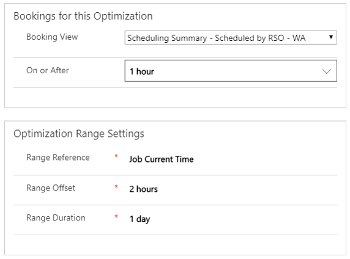

Resource Scheduling Optimization لا يمكن تحسين الأصناف في التطبيق ما لم يعرف ما هي الأصناف المتاحة ليتم تحسينها.
ويستخدم RSO النطاقات لتحديد السجلات والأطر الزمنية التي يجب أن يركز عليها محرك التحسين عند تشغيله.

يمكن أن يتضمن النطاق النموذجي المعلمات التالية:

-   **الموارد** - تحديد الموارد التي يجب تضمينها في مهمة التحسين. *(مطلوب لكافة النطاقات)*

    على سبيل المثال، الموارد الخارجية الموجودة في واشنطن فقط وهم فنيو الكهرباء.

-   **متطلبات المورد** - تحديد متطلبات الموارد (الأصناف غير المجدولة) التي ترغب في تضمينها.

    على سبيل المثال، الأصناف غير المجدولة فقط حيث يكون لأمر العمل حالة فرعية جاهز للإرسال.

-   **الحجوزات** - تحديد الحجوزات الموجودة التي ترغب في تحديثها.

    على سبيل المثال، يمكنك تحسين الحجوزات المجدولة لليوم فقط. اترك الحجوزات المستقبلية كما هي دون تغيير.

يجب أن تكون النطاقات صغيرة بقدر الإمكان. يعد RSO أسرع وأكثر فاعلية إذا كانت الطلبات تحتوي على موارد ومتطلبات وحجوزات أقل ونطاقات زمنية أقصر. وفي كثير من الأحيان، تحتوي المؤسسات بالفعل على تقسيمات منطقية يمكن استخدامها في RSO مثل:

-   **محدد مؤقتاً** - يمكن أن يكون هذا التقسيم يفصل بين العمال الذين يعملون نهاراً والعمال الذين يعملون ليلاً.

-   **محددة جغرافياً** - المواقع مثل الأحياء والمدن.

-   **معرف منطقياً** - تحديد مستوى الدعم أو نوع الحدث.

يمكن تحديد النطاقات باستخدام طرق عرض النظام أو طرق العرض الشخصية التي تحدد الموارد والمتطلبات والحجوزات. إذا كانت طريقة العرض الشخصي محددة، فستتم مشاركتها مع مستخدم تطبيق RSO والمستخدمين الآخرين الذين لديهم حق الوصول إلى النطاق. يجب أن يتضمن نطاق التحسين دائماً الموارد المحددة لتحسينها.

على سبيل المثال، إذا أرادت إحدى المؤسسات فقط تحسين الموارد الموجودة في واشنطن، فسيتعين عليها إنشاء طريقة عرض في Dynamics 365 Field Service تقوم بتصفية كيان المورد القابل للحجز لإظهار الموارد في واشنطن فقط. ويمكن بعد ذلك إضافة العرض إلى النطاق من قائمة **عرض المورد** المنسدلة.

لا يتم استخدام النطاقات لتحسين الحجوزات الحالية فحسب، بل يمكن أيضاً إنشاء حجوزات جديدة. يمكن تعيين هذه المعلمة على النطاق من خلال تحديد المتطلبات أو الحجوزات أو كليهما لتحسينها، على سبيل المثال:

-   **إنشاء حجوزات جديدة (عرض المتطلبات)** - لاستخدام النطاق لإنشاء حجوزات جديدة لأي أوامر عمل صيانة وقائية التي يتم إنشاؤها من خلال اتفاقيات الخدمة الميدانية. يمكنك إنشاء طريقة عرض لكيان متطلبات الموارد التي تُظهر أوامر العمل غير المجدولة باستخدام نوع أمر العمل للصيانة الوقائية.

-   **تحديث الحجوزات الموجودة (عرض الحجز)** - لاستخدام النطاق لتحسين أي حجوزات التي تتم جدولتها حالياً لعملاء واشنطن. ويمكنك تحديد طريقة عرض لكيان حجز المورد القابل للحجز والذي يعرض الحجوزات المرتبطة بأوامر العمل في واشنطن فقط.

يمكنك تحديد كل من عرض المتطلبات والحجز في نطاق واحد.
ومع ذلك، نظراً لأنه من الأفضل أن تكون النطاقات صغيرة بقدر الإمكان، فقد يكون من الأفضل استخدام أحدهما أو الآخر.

> [!VIDEO https://www.microsoft.com/videoplayer/embed/RE4kspc]

### إعدادات نطاق التحسين

تحدد إعدادات نطاق التحسين النطاق الزمني الذي يمكن فيه إنشاء الحجوزات أو تحديثها أو حذفها بناءً على أنواع السجلات التي تم تضمينها. لا علاقة لهذه الإعدادات بنطاق الحجوزات التي تم تحديدها بناءً على طرق عرض السجلات المرتبطة بالحجوزات.

وفيما يلي أنواع إعدادات نطاق التحسين:

-   **مرجع النطاق** - لحظة البدء لجميع حسابات نطاق أمر العمل اللاحقة. (الوقت الحالي للوظيفة أو بداية اليوم الحالي للوظيفة).

-   **النطاق المقابل** - مقدار الوقت الذي تتم إضافته إلى مرجع النطاق لتحديد بداية النطاق.

-   **مدة النطاق (بالأيام)** - عدد الأيام التي تمت إضافتها إلى مرجع النطاق.

لتبسيط كيفية حدوث تحسين النطاق، تقوم وحدات السيناريوهات التالية بفحص موقفين مختلفين رفيعي المستوى حيث يمكن تشغيل ذلك.

***السيناريو 1:***

إنك تريد الحصول على المتطلبات التي تم تحديدها في نطاق التحسين الذي تم إنشاؤه وجدولته خلال فترة الـ 24 ساعة التالية. ومع ذلك، لا تريد أي أصناف تم إنشاؤها خلال الساعة القادمة. وبمعنى آخر، ستتم جدولة المتطلبات في نطاق يبدأ الآن + ساعة واحدة وينتهي الآن + ساعة واحدة + يوم واحد (والذي قد يظل جزئياً حتى اليوم).

***السيناريو 2:***

إذا أردت نقل الحجوزات الحالية التي تم تحديدها في نطاق التحسين إلى اليومين المقبلين. ومع ذلك، لا تريد أن يتم نقل أي شيء إلى اليوم. وبمعنى آخر، سيتم نقل الحجوزات إلى نطاق يبدأ من الساعة 12:00 صباحاً اليوم + يوم واحد (غداً في الساعة 12:00 صباحاً) وينتهي غداً في الساعة 12:00 صباحاً + يومين.

> [!VIDEO https://www.microsoft.com/videoplayer/embed/RE4kuSQ]

لاستكشاف المزيد عن كيفية عمل تحسين النطاق، توفر السيناريوهات التالية نظرة أعمق حول كيفية تأثير إعدادات نطاق التحسين على الحجوزات.

تم تضمين خمسة حجوزات (A وB وC وD وE) في **ملخص الجدولة - تمت جدولتها من خلال عرض الحجز RSO-واشنطن** عند جدولتها، بالتكوين التالي:

-   من المحتمل أن يتم نقل كافة الحجوزات الخمسة إلى نطاق البدء/الانتهاء نطاق التحسين إذا كانت القدرة الإنتاجية كافية.

-   سيتم نقل الحجوزات المؤمنة على **‏‫النطاق الزمني** التي تتداخل مع نطاق التحسين. إذا كان النطاق الزمني المؤمن خارج نطاق التحسين، فسيتم تجاهل الحجز.

إذا قمت بالإضافة **الآن أو بعد** = ساعة واحدة وظلت الإعدادات الأخرى كما هي، فإن خمسة حجوزات (A وB وC وD وE) لا تزال مضمنة في **ملخص الجدولة - التي تمت جدولتها من خلال RSO-WA** عندما يتم جدولتها مع التكوين التالي.

-   من المحتمل أن يتم نقل ثلاثة حجوزات فقط (C وD وE) إلى نطاق تحسين البدء/الانتهاء إذا كانت القدرة الإنتاجية كافية.

-   يعد الحجز A في الماضي قبل **الآن أو بعد ذلك** وسيتم استبعاده من النطاق.

-   يتداخل الحجز B مع خط **بند الآن أو بعده** وسيتم اعتباره مؤمَّناً.

-   بالنسبة للحجز المؤمَّن على **نطاق زمني**، إذا تداخل نطاق زمني مغلق مع نطاق التحسين فسيتم نقل الحجز. إذا كان النطاق الزمني المؤمن خارج نطاق التحسين، فسيتم تجاهل الحجز.

إذا قمت بالإضافة **الآن أو بعد** = 4 ساعات وظلت الإعدادات الأخرى كما هي، فإن خمسة حجوزات (A وB وC وD وE) لا تزال مضمنة في **ملخص الجدولة - التي تمت جدولتها من خلال RSO-WA** عندما يتم جدولتها مع التكوين التالي.

-   من المحتمل أن يتم نقل حجزين فقط (D وE) إلى نطاق تحسين البدء/الانتهاء إذا كانت القدرة الإنتاجية كافية.

-   الحجزان A وB في الماضي قبل **الآن أو بعد ذلك** وسيتم استبعادها من النطاق.

-   يتداخل الحجز B مع خط **بند الآن أو بعد ذلك** وسيتم اعتباره مؤمَّناً.

-   بالنسبة للحجز المؤمَّن على **نطاق زمني**، إذا تداخل نطاق زمني مغلق مع نطاق التحسين فسيتم نقل الحجز. إذا كان النطاق الزمني المؤمن خارج نطاق التحسين، فسيتم تجاهل الحجز.

إذا قمت بالإضافة **الآن أو بعد** = 27 ساعة وظلت الإعدادات الأخرى كما هي، فإن خمسة حجوزات (A وB وC وD وE) لا تزال مضمنة في **ملخص الجدولة - التي تمت جدولتها من خلال RSO-WA** عندما يتم جدولتها مع التكوين التالي.

-   من المحتمل أن يتم نقل حجز واحد فقط (E) إلى نطاق تحسين البدء/الانتهاء إذا كانت القدرة الإنتاجية كافية.

-   كانت الحجوزات A وB وC وD في الماضي قبل **الآن أو بعد ذلك** وسيتم استبعادها من النطاق.

-   بالنسبة للحجز المؤمَّن على **نطاق زمني**، إذا تداخل نطاق زمني مؤمَّن مع نطاق التحسين فسيتم نقل الحجز. إذا كان النطاق الزمني المؤمن خارج نطاق التحسين، فسيتم تجاهل الحجز.

### عرض نتائج النطاق

لتحديد الموارد والمتطلبات والحجوزات التي ستتأثر استناداً إلى نطاق التحسين، يمكنك معاينة الأصناف من خلال لوحة الجدولة.

تتم تعبئة عوامل تصفية الموارد الموجودة على لوحة الجدولة مسبقاً من طريقة عرض الموارد. تتطابق قائمة الموارد مع عدد الموارد المحددة في طريقة عرض الموارد. سيقوم RSO بعرض رمز قفل وتلميح الأداة للإشارة إلى ما إذا لم يتم تمكين أحد الموارد للتحسين (على الرغم من إضافته إلى عرض المورد).

سوف تتطابق المتطلبات التي هي أقل من مؤهلة للتحسين مع السجلات من عرض المتطلبات.

يمكنك تعديل عوامل التصفية على اللوحة اليسرى وحفظها في النطاق.

إذا كانت طريقة عرض المورد المشار إليها من خلال نطاق التحسين عبارة عن طريقة عرض للنظام، فسيتم حفظ عوامل التصفية المعدلة من خلال لوحة الجدولة كطريقة عرض شخصية جديدة.

إذا كانت طرقة عرض الموارد المشار إليها من خلال نطاق التحسين عبارة عن طريقة عرض شخصية، فسيتم حفظ عوامل التصفية المعدلة من خلال لوحة الجدولة مرة أخرى في نفس طريقة العرض الشخصية الجديدة.
