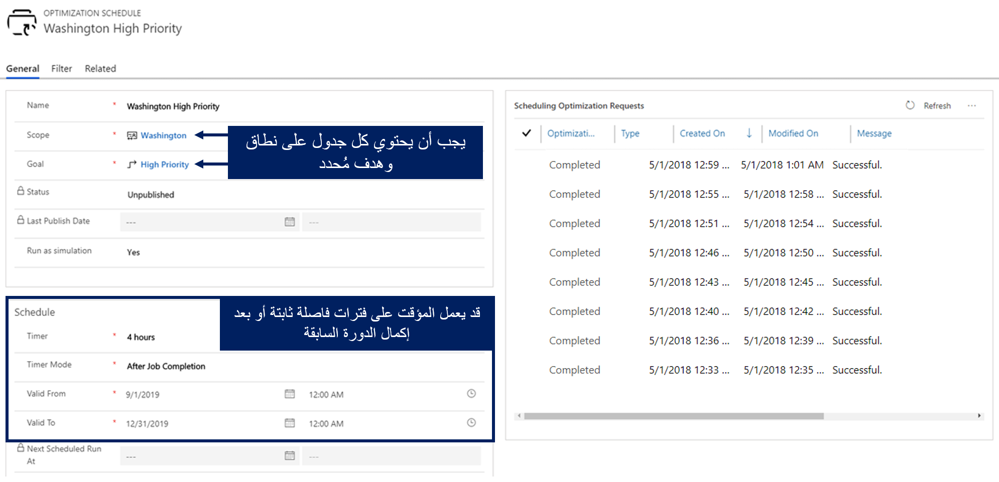
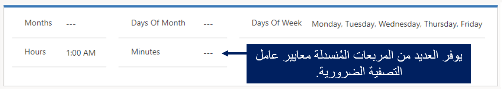
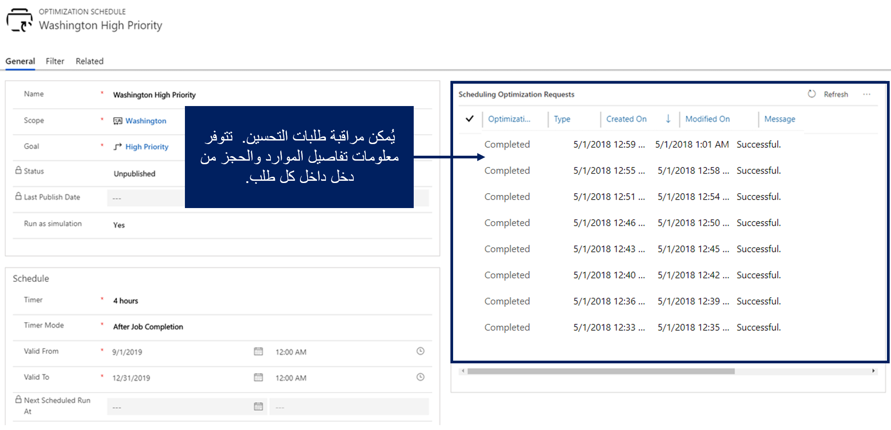

يحدد جدول التحسين متى يجب تحسين السجلات. على سبيل المثال، يمكنك تحديد جدول يعمل في أيام الأسبوع في الساعة 1:00 صباحاً.

عند إنشاء جدول تحسين، ستحتاج إلى تحديد المعلمات التالية:

-   **الاسم** - أدخل اسماً منطقياً يوضح المتطلبات والحجوزات والموارد التي سيتم تحسينها.

-   **النطاق** - يحدد النطاق الذي سيتم استخدامه.

-   **الهدف** - يحدد الهدف الذي سيتم استخدامه.

-   **المؤقت** - يحدد عدد مرات تشغيل هذا الجدول الزمني.

-   **وضع المؤقت** - يحدد النقطة عندما يبدأ الجدول الزمني في تشغيل المؤقت.

    -   على سبيل المثال، إذا تم تعيين المؤقت إلى 30 دقيقة، يبدأ التشغيل الأول بعد 30 دقيقة من تاريخ/وقت النشر.

    -   **الوضع الثابت** - يعمل تحسين الأداء كل 30 دقيقة.

    -   **بعد وضع إكمال المهمة** - يعمل التحسين لمدة 30 دقيقة من نهاية آخر تشغيل لمهمة RSO.

-   **صالح من** **وصالح حتى** - التاريخ والوقت الأول/الأخير عندما يكون هذا الجدول صالحاً للتنفيذ.

### تحديد خيارات عامل التصفية

في كثير من الأحيان، قد تحتاج وظائف مختلفة إلى العمل في أوقات مختلفة. على سبيل المثال، سيتم تشغيل الجدول الزمني في الساعة 1:00 صباحاً والساعة 7:00 مساءً كل يوم إثنين حتى الجمعة. في هذه الحالات، يمكنك استخدام ميزة عامل التصفية لتحديد وقت تشغيل المهمة. قسم عامل التصفية في الجدول هو ميزة متقدمة. تسمح نافذة **عامل التصفية** بتحديد مجموعات متنوعة، مثل:

-   يمكنك التصفية حسب الشهر، واليوم الرقمي، وأيام الأسبوع، والساعة، والدقيقة، والإشارة إلى منطقة زمنية تم تكوينها.

-   يعني ترك جميع عوامل التصفية فارغة أنه لن يتم تطبيق أي عوامل التصفية.

### كيفيه عمل المؤقتات مع عوامل التصفية

إذا قمت بتكوين المؤقت وعامل التصفية كما هو موضح في الفيديو التالي، فسيتم تشغيل RSO كل 30 دقيقة بعد اكتمال المهمة السابقة، من 12/3/2016 الساعة 9:00 صباحاً إلى 12/4/2018 الساعة 9:00 صباحاً، ما عدا يومي السبت والأحد.

راجع [تحديد جداول التحسين](/dynamics365/customer-engagement/field-service/rso-configuration#create-an-optimization-schedule/?azure-portal=true) لمزيد من المعلومات.

> [!VIDEO https://www.microsoft.com/videoplayer/embed/RE4kspb]

### نشر الجداول

سيكون الجدول موجوداً في إحدى الحالات العديدة طوال دورة حياته.
لن يبدأ الجدول الزمني في تحسين الموارد والمتطلبات والحجوزات حتى يتم نشرها. يتم نشر الجداول من خلال تحديد جدول (جداول) للنشر ثم تحديد زر **النشر** في الجزء العلوي الأيسر. من الممكن نشر جميع الجداول عن طريق تحديد الزر **نشر الكل**.

تحدد القائمة التالية الحالات المختلفة التي يمكن أن توجد فيها مهمة RSO:

-   **غير منشور** - الحالة الافتراضية عند إنشاء جدول أو بعد إعادة تعيينه.

-   **النشر** - يحاول النظام نشر الجداول الزمنية.

-   **تم النشر** - قام النظام بنشر جدول ويعتبر تشغيله جيداً.

-   **غير متزامن** - تتطلب التغييرات التي تم إجراؤها وفقاً للجدول نشره مرة أخرى.

-   **تحت الصيانة** - يشير إلى أن شخصاً ما يقوم بترقية RSO إلى إصدار أحدث.

-   **فشل** - فشل النظام في نشر الجداول لأسباب متعددة.

    -   يمكن للمستخدم رؤية تفاصيل الخطأ في شكل الجدول.

    -   قد يكون الخطأ المعتاد هو أن SASKey لم يتم تكوينه، مما يعني أن موارد RSO Azure لم يتم إعدادها بشكل صحيح.

بعد نشر الجدول، سيبدأ في تحسين الأصناف بناءً على الجدول. يمكن تشغيل جداول RSO يدوياً عند الطلب في أي وقت عن طريق تحديد زر **التشغيل الآن**. إذا احتاج جدول تحسين جدولة الموارد إلى بعض التغييرات واسعة النطاق، أو كان هناك شيء لا يعمل، فيمكنك تحديد الزر **إعادة تعيين Resource Scheduling Optimization**، والذي سيؤدي إلى إلغاء كافة مهام RSO المعلقة وإلغاء نشر الجدول.

راجع [جداول النشر،](/dynamics365/customer-engagement/field-service/rso-schedule-optimization?azure-portal=true#publishing-schedules/) لمزيد من المعلومات.

### مراقبة طلبات التحسين

بعد نشر الجدول، يمكنك فتحه ومراقبة جدولة طلبات التحسين (مهام RSO). يمكنك التنقل في كل من هذه الطلبات لمعرفة الحجوزات المرتبطة بتشغيل مهمة RSO.

من جدول تحسين الأداء، يمكنك مشاهدة:

-   الموارد التي يتم تحسينها والتي لا يتم تحسينها (ولأي سبب).

-   تفاصيل الحجز والمخططات التحليلية التي تعرض عدد ساعات السفر مقابل عدد ساعات العمل المجدولة لهذا التشغيل.

راجع [مراقبة طلبات التحسين،](/dynamics365/customer-engagement/field-service/rso-schedule-optimization#monitoring-optimization-requests/?azure-portal=true) لمزيد من المعلومات.

