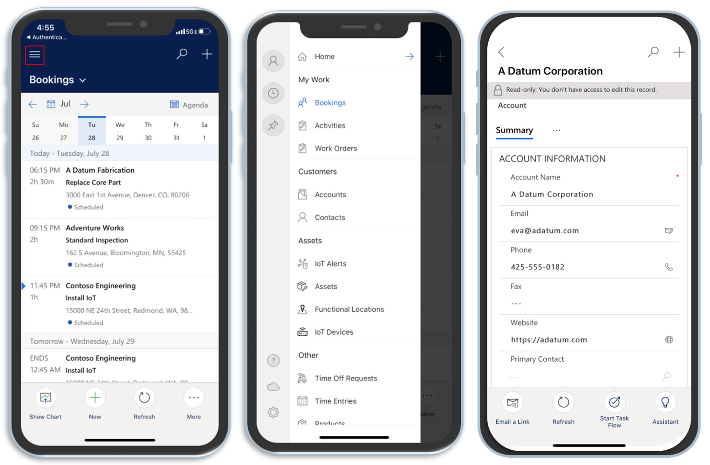
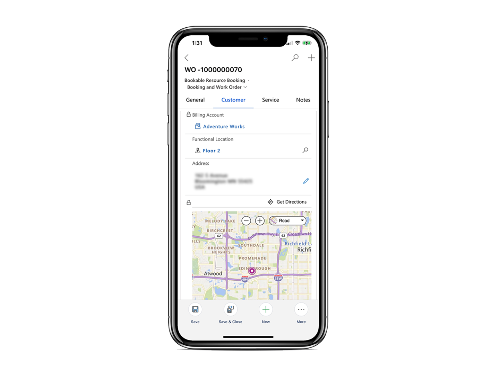

يجب أن يكون لدى العاملين في الخطوط الأمامية الذين يعملون في الميدان جميع المعلومات والأدوات والموارد اللازمة التي يمكن الوصول إليها لضمان أن يتمكنوا من توفير المستوى المطلوب من الخدمة للعملاء. وقد تتضمن هذه المعلومات تفاصيل عن المكان الذي يذهبون إليه، أو إرشادات بشأن ما يجب القيام به عند وصولهم، أو تسهيل حصولهم على أي مساعدة ضرورية عند الحاجة. وينبغي أن تكون المعلومات اللازمة لإكمال المهمة متاحة بسهولة وفوراً للعامل. بعد أن يكمل العامل المكالمة ويجد حلاً، يمكنه توفير التفاصيل اللازمة حول الدقة أو إضافة ملاحظات أو التقاط توقيع عميل.

إن تزويد العاملين في الخطوط الأمامية بالمعلومات والأدوات التي يحتاجونها يعني أكثر من مجرد تزويدهم بنظرة عامة على التوقعات والمهام. يجب أن يكونوا قادرين على حل المشكلة في المرة الأولى، بغض النظر عن الموقع.

بالإضافة إلى تقويم الوظائف المجدولة وتفاصيل أمر العمل، قد تفكر في بذل الجهود التالية لمساعدتهم على إكمال المهمة:

- تقديم معلومات حول موقع العميل.

- التقاط الصور أو ملفات الفيديو وإرفاقها.

- مسح الكود الشريطي ضوئياً.

- تقديم تفاصيل تتعلق بالأجزاء والخدمات المحددة التي سيقدمونها.

- التقط توقيع عميل.

- التواصل مع خبراء الموضوع أثناء العمل في هذا المجال.

- الوصول إلى البيانات أثناء العمل عبر الإنترنت أو دون اتصال.

## تطبيق Dynamics 365 Field Service ‏Mobile

تم إنشاء تطبيق Microsoft Dynamics 365 Field Service ‏Mobile على Microsoft Power Platform ويوفر للعاملين في الخطوط الأمامية الأدوات التي يحتاجونها لخدمة العملاء في هذا المجال. أثناء العمل في الميدان، يمكنهم الوصول إلى معلومات مهمة مثل:

- أوامر العمل التي تم تعيينها لهم

- قوائم أصول العميل

- الحسابات

- جهات الاتصال

يوفر التطبيق المحمول أيضاً للعاملين في الخطوط الأمامية عرض جدول يومي حتى يتمكنوا من عرض جدولهم وإدارته بشكل أكثر ملاءمة. يتم تجميع الحجوزات وأوامر العمل المرفقة معاً، لذلك يحتاج العمال فقط إلى فتح عنصر واحد لعرض وإدخال البيانات المتعلقة بالحجز وأمر العمل.

> [!div class="mx-imgBorder"]
> 

بالإضافة إلى عرض تفاصيل حول وظائف محددة، يمكن للعمال عرض معلومات موقع العميل. كما يمكنهم تشغيل اتجاهات القيادة بدورها من تطبيق GPS على هواتفهم مثل خرائط Bing أو خرائط Apple أو Google Maps.

> [!div class="mx-imgBorder"]
> 

ونظراً لأن العمال لن يكون لديهم إمكانية الاتصال الدائم بالإنترنت، فيمكنهم الوصول إلى تطبيق Dynamics 365 Field Service ‏Mobile أثناء عملهم بدون اتصال أو بالإنترنت. كمنظمة، يمكنك تحديد المستخدمين الذين لديهم حق الوصول إلى دون اتصال أولاً. يمكنك أيضاً تحديد البيانات المتوفرة لهم أثناء العمل دون اتصال.

يتم دعم تطبيق Field Service Mobile على منصات IOS وAndroid. لمزيد من المعلومات، راجع [الأنظمة الأساسية المعتمدة على الأجهزة المحمولة](/dynamics365/field-service/mobile-power-app-system-requirements/?azure-portal=true#mobile-device---supported-platforms).

يمكنك أيضا مشاهدة الفيديو التالي للمراجعة الإرشادية للتطبيق.

> [!VIDEO https://www.microsoft.com/videoplayer/embed/RE4HKRL]

ستفسر بقية هذه الوحدة النمطية كيفية البدء في العمل مع تطبيق Dynamics 365 Field Service ‏Mobile.
