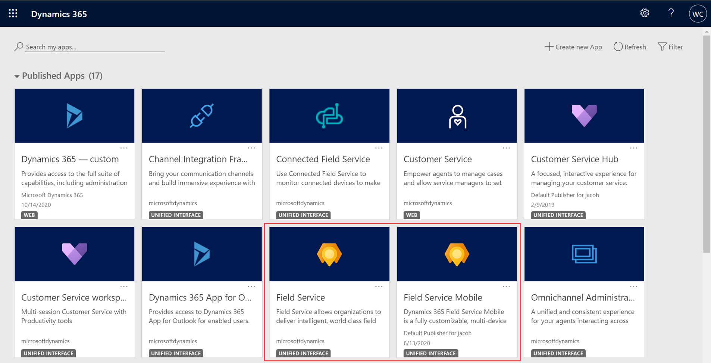
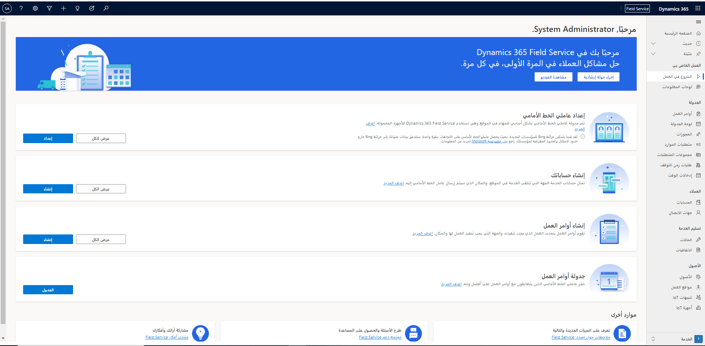
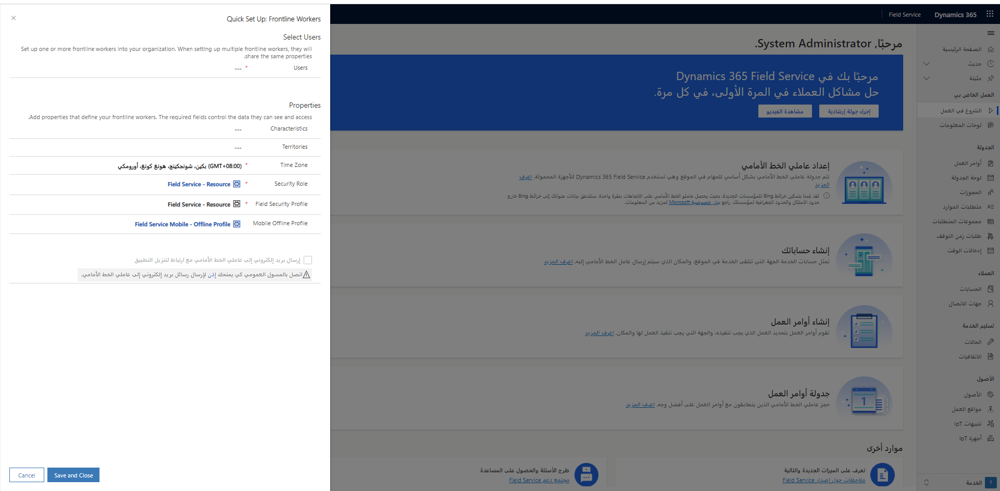
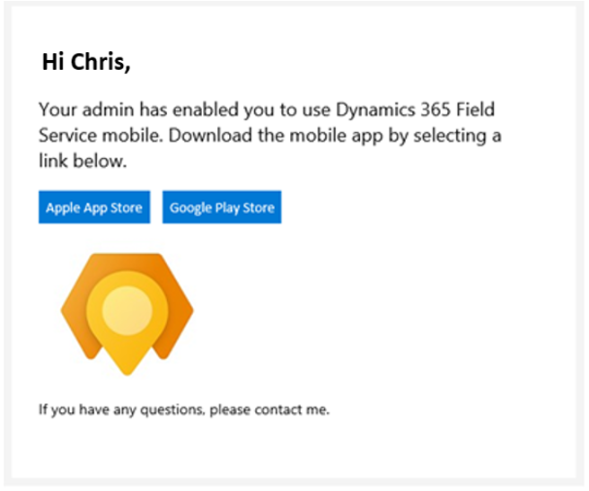
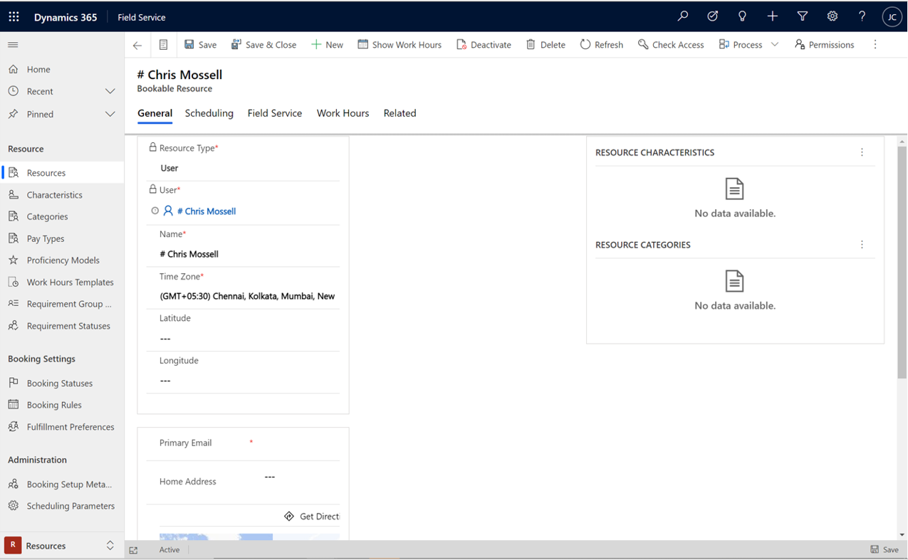
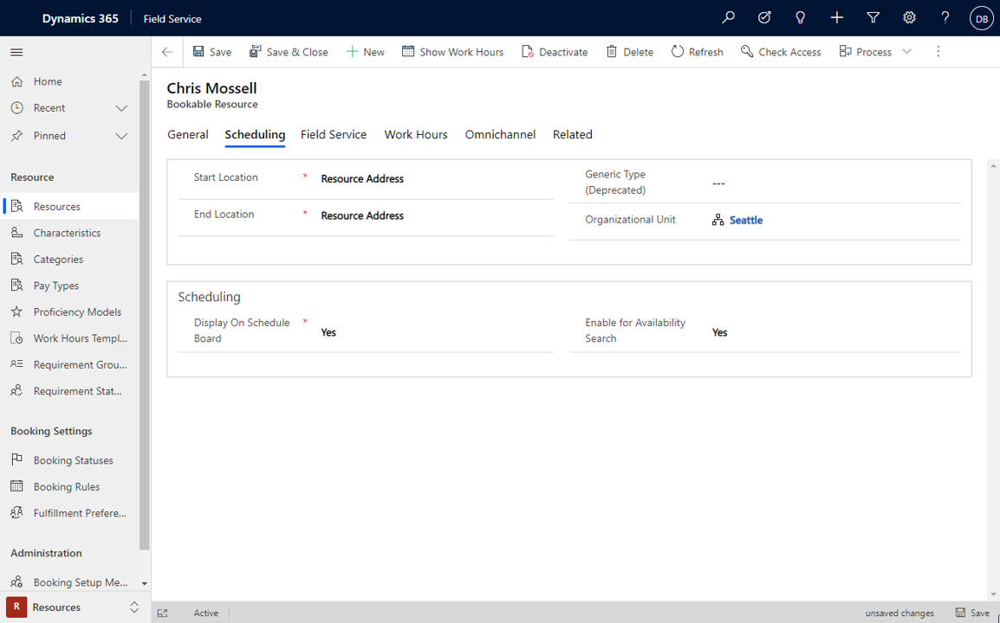
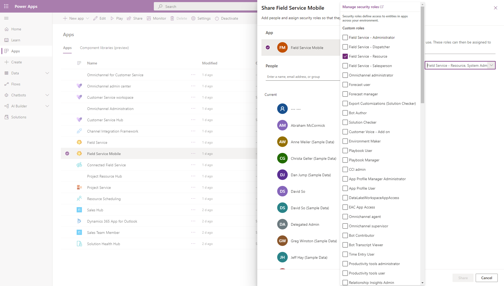
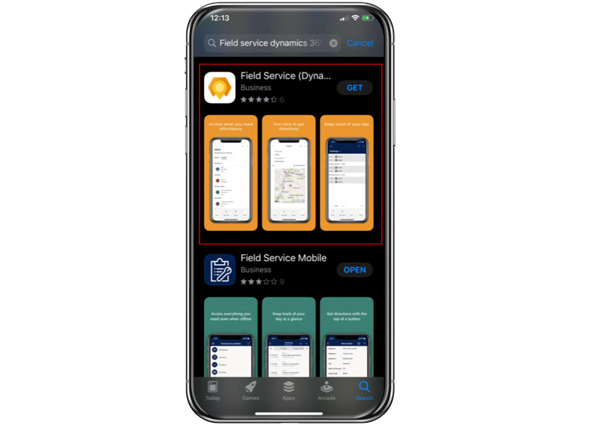
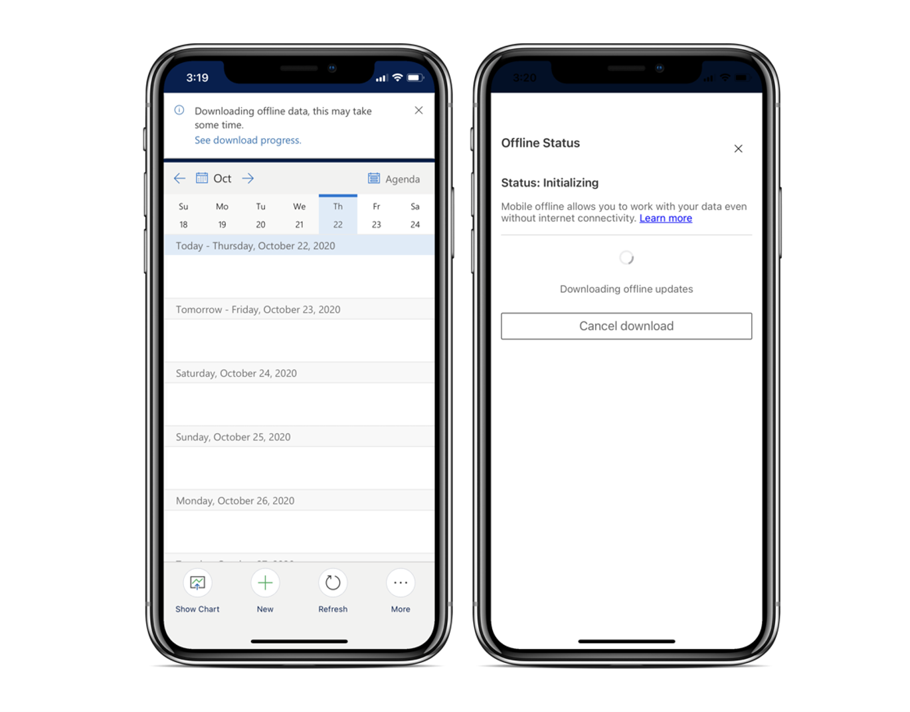

قبل أن تتمكن من استخدام تطبيق Field Service Mobile، يجب أن تكون قد قمت بتثبيت Dynamics 365 Field Service وإعداده.

إذا لم تكن قد قمت بالفعل بإعداد Dynamics 365 Field Service، راجع المقالات التالية:

- [كيفية تثبيت Dynamics 365 Field Service](/dynamics365/field-service/install-field-service/?azure-portal=true)

- [إعداد ملفات تعريف الأمان والمستخدمين](/dynamics365/field-service/view-user-accounts-security-roles/?azure-portal=true)

- [إجراء التكوينات الأولية](/dynamics365/field-service/perform-initial-configurations-setup/?azure-portal=true)

- [إعداد عامل الخط الأمامي](/dynamics365/field-service/frontline-worker-set-up/?azure-portal=true)

## عملية التوزيع

تتضمن عملية النشر الخطوات التالية:

1. تأكد من أنك تقوم بتشغيل الإصدار الصحيح من Dynamics 365 Field Service.

1. قم بإعداد عمال الخط الأمامي وتكوينهم.

1. تعيين أدوار أمان مناسبة للمستخدمين وتطبيق الأجهزة المحمولة.

1. قم بتنزيل التطبيق وتسجيل الدخول.

## تثبيت إصدار Field Service أو ترقيته

لن يتوفر تطبيق Field Service Mobile الذي تم إنشاؤه على Microsoft Power Platform للمستخدمين في مؤسستك إلا إذا كنت تقوم بتشغيل الإصدار المناسب من Dynamics 365 Field Service. ستحتاج إلى تثبيت أو ترقية مثيل Field Service إلى 8.8.22 أو إصدار أعلى. عند تشغيل البيئة الخاصة بك على الإصدار الصحيح، فإن Dynamics 365 Field Service ‏Mobile سيصبح متوفراً للمستخدمين.

> [!div class="mx-imgBorder"]
> 

## إعداد عمال الخط الأمامي في مؤسستك

بعد التأكد من تشغيل إصدار التطبيق الصحيح، تكون المهمة التالية هي إعداد عمال الخط الأمامي. عمال الخط الأمامي في Dynamics 365 Field Service هم الأشخاص ضمن مؤسستك الذين يتم جدولتهم بشكل أساسي للوظائف في الموقع والذين سيستخدمون تطبيق الجوال لعملهم. تأكد من إعداد عمال الخطوط الأمامية في Field Service في أسرع وقت ممكن حتى يتمكنوا من البدء فوراً في إصلاح المشاكل في مواقع العملاء وإكمال مكالمات الخدمة.

عند تشغيل Dynamics 365 Field Service، يتوفر خيار **الشروع في العمل** ضمن مجموعة **العمل الخاص بي**. في هذه الصفحة، يستطيع المسؤولون إعداد عمال الخطوط الأمامية بسرعة وتقديم الأذونات الضرورية لجدولة أوامر العمل واستخدام تطبيق Field Service Mobile.

> [!div class="mx-imgBorder"]
> 

من النموذج **إعداد عمال الخط الأمامي**، يمكنك إكمال المهام التالية:

- **تحديد عمال الخط الأمامي** - قم بإعداد واحد أو أكثر من العاملين في الخطوط الأمامية، بما في ذلك تحديد العوامل التالية:

  - [الصفات المميزة (المهارات والشهادات)](/dynamics365/field-service/set-up-characteristics/?azure-portal=true)

  - [الأقاليم](/dynamics365/field-service/set-up-territories/?azure-portal=true)

  - المناطق الزمنية

  - [‏‏أدوار الأمان](/dynamics365/field-service/view-user-accounts-security-roles/?azure-portal=true)

  - [ملف تعريف Mobile Offline](/dynamics365/field-service/mobile-power-app-system-offline/?azure-portal=true)

- **تعديل إعدادات أمان العاملين** - عرض وتحديث دور الأمان الافتراضي وملف تعريف أمان الحقل وملف تعريف Mobile Offline الذي تم تعيينه لعمال الخط الأمامي، والتي تتحكم في البيانات التي يمكن لعمال الخط الأمامي رؤيتها والوصول إليها.

- **تزويد المستخدمين بارتباط تنزيل** - حدد لإرسال بريد إلكتروني تلقائي إلى عمال الخط الأمامي لديك باستخدام أحد الارتباطات لتنزيل تطبيق Dynamics 365 Field Service ‏Mobile.

> [!NOTE]
> نوصي باستخدام أدوار الأمان الافتراضية وملفات تعريف Mobile Offline عند استخدام معالج الاعداد.

بعد تحديد واحد أو أكثر من عمال الخطوط الأمامية، يمكنك:

- استعرض قائمة تضم جميع عمال الخطوط الأمامية، بما في ذلك الأسماء وعناوين البريد الإلكتروني وعناوين المنزل.

- استعرض تفاصيل عامل الخط الأمامي الشخصية وقم بتحديثها، مثل عنوان المنزل ودور الأمان وملف تعريف Mobile Offline.

## إنشاء عامل الخط الأمامي

بعد تحديد الزر **إعداد** لبدء إضافة مستخدمين، سيتم توجيهك إلى نموذج **الإعداد السريع: عمال الخطوط الأمامية** . في القسم 
**تحديد مستخدمين**، يمكنك تحديد واحد أو أكثر من عمال الخطوط الأمامية  في مؤسستك.

> [!div class="mx-imgBorder"]
> 

بعد تحديد العمال الذين تريد إضافتهم، ستحتاج إلى تحديد خصائص معينة ليتم إقرانها بهؤلاء المستخدمين، بما في ذلك:

- **الخصائص** - تحدد مناطق الخبرة أو الشهادات الخاصة بعامل الخط الأمامي. تستخدم هذه الخصائص عادةً لجدولة العاملين للوظائف استناداً إلى الخصائص التي تم تعيينها للصنف الذي تتم جدولته.
  يمكن أن يكون لعامل الخط الأمامي خصائص متعددة معينة لهم.

- **المناطق** - تحديد المناطق الجغرافية لعامل الخط الأمامي، مثل المدينة أو الولاية أو المقاطعة أو الرمز البريدي لإعلام الجدولة.
  يمكن أن يكون لعامل الخط الأمامي مناطق متعددة معينة لهم.

- **المنطقة الزمنية** - تحديد المنطقة الزمنية التي يوجد بها هذا العامل. يمكن أن تؤثر المناطق الزمنية على الجدولة في التطبيق.

- **دور الأمان** - يتحكم في أنواع البيانات وأنواع السجلات التي يمكن لعامل الخط الأمامي الوصول إليها وتحريرها. (نوصي بشدة باستخدام الدور الافتراضي لـ **Field Service - المورد**.)

- **ملف تعريف Field Security** - التحكم في الحقول التي يراها عامل الخط الأمامي لنوع السجل. (نوصي بشدة باستخدام الدور الافتراضي لـ **Field Service - المورد**.)

- **ملف تعريف Mobile Offline** - التحكم في البيانات التي يتم تنزيلها إلى تطبيق الأجهزة المحمولة في وضع عدم الاتصال. لن تظهر ملفات التعريف غير المنشورة حتى يتم نشرها. (نوصي بشدة باستخدام ملف التعريف الافتراضي لـ **Field Service Mobile - ملف تعريف وضع عدم الاتصال**.)

> [!NOTE]
> وبشكل مثالي، سيتم إعداد الصفات المميزة والمناطق بواسطة شخص لديه حقوق إدارية قبل إضافة عمال الخطوط الأمامية.

> [!IMPORTANT]
> إذا كنت تقوم بإعداد العديد من العاملين في الخطوط الأمامية في نموذج واحد، فسيحددون جميعهم الخصائص. إذا كنت بحاجة إلى إعداد عمال إضافيين بخصائص مختلفة، فستحتاج إلى إجراء الإعداد مرة أخرى.

لمزيد من المعلومات، راجع [إعداد عمال الخطوط الأمامية في مؤسستك](/dynamics365/field-service/frontline-worker-set-up?azure-portal=true#use-the-form/).

يمكنك إرسال بريد إلكتروني تلقائي إلى عمال الخطوط الأمامية يتضمن ارتباطاً لتنزيل تطبيق Dynamics 365 Field Service ‏Mobile.
للقيام بذلك، قبل حفظ سجلات عامل الخط الأمامي، تأكد من تحديد خانة الاختيار **إرسال بريد إلكتروني لعمال الخطوط الأمامية يتضمن ارتباطاً لتنزيل التطبيق** ضمن النموذج **الإعداد السريع: عمال الخطوط الأمامية**.

> [!NOTE]
> تم تحديد هذا البريد الإلكتروني مسبقاً والمحتويات غير قابلة للتحرير.

> [!div class="mx-imgBorder"]
> 

لمزيد من المعلومات، راجع [إرسال بريد إلكتروني بارتباط لتنزيل التطبيق إلى عمال الخطوط الأمامية](/dynamics365/field-service/frontline-worker-set-up/?azure-portal=true#send-frontline-workers-an-email-with-link-to-download-app).

## عرض عمال الخطوط الأمامية وتحديثهم

بعد إعداد عمال الخطوط الأمامية، قد تواجه سيناريوهات تحتاج فيها إلى تعديل المعلومات المرتبطة بالعامل. على سبيل المثال، قد يتم تعيين منطقة جديدة للعامل. في تلك الحالات، يمكنك تعديل تفاصيل عامل الخط الأمامي حسب الحاجة.

من  **الصفحة الرئيسية** أو صفحة  **الشروع في العمل** ، قم بتحديد الزر **عرض الكل** الموجود في القسم **إعداد عمال الخطوط الأمامية** . سيتم عرض قائمة تتضمن كافة عمال الخطوط الأمامية في مؤسستك الذين تم تكوينهم. عندما تقوم بفتح سجل العامل، يمكنك عرض وتعديل التفاصيل الخاصة بهذا العامل مثل الخصائص والمناطق والمنطقة الزمنية وما إلى ذلك في نموذج **المورد القابل للحجز**.

> [!div class="mx-imgBorder"]
> 

إذا كنت بحاجة إلى تعديل المعلومات المتعلقة بالأذونات للعامل، مثل البيانات التي يمكنهم الوصول إليها أو جعلها غير متصل، حدد الزر **الأذونات** من شريط الأوامر. سيؤدي هذا الإجراء إلى فتح نافذة **الأذونات** أو تحديثها، حيث يمكنك تحديث دور الأمان الخاص بهذا العامل ودور أمان الحقل وملف تعريف Mobile Offline.

> [!div class="mx-imgBorder"]
> 

لمزيد من المعلومات، راجع [إعداد عمال الخطوط الأمامية في مؤسستك](/dynamics365/field-service/frontline-worker-set-up#view-and-update-the-details-of-individual-frontline-workers-on-the-bookable-resource-form/?azure-portal=true).

## تعيين أدوار أمان لتطبيق Field Service Mobile

بالإضافة إلى التأكد من أن العاملين في الخطوط الأمامية قد تم تعيينهم أدوار الأمان اللازمة للعمل مع التطبيق، تحتاج إلى تعيين أدوار الأمان لتطبيق Field Service Mobile لتحديد الأدوار التي يمكن وصولها إلى التطبيق. على سبيل المثال، لقد قمت مسبقاً بتعيين دور مورد Field Service لعمال الخطوط الأمامية. إذا لم تقم أيضاً بتعيين هذا الدور إلى تطبيق Field Service Mobile، فمن غير المعروف هل سيتمكن هؤلاء العمال من استخدام تطبيق الأجهزة المحمولة أم لا.

يمكن للمسؤولين تعديل الأذونات من شاشة **التطبيقات**. إذا كنت تعمل في تطبيق Field Service، فحدد نص Field Service في الجزء العلوي الأيمن من الشاشة. سيتم فتح شاشة **التطبيقات**، حيث يمكنك تحديد موقع تطبيق Field Service Mobile ثم تحديد علامة القطع (**...**). من القائمة التي تظهر، حدد **إدارة الأدوار**.
حدد الأدوار التي تريد توفير صلاحية الوصول لها.

> [!div class="mx-imgBorder"]
> 

> [!IMPORTANT]
> يجب التأكد من تعيين أدوار المسؤول عن Field Service-المورد وField Service-المسؤول.

## تنزيل التطبيق وتثبيته

قبل أن يتمكن العاملون في الخطوط الأمامية من البدء في استخدام تطبيق Field Service Mobile، يحتاجون إلى تنزيل التطبيق وتثبيته على أجهزتهم المفضلة من متجر تطبيقات هذا الجهاز. كما سبق ذكره، يكون تطبيق Field Service Mobile معتمداً حالياً على الأجهزة التي تعمل بنظام Android وIOS. لمزيد من المعلومات، راجع [الأنظمة الأساسية المعتمدة على الأجهزة المحمولة](/dynamics365/field-service/mobile-power-app-system-requirements/?azure-portal=true#mobile-device---supported-platforms).

> [!div class="mx-imgBorder"]
> 

بعد تثبيت التطبيق على أجهزتهم، وبعد أن يكون لديهم أدوار الأمان اللازمة المعينة لهم، يمكن لعامل خط المواجهة تسجيل الدخول إلى التطبيق. بعد أن يقوم العامل بتسجيل الدخول بنجاح، سيقوم التطبيق بتنزيل معلومات مهمة عن Field Service كما يسميها المسؤولون.

> [!div class="mx-imgBorder"]
> 
