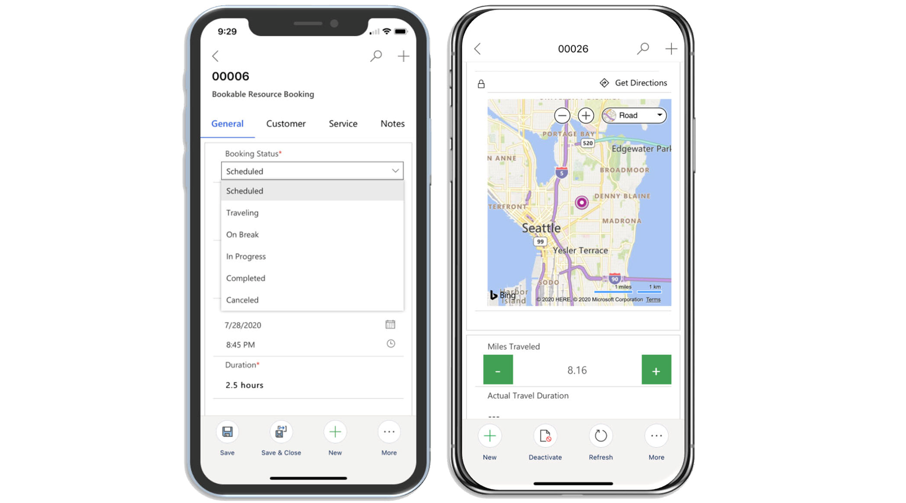
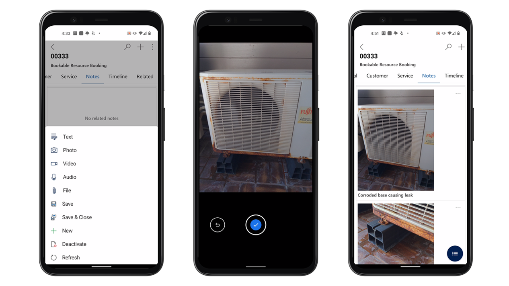

بعد تسجيل الدخول إلى التطبيق، سيتم توجيهك إلى الشاشة الرئيسية. ستزودك الشاشة الرئيسية بنظرة عامة يومية على جميع الحجوزات التي تم تخصيصها لك. بالإضافة إلى ذلك، يمكنك الانتقال إلى أيام مختلفة لعرض حجوزات معينة.

## تصفح تطبيق الأجهزة المحمولة

يتضمن تطبيق الأجهزة المحمولة أيضاً خريطة موقع يمكنك استخدامها للتنقل إلى معلومات مختلفة مثل الحسابات وجهات الاتصال وأصول العميل. يمكنك الوصول إلى خريطة الموقع عن طريق تحديد رمز القائمة من عرض التقويم.

> [!div class="mx-imgBorder"]
> 

في البداية، تم تكوين خريطة موقع تطبيق الأجهزة المحمولة لتشمل العناصر التي سيحتاج عمال الخطوط الأمامية للوصول إليها أثناء العمل في الميدان.

بشكل مبتكر، يتم تقسيم خريطة الموقع إلى خمس مجموعات:

- **الرئيسية** - التنقل إلى تقويم الشاشة الرئيسية حيث يمكن للمندوبين الميدانيين العمل مع حجوزاتهم.

- **عملي** - تضمن المعلومات ذات الصلة بالمندوبين الميدانيين، مثل الحجوزات والأنشطة وأوامر العمل المعينة لهم.

- **العملاء** - توفير الوصول إلى الحساب وسجلات الاتصال.

- **الأصول** - تُستخدم مع إمكانات إدارة الأصول وIoT في Dynamics 365 Field Service.

- **تقارير الوقت** - توفير الوصول إلى إمكانات إدارة الوقت بما في ذلك طلبات الإجازة وإدخال الوقت.

قد لا تتناسب العناصر السابقة مع احتياجات كل مؤسسة.
يمكن للمؤسسات تعديل المعلومات المتاحة للمندوبين الميدانيين أثناء عملهم في التطبيق. كيفية تعديل التطبيق خارج نطاق هذه الوحدة، ولكن لمزيد من المعلومات، راجع [تخصيص تطبيق الأجهزة المحمولة](/dynamics365/field-service/mobile-power-app-configure#edit-sitemap-entities-on-home-screen/?azure-portal=true).

## استخدم خياري "الأحدث" و"التثبيت"

استخدم الخيار  **الأحدث** في القائمة الرئيسية للانتقال بسرعة إلى مؤخراً العناصر المعروضة، مثل أوامر العمل والأصول وإدخالات الوقت والمزيد. يمكنك أيضاً تثبيت السجلات المهمة للوصول السريع. يمكنك عرض جميع العناصر المثبتة عن طريق تحديد الرمز **تثبيت**.

> [!div class="mx-imgBorder"]
> 

## عرض أوامر العمل المجدولة

الشاشة الأولى التي ستراها هي طريقة عرض التقويم التي تعرض أوامر العمل المجدولة. ستكون افتراضياً على تاريخ اليوم، ولكن يمكنك استخدام التنقل للتنقل بين الأيام والأسابيع والشهور المختلفة.

يوفر التقويم طريقتين لك لعرض المعلومات المجدولة:

- **جدول الأعمال** - عرض الحجوزات المجدولة بتنسيق جدول أعمال مدرج، مجمعة حسب التاريخ. هذه الطريقة مفيدة عندما تريد عرض المزيد من العناصر على الشاشة.

- **اليوم** - عرض الحجوزات المجدولة في عرض التقويم اليومي.
يتم عرض الأطر الزمنية والعناصر المجدولة في تلك الكتل.

يمكن للمندوبين الميدانيين التبديل بين جدول الأعمال وطريقة عرض اليوم حسب الحاجة عن طريق تحديد جدول الأعمال أو نص اليوم ثم اختيار الخيار الذي يريدون العمل به.

> [!div class="mx-imgBorder"]
> 

يوفر التطبيق أيضاً للمندوبين الميدانيين قائمة بالخيارات المختلفة المتاحة، مثل القدرة على تحديث التقويم أو إنشاء حجز جديد. بالإضافة إلى ذلك، سيوفر الزر **المزيد** قائمة بالعناصر الأخرى التي يمكن تنفيذها، مثل القدرة على استخدام **إظهار كـ > شبكة للقراءة فقط** لعرض الحجوزات على شكل قائمة، كما هو موضح على الجانب الأيمن من لقطة الشاشة السابقة.

## السفر إلى موقع العمل

عند تحديد حجز مدرج في التقويم، سيتم تزويدك بمزيد من التفاصيل حول وقت الحجز وأمر العمل الفردي.
على سبيل المثال، بعد إكمال أمر عمل سابق، يمكنك تحديث حالة الحجز التالي إلى **السفر** للإشارة إلى أنك في طريقك إلى موقع العميل. للمساعدة في تسهيل تحديد موقع المعلومات والعمل عليها في سجل أمر العمل، تتوفر علامات تبويب متعددة للوصول إلى المعلومات المهمة في أمر العمل. على سبيل المثال، باستخدام علامة التبويب **العميل**، يمكنك عرض موقع أمر العمل على الخريطة. من علامة التبويب هذه، يمكنك تشغيل اتجاهات القيادة خطوة بخطوة من تطبيق GPS على هاتفك مثل خرائط Bing أو خرائط Apple أو Google Maps.

> [!div class="mx-imgBorder"]
> 

في كثير من الأحيان، يتم إيفاد عامل في الخطوط الأمامية للعمل على عنصر معين في موقع معين. على سبيل المثال، قد يحتاج إلى العمل على طابعة موجودة في معمل كمبيوتر في طابق معين من المبنى. في هذه الحالات، من المحتمل ألا يكون امتلاك عنوان فقط معلومات كافية.
سيحتاج المندوب إلى مزيد من التفاصيل. يخبر الحقل **موقع العمل** الموجود أعلى العنوان العامل إلى أين يتجه بالضبط داخل العنوان. تضمن هذه الميزة أنه عند وصولهم إلى الموقع، يمكن للعامل تحديد الموقع الدقيق الذي يحتاج إلى الذهاب إليه لحل المشكلة.

> [!div class="mx-imgBorder"]
> 

## أداء وتسجيل العمل

في كثير من الأحيان، يقوم عمال الخطوط الأمامية في الميدان بتثبيت منتج معين أو تنفيذ خدمة. من المهم أن تعرف بالضبط ما يجب أن تفعله أثناء العمل على العنصر. عند فتح أمر عمل على تطبيق الأجهزة المحمولة، توفر لك علامة التبويب **الخدمة** تفاصيل أمر العمل الضرورية، مثل مهام ومنتجات وخدمات أمر العمل. بنقرة واحدة، يمكنك تحديد مهمة خدمة أو خدمة كاملة، مع الإشارة إلى المنتجات التي تم استخدامها. يمكنك ضبط وحدات المنتج وساعات الخدمة حسب الحاجة. سيؤدي تحديد مهمة الخدمة أو الخدمة أو اسم المنتج إلى فتح نموذج التفاصيل الكاملة حيث يمكنك عرض التفاصيل المحددة المتعلقة بالعنصر المحدد.

> [!div class="mx-imgBorder"]
> 

## تدوين ملاحظات بالصور ومقاطع الفيديو والملفات المرفقة

يحتاج المندوبون إلى القدرة على توثيق ما يفعلونه أو يرونه أثناء تواجدهم في الموقع. يساعد توثيق المعلومات المندوب، ولكنه مفيد أيضاً في المواقف التي قد يتساءل فيها شخص ما عما إذا كان العمل قد تم أم لا.
من خلال إضافة ملاحظات حول ما فعلوه والتقاط الصور، يمكن للمندوبين الرجوع إلى هذه البيانات في المستقبل. في علامة التبويب **ملاحظات** ، يمكنك التقاط أسطر نصية متعددة، وصورة أو ملاحظة صوتية أو فيديو، ثم اربطها بالحجز. يمكنك أيضاً إرفاق ملفات والتقاط توقيعات العملاء. بالإضافة إلى ذلك، تتوفر علامة التبويب **الجدول الزمني** للبيانات التاريخية الأخرى متصل بالحجز، مثل رسائل البريد الإلكتروني ذات الصلة والمكالمات الهاتفية والمنشورات وما إلى ذلك.

> [!div class="mx-imgBorder"]
> 

## إنشاء أوامر عمل المتابعة

أثناء العمل في الموقع، قد يحتاج العاملون في الخطوط الأمامية إلى ملاحظة العمل الإضافي الذي يجب القيام به في وقت لاحق. يسهل تطبيق Field Service Mobile عليك إنشاء أوامر عمل متابعة بعد إكمال أمر العمل الحالي. تقوم هذه الميزة بملء عدة أعمدة مسبقاً من أمر العمل الحالي، مما يبسط مهمة عامل الخط الأمامي المتمثلة في إنشاء أمر العمل الجديد بسرعة.

لمزيد من المعلومات، راجع [إنشاء أوامر عمل المتابعة](/dynamics365/field-service/mobile-power-app-use?azure-portal=true#create-follow-up-work-orders)
