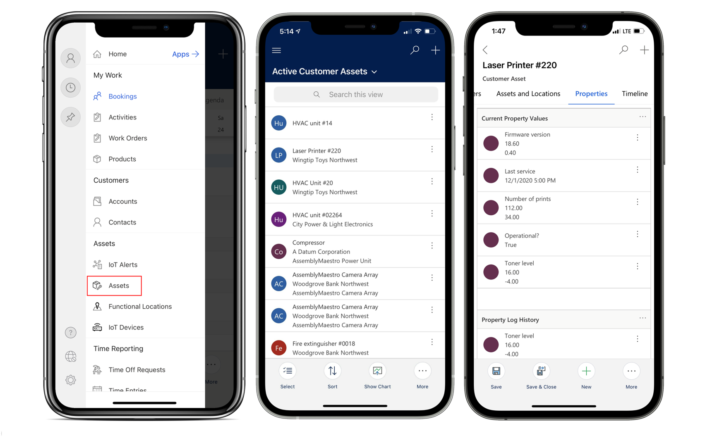
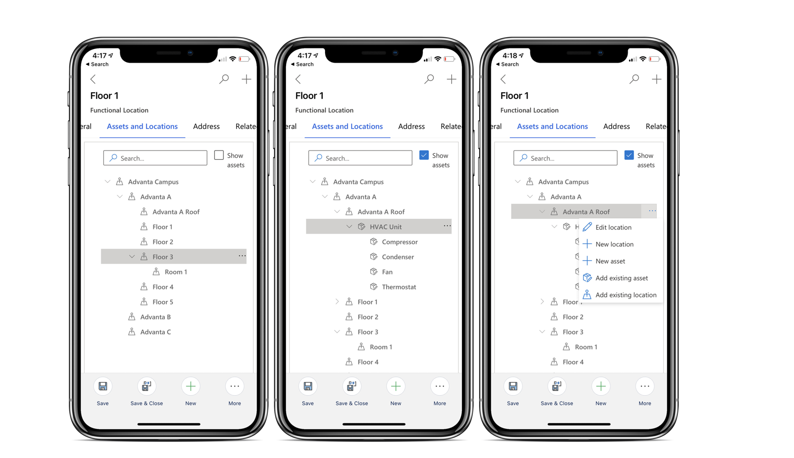
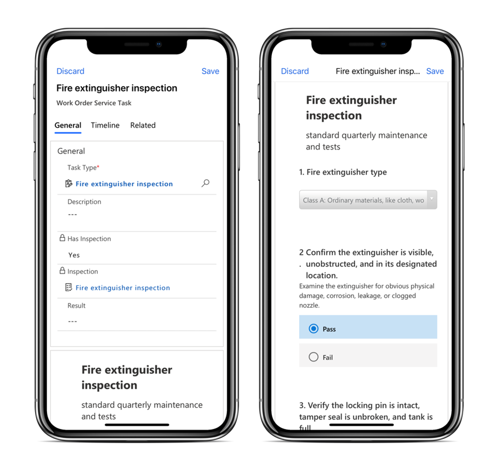
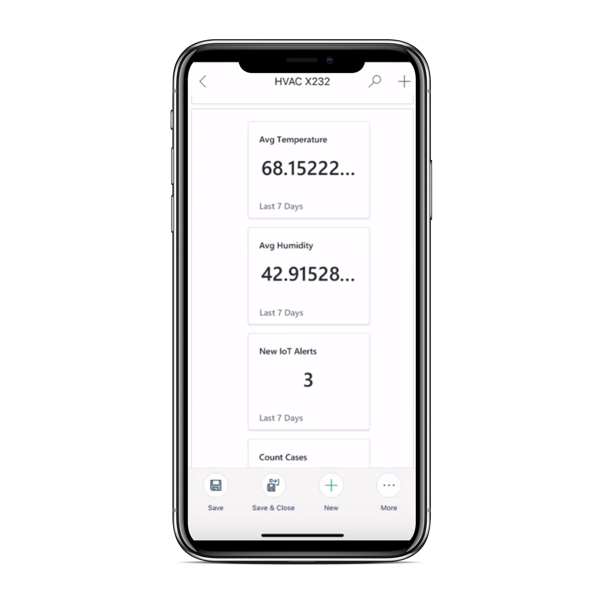
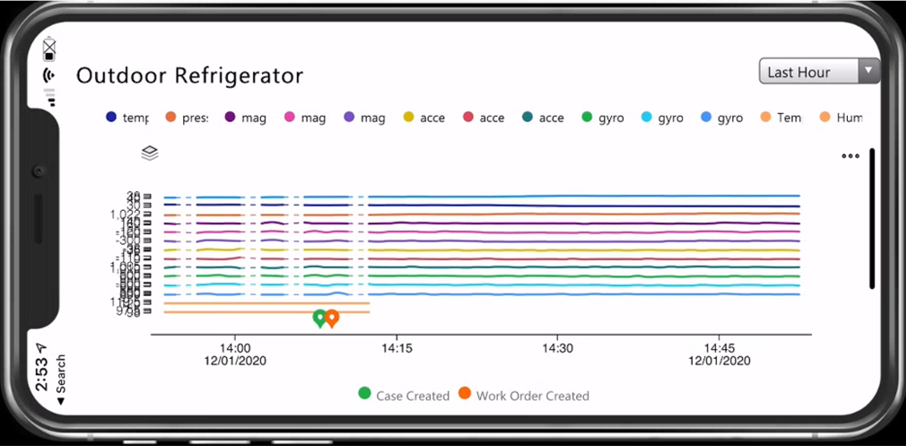
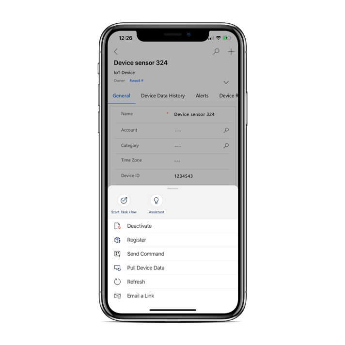

في Dynamics 365 Field Service، يمثل أصل العميل أجزاء معينة من المعدات التي يمتلكها العميل. يمكن أن يكون هذا الأصل أي شيء من قطعة كبيرة من معدات التصنيع أو التكنولوجيا إلى جهاز مثل مكيف الهواء. في كثير من الأحيان، عندما يتم إرسال وكيل ميداني لتنفيذ أمر عمل، فإنهم يقومون بالعمل أو الصيانة على أصول العميل هذه.

باستخدام أصول العملاء، يمكن للمؤسسات:

- تسجيل معلومات محددة حول الصنف.

- إنشاء سجل تاريخي لجميع أوامر العمل المرتبطة بالصنف.

- إقران الأصل بجهاز مُمكّن لـ IoT يمكن التفاعل معه عن بُعد.

> [!div class="mx-imgBorder"]
> 

كما ذكرنا سابقاً، قد تكون أصول العميل في مبنى أو طابق أو غرفة معينة. من المهم أن تتوفر هذه المعلومات للوكلاء. في Dynamics 365 Field Service، توفر ميزة **موقع العمل** هذه المعلومات. أثناء العمل في تطبيق الأجهزة المحمولة، يمكن للعاملين في الخطوط الأمامية عرض الموقع الوظيفي والتسلسلات الهرمية لأصول العميل والتفاعل معها. باستخدام هذه الميزة، سيعرف العمال بالضبط مكان وجود أحد أصول العميل. يمكن أن تكون هذه المعلومات مفيدة بشكل خاص في السيناريوهات التي يمتلك فيها العميل حجماً كبيراً من الأصول في مبانٍ متعددة.

> [!div class="mx-imgBorder"]
> 

> [!NOTE]
> يلزم الاتصال بالإنترنت لعرض موقع العمل وأشجار التدرج الهرمي لأصول العميل والتفاعل معها على تطبيق Field Service Mobile.

شاهد الفيديو التالي للحصول على وصف لمواقع العمل على تطبيق Field Service Mobile.

> [!VIDEO https://www.microsoft.com/videoplayer/embed/RE4I2pU]

## مسح الرمز الشريطي

حدد رمز البحث العمومي للبحث عن السجلات عبر الحسابات أو جهات الاتصال أو أوامر العمل أو أصول العملاء أو أي كيان آخر. يمكن للعاملين في الخطوط الأمامية أيضاً البحث عن طريق مسح الرمز الشريطي باستخدام كاميرا هواتفهم.
سيجد مسح الرمز الشريطي السجلات التي تحتوي على حقل رمز شريطي مطابق.

> [!div class="mx-imgBorder"]
> 

لمزيد من المعلومات، راجع [مسح الرمز الشريطي والبحث الشامل‏‎](/dynamics365/field-service/mobile-power-app-system-barcode-scanning?azure-portal=true).

## عمليات الفحص

يمكن للعاملين في الخطوط الأمامية الذين يستخدمون تطبيق الأجهزة المحمولة إجراء فحوصات دون الحاجة إلى مغادرة التطبيق. يمكن للعاملين في الخطوط الأمامية بدء الفحوصات وإكمالها من تطبيق الأجهزة المحمولة. بعد أن يُكمل عامل الخط الأمامي الفحص، يتم تخزين البيانات في تطبيق Field Service، مما يساعد على تسهيل قيام العامل بالإبلاغ عن النتائج وتناسب عمليات الفحص في عمليات الأعمال الآلية.

توفر عمليات الفحص في Field Service أيضاً:

- **الدعم الأول في وضع عدم الاتصال** - يمكن للعاملين في الخطوط الأمامية عرض وملء عمليات الفحص على هواتفهم المحمولة أو الأجهزة اللوحية بدون اتصال بالإنترنت. تتم مزامنة الإجابات عند استعادة الاتصال (شبكة خلوية أو لاسلكية).

- **أصول العميل** - يمكن ربط عمليات التفتيش بالأصول، مما يسمح للمستخدمين بمشاهدة سجل جميع عمليات التفتيش لقطعة معينة من المعدات.

أثناء العمل في تطبيق الأجهزة المحمولة، يمكنك تحديد **مهمة خدمة أمر العمل** التي تتضمن الفحص ذي الصلة. عند إكمال الفحص، يمكنك تحميل الملفات أو التقاط الصور أو تحميل الصور من ألبوم الكاميرا بالهاتف. بالإضافة إلى ذلك، يمكنك إضافة تعليقات أثناء تحميل ملف أو صور.

> [!div class="mx-imgBorder"]
> 

## IoT

يمكن للمؤسسات التي تستخدم Connected Field Service لإنشاء أوامر عمل من بيانات IoT أن تزود العاملين في الخطوط الأمامية ببيانات IoT وإجراءات Connected Field Service لتحسين تقديم خدمة الموقع.

في أغلب الأحيان، سيتم استخدام Connected Field Service من أجل:

- **عرض بيانات IoT** المتعلقة بالأصول لفهم سياق الإصلاح بشكل أفضل.

- **تسجيل أجهزة IoT الجديدة** عند تثبيت أصل لتوصيله بـ Azure IoT أو موفر IoT المخصص.

- **إرسال الأوامر** لاستكشاف المشاكل وإصلاحها.

باستخدام أحدث إصدار من Field Service وتطبيق Field Service Mobile، سيجد العاملون في الخطوط الأمامية كيانات Connected Field Service في خريطة الموقع.

## عرض الإطارات المتجانبة التلخيصية وقراءة الأجهزة

أثناء قيامهم بتنفيذ أمر عمل لأحد الأصول، قد يرغب العاملون في الخطوط الأمامية في عرض بيانات IoT الحديثة للأجهزة المرتبطة بهذا الأصل. ستوفر علامة التبويب **الملخص** في سجل أصول العميل نظرة عامة على نشاط IoT الأخير المرتبط بالأصل.

> [!div class="mx-imgBorder"]
> 

كما هو موضح في الصورة التالية، يمكن للعمال أيضاً عرض مخطط لبيانات IoT المباشرة من جهاز IoT أو أصل العميل أو سجل تنبيه IoT. يعرض لك القسم **قراءات الجهاز** أحدث قياسات IoT التي تم رسمها على الرسم البياني.

> [!div class="mx-imgBorder"]
> 

## تسجيل أجهزة IoT الجديدة

أثناء عمليات تثبيت الأصول، قد ترغب في توصيل أجهزة IoT الجديدة بـ Microsoft Azure. شريطة أن تكون متصلاً بالإنترنت، يمكنك تسجيل الأجهزة من تطبيق الأجهزة المحمولة عن طريق تحديد **المزيد> تسجيل**.
سيؤدي هذا الإجراء إلى إنشاء جهاز IoT في Azure IoT.

> [!div class="mx-imgBorder"]
> 

لمزيد من المعلومات، راجع [Connected Field Service على تطبيق الأجهزة المحمولة لـ Field Service (Dynamics 365)](/dynamics365/field-service/cfs-mobile-powerapp/?azure-portal=true).

## استكشاف الأخطاء وإصلاحها عن طريق إرسال الأوامر

في كثير من الأحيان، أثناء عملك على أحد الأجهزة، قد ترغب في اتخاذ الإجراءات اللازمة مثل إعادة تشغيل الجهاز أو إيقاف تشغيله.
توفر Connected Field Service للمؤسسات القدرة على إرسال أوامر إلى الأجهزة مباشرةً من Dynamics 365 Field Service.

تتضمن الأوامر الشائعة إعادة التشغيل وإيقاف التشغيل، من بين أوامر مخصصة أخرى خاصة بالجهاز.

من سجل جهاز IoT، حدد **المزيد...** في الجزء السفلي من الشاشة.
من القائمة التي تظهر، حدد **إرسال الأمر**. بناءً على الأوامر التي تم تكوينها المتوفرة، حدد أمراً محدداً من القائمة.
