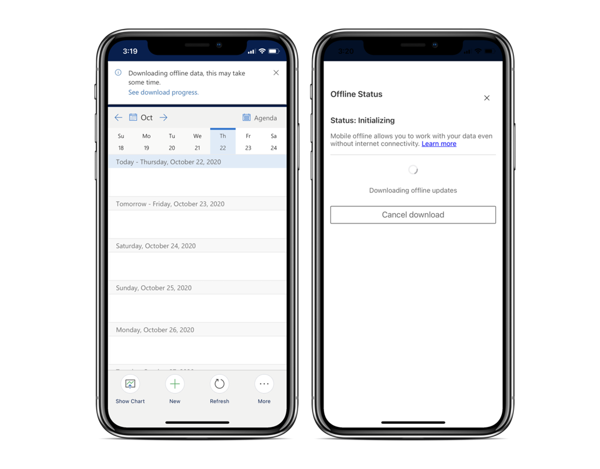
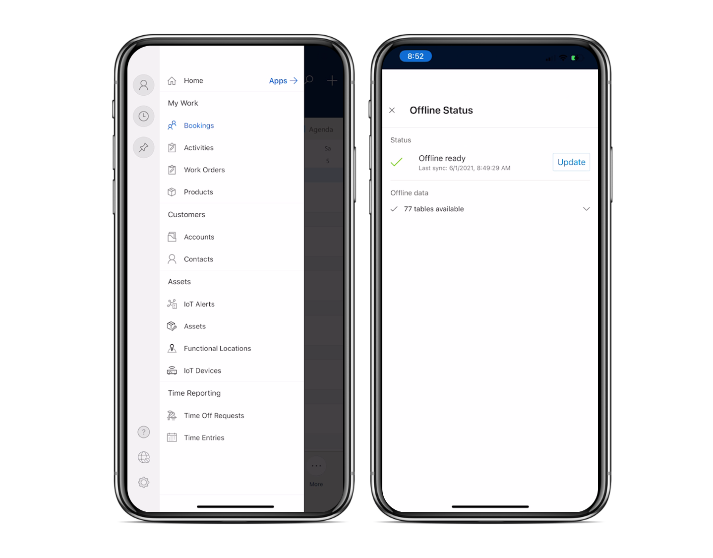
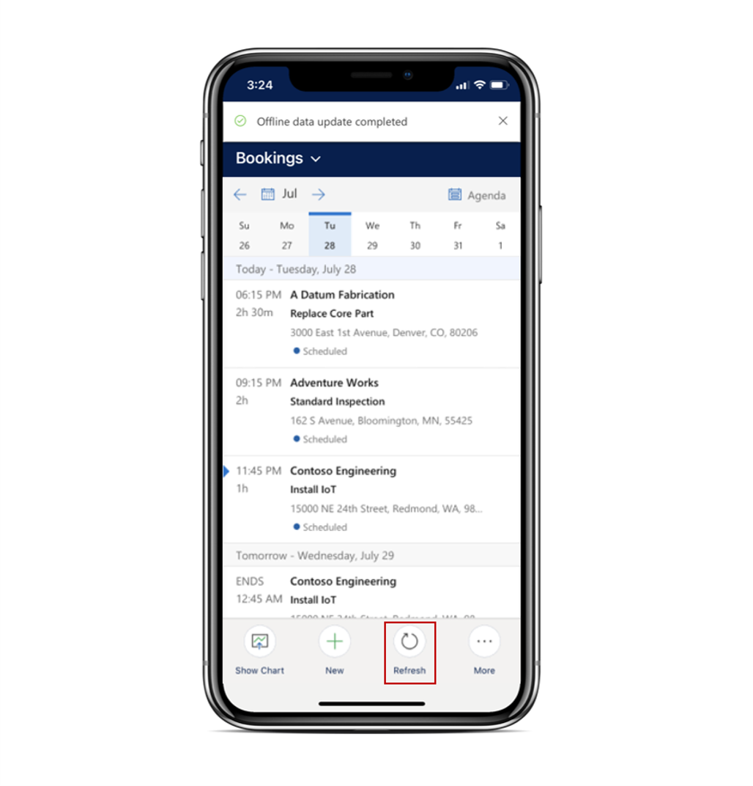

وعلى الرغم من أن العالم متصل رقمياً أكثر من أي وقت مضى، إلا أنه لا يزال شائعاً أن يعمل العاملون في الخطوط الأمامية في مناطق ذات وصول محدود أو معدوم للإنترنت. على سبيل المثال، غالباً ما يعمل العاملون في الخطوط الأمامية في الطوابق السفلية من المجمعات الكبيرة حيث لا يتوفر لديهم سوى اتصال ضئيل أو معدوم بالإنترنت. ولا يزال المندوبون بحاجة إلى الوصول إلى أوامر العمل وتفاصيل الحجز، حتى بدون اتصال.

يوفر تطبيق Dynamics 365 Field Service ‏Mobile للمندوبين القدرة على العمل دون اتصال تلك السيناريوهات. سيؤدي العمل دون اتصال بالإنترنت إلى تنزيل أوامر العمل والملاحظات ومهام الخدمة والصور لاستخدامها دون اتصال. بعد استعادة الاتصال، تتم مزامنة البيانات الجديدة تلقائياً مرة أخرى مع الخادم. تحدث هذه العملية دون انقطاع الخبرة.

> [!IMPORTANT]
> قبل أن يتمكن العاملون في الخطوط الأمامية من استخدام إمكانات تطبيق الأجهزة المحمولة دون اتصال بالإنترنت، سيحتاج مسؤول المؤسسة إلى إعداد الإمكانات غير المتصلة وتكوينها، بما في ذلك إنشاء ملفات تعريف غير متصلة بالإنترنت، وإضافة مستخدمين إلى ملفات التعريف وتحديد البيانات التي يمكن استخدامها بدون اتصال. لمزيد من المعلومات، راجع [تكوين إمكانات وضع عدم الاتصال في تطبيق الأجهزة المحمولة Field Service (Dynamics 365) ](/dynamics365/field-service/mobile-power-app-system-offline/?azure-portal=true).

## العمل دون اتصال بالإنترنت

بعد تسجيل الدخول إلى التطبيق، سيقوم بتنزيل معلومات Field Service المهمة. كما سيقوم بتحديد الجداول التي تم تمكينها للوصول دون اتصال وسحب البيانات غير المتصلة التي يمكن لعامل الخط الأمامي الوصول إليها بناءً على ما حدده المسؤول.

> [!div class="mx-imgBorder"]
> 

بعد تنزيل جميع البيانات الضرورية، سيتم تعيين **الحالة** على **متاح**. بعد ذلك، سيكون لديك ما يلزم للعمل دون اتصال.

عندما يكون تطبيق الجهاز المحمول متصلاً بالإنترنت، يتم تحديث البيانات الموجودة على الجهاز تلقائياً كل خمس دقائق. ومع ذلك ، يمكنك أيضا تحديث البيانات دون اتصال يدويا من خريطة الموقع وذلك بتحديد الرمز غير المتصل في الجزء الأيمن السفلي. من صفحة **‏‫حالة عدم الاتصال** يمكنك تحديد الخيار **تحديث البيانات دون اتصال** .

> [!div class="mx-imgBorder"]
> 

وعلى الرغم من مزامنة البيانات كل خمس دقائق أثناء وجود نشاط على الإنترنت، فقد يكون من السهل مزامنة طرق عرض محددة لضمان حصولك على أحدث المعلومات في حالة انقطاع الاتصال بالإنترنت.

علي سبيل المثال، قد تحتاج إلى التحقق من العوامل التالية:

- الحجوزات الجديدة في التقويم قبل بدء القيادة إلى الموقع.

- تحديثات على أمر عمل قد تم إجراؤه من قبل أعضاء الطاقم الآخرين.

يمكنك مزامنة طرق عرض محددة عن طريق تحديد زر **تحديث** من القائمة السفلية للتطبيق. على سبيل المثال، يمكنك تحديث الحجوزات عن طريق تحديد خيار **تحديث** كما هو موضح في لقطة الشاشة التالية.

> [!div class="mx-imgBorder"]
> 

فيما يتعلق بالاتصال بالإنترنت، يعمل التطبيق ضمن السيناريوهات التالية:

- **متصل** - يحدث عندما يكون الاتصال بالإنترنت متاحاً، ولكن لم يتم تكوين ملف تعريف دون اتصال. يعمل تطبيق الأجهزة المحمولة بشكل مشابه لتطبيق Dynamics 365 مع الإنترنت على جهاز الكمبيوتر الخاص بك. عندما ينقطع الاتصال بالإنترنت أو ينخفض يكون تطبيق الجهاز المحمول غير قابل للاستخدام بشكل أساسي. (غير مستحسن.)

- **العمل دون اتصال أولاً**

    - ***بدون* اتصال بالإنترنت** - يتم تنزيل البيانات على الجهاز ويتم حفظ كافة التغييرات محلياً على جهازك المحمول.
    عند استعادة الإنترنت، تتم مزامنة التغييرات مع الخادم.

    - ***باستخدام* اتصال بالإنترنت** - يتم تنزيل البيانات على الجهاز، ونظراً لوجود اتصال بالإنترنت، تتم مزامنة التغييرات مع الخادم عند حفظ أحد السجلات. يتم سحب التغييرات على جانب الخادم لأسفل عندما يقوم المستخدم بتحديث البيانات غير المتصلة يدوياً أو عند الإيقاع التالي للمزامنة، وهو خمس دقائق افتراضياً.

يؤدي التكوين **دون اتصال أولاً** إلى إنشاء تجربة سريعة ومتسقة ويوصى بها بشدة.
