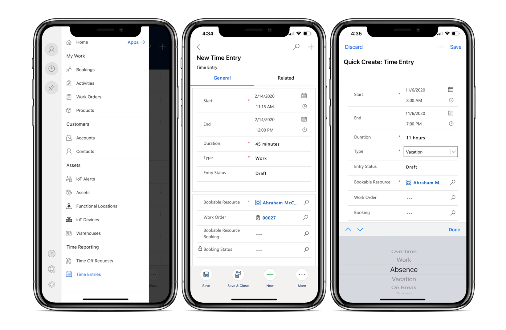
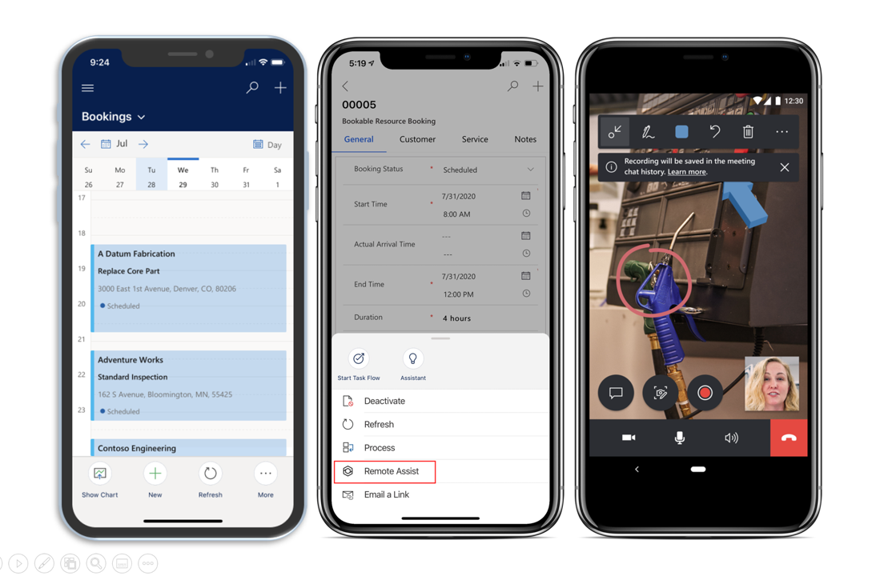
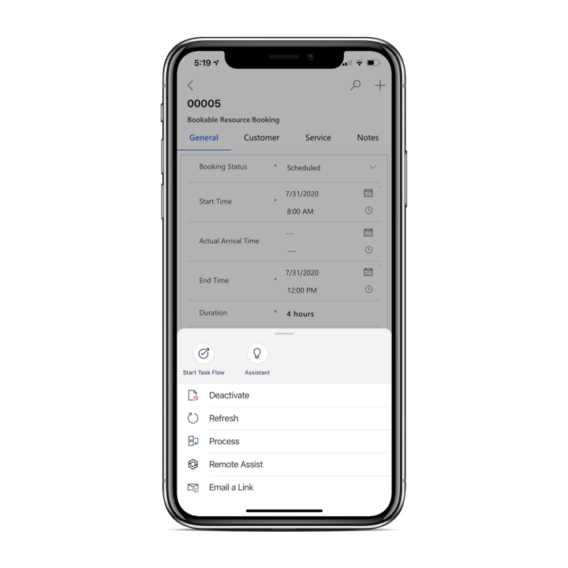

بالإضافة إلى تطبيق ترتيب العمل المذكور مسبقاً وإدارة الجداول وقدرات معالجة الأصول المتوفرة في تطبيق Field Service Mobile، تتوفر الإمكانات الأخرى للعملاء أثناء عملهم في التطبيق.

وتشتمل هذه القدرات الأخرى على ما يلي:

- إدخال الوقت وتتبع إدارته

- إدارة وصيانة أجهزة IoT

- التعامل مع خبراء المجال باستخدام Microsoft Dynamics 365 Remote Assist

## إدخال الوقت

تساعد إمكانات إدخال الوقت في تطبيق Field Service Mobile مؤسسات الخدمة الميدانية بشكل أكثر فاعلية في تتبع الوقت الذي يقضيه العاملون في الخطوط الأمامية في إكمال أوامر العمل والعمل على سيناريوهات أخرى.

تكون إدخالات الوقت مفيدة لما يلي:

- إعطاء التقارير المرتبطة بالوقت المستغرق في المشاريع.

- توفير عرض أفضل لكيفية استخدام الموارد.

- المساعدة في الفواتير والفوترة للخدمة التي يتم تقديمها.

نظراً لأن العاملين في الخطوط الأمامية الذين يعملون في هذا المجال، يمكنهم عرض إدخالات الوقت الحالية وإنشاء إدخالات جديدة مباشرة من تطبيق الهاتف المحمول.

يمكنك إنشاء إدخالات وقت عن طريق تحديد **إدخالات الوقت** من القائمة الرئيسية. في قائمة إدخالات الوقت الخاصة بك، يمكنك استخدام زر **جديد** لإنشاء إدخال وقت جديد. بصرف النظر عن تقديم تفاصيل التاريخ والوقت، ستحتاج أيضاً إلى تحديد ما إذا كان إدخال الوقت يتعلق بالعمل والإجازة والغياب والراحة القصيرة وما إلى ذلك. ستضمن هذه الطريقة تسجيل إدخال الوقت بشكل صحيح سينعكس على نحو دقيق في التقارير.

> [!div class="mx-imgBorder"]
> 

شاهد الفيديو التالي للحصول على عرض توضيحي لإنشاء إدخال وقت في تطبيق Field Service Mobile.

> [!VIDEO https://www.microsoft.com/videoplayer/embed/RE4J6mQ]

## مشغل Dynamics 365 Remote Assist للتعاون عن بعد

تحاول معظم المؤسسات تحديد أفضل شخص لإكمال أمر العمل؛ وعلى الرغم من ذلك، في بعض الأحيان، لا يكون عامل الخط الأمامي متأكداً من كيفية إصلاح صنف معين. في هذه الحالات، قد يرغب العامل في التعامل مع زميل في العمل والذي يعمل في الخطوط الأمامية مع العنصر الذي يعملون فيه. وسوف تلاحظ المؤسسات التي تستخدم Dynamics 365 Remote Assist بأن الموظفين الذين يعملون في الخطوط الأمامية يمكنهم تشغيل ارتباط عميق من أمر العمل لفتح تطبيق الأجهزة المحمولة Dynamics 365 Remote Assist.

تعمل هذه الميزة على تبسيط قدرة العامل على الحصول على المساعدة وتضمن توفر معلومات أمر العمل ذات الصلة في Dynamics 365 Remote Assist. كما يسمح للعامل بإرسال معلومات مكالمة Remote Assist إلى الجدول الزمني لأمر العمل.

> [!div class="mx-imgBorder"]
> 

> [!div class="mx-imgBorder"]
> 

لمزيد من المعلومات، راجع [التعاون في الواقع المختلط باستخدام Field Service وDynamics 365 Remote Assist وHoloLens](/dynamics365/field-service/remote-assist-hololens/?azure-portal=true).
