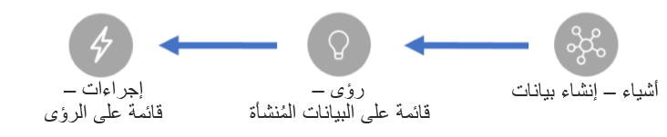
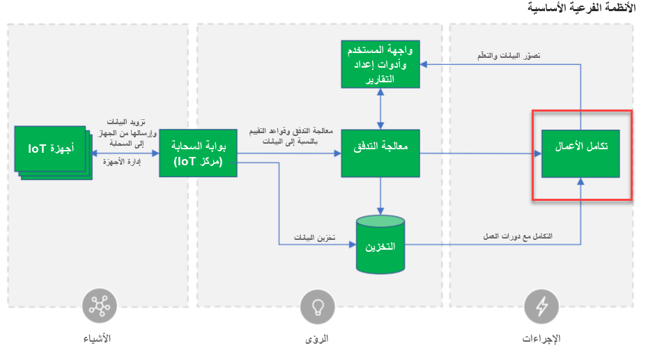

تُعد Connected Field Service حلاً إضافياً لـ Dynamics 365 Field Service الذي يربط بيانات تتبع استخدام IoT بإجراءات العمل. في العديد من الحالات، يسمح ذلك للشركات باتخاذ خطوات استباقية بدلاً من كونها مجرد رد فعل، ويقوم بتحويل نموذج العمل الخاص بآلية عملها مع العملاء.

> [!VIDEO https://www.microsoft.com/videoplayer/embed/RE2DQPr]

في هذه الوحدة النمطية، نتطلع إلى كيفية عمل Connected Field Service مع إمكانات Azure IoT لتنفيذ حل IoT متكامل.

ولعل تغطية الجوانب الثلاث الأساسية التالية هي إحدى الطرق البسيطة للتفكير في حل IoT متكامل:

مع كل هذه الضجة حول IoT، من السهل التركيز على التفاصيل المنخفضة المستوى لتناول بيانات تتبع الاستخدام ونسيان كيفية التعامل مع مشكلة تم اكتشافها والحصول على فني في الموقع لحلها.

## الفحص الاستباقي والتشخيص

تُعد Connected Field Service جزءاً هاماً من الإجراءات استناداً إلى الرؤى. ومن خلال توصيل جهاز IoT بعميل باعتباره أحد أصول العميل، سيسمح ذلك بإنشاء أوامر العمل وإرسال فني.
ويؤدي ذلك إلى إنشاء القدرة على الكشف عن المشكلات وتشخيصها قبل أن يكون العملاء على علم بوجود مشكلة. ويمكن أن يشمل ذلك جدولة زيارة في الموقع بشكل استباقي، أو ببساطة أمراً تلقائياً للجهاز لإعادة التعيين. عندما يقوم الفنيون بزيارة الموقع، يكون لديهم تطبيق Field Service mobile الذي يحتوي على تفاصيل العميل المتعلقة بأمر العمل. تتم جدولة زياراتهم، والمسارات المحسنة باستخدام إمكانات جدولة Dynamics 365 Field Service.

إنّ الرسم التخطيطي التالي للبنية المرجعية لـ IoT في Microsoft Azure يوضح تكامل الأعمال وهو المكان الذي تتناسب فيه Connected Field Service مع هندسة المرجع.

وكجزء من إنشاء حل Connected Field Service بالكامل، يمكنك أيضاً تضمينها في إنشاء الرؤى المتعمقة. على سبيل المثال، قد تقوم بتعديل معالج التدفق للكشف عن الحالات الشاذة في بيانات تتبع الاستخدام. قم بأداء سيناريو حيث تقوم بمراقبة غرفة يتم التحكم فيها باستخدام درجات الحرارة. ومن السهل أن يتم الكشف عن الغرفة بشكل مفاجئ على درجة حرارة كبيرة جداً. ارتفاع قيمة الأعمال هو الحالة التي تستطيع فيها الكشف عن درجة الحرارة التي ترتفع ببطء على مدى فترة ثماني ساعات. وهذا سيتيح لك الحصول على فني يتم إرساله قبل درجة الحرارة التي تسبب مشكلة للعميل.

## التثبيت

عند تكوين الوظيفة الإضافية لـ Connected Field Service، التي ستقوم بإجرائها في الوحدة التالية، ستقوم بنشر مكونات Azure لدعم التوزيع. بالإضافة إلى ذلك، يقوم بتثبيت حل قالب في مجموعة موارد Azure الخاصة بك لمعرفة كيفية اكتشاف الحالات الشاذة ورفع التنبيهات على Dynamics 365 Field Service.

كجزء من تثبيت تطبيق Dynamics 365 Field Service، فإنه يقوم أيضاً بتثبيت الحلول الإضافية لـ Connected Field Service في البيئة التي تقوم بإنشائها في تطبيق Dynamics 365 Field Service. يتم تضمين الكيانات التالية في هذه الحلول وهي مجموعة فرعية رئيسية من الكيانات التي تدعم التكامل مع Azure IoT؛ سيتم التعامل مع هذه الإجراءات أثناء تنفيذ التخصيصات.

| اسم الكيان                     | الوصف                                                         |
|---------------------------------|---------------------------------------------------------------------|
| تنبيه IoT                       | حدث تم إرساله بسبب حدث بارز من بيانات تتبع استخدام IoT Hub. |
| جهاز IoT                      | جهاز متصل يمكن تسجيله في IoT Hub.              |
| فئة جهاز IoT             | تجميع الأجهزة                                               |
| أمر جهاز IoT              | يمثل رسالة صادرة إلى جهاز متصل بـ IoT Hub                |
| محفوظات تسجيل أجهزة IoT | حالة محفوظات تسجيل أجهزة IoT                |

يقوم الحل أيضاً بتثبيت عدد من مهام سير العمل والإجراءات التي يمكن استخدامها لتنفيذ العمل تلقائياً أثناء تخصيص حل Connected Field Service.

في الوحدة التالية، سنقوم بالنظر إلى خيارات النشر وكيفية اختيار ما يناسب الحل الخاص بك.
