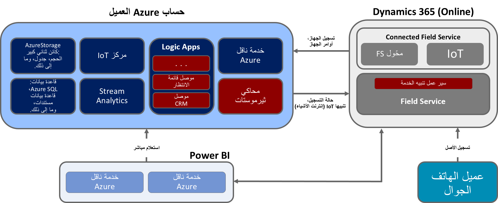

جزء مهم من تصميم حل Connected Field Service هو اختيار نهج النشر الأساسي. وهناك حالياً ثلاثة نهج أولية للاختيار من بينها. جميعها تستخدم Azure IoT للاتصال الآمن الثنائي الاتجاه مع أجهزه IoT المتصلة. وفيما يلي النهج ووصف موجز عنه.

-   **قالب Connected Field Service:** هذا هو الإعداد الافتراضي عند تثبيت Connected Field Service، ويتضمن تطبيق قالب يستند إلى سيناريو عام خاص بدرجات الحرارة. يقوم النشر الافتراضي بإنشاء مركز Azure IoT والتشغيل التلقائي باستخدام Logic Apps لتسجيل الأجهزة ورفع التنبيهات إلى Dynamics 365 Field Service. يتم استخدام Stream Analytics للكشف عن الحالات الشاذة. يمكن تخصيص المكونات وتكييفها مع السيناريو الخاص بك.

-   **مسرعات حلول Azure IoT**: وهي عبارة عن مجموعة من حلول IoT الجاهزة للنشر للسيناريوهات الشائعة مثل المراقبة عن بعد والصيانة التنبؤية. أنّ مصدر التعليمات البرمجية للحل هو المصدر المفتوح وGitHub. يمكنك تخصيص المسرع ليتوافق مع متطلباتك. حالياً، لا تعمل أي من هذه المسرعات مباشرةً مع مكونات Connected Field Service ولكن يمكن أن يتم تكييفها عن طريق تخصيصها لتكون مثل تطبيق قالب Connected Field Service في كيفية التحدث إلى Dynamics 365 Field Service.

-   **Azure IoT Central:** هذا هو حل البرمجيات كخدمة (SaaS) الذي يقوم باستخراج العديد من المكونات منخفضة المستوى لحل IoT في نهج يستند إلى نموذج قابل للتخصيص. تم تكوين الحل في IoT Central بمستوى مماثل من التجريد كما هو الحال في تطبيقات Dynamics 365. يمكن استخدام IoT Central مع Connected Field Service عن طريق تشغيل تدفقات Power Automate التي تقوم بإنشاء تنبيهات تتدفق إلى عمليات Connected Field Service.

لفهم أفضل للمفاضلة، يعرض الجدول التالي مقارنة بين النهج المختلفة. نظراً لأن قالب Connected Field Service ومسرعات حلول IoT Azure تشترك في العديد من الخصائص نفسها التي نقارنها، فقد قمنا بتضمينها في العمود نفسه.

| ‏‫الخصائص                     | IoT Central                                                                                                                                  | قالب Connected Field Service/مسرعات حل Azure                                                                                           |
|------------------------------------|----------------------------------------------------------------------------------------------------------------------------------------------|----------------------------------------------------------------------------------------------------------------------------------------------------------|
| الاستخدام الأساسي                      | لتسريع الوقت للتسويق لحلول IoT المباشرة التي لا تتطلب تخصيصاً عميقاً للخدمة.                                | لتسريع تطوير حل IoT مخصص يحتاج إلى أقصى قدر من المرونة.                                                                       |
| الوصول إلى خدمات PaaS الأساسية | SaaS. الحل المدار بالكامل، لا يتم كشف الخدمات الأساسية.                                                                       | يمكنك الوصول إلى خدمات Azure الأساسية لإدارتها أو استبدالها حسب الحاجة.                                                               |
| المرونة                        | يمكنك استخدام تجربة المستخدم المستندة إلى المستعرض لتخصيص طراز الحل وجوانب واجهة المستخدم. البنية التحتية غير قابلة للتخصيص. | تتوفر الأكواد الخاصة بالمكونات ويمكنك تعديلها بأية طريقة ترغب فيها. بالإضافة إلى ذلك، يمكنك تخصيص البنية الأساسية للتوزيع. |
| مستوى المهارة                        | تشبه تخصيصات Dynamics 365.                                                                                                       | يتطلب مهارات المطور لتخصيص العديد من المكونات التي تقوم بإنشاء الرؤى.                                                                |
| التسعير                            | بنية تسعير بسيطة ومتوقعة.                                                                                                       | يمكن ضبطه بشكل جيد على مستوى المكون لإدارة التكلفة.                                                                                                 |

يوضح الرسم التخطيطي التالي المكونات التي تم تكوينها كجزء من قالب Connected Field Service عندما تقوم بنشر الوظيفة الإضافية لـ Connected Field Service والتي ستقوم بها في الوحدة التالية.

ويتم تكوين هذه المكونات مسبقاً لدعم سيناريو يستند إلى درجة الحرارة. عندما تكون درجة الحرارة خارج النطاق المقبول، يتم إنشاء تنبيه IoT وإرساله إلى Dynamics 365 Field Service. كجزء من استخدام هذا القالب، من المحتمل أن تقوم بتخصيص وظائف Logic Apps وStream Analytics لدعم متطلباتك الفريدة. إذا كنت تستخدمه مع أحد مسرعات حلول Azure IoT، ستقوم بنشر ذلك أولاً ثم الاتصال بمركز IoT الموجود أثناء عملية النشر. إذا كنت تستخدم Azure IoT Central، فلن تقوم بنشر أصول Azure نظراً لأن Azure IoT Central تتضمنها عند توفير التطبيق الخاص بك.

في الوحدة التالية، ستقوم بنشر Connected Field Service باستخدام القالب الافتراضي.
