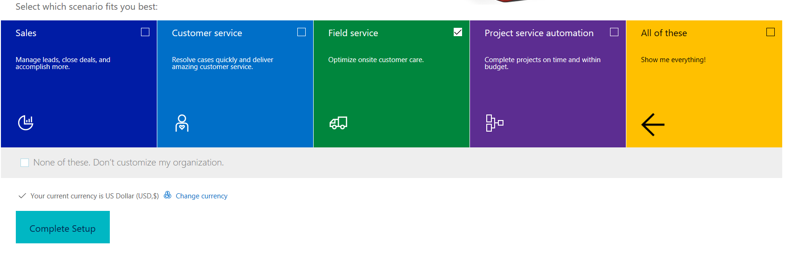
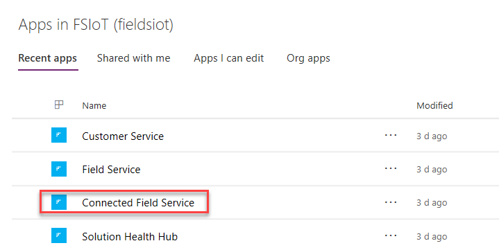
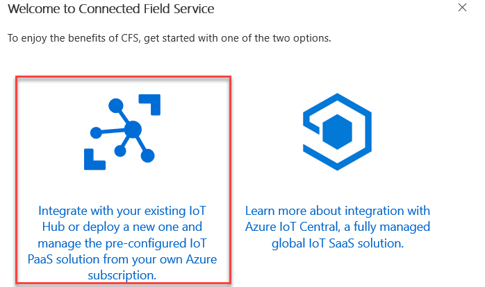
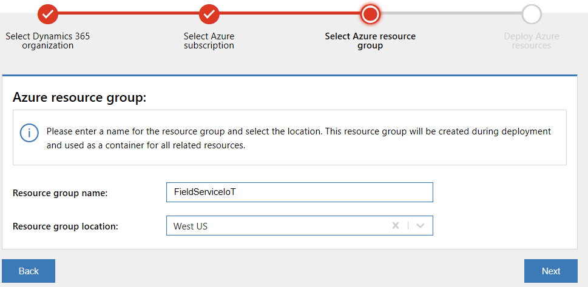
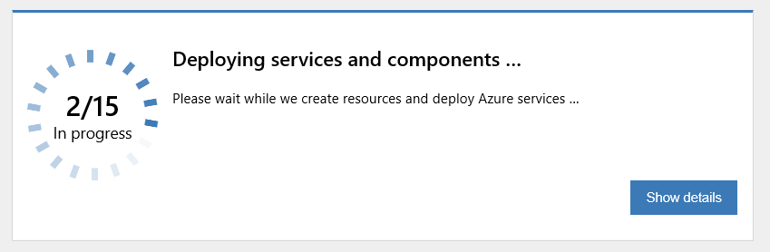
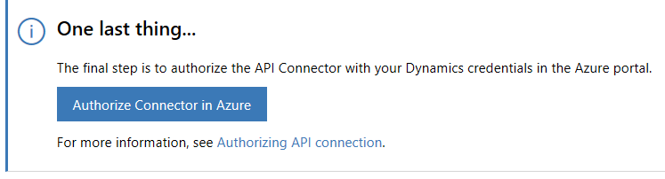
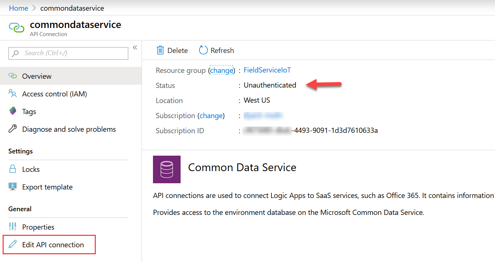

يتكون كل تدريب من سيناريو وأهداف تعليمية، ويصف السيناريو الغرض من التدريبات، بينما يتم سرد الأهداف ولها نقاط.

إنشاء إصدار تجريبي، أو الحصول علي مستأجر تجريبي أو إعادة تعيين بيئة اختبار موجودة وتكوينه لـ Field Service.  يؤدي هذا إلى تثبيت تطبيق Dynamics 365 Field Service.  من هذا التوزيع الأساسي، ستقوم بتكوين الوظيفة الإضافية Connected Field Service.  تأكد من تمكين عينة البيانات في بيئة المعمل.

ستتطلب المعامل أيضاً اشتراك Azure ويكون أسهل إذا كان في نفس المستأجر مثل بيئة Dynamics 365 الخاصة بك. من الممكن استخدام اشتراك في مستأجر مختلف ولكنه يتطلب خطوات إضافية غير موثقة في المعامل.

من المهم ألا تكمل هذه التمارين في بيئة التشغيل الخاصة بك. قم دائماً بإجراء هذه الميزات الاختبارية في مثيل من نوع العرض التوضيحي أو وضع الحماية.

قد يستغرق هذا ما يصل إلى 30 دقيقة.

> [!NOTE]
> راجع [خيارات الإعداد](/power-platform/admin/try-powerapps-dynamics-365/?azure-portal=true) للحصول على بيئة واختيار التطبيقات المستندة إلى نموذج في خيار الإصدار التجريبي من Dynamics 365.

يتكون كل تدريب من سيناريو وأهداف تعليمية، ويصف السيناريو الغرض من التدريبات، بينما يتم سرد الأهداف ولها نقاط.

1.  انتقل إلى [Power Apps](https://make.powerapps.com) وتأكد من أنك لست في البيئة الافتراضية. سيكون للبيئة الافتراضية اسم البيئة الخاصة بك مع (افتراضي) كلاحقة. تريد اختيار البيئة الأخرى التي قمت بتكوينها للتو. في بعض الحالات، قد يستغرق الأمر بعض الوقت حتى تظهر البيئة الجديدة في القائمة.

2.  حدد **التطبيقات**، وانقر لفتح تطبيق **Connected Field Service**.

    

3.  يجب أن ترى نافذة منبثقة تحتوي على **مرحبًا بك في رسالة Connected Field**
    **Service**. انقر فوق **تكامل**.

    

4.  قم بتوفير بيانات اعتماد **Azure** وتسجيل الدخول.

5.  انقر فوق **قبول**.

6.  راجع **شروط الخدمة** وكذلك **بيان الخصوصية** **وقم بالقبول** إذا وافقت علي ذلك.

7.  حدد مؤسستك وانقر فوق **التالي**.

8.  حدد **اشتراك Azure** وانقر فوق **التالي**. 

    > [!NOTE]
    > إذا تلقيت الرسالة أنه لا توجد اشتراكات، فيمكنك التسجيل للحصول على الإصدار التجريبي مباشرة من هناك أو يمكنك تسجيل الدخول إلى حساب مختلف إذا كنت تريد استخدام اشتراك Azure في مستأجر مختلف.

9.  قم بتوفير **FieldServiceIoT** كاسم **مجموعة الموارد**، وحدد **موقع المجموعة** وانقر فوق **التالي**.

    

10. انقر فوق **توزيع**.

11. يجب أن يبدأ التوزيع.

12. انتظر حتى يكتمل التوزيع. يجب الحصول علي تحديث حالة التقدم، انقر فوق إظهار التفاصيل. قد يستغرق هذا ما يصل إلى 10 دقائق.

    

13. تأكد من نجاح التوزيع قبل المتابعة إلى الخطوات التالية.

14. انقر فوق **تخويل الموصل في Azure**.

    

15. قم بتسجيل الدخول باستخدام بيانات اعتماد Azure الخاصة بك وسيتم الانتقال إلى بوابة Azure.

16. انقر فوق **تحرير اتصال API** في شريط التنقل الأيمن.

    

17. انقر فوق **تخويل**.

18. سجّل الدخول باستخدام بيانات اعتماد Dynamics 365.

19. انقر فوق **حفظ**.

20. لقد أكملت الآن تثبيت Connected Field Service. يمكنك الآن تنزيل وتوزيع بعض [بيانات العرض التوضيحي](https://www.microsoft.com/download/details.aspx?id=55320). 
