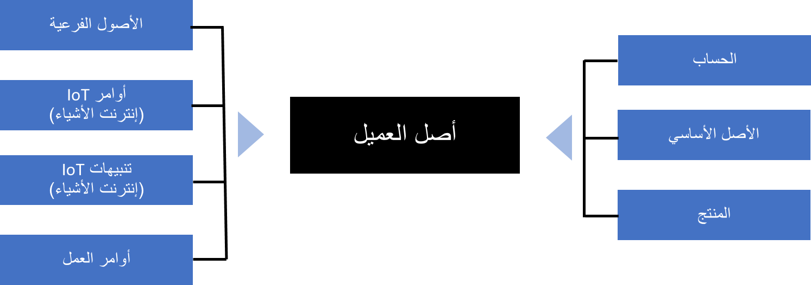
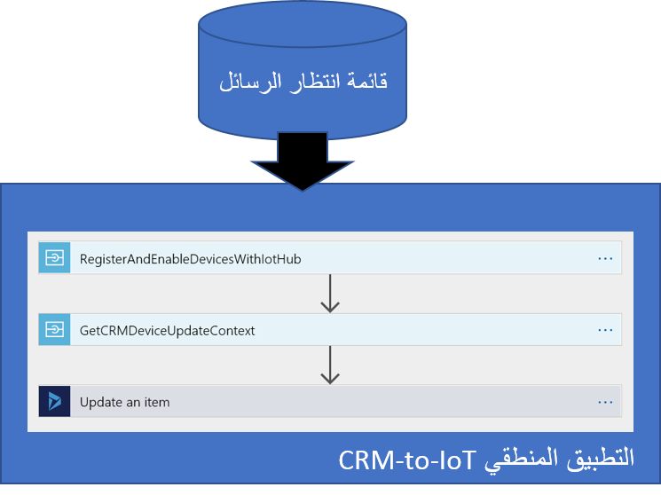
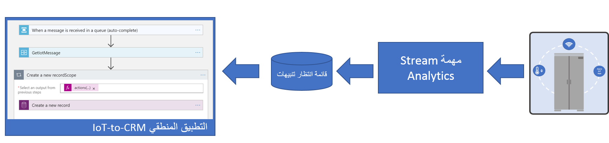
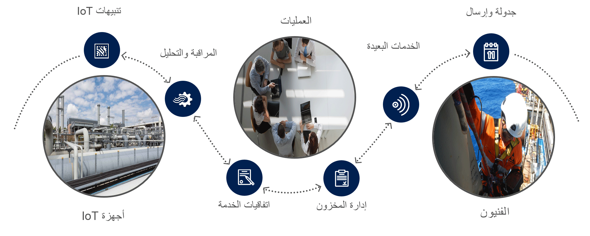

الآن بعد إكمال عملية توزيع وظيفة Connected Field Service الإضافية، فإن الخطوة التالية هي إلقاء نظرة على كيفية تسجيل جهاز ودمج بيانات Dynamics 365 مع أجهزة Azure IoT Hub.

ويتم إجراء ذلك عن طريق إنشاء سجل أصل العميل في Dynamics 365 ثم تشغيل عملية التسجيل. يوضح الرسم التخطيطي التالي كيف يكون أصل العميل في مركز دمج جهاز متصل في عملية Dynamics 365 Field Service.

## تسجيل الأصول

عند تحديد أصل العميل، يمكنك معالجة مجموعة متنوعة من السيناريوهات بما في ذلك الأصول التي تحتوي على أجزاء متعددة. ويمكن تكوينها باستخدام الاتصالات لتأسيس العلاقة مع أصل العميل.
كما يمكن تصنيف أصول العميل للسماح بالإدارة والإرسال المجمع للأوامر بشكل أسهل.

بمجرد إنشاء أصل العميل والنقر على زر تسجيل، يتم إرسال رسالة إلى قائمة انتظار ناقل خدمة Azure لطلب التسجيل باستخدام Azure IoT Hub المقترن. يقوم ذلك بتشغيل تطبيق Logic App الذي يتم توفيره كجزء من قالب Connected Field Service الذي يتم نشره. يتحدث تطبيق Logic إلى Azure IoT Hub ويقوم بتسجيل الجهاز ثم يعود إلى Dynamics 365 لتحديث حالة التسجيل.

باستخدام الجهاز المسجل، يمكن الآن استيعاب قياس تتبع الاستخدام وتقييمه بحثاً عن عيوب. يقوم تطبيق قالب Connected Field Service بذلك باستخدام وظيفة Stream Analytics التي تعالج قياس تتبع الاستخدام الأولية. تقوم الوظيفة بتقييم البيانات الواردة الخاصة بدرجات الحرارة التي تزيد عن درجة الحرارة المرجعية. تذكر أن هذه ليست سوى قواعد البداية في النموذج التي يمكنك تخصيصها لتضمين أي منطق اكتشاف مناسب للسيناريو الخاص بك. بالنسبة لبعض السيناريوهات، قد تجد هذه مثالاً جيداً لإلهامك لإنشاء تدفق الوظائف وLogic Apps المرتبطة به. في الحقيقة، يمكن استبدال هذه الخدمات بخدمة صغيرة تقوم بالرفع الثقيل كما ترى في بعض مسرعات حلول Azure IoT.

## تدفق بيانات تتبع الاستخدام

يُظهر الرسم التخطيطي التالي التدفق الإجمالي لقياس تتبع الاستخدام أثناء تقييمه وتحويله إلى تنبيه IoT في Dynamics 365. عندما يتم تجاوز درجة الحرارة، يتم وضع رسالة في صف انتظار في قائمة انتظار ناقل الخدمة. يتم استلام هذا بواسطة Logic App الذي يقوم بإنشاء سجل تنبيه IoT الفعلي في Dynamics 365.

وبمجرد تلقي تنبيه IoT داخل Dynamics 365، يمكن تقييمه إما يدوياً عن طريق وضعه في قائمة انتظار للمراجعة البشرية أو الأتمتة عن طريق القيام أولاً بمحاولة أمر تصحيحي على الجهاز. يمكن للأوامر المرسلة إلى الجهاز تنفيذ إجراءات مثل إعادة التعيين أو إرسال إخطار أو أي أمر مخصص آخر يتوقع الجهاز تلقيه. يمكن أيضاً ضبط إعدادات الجهاز لتلائم البيئات المتغيرة على الجهاز البعيد. ومن هناك يمكن إنشاء عملية تجارية مخصصة لتحديد الفرز وإرسال فني حسب الحاجة. ستتم مطابقة الفني وتخصيصه باستخدام لوحة جدولة Dynamics 365 Field Service القياسية.

في الوحدة التالية، ستقوم بتسجيل جهاز محاكاة والتفاعل مع المحاكي لرؤية التنبيه الذي تم إنشاؤه وإرساله إلى Dynamics 365.
