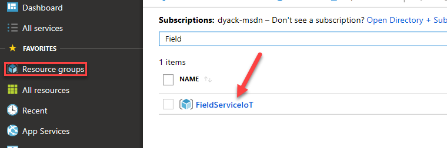

## تدريب 1: تكوين المحاكي  

في هذا التدريب، ستقوم بتكوين المحاكي للعمل مع تطبيق Field Service الخاص بك.

يتكون كل تدريب من سيناريو وأهداف تعليمية، ويصف السيناريو الغرض من التدريبات، بينما يتم سرد الأهداف ولها نقاط.

1.  انتقل إلى مدخل Azure الخاص بك، وحدد مجموعات الموارد، ثم افتح مجموعة الموارد التي قمت بإنشائها عند نشر Connected Field Service.

    

2.  قم بتحديد الموقع والنقر على **SimulatorFieldServiceIoTXXXX** الخاص بنوع المورد **خدمة التطبيق**.

    

3.  انقر فوق عنوان **URL**.

    

4.  تحديد **اتصال**.

    

5.  قم بالرجوع إلى **بوابة Azure**، حدد **مجموعة الموارد** التي قمن بإنشائها وانقر فوق نوع المورد **IoT Hub**.

    

6.  قم بنسخ **اسم المضيف**.

    

7.  قم بالرجوع إلى المحاكي وقم بلصق **اسم المضيف** في حقل **الضيف**.

    

8.  قم بالرجوع إلى بوابة **Azure** وتأكد من تحديد **IoT Hub**.

9.  تحديد **سياسات الوصول المشتركة**.

    

10. انقر فوق **مالك IoT Hub**.

11. قم بنسخ **المفتاح الأساسي**.

    

12. قم بالرجوع إلى المحاكي وقم بلصق **المفتاح الأساسي** في حقل **المفتاح** وانقر فوق **اتصال**.

13. قم بالنقر على القائمة المنسدلة **معرف الجهاز**. ستلاحظ أنه لم يتم تسجيل أي جهز حالياً، وسوف تقوم بتسجيل الجهاز في التدريب التالي. **لا تقم بإغلاق نافذة المستعرض.**

## تدريب 2: تسجيل جهاز 

في هذا التدريب، ستقوم بإنشاء أصل للعميل، وبعد ذلك ستقوم بتسجيل جهاز باستخدام Azure IoT Hub. ستقوم بعد ذلك بمعالجة الجهاز ليتسبب في إنشاء تنبيه IoT في Dynamics 365. وبإكمال ذلك، ستتحقق من أن عملية نشر Connected Field Service تعمل.

يتكون كل تدريب من سيناريو وأهداف تعليمية، ويصف السيناريو الغرض من التدريبات، بينما يتم سرد الأهداف ولها نقاط.

1.  انتقل إلى [Power Apps](https://make.powerapps.com//?azure-portal=true) وتأكد من أنك في البيئة الصحيحة.

2.  حدد **التطبيقات**، وانقر لفتح تطبيق **Connected Field Service**.

3.  حدد **أصول العميل** وانقر فوق **جديد**.

4.  قم بإدخال **محاكي الثيرموستات الخاص بك** **للاسم** وحدد **A. Datum** **للحساب** وقم بالنقر على **حفظ**.

    

5.  بعد حفظ السجل، يجب أن تكون قادراً على رؤية مزيد من أقسام النموذج. قم بالتمرير لأسفل إلى قسم **سمات** **الجهاز المتصل**.

6.  قم بإدخال **MyThermSim1** إلى **معرف الجهاز** ثم انقر فوق **حفظ**. ولا بأس إذا اختفى **معرف الجهاز** بعد حفظ البيانات. ستتمكن من رؤية النتائج المتوقعة بعد تسجيل الجهاز.

7.  انقر فوق **تسجيل الأجهزة**.

8.  انقر فوق **موافق**.

9.  في قسم **الأجهزة المتصلة** انقر فوق **تحديث**.

10. يجب أن ترى تقدم تسجيل الجهاز. في البداية، تكون حالة التسجيل هي "قيد التقدم".

11. قم بالتحديث حتى يتم تسجيل الجهاز.

12. قم بالرجوع إلى المحاكي وانقر فوق **تحديث**. يجب أن تكون الآن قادراً على رؤية الجهاز في القائمة المنسدلة.

    

13. انقر فوق القائمة المنسدلة وحدد الجهاز الذي قمت بتسجيله.

    

14. قم بتغيير درجة الحرارة إلى 86.

15. ستحتوي **الرسالة المرسلة** على درجة الحرارة والرطوبة.

16. قم بالرجوع إلى تطبيق **Connected Field Service** وقم بفتح أصل العميل الذي قمت بإنشائه.

17. انقر فوق **مرتبط** وقم بتحديد **تنبيهات ‎IoT**.

18. يجب أن ترى تنبيهاً تم إنشاؤه بواسطة المحاكي بخصوص تجاوز حد درجة الحرارة.

    
