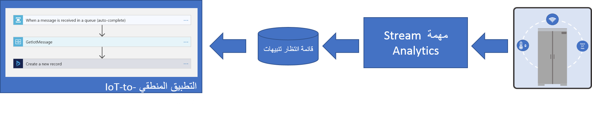
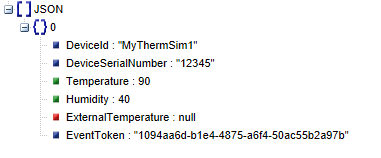
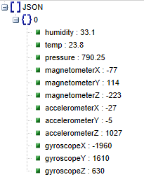
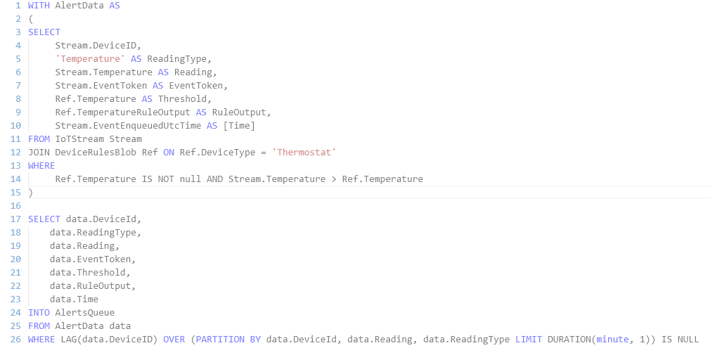
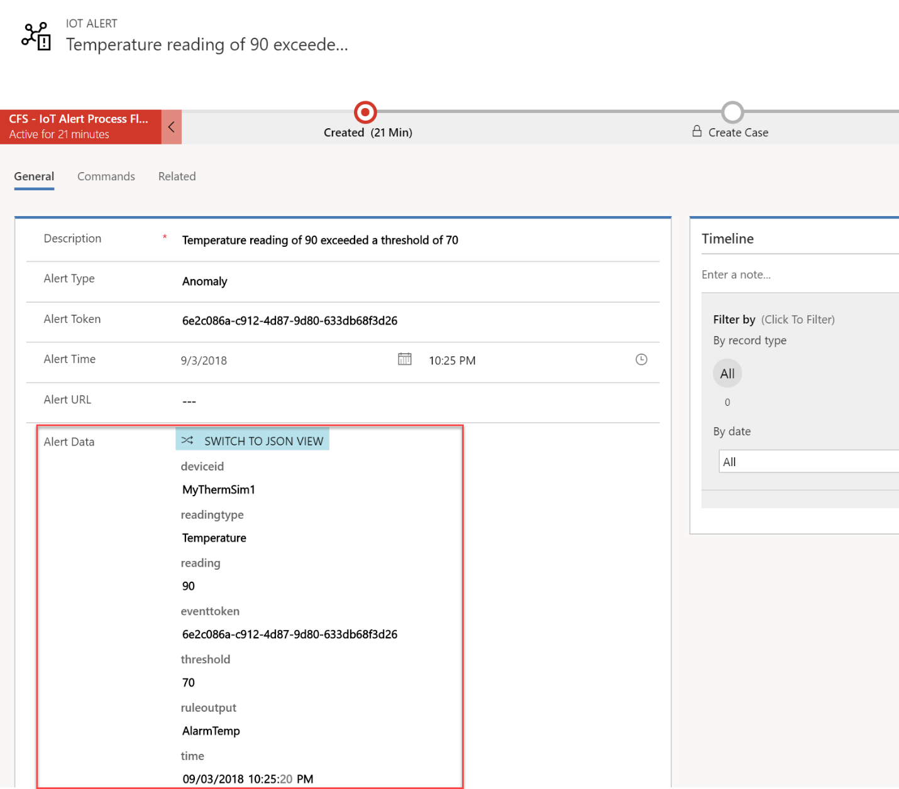

يُعد تحديد الحالات الشاذة وتصعيدها إلى التطبيق حيث يمكن اتخاذ إجراء بشأنها هو أحد الجوانب الهامة لتطبيق Connected Field Service. عند تكوين الوظيفة الإضافية في Connected Field Service من Dynamics 365 Field Service، فإنها تتضمن تطبيق قالب تم بناؤه مسبقاً والذي يستخدم سيناريو مستند إلى درجة الحرارة مع تنسيق محدد من البيانات الواردة من جهاز IoT. يستخدم هذا القالب أيضاً قواعد ثابتة للكشف عن الحالات الشاذة. في هذه الوحدة، سوف نبحث في كيفية تخصيص مكونات القالب للتعامل مع المتطلبات الفريدة للسيناريو الخاص بك. ويشمل ذلك تسليم بيانات مختلفة يتم إرسالها من الجهاز بالإضافة إلى تغيير القواعد المستخدمة لتقييم البيانات وإنشاء تنبيهات IoT.

> [!VIDEO https://www.microsoft.com/videoplayer/embed/RE2EbBx]

فيما يلي البنية المستخدمة من قِبل المكونات الافتراضية المثبتة مع الوظيفة الإضافية لـ Connected Field Service. يتم تقييم بيانات القياس عن بُعد من الجهاز بواسطة مهمة Azure Stream Analytics للاستثناءات الخاصة بالقواعد الثابتة.

عند تكوين الوظيفة الإضافية، يقوم التطبيق المحاكي بإنشاء بيانات الجهاز التالية التي يتم استهلاكها بواسطة مهمة تحليل Azure Stream Analytics.

في الوحدة التالية، ستقوم بالاتصال بأحد الأجهزة الحقيقية باستخدام Azure IoT DevKit مع تثبيت البرنامج الثابت IoT Central. باستخدام هذا البرنامج الثابت، سيقوم الجهاز بإنشاء البيانات التالية.

باستخدام المقارنة السريعة، ستجد بعض الاختلافات الملحوظة.
تكون كافة سمات البيانات في JSON بأحرف صغيرة، وتكون درجة الحرارة الآن مؤقتة أيضاً. يتم الإبلاغ عن درجة الحرارة الآن بالمئوية، وليس فهرنهايت. يحتوي الجهاز الحقيقي أيضاً على مزيد من أدوات الاستشعار ويتم تكوينه لإرسال مزيد من البيانات. لن تؤثر البيانات الإضافية في مكونات القالب الحالي، ولكن يمكن تحسينها لاستخدام تلك البيانات أيضاً.

فيما يلي استعلام Stream Analytics الافتراضي، حتى يمكنك مشاهدة كيفية تحويل البيانات حالياً.

عندما تتم معالجة البيانات بواسطة مهمة Stream Analytics ويتم إنشاء بعض البيانات الأولية عبر تنبيه IoT بالإضافة إلى بعض البيانات المعززة من القاعدة التي يتم تعبئتها كبيانات تنبيه على تنبيه IoT في سجل Dynamics 365.
يمكنك البدء في رؤية كيف سنحتاج إلى تعديل هذا الاستعلام لاستيعاب الاختلافات بين جهاز المحاكاة والجهاز الحقيقي.

يمكن تقييم خصائص بيانات التنبيه كجزء من أي أتمتة يتم تنفيذها بمجرد إنشاء سجل تنبيه IoT. عند النظر إلى السيناريو الفريد، يجب عليك مراعاة البيانات التي يجب ترقيتها من القياس عن بُعد للجهاز إلى بيانات التنبيه.

بالإضافة إلى النظر إلى التنبيهات، قد ترغب في تخزين البيانات المفصلة للقياس عن بُعد، حتى تتمكن من التمرير لأسفل كجزء من تشخيص تنبيه. يستخدم القالب الافتراضي قاعدة بيانات Azure SQL المدمجة مع Power BI لمنحك نظرة في الوقت الفعلي على النشاط من أجهزتك. سنقوم لاحقاً في هذه الوحدة النمطية بالاطلاع على العديد من الخيارات لتخزين بيانات القياس عن بُعد التفصيلية.

في الوحدة التالية، ستقوم بإعداد الجهاز ثم سنقوم لاحقاً بتعديل القالب الافتراضي لالتقاط تنسيق البيانات الجديد.
