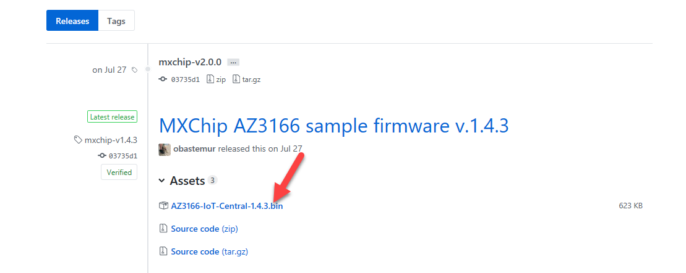
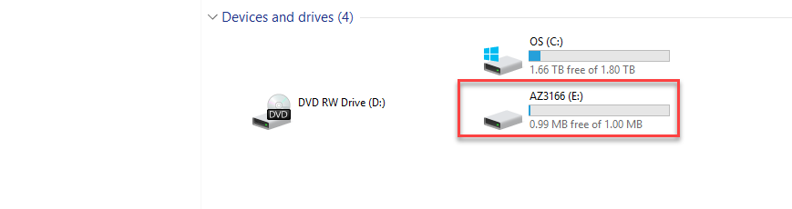
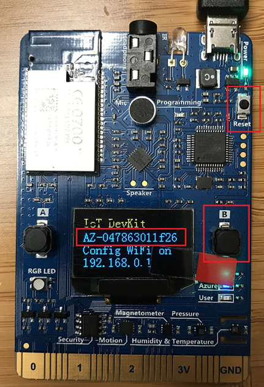
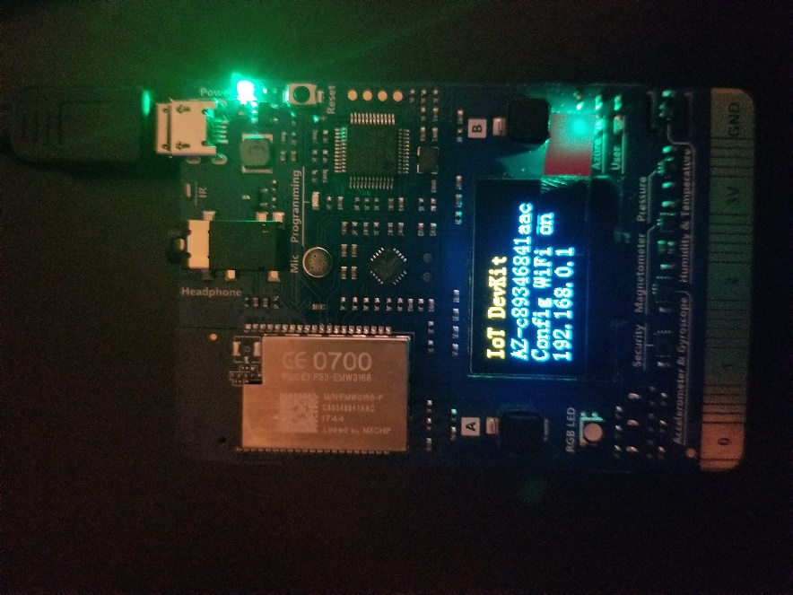
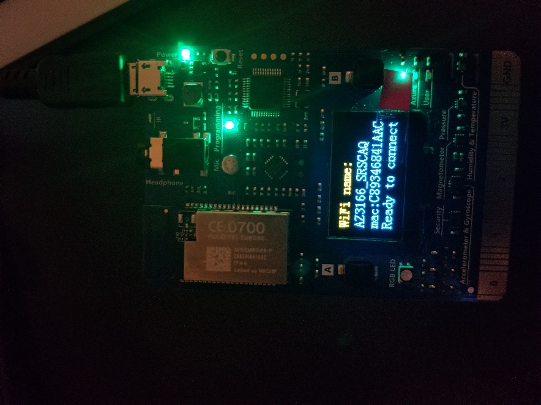
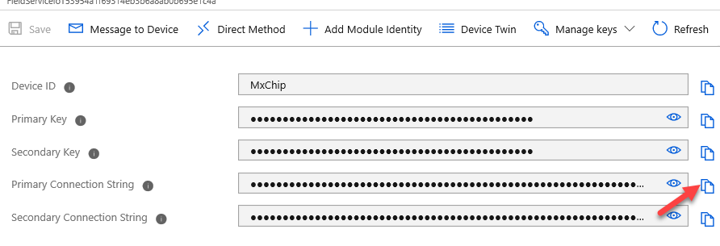
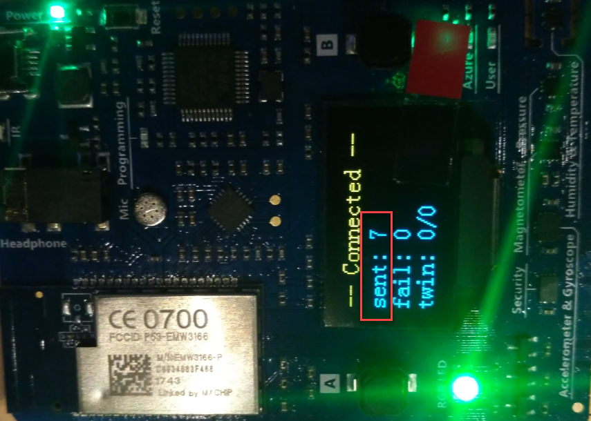
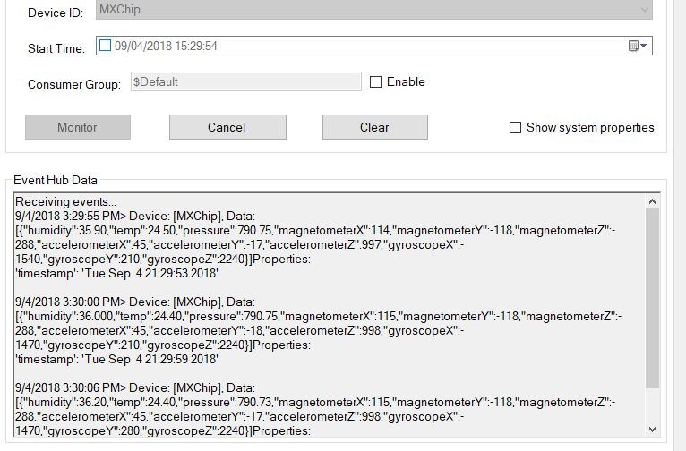

## تدريب 1: تكوين الجهاز الفعلي 

في هذا التدريب، ستتعرف على إعداد MXChip IoT DevKit. يُعد MXChip IoT DevKit (المعروف أيضاً باسم DevKit) هو جهاز IoT شامل، يمكنك استخدامه لتطوير حلول تكنولوجيا المعلومات والنماذج الأولية التي تستفيد من خدمات Microsoft Azure.

وهو يشتمل على لوحة تطوير متوافقة مع Arduino مع أجهزة طرفية وأجهزة استشعار غنية، وحزمة لوحة مفتوحة المصدر، وكتالوج مشاريع متزايدة.

للشروع في البدء مع شراء MXChip IoT DevKit، قم بزيارة [https://aka.ms/iot-devkit/](https://aka.ms/iot-devkit/?azure-portal=true) ثم انقر فوق الحصول على المجموعة.

### المهمة 1: إنشاء الجهاز وتسجيله

في هذه المهمة، ستقوم بإنشاء أصل جديد للعميل وتسجيله.

1.  انتقل إلى [Power Apps](https://make.powerapps.com/?azure-portal=true) وتأكد من أنك في البيئة الصحيحة.

1.  حدد **التطبيقات**، وانقر لفتح تطبيق **Connected Field Service**.

1.  حدد **أصول العميل** وانقر فوق **+** **جديد**.

1.  أدخِل MxChip IoT للاسم، وحدد Adventure Works للحساب ثم انقر فوق حفظ.

1.  قم بالتمرير وأدخِل **MxChip‎** في **معرّف الجهاز** وانقر فوق **حفظ** مرة أخرى.

1.  انقر فوق تسجيل الأجهزة.

1.  انقر فوق موافق.

### المهمة 2: برامج Flash الثابتة

1.  قم بتنزيل أحدث البرامج الثابتة IoT Central Microsoftسابقة الإنشاء لـ MXChip من صفحة الإصدارات على [GitHub ](https://github.com/Azure/iot-central-firmware/releases/?azure-portal=true).

1.  حدد **AZ3166-IoT-Central-x.x.x.bin**.

    

1.  حفظ الملف محلياً.

1.  قم بتوصيل جهاز **DevKit** بجهاز التطوير باستخدام كبل USB.

1.  في Windows، يتم فتح نافذة مستكشف الملفات على محرك أقراص تم تعيينه للتخزين على جهاز DevKit. على سبيل المثال، قد يُطلق على محرك الأقراص اسم AZ3166 (E:).

    

1.  اسحب ملف AZ3166-IoT-Central-X.X.X.bin إلى نافذة محرك الأقراص.

1.  عند اكتمال النسخ، سيتم إعادة تشغيل الجهاز باستخدام البرنامج الثابت الجديد.

### المهمة 3: تكوين Wi-Fi

بعد إعادة تشغيل الجهاز، تحتاج إلى تكوين شبكة Wi-Fi على الجهاز.

1.  اضغط باستمرار على الزر B. بينما لا تزال تضغط على الزر B، اضغط زر إعادة التعيين ثم حرره. ثم حرر الزر B.

    

1.  يدخل DevKit في وضع AP لتكوين Wi-Fi. تعرض الشاشة معرف مجموعة الخدمات (SSID) لجهاز DevKit وعنوان IP لمدخل التكوين:

    

    إذا بدأ Wi-Fi SSID الخاص بك بـ AZ وليس AZ3166 بعد تطبيق البرنامج الثابت، فأنت بحاجة إلى اتباع الخطوات التالية للتأكد من تطبيق البرنامج الثابت بشكل صحيح.
    
    **ضار - لم يتم تطبيق البرامج الثابتة بشكل صحيح**  
    
    
    
    **جيد - تم تطبيق البرامج الثابتة بشكل صحيح**
    
    
    
    -   انقر فوق إعادة تعيين في AZ3166
    
    -   اضغط باستمرار على الزر A + B وستتم إعادة تعيين AZ3166.
    
    -   اضغط على إعادة التعيين
    
    -   إزالة من مصدر الطاقة
    
    -   وضع AZ3166 في نمط AP
    
    -   إذا كان SSID هو AZ3166_XXXXXX، فسيتم تطبيق البرنامج الثابت بشكل صحيح.
    
    -   إذا كان SSID لا يزال يعرض AZ-XXXXXXXXXX، فيرجى الرجوع إلى [IoT DevKit](https://microsoft.github.io/azure-iot-developer-kit/docs/use-configuration-mode/?azure-portal=true) واستخدام SSH لتحديث سلسلة اتصال IoT Hub.

1.  انتقل إلى مدخل **Azure**، وحدد **كافة الموارد** وانقر لفتح **IoT Hub**.

1.  حدد **أجهزة IoT** وافتح الجهاز الذي قمت بتسجيله.

1.  انسخ **سلسلة الاتصال الأساسية**.

    

1.  استخدم جهاز آخر يدعم Wi-Fi (مثل الكمبيوتر أو الهاتف المحمول) للاتصال بـ DevKit SSID. حدد موقع AZ3166 ثم انقر فوق "اتصال".

1.  انتظر حتى يتم توصيل الجهاز.

1.  قم بلصق `http://192.168.0.1/start` في متصفحك الخاص و`<enter>`.

1.  حدد شبكة Wi-Fi التي تريد الانضمام إليها وأدخِل كلمة مرور Wi-Fi.

1. قم بلصق **سلسلة الاتصال** التي قمت بنسخها.

1. احصل على **رمز رقم المعرّف الشخصي** من الجهاز وأدخله في حقل رمز رقم المعرّف الشخصي (PIN) للجهاز.

1. حدد خيارات كل بيانات تتبع الاستخدام ثم انقر فوق "تكوين جهاز".

1. ستتم مطالبتك بإعادة تعيين الجهاز.

1. اضغط على زر **إعادة تعيين** الموجود على الجهاز.

1. ستتم إعادة تعيين الجهاز وتوصيله. انتظر حتى ترى الرسائل يتم إرسالها إلى IoT Hub.

    

1. تم تكوين جهازك المادي الآن للاتصال بـ **Azure IoT Hub**.

## التدريب 2: استخدام مستكشف الأجهزة 

### المهمة 1: تنزيل مستكشف الأجهزة وتثبيته

1.  انتقل إلى [Microsoft Azure مركز SDK IoT لإصدار C# 2019-9-12](https://github.com/Azure/azure-iot-sdk-csharp/releases/?azure-portal=true). 

1.  قم بالتمرير إلى أسفل لتحديد موقع **SetupDeviceExplorer.msi** وقم بالنقر عليه.

1.  انقر فوق **تشغيل**.

1.  انقر فوق **التالي**.

1.  أكمل عملية التثبيت وانقر فوق إغلاق.

### المهمة 2: الاتصال

1.  انتقل إلى **مدخل Azure** الخاص بك وافتح **مركز IoT** مرة أخرى.

1.  حدد **سياسة الوصول المشترك** وانقر فوق **iothubowner**.

1.  انسخ **سلسلة الاتصال - المفتاح الأساسي**.

1.  قم بتشغيل **مستكشف الأجهزة** الذي تم تثبيته على جهازك.

1.  الصق سلسلة الاتصال وانقر فوق تحديث.

1.  انقر فوق موافق.

1.  حدد علامة تبويب **البيانات** وانقر فوق **مراقبة**.

1.  يجب أن تتوفر لديك بيانات المستشعر من جهازك بتنسيق JSON.

    
