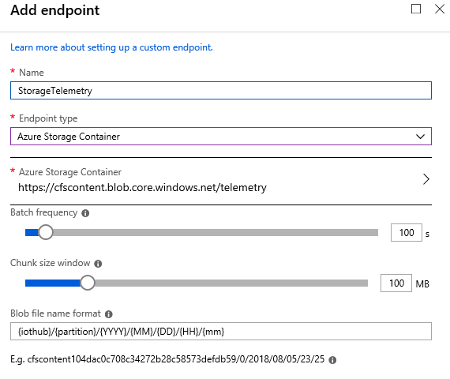
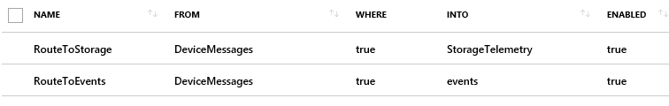

تنشئ أجهزة IoT الكثير من البيانات التي يتم استيعابها في Azure IoT Hub والمتاحة للمعالجة. هذا التدفق من البيانات ضروري للقدرة على توليد رؤى فورية. يعالج قالب تطبيق الوظيفة الإضافية Connected Field Service تدفق البيانات هذا باستخدام وظيفة Azure Stream Analytics. بعد التقييم ورفع التنبيهات، لا يتم الاحتفاظ بالبيانات للاستخدام مرة أخرى بشكل افتراضي.

لديك الخيار أثناء نشر الوظيفة الإضافية Connected Field Service لتمكين خيار Power BI. يؤدي هذا إلى توصيل وظيفة Azure Stream Analytics الثانية بـ Azure IoT Hub للحصول على نسختها الخاصة من بيانات الجهاز. يتم تلخيص هذه البيانات في نوافذ زمنية مدتها دقيقة واحدة واستمرارها في قاعدة بيانات Azure SQL التي يمكن بعد ذلك إدخالها في Power BI وعرضها باستخدام [Power BI قالب التقرير لـ Connected Field Service](https://www.microsoft.com/download/details.aspx?id=54298). يسمح هذا الأسلوب بتخزين غير محدود ولكنه مفصل جداً لسيناريو القالب الحالي. إذا كنت بحاجة إلى دعم بيانات جهاز مختلفة، فستحتاج إلى إنشاء تنسيق الجدول والتقارير الخاصة بك.

## مركز Azure IoT ومركز أحداث Azure

يحتوي Azure IoT Hub على نقاط نهاية متعددة، والنقطة الأساسية لتلقي بيانات الجهاز التفصيلية (رسائل من جهاز إلى سحابة) هي نقطة نهاية متوافقة مع Azure Event Hubs. هذا هو ما يسمح لخدمات مثل Azure Stream Analytics بمعالجة دفق البيانات. هذه الرسائل محدودة بحجم 256 كيلوبايت. يمكنك أيضاً تحديد نقاط نهاية مخصصة إضافية تسمح بتوجيه الرسائل إليها بعد استيفاء معايير التصفية.
يمكن أن تكون نقاط النهاية هذه تخزين Azure أو مراكز الأحداث أو قوائم انتظار ناقل الخدمة وموضوعات ناقل الخدمة. فيما يلي مثال على إضافة نقطة نهاية تخزين Azure.

عندما يكون لديك نقاط نهاية إضافية، فإن مسارات IoT Hub تحدد أين تذهب الرسائل. لا تحصل نقطة النهاية المضمنة للحدث إلا على الرسائل التي لم يتم توجيهها إلى نقاط نهاية أخرى ما لم تقم بإضافة قاعدة صريحة. يمكن تصفية المسار باستخدام [لغة مماثله لـ SQL](/azure/iot-hub/iot-hub-devguide-query-language/?azure-portal=true).

على سبيل المثال، إذا أردنا حفظ نسخة من كل رسالة في مخزن Azure، فستبدو مسارات IoT Hub كما يلي للتأكد من حصول كلتا نقطتي النهاية على كل رسالة من الجهاز.

## أنواع التخزين

لرفع مستوى المناقشة، دعنا نلقي نظرة على التدفق الإجمالي للبيانات من خلال حل IoT الخاص بنا. أحد التصنيفات التي قامت بها الهندسة المرجعية لـ Azure IoT هو النظر إلى تخزين البيانات على أنه إما "سريع" أو "بطيء". حيث يحتاج التخزين السريع إلى الوصول إلى البيانات الحديثة نسبياً مع زمن انتقال منخفض للوصول إلى البيانات. قد يحتفظ التخزين السريع بيوم أو أسبوع أو شهر فقط من البيانات. عادةً ما يستخدم التخزين البطيء تقنية منخفضة التكلفة مثل تخزين Azure وقد يكون تخزينًا طويل المدى لبيانات التفاصيل. يمكن استخدام التخزين البطيء لتدريب نماذج التعلم الآلي المستقبلية أو فقط لتحليل تفصيلي للجهاز في المستقبل.

## Azure Stream Analytics

تحدثنا في سابقاً عن استخدام Power BI، لكن القالب يستخدم قاعدة بيانات Azure SQL كمخزن. هناك طريقة أخرى تكون أكثر اتساقاً مع مفهوم التخزين "البطيء" وهي إنشاء مخرجات أخرى من وظيفة تحليل التدفق التي تكتب مباشرة إلى Power BI. هذه إحدى إمكانات Azure Stream Analytics.
يتيح ذلك عرض البيانات في الوقت الفعلي في Power BI ولكنه مقيد بالقدرة تلقائياً. يحتوي هذا الأسلوب على حد يبلغ 200,000 سجل ويتم الاحتفاظ بالسجلات في تسلسل ما يرد أولاً خارج أول (FIFO).

يمكن لـ Stream Analytics أيضاً الإخراج إلى Azure Cosmos DB. هذه طريقة أخرى يمكنك اتباعها لتخزين البيانات التفصيلية. باستخدام هذا الأسلوب، يتم الاحتفاظ بالبيانات في Azure Cosmos DB من وظيفة Stream Analytics. يمكنك أيضاً زيادة هذه البيانات باستخدام معرف Dynamics 365 لأصل العميل. سيسمح لك ذلك باستخدام موفر الكيان الظاهري Dynamics 365 Azure Cosmos DB لإبراز تفاصيل بيانات تتبع الاستخدام في تجربة المستخدم المستندة إلى النموذج. السماح بعرض بيانات تفاصيل الجهاز في سياق النظر في تنبيه IoT أو سجلات أصول العميل في Dynamics 365 Field Service.

أثناء قيامك بتخصيص تطبيق قالب Connected Field Service ليلائم متطلباتك الفريدة، يجب أن تأخذ في الاعتبار تدفق التخزين والمعالجة لبيانات تفاصيل الجهاز التي تم استيعابها. هناك العديد من نقاط التوسيع من IoT Hub إلى وظيفة Stream Analytics حيث يمكنك النقر وتخزين البيانات التفصيلية التي يمكن أن تكون مفيدة للتحليل على الطريق أو تظهر على الفور لمساعدة الموظفين على الاستجابة لتنبيهات IoT.
