في هذه الوحدة، سنقوم بتعديل وظيفة Stream Analytics للعمل مع البيانات من أجهزتنا الفعلية والتي تأتي بتنسيق مختلف عن الذي تمت محاكاته.  سنقوم أيضاً بتعديل تدفق الوظيفة لتخزين البيانات في Azure Cosmos DB بالإضافة إلى تقييمها بحثاً عن العيوب.

## <a name="exercise-1-using-device-explorer"></a>التدريب 1: استخدام مستكشف الأجهزة 

### <a name="task-1-download-and-install-device-explorer"></a>المهمة 1: تنزيل مستكشف الأجهزة وتثبيته

1.  انتقل إلى [Microsoft Azure مركز SDK IoT لإصدار C# 2019-9-12](https://github.com/Azure/azure-iot-sdk-csharp/releases/?azure-portal=true). 

1.  قم بالتمرير إلى أسفل لتحديد موقع SetupDeviceExplorer.msi وقم بالنقر عليه.

1.  انقر فوق **تشغيل**.

1.  انقر فوق **التالي**.

1.  أكمل عملية التثبيت وانقر فوق **إغلاق**.

### <a name="task-2-connect"></a>المهمة 2: الاتصال

1.  انتقل إلى مدخل Azure الخاص بك وافتح مركز IoT مرة أخرى.

1.  حدد سياسة الوصول المشترك وانقر فوق iothubowner.

1.  انسخ سلسلة **الاتصال - المفتاح الأساسي**.

1.  قم بتشغيل **مستكشف الأجهزة** الذي تم تثبيته على جهازك.

1.  الصق **سلسلة الاتصال** وانقر فوق **تحديث**.

1.  انقر فوق **موافق**.

1.  حدد علامة تبويب **البيانات** وانقر فوق **مراقبة**.

1.  يجب أن تتوفر لديك بيانات المستشعر من جهازك بتنسيق JSON.

    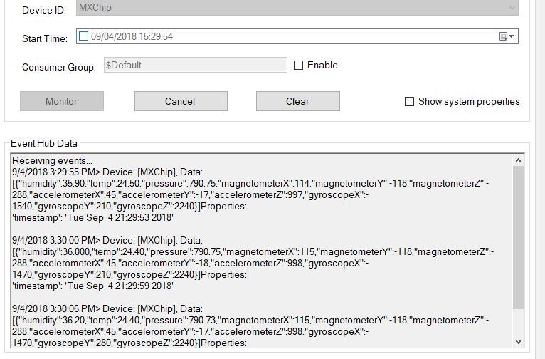

## <a name="exercise-2-azure-cosmos-db"></a>تدريب 2: Azure Cosmos DB

في هذا التدريب، ستقوم بالإنشاء المسبق لـ Azure Cosmos DB التي سيتم استخدامها في التدريب التالي. سيتم استخدام قاعدة البيانات هذه لتخزين بيانات تتبع الاستخدام من الجهاز.

### <a name="task-1-create-azure-cosmos-db"></a>المهمة 1: إنشاء Azure Cosmos DB

1.  انتقل إلى مدخل **Azure** الخاص بك وانقر فوق **إنشاء مورد**.

1.  ابحث عن **Azure Cosmos DB** وقم بتحديده.

1.  انقر فوق **إنشاء**.

1.  حدد **الاشتراك** الخاص بك وحدد **مجموعة الموارد** وقم بتوفير **اسم حساب** فريد وحدد **(SQL) الأساسي** الخاص بواجهة برمجة التطبيقات **API** وقم بتحديد **الموقع** الخاص بك وانقر فوق **المراجعة و**
    **الإنشاء**.

    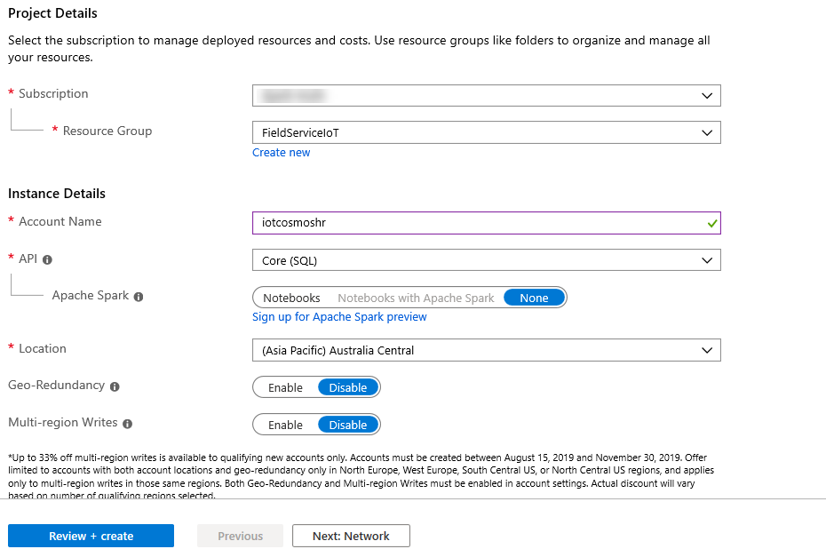

1.  انقر فوق **إنشاء** وانتظر حتى يتم إنشاء **Azure Cosmos DB**.

1.  افتح **Azure Cosmos DB** التي قمت بإنشائها.

1.  حدد **مستكشف البيانات** وانقر فوق **حاوية جديدة** وقم بتحديد **قاعدة بيانات جديدة**.

1.  أدخِل **بيانات تتبع الاستخدام** لـ **معرف قاعدة البيانات** ثم انقر فوق **موافق**.

1.  انقر فوق **...** زر قاعدة البيانات التي قمت بإنشائها.

1. حدد **حاوية جديدة**.

1. أدخِل **DeviceData** **لمعرف الحاوية** وأدخل **معرف الجهاز** لـ  **مفتاح التقسيم** ثم انقر فوق خانة اختيار **التوفير**.

1. قم بتغيير **الإنتاجية** إلى **400** ثم انقر فوق **موافق**. نقوم بتغيير الإنتاجية لتقليل التكلفة.

## <a name="exercise-3-adjust-stream-analytics-job"></a>تدريب 3: اضبط وظيفة Stream Analytics 

في هذا التدريب، ستقوم بتعديل وظيفة Azure Stream Analytics لتلائم بيانات تتبع الاستخدام المختلفة التي يرسلها جهاز MXChip الخاص بك.

### <a name="task-1-add-cosmos-db-as-an-output"></a>المهمة 1: إضافة Cosmos DB كمخرج

1.  حدد **مجموعة الموارد** وافتح **مجموعة الموارد** التي قمت بإنشائها.

1.  حدد موقع **وظيفة Stream Analytics**.

1.  انقر فوق **إيقاف**. يجب إيقاف **مهمة Stream Analytics** قبل أن تتمكن من تغيير الاستعلام والمدخلات/المخرجات.

1.  انقر فوق **نعم**.

1.  بعد توقف المهمة، حدد **المخرجات**.

1.  انقر فوق **إضافة** ثم حدد **Cosmos DB**.

1.  أدخِل **CosmosDB** للحصول على **مخرج الاسم المستعار** ثم قم بتحديد **الاشتراك** وحدد **Cosmo DB** الذي قمت بإنشائه **وقاعدة البيانات** التي قمت بإنشائها وقم بإدخال **DeviceData** لـ **اسم المجموعة** ثم انقر فوق **حفظ**.

### <a name="task-2-adjust-the-query-for-the-device"></a>المهمة 2: ضبط الاستعلام للجهاز

1.  حدد **استعلام**.

1.  قم بوضع المؤشر عند نهاية السطر **14** واضغط على Enter.

    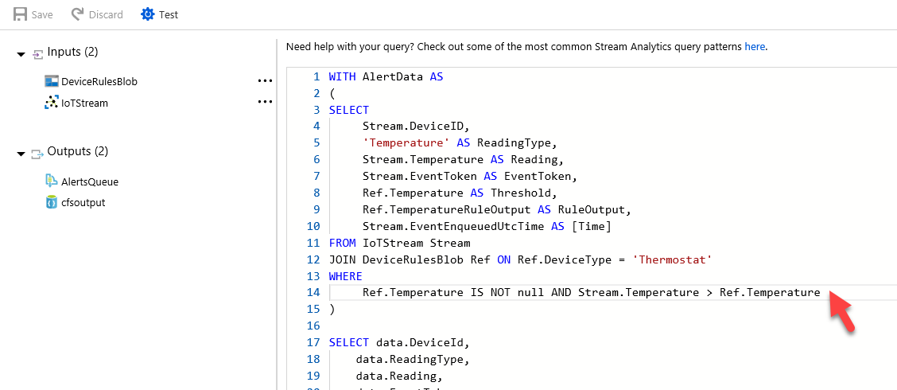

1.  ألصق قصاصة برمجية الاستعلام أدناه. سيسمح هذا للاستعلام بدعم كل من الأجهزة الحقيقية والمحاكاة.

     ```json
    UNION 
    -- MX Chip 
    SELECT 
        GetMetadataPropertyValue(Stream, '[IoTHUB].[ConnectionDeviceId]') as DeviceID, 
        'Temperature' AS ReadingType, 
        (((Stream.temp *9) / 5)+32) AS Reading, 
        GetMetadataPropertyValue (Stream, 'EventId') as EventToken, 
        Ref.Temperature AS Threshold, 
        Ref.TemperatureRuleOutput AS RuleOutput, 
        Stream.EventEnqueuedUtcTime AS [time] 
    FROM IoTStream Stream
    JOIN DeviceRulesBlob Ref ON Ref.DeviceType = 'Thermostat' 
    WHERE 
        Stream.temp IS NOT NULL AND Stream.temp > Ref.Temperature 
    ```

    لاحظ أننا لا نقوم بتعديل أسماء الحقول فحسب، بل نقوم بتحويل درجة الحرارة من مئوية إلى فهرنهايت.

    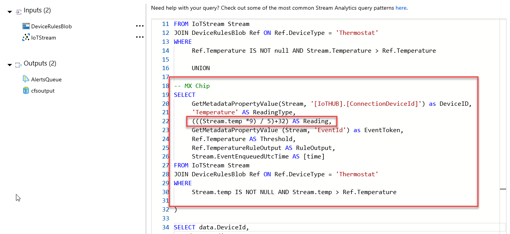

1.  انقر فوق **حفظ الاستعلام.**

### <a name="task-3-add-saved-data-to-azure-cosmos-db"></a>المهمة 3: إضافة بيانات محفوظة إلى Azure Cosmos DB

1.  قم بالتمرير لأسفل إلى نهاية الاستعلام وقم بإضافة القصاصة أدناه إلى الاستعلام. سيؤدي هذا إلى حفظ نسخة من البيانات التي تم استيعابها.

    ```
    SELECT
    IoTHub.ConnectionDeviceId as DeviceID, humidity, temp, pressure, magnetometerX, magnetometerY, magnetometerZ, accelerometerX, accelerometerY, accelerometerZ, gyroscopeX, gyroscopeY, gyroscopeZ INTO CosmosDB
    FROM IoTStream
    ```

    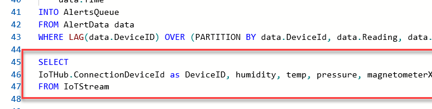

1.  انقر فوق **حفظ الاستعلام** مرة أخرى.

1.  حدد **مستوى التوافق**.

1.  قم بتغيير **مستوى التوافق** إلى **1.2**.

1.  حدد علامة التبويب **نظرة عامة** وقم بإعادة تشغيل الوظيفة.

1.  حدد **الآن** وانقر فوق **أبدا**.

1.  انتظر بدء **وظيفة Stream Analytics**.

1.  انقر فوق **مجموعة الموارد**.

1.  افتح **Azure Cosmos DB** التي قمت بإنشائها.

1. حدد **مستكشف البيانات** وقم بتوسيع **قياس تتبع الاستخدام** وتوسيع  **DeviceData** وقم بتحديد **الأصناف**.

1. يجب أن تحصل على قائمة بالمستندات. انقر فوق أحد المستندين.

    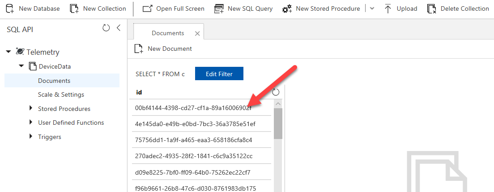

1. يجب أن تحصل على بيانات المستشعر من جهازك.

    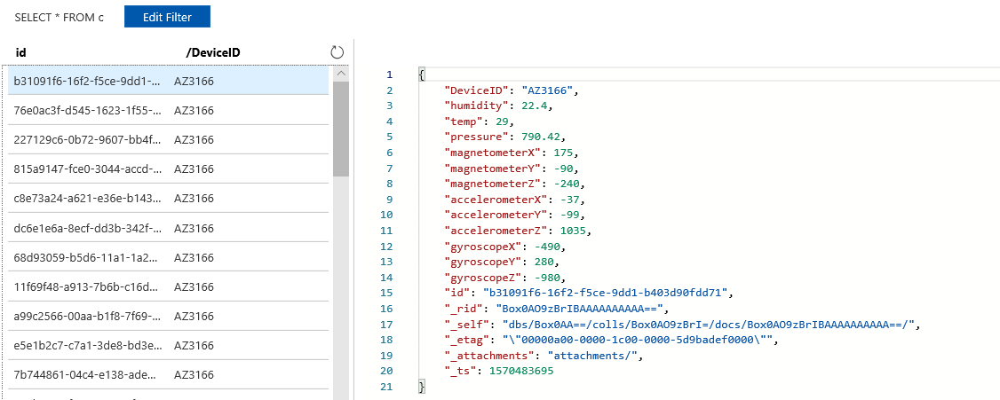

## <a name="exercise-4-build-new-query"></a>تدريب 4: إنشاء استعلام جديد 

في هذا التدريب، ستقوم بإنشاء استعلام جديد لاستبدال استعلام مهمة Azure Stream Analytics الموجودة. ستقوم ببناء هذا الاستعلام الجديد بشكل تدريجي، حتى يمكنك مشاهدة ما تقوم به الأجزاء. تم تصميم هذا المعمل للعمل مع جهازك الفعلي، إذا لم يكن لديك جهاز فعلي، يمكنك تغيير الاستعلام لاستخدام الحقول من جهاز المحاكاة.

### <a name="task-1-add-anomaly-data-collection-to-azure"></a>المهمة 1: إضافة تجميع بيانات خارج عن المألوف إلى Azure

لحفظ نتائج التفاصيل التي تم إنشاؤها من ‏‫اكتشاف الخارج عن المألوف‬، فإننا نحتاج إلى إنشاء مجموعة أخرى في Azure Cosmos DB التي استخدمناها في التدريب العملي السابق. نقوم بذلك لتسهيل رؤية القيم التي تم إنشاؤها من عامل كشف الخارج هن المألوف.

1.  انتقل إلى مدخل **Azure** وحدد مجموعات الموارد، ثم افتح مجموعة الموارد التي قمت بإنشائها عند نشر Connected Field Service.

1.  افتح **Azure Cosmo DB** التي قمت بإنشائها.

1.  حدد **مستكشف البيانات** وانقر فوق ... زر من قاعدة بيانات قياس تتبع الاستخدام وحدد **حاوية جديدة.**

1.  أدخِل **AnomalyData** لـ **معرف الحاوية** وأدخِل **معرف الجهاز** إلى **مفتاح التقسيم** ثم انقر فوق موافق.

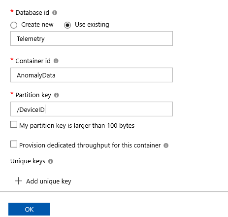

### <a name="task-2-add-new-output"></a>المهمة 2: إضافة إخراج جديد

في هذه المهمة، ستقوم بإضافة إخراج جديد لحاوية AnomalyData.

1.  قم بإغلاق الريشة الخاصة بـ **Azure Cosmos DB** .

1.  حدد موقع **وظيفة Stream Analytics**.

1.  انقر فوق **إيقاف**. يجب إيقاف مهمة Stream Analytics قبل أن تتمكن من تغيير الاستعلام والمدخلات/المخرجات.

1.  انقر فوق **نعم**.

1.  بعد توقف الوظيفة، حدد **إخراج** انقر فوق **+ إضافة** وحدد **Cosmo DB**.

1.  أدخِل **AnomalyDB** للحصول على **مخرج الاسم المستعار** ثم قم بتحديد **الاشتراك** وحدد **Cosmo DB** الذي قمت بإنشائه **وقاعدة البيانات** التي قمت بإنشائها وقم بإدخال **AnomalyData** لـ **اسم الحاوية** ثم انقر فوق **حفظ**.

### <a name="task-3-prepare-and-build-the-new-query"></a>المهمة 3: إعداد الاستعلام الجديد وإنشاءه

1.  حدد **استعلام**.

1.  قم بنسخ الاستعلام الموجود وحفظه في حالة رغبتك في الرجوع إليه لاحقاً.

1.  قم بإلغاء تحديد الاستعلام الموجود، سنقوم بإنشاء حقل جديد خطو بخطوة.

1.  ألصق القصاصة الموجودة أدناه في محرر الاستعلام.

    ```json
    WITH AlertData AS 
    (
    
    SELECT
        IoTHub.ConnectionDeviceId as Device,
        System.Timestamp as tumblingWindowEnd,
           AVG(Stream.temp) as TempC,
           AVG(((Stream.temp*1.8)+32)) as TempF,
           AVG(Stream.accelerometerX) as accelerometerX,
           AVG(Stream.accelerometerY) as accelerometerY,
           AVG(Stream.accelerometerZ) as accelerometerZ
        
    FROM
        IoTStream Stream TIMESTAMP BY IoTHub.EnqueuedTime
    GROUP BY IoTHub.ConnectionDeviceId, TumblingWindow(second, 10)
    ),
    ```

    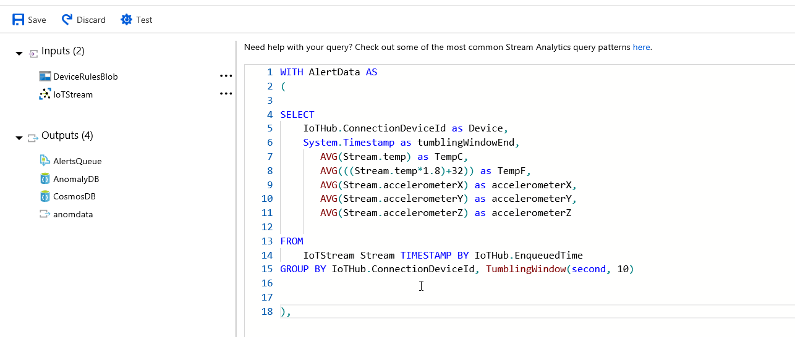
    
    > [!NOTE]
    > سيؤدي ذلك إلى معالجة البيانات الأولية خارج الجهاز والمجموعة في نافذة متقلبة كل 10 ثواني التي سيتم تقييمها لحالات الكشف عن العيوب. نختار استخدام متوسط البيانات الموجودة في النافذة، ويمكنك استخدام أي تجميع تم إجراؤه منذ السيناريو الخاص بك.

1.  قم بلصق ما يلي مباشرة بعد الاستعلام السابق، سيؤدي ذلك إلى استخدام البيانات من الاستعلام الأخير وزيادتها.

    ```json
    FillInMissingValuesStep AS
        (
              SELECT                
                    System.Timestamp AS hoppingWindowEnd,
                    TopOne() OVER (ORDER BY tumblingWindowEnd DESC) AS lastEvent
             FROM AlertData
             GROUP BY HOPPINGWINDOW(second, 300, 5)
    
        ),
    ```

    > [!NOTE]
    > للمساعدة في ضمان توحيد البيانات بحيث لا تتوفر لدينا أي فجوات، حددنا تعبئة الفجوات عن طريق الحصول على آخر حدث في كل نافذة من إطارات القفزات.

1.  قم بلصق الخطوة التالية لإجراء تسجيل الخارج عن المألوف بالفعل.

    ```json
    AnomalyDetectionStep AS (
    SELECT
         lastevent.Device as lastEventDevice,
         hoppingWindowEnd,
                    lastEvent.tumblingWindowEnd as lastTumblingWindowEnd,
                    lastEvent.TempC as lastEventTempC,
                    lastEvent.TempF as lastEventTempF,
                    lastEvent.accelerometerY as lastEventaccelerometerY,
                    lastEvent.accelerometerX as lastEventaccelerometerX,
                    lastEvent.accelerometerZ as lastEventaccelerometerZ,                
                    system.timestamp as anomalyDetectionStepTimestamp,
         ANOMALYDETECTION(lastEvent.TempC) OVER (PARTITION BY lastevent.Device LIMIT DURATION(mi, 2)) as  scores
    FROM FillInMissingValuesStep
    ),
    ```

    > [!NOTE]
    > يستخدم هذا الاستعلام عامل تشغيل ANOMALYDETECTION في قيمة TempC. يتم القيام بذلك على كل جهاز ويتم قياسه لمدة دقيقتين.  يتسبب ذلك في جعل تدريب كشف عن الخارج عن المألوف بالأجهزة خاصاً وقد يستوعب الفروق في درجات الحرارة الأساسية في كل موقع من مواقع الأجهزة. المخرج من هذه النتائج تتم إضافته إلى المخرجات للتقييم في الاستعلام التالي.

1.  قم بلصق ما يلي في الاستعلام الذي تقوم بإنشائه.

    ```json
    AnomalyDetectionFilter AS (
    SELECT lastEventDevice as DeviceId,
        CAST(GetRecordPropertyValue(scores, 'BiLevelChangeScore') as float) as BiLevelChangeScore,
        CAST(GetRecordPropertyValue(scores, 'SlowPosTrendScore') as float) as SlowPosTrendScore,
        CAST(GetRecordPropertyValue(scores, 'SlowNegTrendScore') as float) as SlowNegTrendScore,
        lastEventTempC as Reading,
        'Tempature' as ReadingType,
        'Trend Up ' as Threshold,
        'EventToken' as EventToken,
        lastTumblingWindowEnd as time
    
    FROM AnomalyDetectionStep 
    WHERE 
           CAST(GetRecordPropertyValue(scores, 'SlowPosTrendScore') as float) >= 10      
    union
    SELECT lastEventDevice as DeviceId,
        CAST(GetRecordPropertyValue(scores, 'BiLevelChangeScore') as float) as BiLevelChangeScore,
        CAST(GetRecordPropertyValue(scores, 'SlowPosTrendScore') as float) as SlowPosTrendScore,
        CAST(GetRecordPropertyValue(scores, 'SlowNegTrendScore') as float) as SlowNegTrendScore,
        lastEventTempC as Reading,
        'Tempature' as ReadingType,
        'Trend Down ' as Threshold,
        'EventToken' as EventToken,
        lastTumblingWindowEnd as time
    
    FROM AnomalyDetectionStep 
    WHERE       
          CAST(GetRecordPropertyValue(scores, 'SlowNegTrendScore') as float) >= 10
    )
    ```

    > [!NOTE]
    > يؤدي ذلك إلى تقييم كل من SlowPosTrendScore وSlowNegTrendScore.  القيمة التي تقوم بفحصها هي الحساسية.  قد يكون من الممكن البدء بالمخاطرة عند 3.25، ولكننا نختار أن تنتظر حتى يصبح الأمر أكثر أهمية عند 10.  وفي الحقيقة، ستقوم بضبط ذلك للسيناريو الخاص بك.  لاحظ أيضاً لن لدينا حقول محددة لـ Reading، وReadingType، وThreshold، وEventToken.  وهذه هي البيانات التي يتوقعها تطبيق Logic لأي رسالة يتم إخراجها إلى تنبيهات AlertsQueue الذي ستقوم به في الاستعلام التالي.  في حالة عدم الاحتفاظ بهذه الحقول، يجب تعديل تطبيق Logic App بحيث لا يتوقع وجوده.

1.  قم بلصق القصاصة البرمجية التي تلي القصاصة الأخيرة.

    ```json
    SELECT *
    INTO AlertsQueue
    FROM AnomalyDetectionFilter data
    WHERE LAG(data.DeviceID) OVER (PARTITION BY data.DeviceId, CAST(data.Reading as bigint), data.ReadingType LIMIT DURATION(minute, 1)) IS NULL
    ```

    > [!NOTE]
    > وهذا يقوم بالإدراج الفعلي في تنبيهات AlertsQueue الذي سيتم انتقاؤها بواسطة تطبيق Logic App لإنشاء سجل تنبيه IoT.  لاحظ أننا نحتفظ بعامل LAG في المكان الذي يتم فيه تقييد عدد المرات التي نضع فيها الرسائل في قائمة الانتظار فقط عندما يكون لدى نفس الجهاز لدرجات حرارة مستديرة بيانات جديدة في غضون دقيقة.

1.  للتأكد من أننا قمنا بتسجيل نفس بيانات التفصيل من الجهاز، قم بإضافة الاستعلام التالي مرة أخرى.

    ```json
    SELECT 
    IoTHub.ConnectionDeviceId as DeviceID, humidity, temp, pressure, magnetometerX, magnetometerY, magnetometerZ, accelerometerX, accelerometerY, accelerometerZ, gyroscopeX, gyroscopeY, gyroscopeZ
    Into CosmosDB
    FROM IoTStream TIMESTAMP BY IoTHub.EnqueuedTime
    ```

1. إضافة إلى ما يلي، سيؤدي ذلك إلى حفظ النتائج من عامل كشف الخارج عن المألوف، بحيث يمكنك بسهولة رؤية البيانات عبر مستكشف بيانات Azure Cosmos DB.

    ```json
    SELECT 
    lasteventdevice as DeviceID, hoppingwindowend, lasteventtempc, lasteventtempf, lasteventaccelerometery, lasteventaccelerometerx, lasteventaccelerometerz, anomalydetectionsteptimestamp, scores
    Into AnomalyDB
    FROM AnomalyDetectionStep
    ```

1. احفظ **الاستعلام**.

1. انقر فوق **نعم**.

1. حدد علامة التبويب **نظرة عامة** وانقر فوق **البدء**.

1. حدد **الآن** وانقر فوق **البدء** مرة أخرى.

1. تأكد من نجاح المهمة.

## <a name="exercise-5-testing-the-query"></a>تدريب 5: اختبار الاستعلام 

في هذا التدريب، ستحاول التسبب في تغيير درجة الحرارة الموجودة على الجهاز المادي لاختبار كشف الخارج عن المألوف.

### <a name="task-1-test-the-query"></a>**المهمة 1: اختبار الاستعلام**

والآن هو جزء التحدي، أنت بحاجة إلى شيء لتغيير درجة الحرارة التي يقرأها الجهاز ببطء.  تعمل أكياس الثلج بشكل جيد، مثلها مثل علب الهواء المضغوط.  قد يعمل أيضاً مجفف الشعر أو مدفئ اليد.  تأكد فقط من حماية جهازك حتى لا يبتل أو يؤدي ذلك إلى إتلافه.

1.  وباستخدام إحدى الأدوات المذكورة أعلاه، قم بتغيير درجة حرارة جهازك.

1.  أغلق ريش **Stream Analytics**.

1.  قم بفتح Azure Cosmos DB.

1.  حدد **مستكشف البيانات** وقم بتوسيع **AnomalyData** وحدد **العناصر**.

1.  يجب أن تحصل على قائمة بالتنبيهات. انقر فوق أحد التنبيهات.

1.  يجب أن تتوفر لديك بيانات المستشعر من جهازك.

    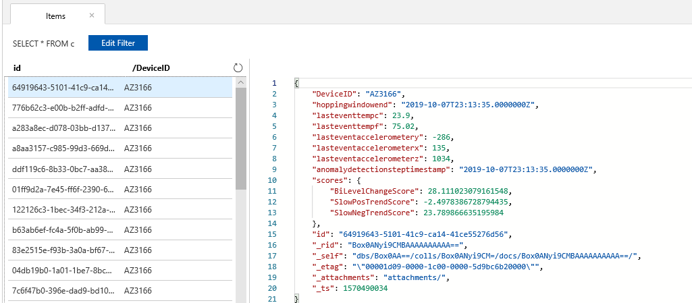

1.  انتقل إلى [Power Apps](https://make.powerapps.com/?azure-portal=true) وتأكد من أنك في البيئة الصحيحة.

1.  حدد **التطبيقات**، وانقر لفتح تطبيق **Connected Field Service**.

1.  حدد **تنبيهات IoT**.

1. افتح أحد التنبيهات.

1. انتقل إلى قسم **بيانات التنبيه** وسترى معلومات المستشعر من جهازك.

    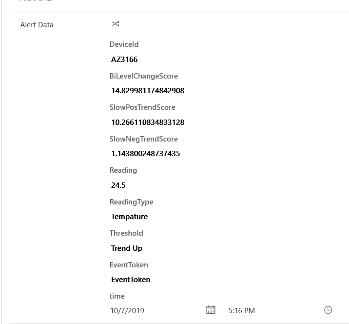
