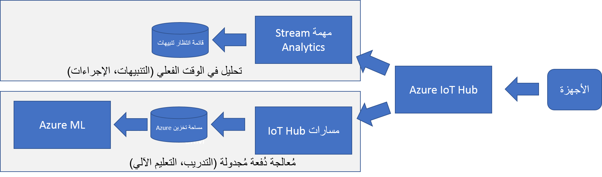
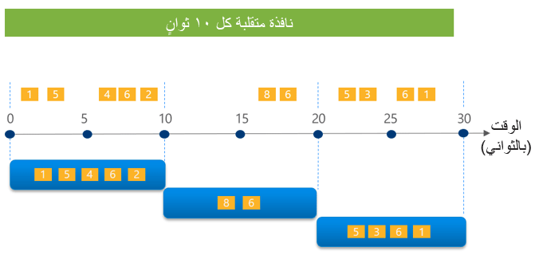

في النظرة العامة، ناقشنا كيفية تعامل Connected Field Service مع اكتشاف الانحرافات باستخدام تطبيق النموذج الافتراضي. في هذه الوحدة، سنناقش خيارات تفصيل كيفية إجراء الكشف.

أول شيء يجب مراعاته هو نوع القواعد أو المعلومات التي تحتاجها للتعامل مع تكوين رؤى للسيناريو الخاص بك. أبسط شكل هو عديم الحالة وثابت. على سبيل المثال، إذا تجاوزت درجة حرارة الغرفة المتحكم بها 20 درجة مئوية أو أقل من 10 درجات مئوية، فستقوم بإصدار تنبيه. لا يتطلب هذا النوع من التقييم بيانات تاريخية لمعرفة مدى تغيره منذ آخر نقطة بيانات، إنه ببساطة نقطة مقارنة بالوقت. بالنسبة لهذا النوع من التحليل، لا تحتاج حقاً إلى وظيفة تحليلات التدفق، بل يمكنك التفكير في استبدالها بوظيفة Azure بسيطة.

## <a name="dealing-with-complex-rules"></a>التعامل مع القواعد المعقدة

عندما تصبح القواعد أكثر تعقيداً، غالباً ما تصبح ذات حالة وديناميكية.
تصبح هذه الأنواع من القواعد أكثر صعوبة في التنفيذ في رمز بسيط لأن الحالة التي يجب الحفاظ عليها عبر مجموعة الأجهزة التي تراقبها. يساعد Azure Stream Analytics من خلال توفير مفهوم النوافذ المستندة إلى الوقت والتي يمكنك تقييمها دون الحاجة إلى كتابة تعليمات برمجية خاصة لتلك السيناريوهات.

أحد الأشياء التي تبرزها الهندسة المرجعية لـ Azure IoT هو مفهوم كسر اكتشاف البصيرة في مسار سريع وبطيء حيث لا يكون المسار البطيء مقيداً بقيود التحليل في الوقت الفعلي. بناءً على مثالنا الخاص بتخزين بيانات القياس عن بُعد في تخزين Azure في الوحدة السابقة، تبرز البنية في المثال التالي باستخدام مسار سريع وبطيء. حيث يمكن أن يأخذ المسار البطيء بيانات التفاصيل من تخزين Azure إلى Azure ML لإنشاء المزيد من التدريب أو الرؤى المتعمقة.



نظراً لأن Azure Stream Analytics ‏(ASA) مضمن في القالب، فلنلقِ نظرة على بعض الأشياء، فهو قادر على القيام به للمساعدة في تحليل تدفق البيانات. لنبدأ بإلقاء نظرة على عبارة أين الافتراضية المستخدمة.
تقوم عبارة أين بمعالجة أي من السجلات التي تقع خارج نطاق الاكتشاف ويضمن إنشاء تنبيه واحد فقط ما لم يكن أطول من دقيقة.

```tsql
WHERE LAG(data.DeviceID) OVER (PARTITION BY data.DeviceId, data.Reading,
data.ReadingType LIMIT DURATION(minute, 1)) IS NULL
```

تقوم هذه الفقرة بذلك باستخدام عامل التشغيل التحليلي LAG، والذي يسمح بالبحث عن حدث سابق في دفق الحدث. سيعيد `OVER (PARTITION...` القراءة السابقة لذلك الجهاز المحدد إذا حدثت في الدقيقة الأخيرة المحددة بواسطة `DURATION`. هذا مثال على طبيعة الحالة الخاصة بـ Azure Stream Analytics، وكيف يدير الحالة لنا.

## <a name="windowing"></a>النوافذ

مثال آخر على ذلك هو القدرة على استخدام قدرات النوافذ.
يحتوي ASA على أربعة أنواع من النوافذ للاختيار من بينها: الهبوط، والتنقل، والانزلاق، والجلسة. سيكون الإخراج من النافذة حدثاً واحداً بناءً على الوظيفة التجميعية المستخدمة. يغير المثال التالي الاستعلام الخاص بنا لإنتاج متوسطات عبر نافذة هبوط مدتها 10 ثوانٍ. هذا يضمن عدم وجود تداخل، ولا يمكن أن ينتمي الحدث إلى أكثر من نافذة واحدة.


ما يلي هو تصور لنافذة هبوط خلال 30 ثانية.



باستخدام هذا النهج، يمكن أن يتم اكتشافنا على متوسطات على مدى فترة زمنية وليس مجرد نقطة في مراقبة الوقت. يمكننا أن ننتقل بهذا إلى المستوى التالي باستخدام ميزة اكتشاف الشذوذ في ASA.

## <a name="detecting-anomalies"></a>كشف حالات الشذوذ

ميزة كشف حالات الشذوذ قيد المعاينة حالياً، ولكنها تضيف عامل التشغيل AnomalyDetection إلى إمكانات الاستعلام. يمكن للمشغل حالياً اكتشاف ثلاثة أنواع من الحالات الشاذة: تغيير المستوى ثنائي الاتجاه، والاتجاه الإيجابي البطيء، والاتجاه السلبي البطيء. خذ مثالنا على غرفتنا الخاضعة للرقابة، حيث تحققنا سابقاً مما إذا كانت درجة الحرارة قد وصلت إلى حدود النطاق لدينا، فهذه هي نقطة زمنية ولا نكتشف إلا عندما وصلنا إلى حدودنا الخارجية. إذا قمنا بتغيير ذلك لاستخدام عامل AnomalyDetection، فقد نكون أكثر إنتاجية عندما نكتشف ارتفاعاً في درجة الحرارة بمرور الوقت قبل أن تصل إلى مستوى الذعر.

يستخدم المشغل منهجاً تعليمياً غير خاضع للإشراف لتدريب النماذج.
بشكل عام، هناك نموذجان يتم الاحتفاظ بهما على التوازي، أحدهما يستخدم لتسجيل النقاط والآخر يتم تدريبه في الخلفية. يتم التدريب من البيانات الموجودة في الدفق الحالي بدلاً من استخدام البيانات خارج النطاق.

كما ترى، هناك العديد من الاحتمالات لكيفية تحديد الاستثناءات ورفع التنبيهات. لقد خدشنا السطح فقط على إمكانات Azure Stream Analytics، والإمكانات المخصصة على الرغم من وظائف Azure أو الخدمات المصغرة لا حصر لها. في الوحدة التالية، ستعمل على تشغيل عامل AnomalyDetection في التمرين العملي.
