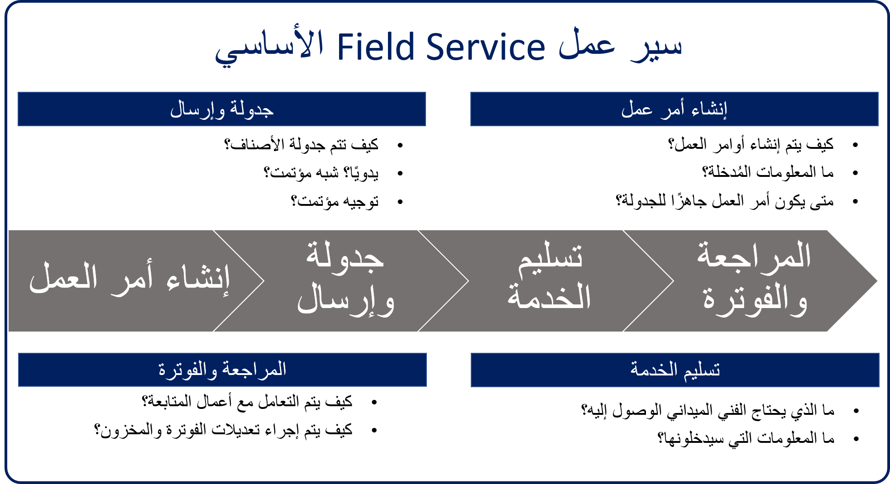

قم بإعداد القوى العاملة المتنقلة لتحقيق النجاح باستخدام Dynamics 365 Field Service. تقديم خدمات في الموقع إلى مواقع العملاء باستخدام أتمتة سير العمل وخوارزميات الجدولة والتنقل.

وتستخدم مجموعه متنوعة من المؤسسات Dynamics 365 Field Service لتقديم الخدمات في الموقع بنجاح.

- **التصنيع:** تقوم شركة تصنيع الأجهزة الطبية بإدارة صيانة الأجهزة في الموقع في المستشفيات والعيادات.
- **الأدوات:** تستجيب شركة الألياف البصرية بإرسال الفنيين إلى مناطق وجود المشكلة.
- **الرعاية الصحية:** يقوم مقدم خدمة الرعاية الصحية في المنزل بجدولة وإرسال العاملين في مجال الرعاية الصحية لإدارة الأدوية وغيرها من الرعاية للعديد من المرضى.
- **صيانة المعدات:** يقوم مدير المرافق بتوفير خدمات الصيانة والإصلاح لمعدات التسخين والتبريد.

### مكان البدء

لتحضير Dynamics 365 Field Service للنشر، يجب مراعاة بعض الأشياء.
سيعمل توزيع Dynamics 365 Field Service بشكل أكثر تشابهاً في تطبيق تخطيط موارد المؤسسة (ERP) من تنفيذ Microsoft Dynamics 365 for Sales أو Microsoft Dynamics365 للخدمة. تتكون عملية التوزيع بشكل عام من أربعة أجزاء:

#### إنشاء أمر العمل - كيفية إنشاء أوامر العمل، وماهية المعلومات المطلوبة
   - هل تعتمد على المكالمات الواردة أو رسائل البريد الكتروني؟
   - هل يمكن إنشاؤها تلقائياً كجزء من اتفاقية خدمة؟
   - هل يجب أن يكون العملاء قادرين على إنشائها من المدخل؟
   - هل يمكن إنشاؤها بناءً على حدث تم تشغيله بواسطة جهاز إنترنت الأشياء (IoT)؟

#### الجدولة والإرسال - عملية جدولة عناصر العمل
-   ما مسؤوليات المرسل؟
-  هل هناك أي عوامل يمكن أن تؤثر على كيفية جدولة العناصر؟
-  كيف سنعرف متى يكون جاهزاً لتحديد موعد؟
-  ما أنواع السيناريوهات التي سيحتاجها المرسل لجدولة العناصر يدوياً؟
-  كيف يمكن أن يبدو الحل شبه المنفذ تلقائياً؟
-  كيف يمكن أن يبدو حل الجدولة المنفذ تلقائياً؟

#### تقديم الخدمة - كيف سيكمل الوكلاء الميدانيون العمل في الموقع
-  ما التفاصيل التي نحتاجها لتقديمها لهم على التذاكر؟
-  ما أنواع المهام التي سيؤدونها في الموقع؟
-  ما المعلومات التي سيحصلون عليها أثناء وجودهم في الموقع؟
-  هل سيعملون بشكل أساسي عبر الإنترنت أو دون اتصال؟
-  هل سيحتاجون إلى أن يكونوا قادرين على التعامل مع خبراء متخصصين أثناء وجودهم في الموقع؟

#### المراجعة والفوترة - كيف ومتى تتم فوترة عنصر بعد اكتمال العمل
   - كيف يتم التعامل مع أعمال المتابعة؟
   - كيف يتم إجراء تسويات الفوترة والمخزون؟

### الترميز الجغرافي

يستخدم Dynamics 365 Field Service خطوط الطول والعرض لتحديد معلومات الموقع. إنّ العناوين في Dynamics 365 مشفرة جغرافياً، لذا يمكن تعريفها بسهولة على الخرائط، ويمكن استخدامها لمقارنة المواقع للعثور على أقرب مورد.

تستفيد Field Service من Universal Resource Scheduling ‏(URS) لجدولة أوامر العمل في التطبيق. يتكون تكوين Field Service من تعريف العناصر في URS وتكوين إعدادات Field Service. أول شيء تريد التأكد من تمكينه هو وظيفة التعيين.   بينما يجب تمكين هذا افتراضياً، يجب عليك التحقق من أنه كذلك.  يمكنك التحقق من هذا في تطبيق **Resource Scheduling**.  انتقل إلى منطقة **الإعدادات**، ثم حدد **الإدارة > معلمات الجدولة**.  عند تعيين حقل الاتصال بالخرائط إلى *نعم*، فإنه يضمن أن لوحة الجدولة ومساعد الجدولة سيستخدمان الخرائط لجدولة العناصر. يستخدم Dynamics 365 Field Service خرائط Bing بشكل افتراضي ولكن يمكن استخدام موفري تعيين مختلفين عن طريق إدراج مفتاح واجهة برمجة التطبيقات (API) للموفر.

### تكوين التخطيط

قبل أن تبدأ تكوين التطبيق، يجب أن تأخذ الوقت اللازم للنظر في ما يجب التقاطه وكيفية تكوين التطبيق لإنجاز ذلك. توفر Dynamics 365 Field Service مجموعة متنوعة من الإعدادات التي يمكن تكوينها.

يجب عليك مراعاة ما يلي:

#### خيارات Resource Scheduling

- ما هي أنواع الموارد التي سنحتاجها؟
- كيف ستتم جدولة الموارد؟
- هل يتم الآن جدولة أوامر العمل فقط، أم يجب مراعاة الكيانات الأخرى؟
- ماذا عن التعامل مع الإجازات؟

   للحصول على المزيد حول URS، وللحصول على الاعتبارات، راجع [Universal Resource Scheduling ‏Field Service](/dynamics365/customer-engagement/field-service/universal-resource-scheduling-for-field-service).

#### جداول Dataverse

-  ضع في اعتبارك أي أعمدة أو طرق عرض أو تخصيصات ضرورية أخرى قد تحتاج إلى القيام بها.

لمزيد من التفاصيل حول تخصيص Dynamics 365، راجع هذه الموارد:

- لمزيد من التفاصيل حول تخصيص كيانات Dynamics 365، راجع [إنشاء كيانات أو تحريرها (أنواع السجلات)](/dynamics365/customer-engagement/customize/create-edit-entities).
- لمزيد من التفاصيل حول تخصيص نماذج Dynamics 365، راجع [إنشاء نماذج وتصميمها](/dynamics365/customer-engagement/customize/create-design-forms).
- لمزيد من التفاصيل حول تخصيص طرق عرض Dynamics 365، راجع [فهم طرق العرض (القوائم)](/dynamics365/customer-engagement/customize/create-edit-views).

#### فئات المنتجات والخدمات

- ما هي أنواع المنتجات التي نبيعها؟
   - هل يتم تعقبها في المخزون؟
- ما هي أنواع المنتجات التي يتم بيعها؟
   - كيف يمكننا الشحن؟

*ستتم مناقشة المنتجات والخدمات بمزيد من التفاصيل فيما بعد.*

#### أنواع المهارات
   - ما هي المهارات التي تحتاجها الموارد للعمل على العناصر؟

> [!VIDEO https://www.microsoft.com/videoplayer/embed/RE2Kmlo]

توجد منطقتان أساسيتان للتكوين في تطبيق Field Service:
-  الإعدادات: منطقة التكوين الأساسية حيث ستحدد الإعدادات التنظيمية، وإعدادات أمر العمل، والمنتجات والمخزون، وإدارة المعرفة، والمزيد.  
-  الموارد: المجال الأساسي حيث ستقوم بتكوين الموارد التي ستستخدمها مؤسستك بالإضافة إلى أشياء، مثل المهارات والأدوار والمزيد.   

#### إعدادات Field Service
تشتمل منطقة إعدادات الخدمة الميدانية على أقسام للمساعدة في التكوين:

-  **عام**: يُستخدم لتحديد إعدادات المؤسسة العامة، مثل الأقاليم وأكواد الضرائب والمنتجات وقوائم الأسعار. 
-  **أوامر العمل**: يُستخدم لتحديد العناصر الخاصة بأوامر العمل، مثل أنواع أوامر العمل والحالات الفرعية وأنواع الحوادث وأنواع مهام الخدمة وقوالب الفحص.
-  **تسليم الخدمة**: يُستخدم لتحديد الإعدادات المتعلقة بالاستحقاقات والحالات الفرعية للاتفاقية.
-  **الشراء**: يُستخدم لتحديد إعدادات أمر الشراء.
-  **المخزون**: تُستخدم لتعريف عناصر، مثل حالات تفويض إرجاع البضائع (RMA) الفرعية وحالات إرجاع إلى البائع (RTV) الفرعية
-  **إدارة المعرفة**: تُستخدم لتكوين قدرات إدارة المعرفة المتوفرة في Dynamics 365 Field Service. 
-  **تكامل Microsoft Teams**: يسمح لك بتكوين تكامل Microsoft Team للسماح بالتعاون مع الموظفين الآخرين من خلال Microsoft Teams دون مغادرة تطبيق Field Service.  
-  **IoT**: يُستخدم لتكوين إمكانات IoT المتاحة مثل الاتصال بموفر IoT، بالإضافة إلى تعريفات الخصائص والأوامر التي يمكن استخدامها للتفاعل مع أجهزة IoT.   
-  **المحيط الجغرافي الظاهري**: يُستخدم لتكوين إمكانات المحيط الجغرافي الظاهري، مثل تحديد الإعدادات وأحداث المحيط الجغرافي الظاهري.  
-  **مدخل العميل**: يُستخدم للمساعدة في تكوين المدخل للمؤسسات التي تستفيد من مدخل الجدولة الذاتية لـ Dynamics 365 Field Service.  
-  **التحليلات والرؤى**: تُستخدم لتمكين التقارير التحليلية المختلفة للخدمة الميدانية مثل التحليلات السابقة لـ Field Service ومدد العمل التنبؤية.  
-  **خصائص الأصول**: تُستخدم لتكوين العناصر المتعلقة بإدارة الأصول، مثل تعريفات الممتلكات.  

#### مستخدمو Field Service وأدوار الأمان

تأتي Field Service مع أدوار الأمان وملفات تعريف أمان الحقل الفريدة لتطبيق Field Service.

من خلال تعيين أدوار الأمان للمستخدمين، يمكنك التحكم في أنواع البيانات والكيانات التي يمكن للمستخدم الوصول إليها وتحريرها. ومن خلال تعيين ملفات تعريف أمان الحقل، يمكنك التحكم في الحقول التي يراها المستخدم لأحد الكيانات. على سبيل المثال، قد يتوفر لدى المستخدم إذن لعرض الحسابات، ولكن ليس لعرض حقول معينه لأحد الحسابات.

أدوار الأمان المضمنة في Field Service هي:

-  **Field Service—المورد**: مصمم للعاملين في الخطوط الأمامية الذين ينفذون أوامر العمل للعملاء في الموقع بشكل أساسي عبر تطبيق Dynamics 365 Field Service للأجهزة المحمولة. هذا الدور لديه فقط قدرات القراءة والتحديث في أوامر العمل. على سبيل المثال، يمكن للعاملين في الخطوط الأمامية عرض وتحديث المعلومات الخاصة بأوامر العمل المعينة لهم فقط.
-  **Field Service—المسؤول**: مصمم لمسؤولي تكنولوجيا المعلومات أو مديري الخدمة. يمكن لهذا الدور الوصول إلى جميع كيانات الخدمة الميدانية بما في ذلك أوامر العمل والجدولة والمخزون. بالإضافة إلى ذلك، يتمتع هذا الدور بقدرات إنشاء وقراءة وتحديث وحذف كاملة (CRUD) في أوامر العمل. على سبيل المثال، يمكن لمسؤول الخدمة الميدانية إنشاء أنواع أوامر عمل جديدة للمؤسسة.
-  **Field Service—المرسل**: مصمم للمجدولين المسؤولين عن إدارة وتعيين مجموعة من أوامر العمل لمجموعة من العاملين في الخطوط الأمامية. يتميز بقدرات حذف محدودة (CRUD) لجدولة الكيانات ذات الصلة داخل وحدة الأعمال الخاصة به. على سبيل المثال، يمكن للمرسلين تحرير وجدولة أوامر العمل للعاملين في الخطوط الأمامية في منطقة واشنطن.
-  **Field Service—شراء المخزون**: مصمم لمديري المخزون المسؤولين عن إدارة مخزون الشاحنات وشراء المخزون وإعادة ترتيبه ومعالجة عوائد المنتجات. هذا الدور له قدرات حذف محدودة (CRUD) للكيانات ذات الصلة بالمخزون داخل وحدة الأعمال الخاصة به. على سبيل المثال، يعالج مديرو المخزون إرجاع منتج لخط عمل واحد أو أكثر. يجب منح دور الأمان هذا للمستخدم بالإضافة إلى أدوار الأمان Field Service-المورد أو Field Service-المرسل.
-  **IoT - المسؤول**: مصمم لمسؤولي تكنولوجيا المعلومات أو مديري الخدمة المسؤولين عن تسجيل الجهاز وعمليات سحب بيانات الجهاز التي تعد عمليات IoTHub ذات الصلة بـ Connected Field Service. يتميز هذا الدور بقدرات الحذف الكامل (CRUD) للكيانات ذات الصلة بـ IoT. على سبيل المثال، قد يتمكن المستخدم الذي لديه هذه الأدوار من الوصول إلى جميع تنبيهات وأجهزة IoT.
-  **IoT - مستخدم نقطة النهاية**: يُستخدم بواسطة Microsoft لتوصيل Dynamics 365 بأنظمة IoT. 
