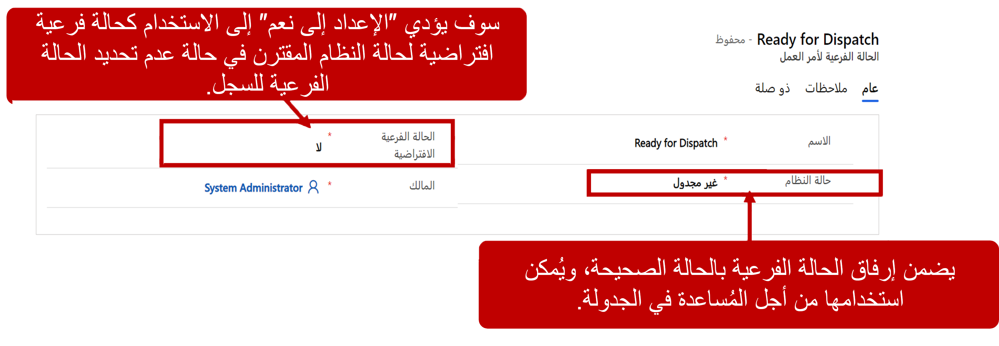

 عند تكوين Dynamics 365 Field Service، ستحتاج إلى تحديد المنتجات والخدمات التي سيتم استخدامها وتسليمها في أوامر العمل. تستخدم Field Service كتالوج منتجات Dynamics 365 التقليدي لتحديد المنتجات والخدمات. 

بعد استيفاء أمر العمل، تتم الإشارة إلى المنتجات والخدمات المتضمنة في أمر العمل، ويتم إصدار فاتورة بها إلى العميل، ثم خصمها من المخزون.

## إعداد المنتج
عند تثبيت حل Field Service، تظهر علامة تبويب إضافية تسمى **Field Service** في نماذج المنتج. ستجد هنا تفاصيل حول المنتج من حيث صلته بـ Field Service.

ابدأ في إعداد منتجاتك في Field Service من خلال تحديد نوع المنتج لكل منتج. هناك ثلاثة أنواع من المنتجات للاختيار من بينها: 

- **المخزون:** المنتجات التي يتم تتبع مستويات مخزونها وخصمها من المخزون عند بيعها. قد تشمل منتجات المخزون الطابعات أو الأجهزة أو الزجاج الأمامي أو السجاد أو أجهزة التلفزيون.
- **غير المخزون:** المنتجات التي يتم بيعها للعميل ولكن لا يتم تعقبها في المخزون. قد تتضمن المنتجات غير المخزون روابط أو كبلات مضغوطة أو عناصر تعاقدية مثل خدمات العناية بالعشب والتي يتم إصدار فواتير بها بنفس المبلغ كل شهر.
- **الخدمات:** الخدمات التي تُباع على أساس الوقت والمواد.
   ومن أمثلة الخدمات رسوم التخلص من الزيت وإعادة التدوير، أو رسوم الصرف الصحي للمنتج، أو رسوم الاستشارة الأولية.
   يتم تعريف جميع الأسعار والتكاليف المرتبطة بالخدمات على أنها أسعار بالساعة. سيكون للخدمات أيضاً مدة خدمة مرتبطة بها عند إضافتها إلى أوامر العمل. يمكن حساب مدة الخدمة بإحدى طريقتين:
   - **يدوي:** يتم إدخال المدة بواسطة الوكيل الميداني باستخدام تطبيق الهاتف المحمول.
   -  **تم الحساب:** سيتم احتساب المدة بناءً على الوقت المنقضي بين حالات جدول أمر العمل.

 

بعد تحديد نوع المنتج الخاص بك، قم بتكوين الإعدادات التالية:

- **رمز UPC:** يدعم تطبيق Field Service Mobile مسح الرمز الشريطي. يُستخدم هذا الحقل لعرض رمز UPC للمنتج.
- **التحويل إلى أصل العميل:** أصل العميل هو قطعة مادية من المعدات في موقع العميل يمكن أن يتم فتح أوامر العمل عليها. يحدد هذا الخيار ما إذا كان يمكن تحويل منتج معين إلى أصل عميل بعد إغلاق أمر العمل المقترن به أم لا.
- **معلومات المورد:** توفير تفاصيل حول البائع الذي تم شراء المنتج منه. يمكنك تحديد اسم المورد الافتراضي واسم الشراء الافتراضي للمنتج.
- **معلومات المحاسبة:** يتضمن ذلك معلومات التكلفة والضرائب، مثل التكاليف الحالية والقياسية، وما إذا كان المنتج خاضعاً للضريبة.

## أسعار المنتجات والخدمات

للتأكد من تحصيل المبلغ الصحيح للمنتجات والخدمات المرتبطة بأوامر العمل، يجب ربط كل منتج وخدمة بقائمة أسعار واحدة أو أكثر. تحدد قوائم الأسعار مستويات الأسعار المتاحة. قد ترغب في تحديد قوائم أسعار متعددة بناءً على ممارسات التسعير الخاصة بمؤسستك.

لضمان استخدام قائمة الأسعار الأكثر ملاءمة، يتم تدوين قوائم الأسعار في السجلات التالية:

- الحسابات
- أوامر العمل
- الاتفاقيات
- سجلات المنتج أو الخدمة الفردية

سيتم تطبيق معلومات قائمة الأسعار بناءً على هذه السجلات. على سبيل المثال، يمكن تحديد قائمة أسعار لأمر عمل عند إنشائه. ومع ذلك، إذا كان للحساب قائمة أسعار مرتبطة به، فسيتم استخدام قائمة الأسعار المرتبطة بسجل الحساب تلقائياً لأمر العمل أيضاً.

عند تحديد عنصر قائمة الأسعار، يكون لديك العديد من خيارات التسعير المختلفة التي يمكن تحديدها للتأكد من أنك تقوم بتسعير العناصر كما ينبغي. على سبيل المثال، هل يجب أن يكون سعر المنتج مبلغاً محدداً، أم يتم تحديد السعر من خلال زيادة التكلفة بنسبة 25 بالمائة؟ أيضاً، إذا كنت تعمل مع الخدمات، فهناك خيارات تسعير إضافية متاحة.

يحدد الجدول التالي خيارات التسعير المختلفة المتاحة للمنتجات والخدمات.

 |ميزة التسعير           |المنتجات       |الخدمات      |
 |:-------------------------|:-------------:|:------------:|
 | المبلغ المحدد          |      X        |       X      |
 | الحد الأدنى لمبلغ الشحن    |               |       X      |
 | الحد الأدنى لمدة الشحن  |               |       X      |
 | الرسم الموحد                 |               |       X      |
 | ٪ من هامش السعر     |               |       X      |
 | ٪ من هامش التكلفة      |       X       |       X      |
 | ٪ من هامش السعر     |       X       |       X      |
 | ٪ من هامش التكلفة      |       X       |       X      |

### تسعير الخدمات

عند إضافة خدمات إلى قائمة الأسعار، حدد من بين الخيارات التالية:

- **الحد الأدنى لمبلغ الشحن:** تعيين الحد الأدنى للمبلغ الذي سيتم فرضه على العميل مقابل الزيارة. تتم إضافة القيمة إلى السعر النهائي بغض النظر عن المبلغ المخصوم.

- **الحد الأدنى لمدة الشحن:** السماح لك بتحديد مقدار الوقت الأول كوقت فراغ. على سبيل المثال، قد لا تتقاضى خدمة تنظيف السجاد رسوماً مقابل الساعة الأولى، لأنها جزء من عرضها الخاص، ولكن بعد الساعة الأولى، يتم إصدار فاتورة للعميل بسعر قياسي.

- **خيار الرسم الموحد:** تحديد رسم موحد. على سبيل المثال، يتم إضافة رسوم التخلص من الزجاج الأمامي إلى كل عملية استبدال للزجاج الأمامي للتخلص السليم من الزجاج الأمامي القديم وإعادة تدويره.

### التعامل مع قوائم أسعار متعددة

يمكن تحديد قوائم الأسعار في أماكن متعددة، مثل أمر عمل أو منتج فردي. من الممكن في بعض الأحيان إضافة عناصر غير موجودة في قائمة الأسعار التي يستخدمها أمر العمل. في تلك الحالات، من المهم تذكر ما يلي:

- يتم استخدام قائمة أسعار أمر العمل إذا كان للمنتج قائمة أسعار افتراضية مختلفة عن أمر العمل.
- سيأتي سعر المنتج من قائمة أسعار المنتج إذا لم يكن العنصر موجوداً في قائمة أسعار أمر العمل.

على سبيل المثال، لنفترض أن مؤسسة ما لديها قائمتا أسعار:

- **قياسي:** الإشارة إلى السعر القياسي الذي يتم تحميله على العملاء.
- **تم الخصم:** الإشارة إلى الأسعار المخفضة التي يتم تقديمها للعملاء الذين لديهم عقد دعم مع مؤسستك.

عند إضافة منتج طابعة جديد وتعريفه، يجب إضافته كعنصر قائمة أسعار إلى كل من قوائم الأسعار القياسية وقوائم الأسعار المخفضة. نظراً لأنه سيتم بيعها باستخدام التسعير القياسي في معظم الأوقات، فسيتم تحديد قائمة الأسعار القياسية على أنها قائمة الأسعار الافتراضية.

لنفترض أننا بحاجة إلى فتح أمر عمل لأحد عملاء العقود لدينا. إنه عميل تعاقد، لذا فإن أي أوامر عمل يتم إنشاؤها لهم ستستخدم أسعاراً مخفضة عند توفرها.

عند إضافة الطابعة إلى أمر عمل العميل، ستستخدم أسعاراً مخفضة لأن قائمة الأسعار المخفضة هي ما يتم استخدامه بواسطة أمر العمل، والطابعة موجودة في كل من قوائم الأسعار القياسية والمخفضة. على الرغم من أن قائمة الأسعار القياسية هي قائمة الأسعار الافتراضية للطابعة، سيظل المنتج يستخدم قائمة الأسعار المخفضة. هذا يضمن أن أسعار الطابعة متسقة مع جميع العناصر الأخرى في أمر العمل.

إذا لم يتم تعريف الطابعة كعنصر قائمة أسعار في قائمة أسعار الخصم، فسيستخدم المنتج تسعير قائمة الأسعار القياسية. هذا لأنه معلومات التسعير الوحيدة التي تنطبق على الطابعة. ستستخدم جميع العناصر الأخرى أسعاراً مخفضة.
