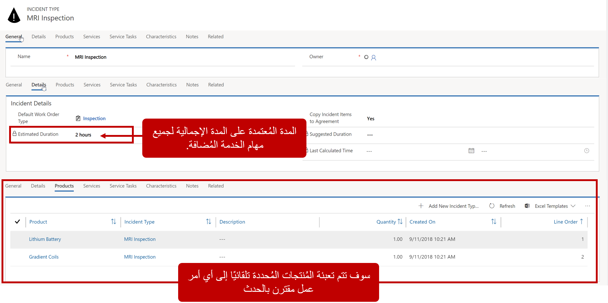
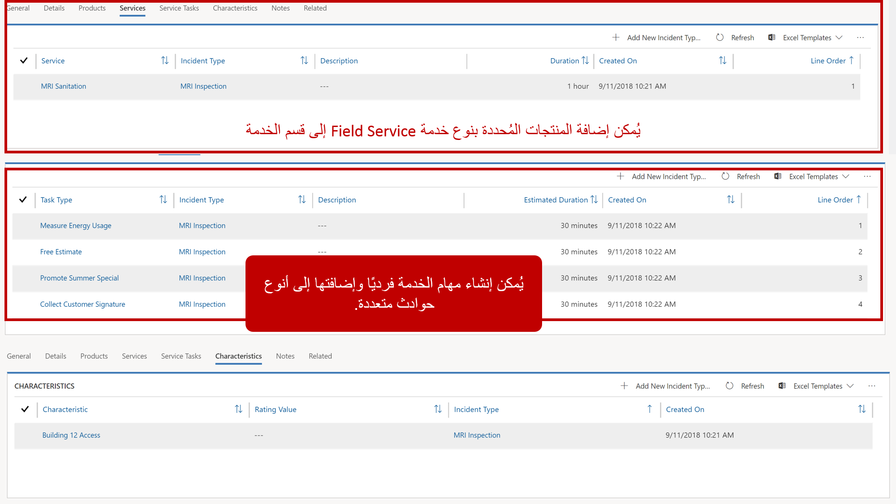
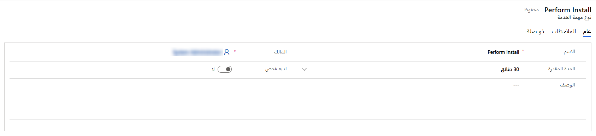
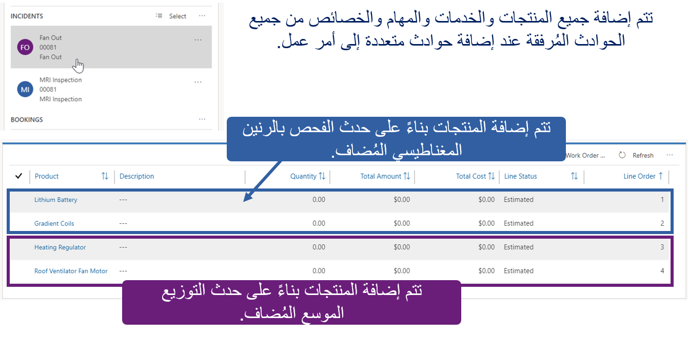

تمتلك العديد من المؤسسات مجموعة من أنواع التذاكر القياسية للخدمات التي تؤديها. غالباً ما تحتوي هذه التذاكر القياسية على منتجات وإجراءات وخدمات لا تختلف كثيراً.

على سبيل المثال، لنفترض أن إحدى الشركات تقدم خدمات التصوير بالرنين المغناطيسي (MRI)، ويتم إرسال المعدات والفنيين بانتظام لإجراء فحوصات التصوير بالرنين المغناطيسي. قد يحتوي فحص التصوير القياسي بالرنين المغناطيسي على ما يلي:

- **المنتجات**
  - 1 بطارية ليثيوم
  - 2 لفائف متدرجة

- **الخدمات**
  - صحة التصوير بالرنين المغناطيسي

- **المهام**
  - قياس استخدام الطاقة: 30 دقيقة
  - استبدال البطارية: 15 دقيقة
  - استبدال ملفات التدرج: 30 دقيقة
  - جمع توقيع العملاء: 15 دقيقة

لتبسيط إنشاء أمر العمل، يمكن إضافة المنتجات والخدمات والمهام القياسية لفحص التصوير بالرنين المغناطيسي بسرعة إلى أمر العمل باستخدام الحوادث. الحوادث عبارة عن قوالب تستخدم لتعبئة أوامر العمل.

### تحديد أنواع الحوادث

لتحديد أنواع الحوادث التي ستحتاجها، في Microsoft Dynamics 365 Field Service حدد علامة الحذف (...)، حدد **إعدادات Field Service**، ثم حدد **أنواع الحوادث**.

قم بتعريف المعلومات التالية:

- **نوع أمر العمل الافتراضي**: نوع أمر العمل المراد تنفيذه (فحص، إصلاح كسر، صيانة وقائية، إلخ.)
- **المهارة / الخصائص:** المهارات أو الشهادات التي يجب أن يمتلكها المورد للعمل على هذا النوع من الأصناف
- **المهام المراد تنفيذها:** قائمة مهام تحدد كل مهمة يتم تنفيذها ومدتها (يتم عرض إجمالي الوقت لجميع المهام إلى أمر العمل وسيتم ملء حقل تقدير المدة في أمر العمل.)
- **المنتجات المطلوبة:** كل منتج وكميته المطلوبة للعمل على التذكرة (يمكن إضافة المنتجات ذات نوع Field Service فقط من *المخزون* أو *غير المخزون* التي يمكن إضافتها كمنتجات.)
- **الخدمات المطلوبة:** كل خدمة سيتم إجراؤها كجزء من التذكرة (يمكن فقط إضافة الأصناف ذات نوع Field Service *كخدمات*.)

 
 

### إنشاء مهام الخدمة

مهمة الخدمة هي المهمة التي يجب إكمالها في أمر العمل. يمكن إضافة مهام الخدمة يدوياً إلى أمر العمل، أو يمكن تعبئتها تلقائياً عن طريق إرفاقها بنوع الحدث. عند إضافة نوع حدث يحتوي على مهمة الخدمة إلى أمر عمل، سيتم إضافة مهمة الخدمة أيضاً. 

لإنشاء مهمة الخدمة، في إعدادات Field Service، تحت **أمر العمل**، حدد **مهمة الخدمة**. 

عند إنشاء مهمة خدمة، ستتضمن ما يلي:

- **الاسم:** يحدد اسم المهمة
- **المدة المقدرة:** يحدد مقدار الوقت المحدد الذي تستغرقه المهمة بشكلٍ عام (يتم تجميع المدة لتعبئة إجمالي المدة المقدرة لأمر العمل)
- **الوصف:** يوفر تفاصيل إضافية حول المهمة

 

وبمجرد إنشاء مهام الخدمة، يمكن الرجوع إليها من خلال العديد من الحوادث أو أوامر العمل. على سبيل المثال، إذا كان كل أمر عمل يقوم به أحد الفنيين مع جمع توقيع العملاء، فيمكنك تحديد نوع مهمة خدمة *جمع توقيع العملاء* مرة واحدة، وإضافته ببساطة عند الحاجة.

### التعامل مع العديد من الحوادث

يمكن أن يحتوي أمر عمل واحد على حوادث متعددة، ويقوم كل منها بتعبئة أمر العمل بالمنتجات والخدمات والمهام. إذا كانت أي عناصر تتم تعبئتها تلقائياً غير ضرورية لأمر العمل، فيمكن إزالتها يدوياً.
 