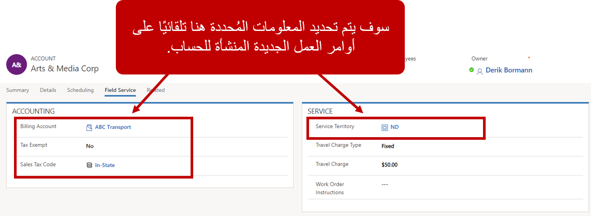

عند إنشاء أمر عمل في Dynamics 365 Field Service، ستحدد حساب خدمة. حساب الخدمة هو سجل الحساب للعمل الذي سيتم إنجازه. عند إنشاء الحساب، يتم تلقائياً ربط المعلومات ذات الصلة منه بأمر العمل. على سبيل المثال، لنفترض أن لديك حساباً بعنوان 1525 181st Avenue North, Bellevue, WA 98004، ويفضل العميل المرتبط بالحساب أن يعمل Randy أو Joni فقط بناءً على طلبهم. يمكنك تحديد هذه المعلومات في سجل الحساب، بحيث تتدفق تلقائياً إلى أي أمر عمل تم إنشاؤه للحساب.

نظراً لأن الحسابات تلعب دوراً مهماً في تنفيذ Field Service، فمن المهم تكوين كل شيء في سجلات الحساب بشكل صحيح.

### العناوين المشفرة جغرافياً

تستخدم Field Service تحديد الموقع الجغرافي لتعيين العناوين. تستند قيم خطوط الطول والعرض إلى عنوان الشارع المحدد في الحساب. يمكنك عرض خط العرض وخط الطول لأحد الحسابات في علامة التبويب **جدولة** في سجل الحساب. 

عند إنشاء أمر عمل، يتم ملء عنوان الحساب تلقائياً. تقارن Field Service العنوان بمعلومات تحديد الموقع الجغرافي للموارد للعثور على الفنيين القريبين، وملء مدد السفر المقدرة، والمساعدة في المعلومات الأخرى المتعلقة بالموقع.

اعرض عنوان مشفر جغرافياً عن طريق تحديد الزر **رمز جغرافي** في شريط الأوامر. ستظهر معلومات خطوط الطول والعرض على الخريطة. عندما تتغير معلومات العنوان، سيتغير خط الطول وخط العرض أيضاً.

### معلومات Field Service

عند تثبيت Field Service، تتم إضافة علامة التبويب **Field Service** إلى سجل الحساب. في علامة التبويب هذه، ستدخل معلومات الحساب التي سيتم استخدامها في Field Service. حدد ما يلي:

- **معلومات المحاسبة:** معلومات متعلقة بالفوترة

  - **حساب الفوترة:** الحساب المسؤول عن الكمبيالة لأنشطة خدمة الحساب
  - **الإعفاء الضريبي:** حالة الإعفاء الضريبي للمؤسسة
  - **رقم الإعفاء الضريبي:** رقم الإعفاء الضريبي للمؤسسة

- **الخدمة**

  - **منطقه الخدمة:** منطقة حساب للخدمة
  - **نوع رسوم السفر:** كيف يجب فوترة رسوم السفر للعميل. تتضمن الخيارات:
    - بالساعة
    - المسافة بالميل
    - ثابت
    - لا شيء
  - **رسوم السفر**: رسوم كل نوع من أنواع رسوم السفر
  - **إرشادات أمر العمل:** محددة، إرشادات متعلقة بالحساب لأوامر العمل

### تفضيلات الموارد

غالباً ما يكون للعملاء تفضيلات الموارد. قد يطلبون من أفراد معينين العمل أو عدم العمل على عناصرهم. يمكن تحديد هذه التفضيلات على مستوى الحساب، ويتم نقلها تلقائياً إلى أوامر العمل عند إنشائها.

عندما تحدد تفضيلات الموارد، يمكنك تحديد ما يلي:

- **المورد القابل للحجز:** المورد الذي ينطبق عليه التفضيل

- **نوع التفضيل:** ما إذا كان هذا المورد من الموارد المفضلة أو المقيدة
  - **المفضل:** مورد مفضل للعمل في أمر
  - **مقيد:** مورد لا يتم تعيينه إلى أمر
  - **تاريخ انتهاء الصلاحية:** التاريخ الذي يمكن فيه إزالة القيد للمورد.

لمزيد من المعلومات حول تحديد تفضيلات الحساب، راجع هذا الفيديو:

>[!VIDEO https://www.microsoft.com/videoplayer/embed/RE2Kewv]

### معلومات حساب إضافية

سيكون لكل حساب أصناف إضافية مقترنة به، والتي توفر معرفة دقيقة بالمؤسسة. وتتضمن هذه العناصر ما يلي:

- **أصول العميل**: معدات محددة قابلة للخدمة لدى العميل. يمكن فتح أمر عمل لهذه الأصول.
- **حسابات مفوترة:** الحسابات المسؤولة عن هذا الحساب لدفع الكمبيالة
- **الاتفاقيات:** أي اتفاقيات دعم مقترنة بالعميل والتي يتم استخدامها لإنشاء أوامر العمل وعمليات الحجز وفق جدول محدد
- **أوامر العمل:** سجل لكافة أوامر العمل المفتوحة والمغلقة المرتبطة بحساب
- **الاتفاقيات المفوترة:** فواتير الاتفاقية السابقة التي تم تحميلها على حساب
- **أوامر العمل المفوتره:** أوامر العمل المتجاوزة المقفلة التي تمت فوترتها للعميل
