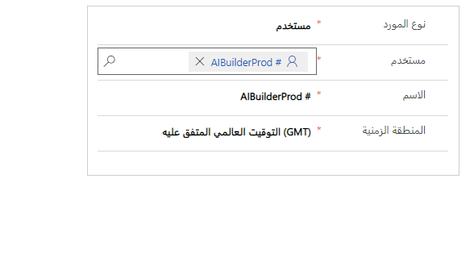
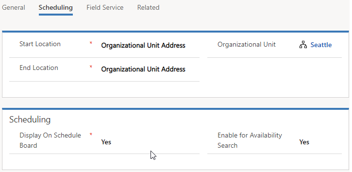
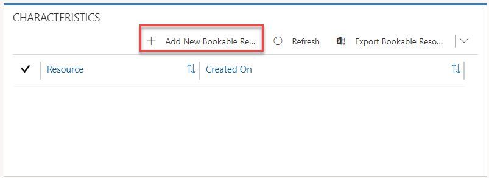
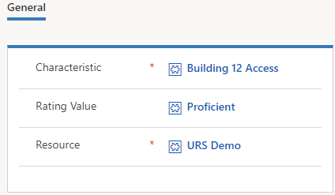
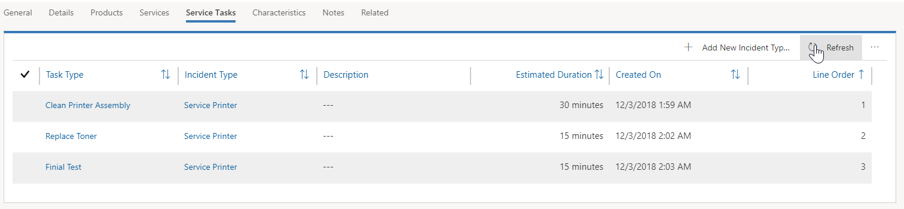

تساعد Dynamics 365 Field Service الشركات على عنونة احتياجات العملاء والتي يمكن أن تختلف حسب نموذج الخدمة والعوامل الأخرى. للقيام بذلك، يجب تكوين Field Service بشكل صحيح قبل بدء إحدى المؤسسات باستخدام التطبيق.

سيقوم هذا التدريب بتقديمك لتكوين Field Service.

### الأهداف التعليمية

بعد إكمال هذا التدريب، ستتمكن من القيام بما يلي:

- إنشاء مهارات الموارد والخصائص
- تمكين التعيين
- إنشاء الموارد
- تحديد أنواع الحوادث

تعمل التمارين والتدريبات العملية في هذه الوحدة النمطية بشكل أفضل إذا توفرت لديك عينة بيانات للعمل معها. إذا لم تتضمن البيئة الخاصة بك عينه البيانات، راجع صفحة [نموذج تثبيت البيانات لتطبيق Field Service](/dynamics365/customer-engagement/field-service/install-sample-data-8-x).

### تمكين خرائط Bing لاستخدام Resource Scheduling

للاستفادة الكاملة من قدرات الجدولة والتعيين المتوفرة مع Field Service، تحقق من كونها مكونة لاستخدام موفر الخرائط. تعد خرائط Bing هي موفر الخريطة الافتراضي، ولكن يمكن تمكين الموفرين الإضافيين.

1. في Dynamics 365، حدد السهم الموجود بجانب النص **Dynamics 365** وحدد **Universal Resource Scheduling**.
2. حدد أيقونة **مخطط الموقع** لتوسيع التنقل. 
3. من القائمة التي تظهر، حدد **الإدارة**.
4. حدد **معلمات الجدولة**.
5. حدد موقع حقل **الاتصال بالخرائط**، وقم بتعيينه إلى *نعم*.
6. احفظ وأغلق الإعدادات.

### تكوين Field Service

في هذا التمرين، ستقوم بتعديل وتكوين إعدادات متعددة لـ Field Service التي سيتم استخدامها من خلال التطبيق. سيتضمن ذلك تحديد المهارات والشهادات والمناطق والموارد وغير ذلك.

### تحديد الخصائص

1. في Dynamics 365، حدد السهم لأسفل بجوار **Dynamics 365**، ثم حدد **Field Service**.
2. باستخدام خريطة الموقع، حدد علامة القطع (...)، وحدد **الإعدادات**.
3. ضمن *إعدادات الجدول* حدد **المهارات**.
4. حدد **جديد**.
5. أدخل *MSCE* في حقل **الاسم**، وحدد **الشهادة** في حقل **الشهادة** **النوع**، ثم حدد **حفظ**.
6. حدد **جديد**.
7. أدخل *MCSA* في حقل **الاسم**، وحدد **الشهادة** في حقل **الأنواع**، ثم حدد **حفظ وإغلاق**.

### تحديد المناطق

1. باستخدام خريطة الموقع، ضمن **إعدادات عامة** حدد **المناطق**.
2. حدد **جديد**.
3. أدخل *ExternalServiceLibrary* في حقل **الاسم** وحدد **حفظ وجديد**.
4. أدخل *جنوب* في حقل **الاسم** وحدد **حفظ وجديد**.
5. قم بإنشاء اثنين من المقاطعات، وقم بتسميتها *بالشرق* *والغرب*.
6. تحقق من وجود أربع مناطق إضافية الآن.

### تحديد الأدوار

1. باستخدام خريطة الموقع، ضمن **إعدادات الجدول** حدد **الأدوار**.
2. حدد **جديد**.
3. قم بإخال *المبيعات المسبقة* لكل من حقل **الاسم** وأيضاً **الوصف** ثم حدد حقل **حفظ**.

### إنشاء المورد القابل للحجز لسجل المستخدم الخاص بك

1. باستخدام خريطة الموقع، ضمن **إعدادات الجدول** حدد **الموارد**.
2. حدد زر **جديد** لإنشاء مورد جديد قابل للحجز.
3. قم بتكوين المورد على النحو التالي:

- **نوع المورد**: *مستخدم*
- **المستخدم**: *سجل* *المستخدم* *الخاص بك*
- **المنطقة الزمنية**: الاحتفاظ بالقيمة الافتراضية في هذا الحقل

4. حدد علامة التبويب **جدولة**، وقم بالتكوين على النحو التالي:

- **الوحدة التنظيمية**: *سياتل*
- **موقع البدء**: *عنوان* *الوحدة* *التنظيمية*
- **موقع الانتهاء**: *عنوان* *الوحدة* *التنظيمية*

    

5. حدد علامة التبويب **Field Service**، وقم بالتكوين على النحو التالي:
- **المعدل بالساعة**: *175*
6. احفظ سجل المورد القابل للحجز، واتركه مفتوحاً.
7. حدد موقع **خصائص** الشبكة الفرعية، وحدد خصائص **إضافة خاصية مورد جديد قابل للحجز**.

    

8. قم بتكوين إعدادات **الخصائص** كما يلي:
- **الخصائص**: *الوصول إلى* *المبنى* *12*
- **قيمة التقييم**: *ممتاز*

    

9. احفظ وأغلق سجل الخصائص.
10. احفظ وأغلق سجل المورد القابل للحجز. 

### إضافة منتج طابعة

1. من تطبيق Field Service حدد **الإعدادات**، ثم حدد قسم *عام* وحدد قسم **المنتجات**.
2. حدد **إضافة منتج** لإنشاء منتج.
3. حدد تفاصيل المنتج كما يلي:

- **الاسم**: *خدمة الطابعة الشهرية*
- **معرف المنتج**: *طباعة-خدمة-1234*
- **مجموعة الوحدات**: *الوحدة الافتراضية*
    - **الوحدة الافتراضية**: *الوحدة الأساسية*
    - **الأرقام العشرية المعتمدة**: *2*

4. حدد علامة التبويب **Field Service** وقم بتعيين **نوع منتج Field Service** إلى *غير مخزن*.
5. قم بتعيين حقل **خاضع للضريبة** إلى *لا*.
6. احفظ المنتج، ثم حدد **نشر**.

### إضافة منتج إلى قائمة الأسعار

1. من تطبيق Field Service حدد **الإعدادات** ثم حدد قسم *عام* وحدد قسم **قوائم الأسعار**.  
2. افتح **قائمة الأسعار الافتراضية**.
3. في **بنود قائمة** الأسعار، حدد **زر إضافة (+)** لإضافة بند قائمة الأسعار.
4. أدخل المعلومات التالية:

   - **المنتج**: *خدمة الطابعة الشهرية*
   - **الوحدة**: *الوحدة الأساسية*
   - **طريقة التسعير**: *مبلغ العملة*
   - **المبلغ**: *750*

5. حدد **حفظ وإغلاق**.
6. قم بإغلاق قائمة الأسعار الافتراضية.

### إنشاء أنواع مهام الخدمة لاستخدامها مع الحوادث

1. باستخدام خريطة الموقع، أسفل **إعدادات أمر العمل** حدد **أنواع مهام الخدمة**.
2. حدد **جديد** ثم أدخل *مُنظف مجموعة الطابعة* لحقل **الاسم**.
3. حدد **30 دقيقة** في حقل **المدة المقدرة**.
4. حدد **حفظ وإغلاق**.
5. كرر الخطوات من 2 إلى 4 لإضافة كل نوع من أنواع مهام الخدمة التالية:

    - **استبدال الحبر**: *المدة **15 دقيقة***
    - **الاختبار النهائي**: *المدة **15 دقيقة***

### إنشاء نوع حدث يسمي طابعة الخدمة

1. باستخدام خريطة الموقع، أسفل **إعدادات أمر العمل** حدد **أنواع الحدث**.

2. حدد **الاسم** وأدخل *خدمة الطابعة* إلى حقل الاسم.
3. حدد علامة التبويب **تفاصيل**، وقم بالتكوين على النحو التالي:

    - **نسخ عناصر الحدث إلى الاتفاقية**: *نعم*
    - **نوع أمر العمل الافتراضي**: *الصيانة الوقائية*

4. حدد **حفظ** لحفظ نوع الحدث وتركه مفتوحاً.
5. حدد علامة التبويب **مهمة الخدمة** ثم حدد **إضافة مهام خدمة نوع حادث جديد**. (في حالة حظر الإطارات المنبثقة، قد تحتاج إلى إلغاء حظرها)
6. أدخل *تجميع الطابعة النظيفة* لحقل **الاسم** وحدد **تجميع الطابعة النظيفة** كنوع المهمة ثم تأكد من تعيين *30 دقيقة* لـ **المدة**
**المقدرة**.
7. حدد **حفظ وإغلاق**.
8. كرر الخطوات من 5 إلى 7 لإضافة العناصر المدرجة أدناه:

