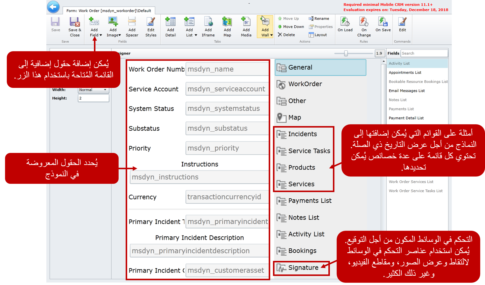
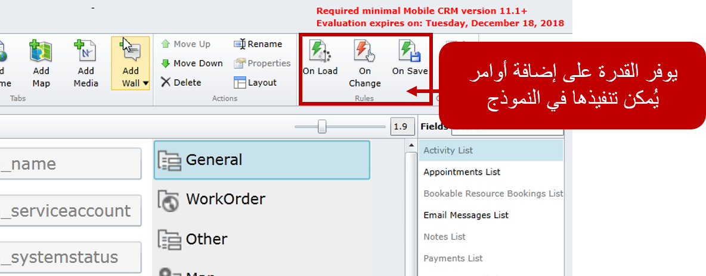

يمكن إنشاء النماذج وتحريرها حسب الحاجة للتأكد من أن الفنيين يرون بالضبط ما هو مطلوب لتقديم الوظائف. يحتوي أمر العمل الافتراضي من على المعلومات التالية:

-   **عام**: يوفر معلومات أساسية حول أمر العمل مثل الرقم وحالة حساب الخدمة والنوع.
-   **غير ذلك**: يقدم معلومات إضافية مثل حساب الفوترة ومعلومات التفضيل.
-   **الخريطة**: توفر معلومات موقع GPS على خريطة لأمر العمل.
-   **حوادث**: يعرض قائمة بجميع الحوادث ذات الصلة المرتبطة بأمر العمل.
-   **مهام الخدمة**: تعرض قائمة بجميع مهام الخدمة المتعلقة بأمر عمل.
-   **المنتجات**: تعرض قائمة بجميع المنتجات المضافة إلى أمر العمل.
-   **الخدمات**: تعرض قائمة بجميع الخدمات المضافة إلى أمر العمل.
-   **قائمة المدفوعات**: تعرض أي مدفوعات مرتبطة بأمر العمل.
-   **ملاحظات**: قائمة تعرض كل الملاحظات المرتبطة بأمر العمل.
-   **قائمة الأنشطة**: تعرض جميع الأنشطة المرتبطة بأمر العمل.
-   **الحجوزات**: تتيح لك رؤية أي حجوزات مرتبطة بأمر العمل.
-   **التوقيع**: يتيح لك التقاط توقيع لأمر العمل.

بينما توفر النماذج الافتراضية المتاحة نقاط بداية جيدة للمؤسسة. في كثير من الأحيان، ستكون هناك حاجة إلى مزيد من التخصيصات للمساعدة على سهولة استخدام النموذج. قد يكون هذا بسيطاً مثل مجرد إضافة حقل جديد إلى النموذج، أو قد يكون أكثر تعقيداً بناءً على المتطلبات.

في كثير من الأحيان، سيتطلب تقديم هذه الوظيفة تعديلات متعددة على أصناف متعددة مثل:

-   كيان Dynamics 365 نفسه
-   الكيان في حل Woodford
-   طريقة عرض و/أو نموذج في حل Woodford

على سبيل المثال، ترتبط الشبكة الفرعية لمهام الخدمة المعروضة في نموذج أمر العمل بكيان مهام خدمة أمر العمل. تعرض القائمة طريقة عرض قائمة مهام الخدمة. تتطلب طريقة عرض قائمة مهام الخدمة فتح كل مهمة لإكمالها افتراضياً. ترغب العديد من المؤسسات في توفير خيار أسهل لمستخدميها.

على مستوى عالٍ يمكن أن يتم ذلك عن طريق:

-   إضافة حقل خيار إلى كيان مهمة خدمة أمر العمل في Dynamics 365 يسمى مكتمل.
-   تمكين الحقل المكتمل لكيان مهمة خدمة أمر العمل في حل Woodford.
-   إضافة الحقل المكتمل كحقل تحرير نص إلى طريقة عرض مهمة خدمة أمر العمل التي يتم عرضها في نموذج أمر العمل.

في حين أن هذه الخطوات عالية المستوى، إلا أنها تساعد في توضيح كيف قد تحتاج التغييرات إلى طبقات فوق بعضها البعض لتقديم حل كامل.

لمزيد من المعلومات حول استخدام النماذج، راجع [طرق عرض متعددة](https://www.resco.net/woodford-user-guide/#__RefHeading__5841_1627906509).

لمزيد من المعلومات حول كائنات النموذج، راجع [IFrame](https://www.resco.net/woodford-user-guide/#__RefHeading__5849_1627906509).

لمزيد من المعلومات حول استخدام إطار الخريطة، راجع [إطار الخريطة](https://www.resco.net/woodford-user-guide/#__RefHeading__5853_1627906509).

### قواعد النموذج

هناك طريقة أخرى يمكن تحسين النماذج بها وهي من خلال قواعد النموذج. تصف قواعد النموذج تسلسل الخطوات التي يتم تنفيذها في الأحداث المتعلقة بالنموذج مثل OnLoad أو OnSave أو OnChange. يتم ربط القواعد بالنموذج والكيان الرئيسي. يتم إنشاء قواعد النموذج من خلال النقر على زر الحدث المقابل.

-   **OnLoad**: يتم تنفيذ القاعدة عند فتح نموذج **التحرير**.
-   **OnChange**: يتم تنفيذ القاعدة عند فتح نموذج **التحرير** ، وكذلك كل مرة يتم فيها تغيير قيمة من حقول النموذج.
-   **OnSave**: يتم تنفيذ القاعدة عند تحديد زر **حفظ**.

يمكن استخدام قواعد النموذج مع الأوامر والأوامر المخصصة لتوفير تجربة مخصصة للمستخدم. على سبيل المثال، قد يحتوي المنتج على حقل UPC تمت تهيئته لاستخدام الماسح الضوئي للرمز الشريطي. عندما يتم مسح رمز UPC ضوئياً وتعبئة القيمة في النموذج، يمكن استخدام قاعدة النموذج لتحديد موقع الورق الأبيض للمنتج المقابل وتحميله في القسم المحدد في النموذج.

تتوفر مجموعة كاملة من الوثائق من Resco. للحصول على تفاصيل حول كيفية استخدام قواعد النموذج والبرمجة النصية، راجع [قواعد النموذج-عند التحميل، عند التغيير، عند الحفظ](https://www.resco.net/woodford-user-guide/#__RefHeading__5859_1627906509).
