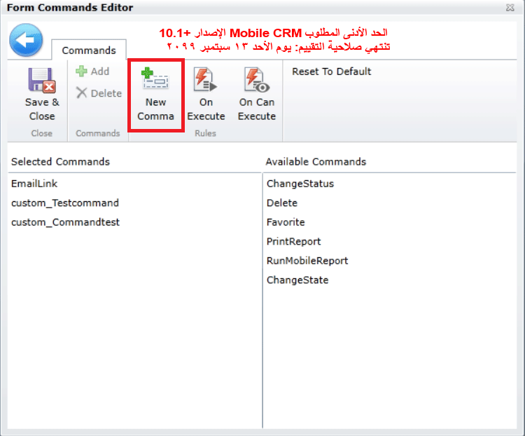
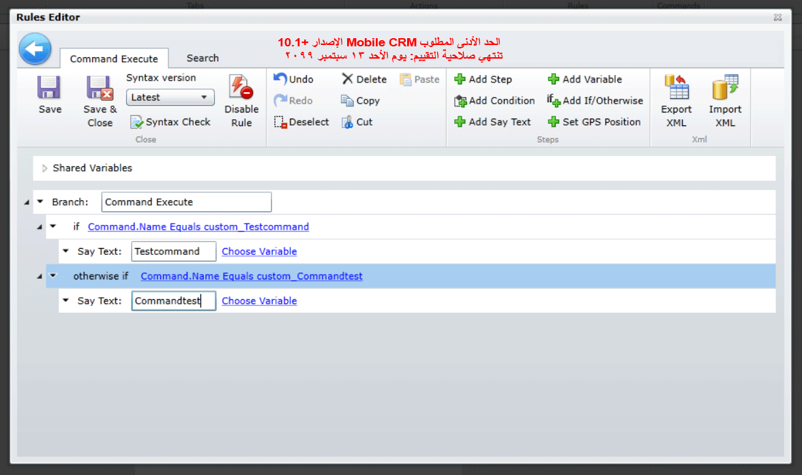
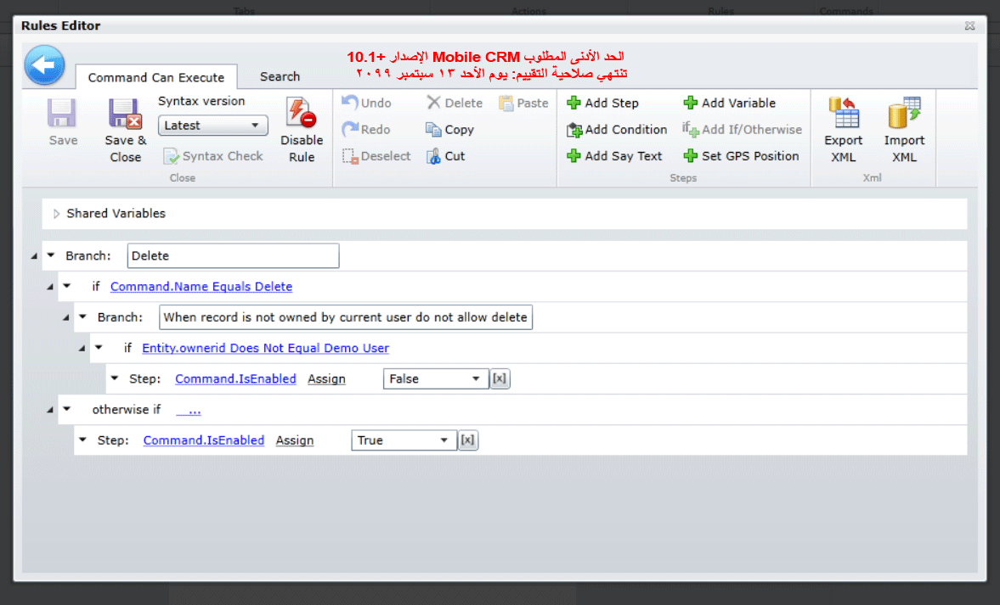

يتيح تطبيق الأجهزة المحمولة Field Service للفنيين في هذا المجال القدرة على الأداء لمعالجة الإجراءات أو تنفيذها بسهولة على السجلات باستخدام قواعد النموذج والأوامر والأوامر المخصصة.

تتضمن بعض الأمثلة الشائعة للأوامر ما يلي:

-   **ChangeState**: تغيير كود حالة السجل. كما يمكنك تحديد خيارات الحالة التي ستكون متوفرة للمستخدمين. سيتم عرض كل خيار حالة كأمر منفصل.
-   **ChangeStatus**: تغيير كود حالة السجل. كما يمكنك تحديد خيارات الحالة التي ستكون متاحة للمستخدمين. سيتم عرض كل خيار حالة كأمر منفصل.
-   **الحذف**: حذف السجل من قاعدة البيانات. في حالة القيام بذلك في وضع عدم الاتصال، بعد إجراء المزامنة، يتم حذفه أيضاً من خادم Dynamics 365.
-   **EmailLink**: يقوم بإنشاء بريد إلكتروني به ارتباطات إلى السجل لخادم Dynamics 365 وتطبيق Field Service Mobile.

يتم إرفاق الأوامر بالنماذج حيث توفر مرونة إضافية وسهولة استخدام القدرات. عندما يتم تخصيص التطبيق، من الممكن تحديد الأوامر التي ستكون متاحة لأي نماذج وفي أي ظروف ستكون متاحة.

بالإضافة إلى الأوامر المرئية، هناك أيضاً العديد من الأوامر المخفية المختلفة المتوفرة. يمكن أن تكون هذه الأوامر المخفية مفيدة للفنيين الموجودين في المجال نظراً لأنها عادةً ما تقدم بيانات GPS وتتفاعل معها.

تشمل الأوامر المخفية المتوفرة ما يلي:

-   **UpdateGPS**: تعيين الموضع الحالي للجهاز لتسجيل حقول خط الطول وخط العرض.
-   **UpdateAddress**: تعيين الموضع الحالي للجهاز (حقول خطوط الطول والعرض) والعنوان (الشارع والمدينة والبلد).

على سبيل المثال، قد ترغب في تحديث موقع الجهاز الحالي الخاص بالفني بعد القيام بتغيير أمر العمل إلى قيد التقدم. وقد يسمح هذا للمرسلين بمعرفة موقع الفني فيما يتعلق بأي أوامر عمل محتملة والتي أحتاج إلى جدولتها.

### أوامر مخصصة

عند الحاجة إلى مرونة إضافية مثل تحديد الشروط التي سيكون فيها الأمر متوفراً وما يمكن القيام به عند استخدام الأمر، يمكنك تحديد الأمر المخصص. 

على سبيل المثال، لنفترض أن الفنيين لا ينبغي أن يكونوا قادرين على حذف المنتجات في أمر العمل بشكلٍ افتراضي. ومع ذلك، في الحالات المحددة (مثل الصنف غير الخاص بالمخزون)، قد ترغب في أن يكون بإمكانهم حذف تلك المنتجات.

عند إضافة الأوامر الافتراضية أو المخصصة إلى نموذج فستحتاج إلى تحديد قواعد On Execute وOn Can Execute rules:

-   **On Can Execute rule**: تعيين متى يمكن للمستخدمين رؤية الأمر واستخدامه. سيتم إخفاء الأمر في الحالات التي لا يكون فيها الإجراء مناسباً.
-   **On Execute rule**: تحدد الإجراءات التي ينفذها الأمر. يمكنك تحديد ما سيتم تنفيذه من خلال الأمر عندما يقوم المستخدم ببدء تشغيله.

ومن الأمثلة البسيطة باستخدام أوامر التنفيذ هو أمر تحديث GPS في علامة التبويب تحرير عنوان النموذج. يجب ألا يغير المستخدمون موضع GPS لسجل تم تعيين موضع GPS له بالفعل حتى تتمكن من إخفاء هذا الأمر في مثل هذه الحالة.

ومن الأمثلة الأخرى عندما ترغب في منع المستخدمين من حذف أحد السجلات. يمكنك تعطيل حذف السجلات بدون وضع الأمر "حذف" في قسم الأوامر المحددة. ولكن ماذا يحدث إذا كنت تريد حذف الأوامر في بعض الحالات؟ يمكنك إضافة أمر الحذف مع إخفائه في حالات محددة. في هذه الحالة، لن نسمح للمستخدمين بحذف السجلات التي يمتلكها مستخدمون مختلفون.

لمزيد من المعلومات حول العمل باستخدام الأوامر المخصصة، يرجى الرجوع إلى [وثائق تخصيص Resco Woodford](https://www.resco.net/woodford-user-guide/#__RefHeading__5863_1627906509).
