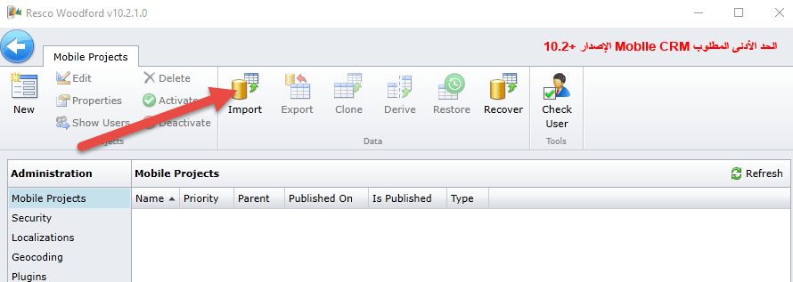
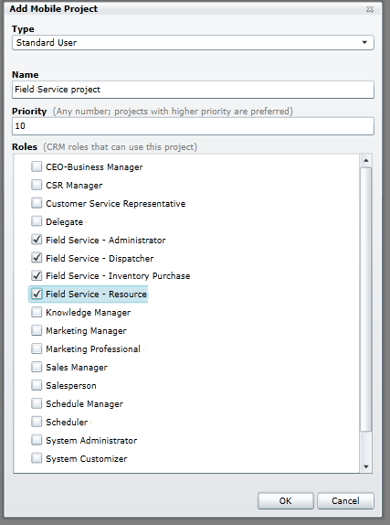
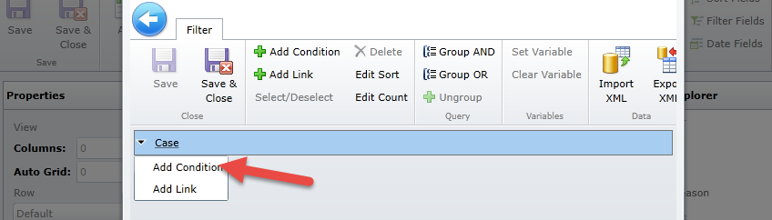
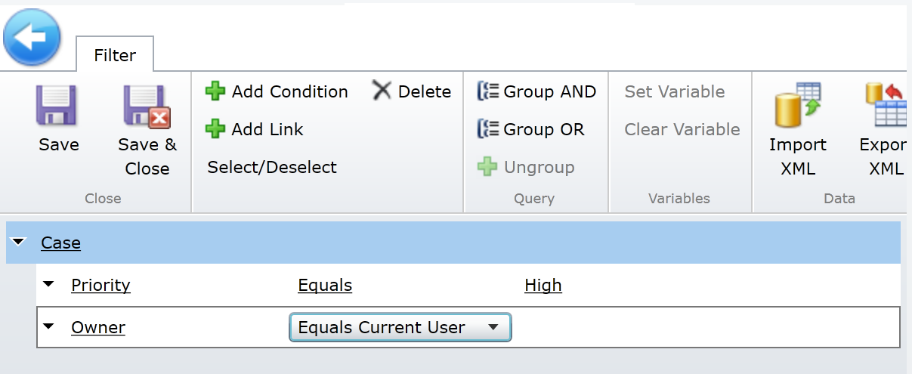
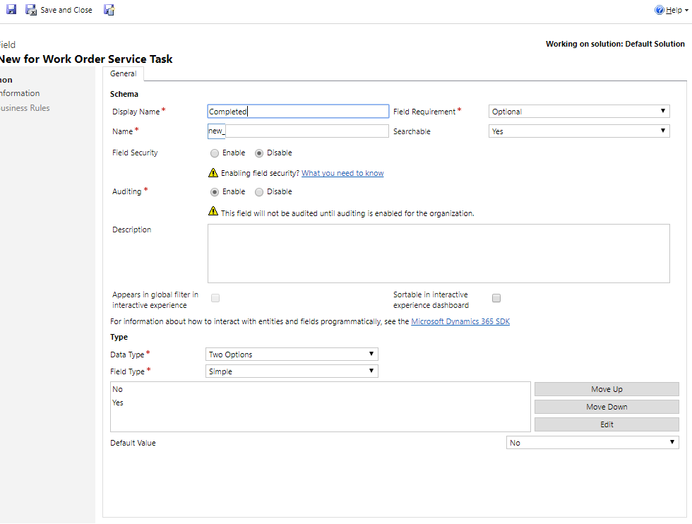
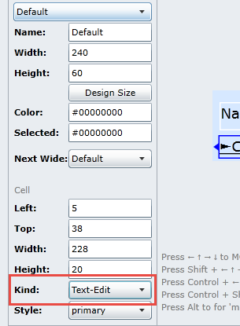
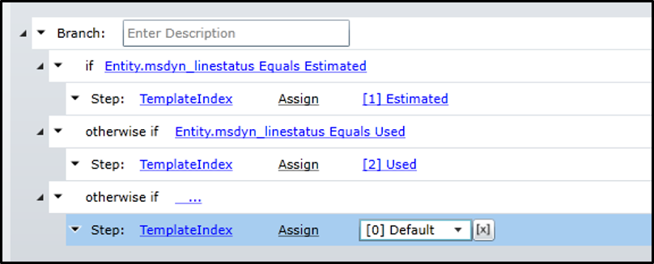

## نشر مشاريع Field Service Mobile وتكوينها

### قبل البدء

تعمل المعامل والتمارين في هذه الوحدة بشكل أفضل عندما تتوفر لديك بعض البيانات النموذجية للعمل معها. اعتماداً على البيئة التي تعمل بها، قد ترغب في تثبيت بعض البيانات النموذجية للمساعدة في التمارين. يوفر Dynamics 365 القدرة على إضافة بيانات نموذجية حسب الحاجة. إذا لم تتوفر لدى البيئة التي تعمل بها أي بيانات نموذجية مثبتة، فاتبع الخطوات التالية لتثبيت البيانات النموذجية في بيئتك.

تعمل المعامل والتمارين في هذه الوحدة بشكل أفضل عندما تتوفر لديك البيانات النموذجية للعمل معها. إذا لم تتضمن البيئة الخاصة بك عينه البيانات، راجع صفحة [نموذج تثبيت البيانات لتطبيق Field Service](/dynamics365/customer-engagement/field-service/install-sample-data-8-x).

### تنزيل حل Field Service Mobile وتثبيته

**قبل البدء:** ستحتاج إلى أذونات المسؤول لتثبيت حل Mobile Dynamics 365 Woodford للأجهزة المحمولة للحصول على قدرات field service في Dynamics 365. كما يلزم أيضاً استخدام Internet Explorer مع Silverlight أو Firefox.

1.  انتقل إلى عنوان URL التالي لتنزيل حل Woodford للأجهزة المحمولة وحفظه من موقع Resco على جهاز الكمبيوتر الخاص بك. <https://www.resco.net/mobilecrm/woodford.html> (يجب عليك تنزيل الحل الذي يتطابق مع إصدار تطبيق Field Service Mobile الذي تقوم بتشغيله وتثبيته.)

    > [!NOTE] 
    > يحتوي الحل على المحرر الذي يمكن تشغيله من حل Dynamics 365. يوصى أيضاً بتنزيل المحرر المستقل. إنه محرر سطح مكتب يمكن تنفيذه من سطح المكتب ولا يعتمد على أي تقنية أخرى وانقر فوق الزر التثبيت.

2.  حدد موقع قسم التطبيق المستقل وانقر فوق الزر تثبيت.
3.  قم بالتبديل إلى مثيل Dynamics 365 الخاص بك حيث تم تثبيت **Field Service**.
4.  انتقل إلى **الإعدادات** \> **الحلول**.
5.  من منطقة **الحلول**، انقر فوق الزر **استيراد**.
6.  حدد موقع حل Woodford الذي قمت بتنزيله سابقاً، وانقر فوق **التالي**، وأخيراً، انقر فوق الزر **استيراد**.
7.  بعد استيراد الحل، يجب أن تشاهد حل **‎Woodford** المسرد في قائمة **الإعدادات**. للتحقق من ذلك، انتقل إلى **الإعدادات**، ثم انقر فوق **Woodford**. **مهم:** إذا لم ترى **Woodford** ضمن قائمة **الإعدادات**، فقم بتحديث الصفحة.
8.  حدد موقع المحرر المستقل الذي قمت بتنزيله. إذا لم يتم بدء تشغيل التطبيق المستقل، فقم بتشغيل التطبيق. إذا تمت مطالبتك بزيادة الحصة النسبية، فقم بتعيين الحصة إلى **100 ميغابايت**، ثم انقر فوق **موافق.**
9.  في مربع الحوار **تحديث المتوفر**، عند \'إعادة المطالبة بتحديث متوفر، انقر فوق **لاحقاً**. (مهم:** *لا تقم بالتحديث حتى إذا كان متاحاً)*
10. إذا طلب منك تثبيت Silverlight، فانقر بزر الماوس الأيمن فوق التطبيق، ثم انقر فوق **تثبيت**.
11. قم بتوفير بيانات الاعتماد مرة أخرى.
12. قم بتوفير بيانات الاعتماد الخاصة بك، وانقر فوق **موافق**.

### قم باستيراد قالب مشروع Field Service Mobile إلى حل Woodford.

بعد تثبيت حل Woodford، ستحتاج إلى تنزيل قالب يساعدك علي تكوين تطبيق الأجهزة المحمولة. يكون القالب مطلوباً إذا كنت تستخدم حل Woodford. يحتوي القالب على جميع التخصيصات الخاصة بتطبيق Field Service Mobile. يمكنك استخدامه لإضافة الحقول والكيانات وطرق العرض والنماذج وإزالتها وتغييرها.

1.  قم بتنزيل ملف temple وحفظه.
    -   إذا كنت تستخدم تحديث ديسمبر 2016 لتطبيق Microsoft Dynamics 365 (online)، فاستخدم قالب[مشروع الأجهزة المحمولة](https://go.microsoft.com/fwlink/p/?linkid=836310) هذا.
    -   إذا كنت تستخدم تطبيق Microsoft Dynamics 365، فاستخدم قالب[مشروع الأجهزة المحمولة](https://go.microsoft.com/fwlink/p/?LinkId=808250) هذا.
2.  انتقل إلى المحرر، وانقر فوق **استيراد**، ثم قم باستيراد ملف قالب مشروع الأجهزة المحمولة الذي قمت بحفظه في الخطوة 1.

    
1.  في مربع الحوار **إضافة مشروع أجهزة محمولة**، قم بما يلي:
    -   بالنسبة إلى **النوع**، حدد **المستخدم القياسي**.
    -   قم بتسمية القالب.
    -   قم بتعيين **الأولوية** إلى *10*.

1.  بالنسبة **للأدوار**، حدد الأدوار التي تريد تطبيق قالب الأجهزة المحمولة هذا عليها، ثم انقر فوق **موافق**. سيرث المستخدم الذي يقوم بتسجيل الدخول ويكون له دوراً يتطابق مع الدور الذي تحدده هنا، هذا التكوين على تطبيق الأجهزة المحمولة.

    

2.  لنشر ملف القالب، في علامة التبويب **مشروع أجهزة محمولة**، انقر فوق **تحرير**.
3.  انقر فوق **موافق**.
4.  في الشاشة التالية، انقر فوق **نشر الكل.**

### تخصيص Field Service Mobile 

والآن بعد إنشاء البيئة الخاصة بك، حان الوقت لبدء تخصيص التطبيق. أولاً، سيتم تخصيص شاشة الرئيسية:

1.  في تطبيق تخصيص Woodford، انقر فوق الزر **الصفحة الرئيسية**.
2.  حدد موقع كيان **الحالة** من قائمة العناصر المتاحة على اليسار واسحبه ضمن المنتج في القسم الرئيسي.
3.  انقر فوق **حفظ**.
4.  انتقل إلى **نسق اللون**\> وانقر فوق **خلفيه العنوان** الموجودة بجوار كلمة العنصر الرئيسي في مقطع السمات.
5.  حدد أي لون ترغب فيه، ثم انقر فوق **تم**.
6.  انقر فوق خلفية علامة التبويب الموجودة بجانب الرمز عام في الجزء السفلي الأيمن. حدد أي لون ترغب فيه، ثم انقر فوق **تم**.
    
5.  انقر فوق **حفظ**.
6.  في الجانب الأيسر من التطبيق، حدد موقع النقر فوق كيان الحالة.
7.  قم بتوسيع كيان الحالة، وحدد الحقول. حدد الحقول الآتية:
-   الاستحقاق
-   الحالة الأصلية
-   الرقم التسلسلي
-   مستوى الخدمة
8.  انقر فوق **حفظ**.
9.  في كيان **الحالة**، حدد **طرق العرض**، ثم انقر فوق الزر **استنساخ**.
10. أدخل **حالات الأولوية القصوى** للاسم، وانقر فوق **موافق**
11. انقر فوق الزر **تحرير عامل التصفية**.
12. قم بتوسيع الحالة وحدد **إضافة شرط**.
    
13. قم بتعيين الشرط إلى **الأولوية** \>**يساوي**\>**عال**.
14. انقر فوق **حالة** مرة أخرى وأضف شرطاً آخر
15. قم بتعيين الشرط إلى **المالك** \>**يساوي المستخدم الحالي**.
16. يجب أن يكون عامل التصفية الذي تم إكماله مشابهاً لما يلي.
    
17. انقر فوق **حفظ وإغلاق**.
18. حدد حقل العميل ضمن عنوان الحالة.
19. في شريط الأوامر، انقر فوق رمز **الأزرار**.
20. ضمن **الأوامر** المتوفرة، انقر فوق **بريد إلكتروني**، ثم انقر فوق **إضافة**.
21. انقر فوق **حفظ وإغلاق**.
22. انقر فوق **حفظ وإغلاق** لحفظ طريقة العرض.
23. ضمن **الحالة**، حدد **النماذج**.
24. انقر فوق **تحرير**.
25. اسحب حقل **الرقم التسلسلي** الموجود أسفل **سبب الحالة**.
26. انقر فوق **حفظ وإغلاق**.
27. انقر فوق **التحقق من الصحة**.
28. انقر فوق **نشر الكل**.
29. افتح تطبيق Field Service Mobile وتحقق من التغييرات.

###  تخصيص كيان مهام خدمة أمر العمل لدعم الوظيفة

في كثير من الأحيان، لن تحتاج فقط إلى تخصيص مشروع الأجهزة المحمولة، ولكن قد تحتاج أيضاً إلى إجراء بعض التغييرات الإضافية في تطبيق Dynamics 365 لدعم الوظائف. في المهمة التالية، سنخصص كيان مهام خدمة أمر العمل في Dynamics 365 والمشروع المحمول للسماح لنا باستخدام مربعات الاختيار لإكمال مهام خدمة أمر العمل.

1.  في مؤسسة Dynamics 365 الخاصة بك، انتقل إلى **الإعدادات** 
    **تخصيصات** > **تخصيص** **النظام**.
2.  في الحل الافتراضي، قم بتوسيع الكيانات و **مهام خدمة أمر العمل**، وانقر فوق **الحقول**.
3.  انقر فوق **جديد** لإنشاء حقل جديد.
4.  قم بتكوين الحقل الجديد على النحو التالي:
    -   **اسم العرض**: مكتمل
    -   **نوع البيانات**: خياران‏‎‏‎
5.  يجب أن يشبه الحقل المكتمل الصورة أدناه:

    
1.  انقر فوق **حفظ** **و** **إغلاق**.
1.  حدد **نشر كل التخصيصات**.

### تخصيص كيان مهام خدمة أمر العمل في حل Woodford

1.  إذا كانت أداة تخصيص Woodford لا تزال مفتوحة، فستحتاج إلى إغلاق المحرر وإعادة تشغيله.
2.  حدد المشروع الذي قمت بإنشائه في وقت سابق، ثم انقر فوق **تحرير**.
3.  قم بتوسيع **مهمة خدمة أمر العمل**، وحدد **الحقول**، وتحقق من الحقل **المكتمل**.
4.  انقر فوق **حفظ**.
5.  انتقل إلى **طرق العرض**، وافتح طريقة عرض **ServiceTaskList**.
6.  في الشريط الموجود بالأعلى، انقر فوق الزر **تحديد الحقول**.
7.  قم بتمكين الحقل **المكتمل**، وانقر فوق **موافق**.
8.  في قسم **الخصائص**، قم بتغيير ارتفاع العرض إلى *60*.
9.  اسحب **مكتمل** إلى أسفل حقل الاسم.
10. في قسم الخصائص، قم بإرسال حقل **النوع** إلى **نص-تحرير**.

    

11. انقر فوق **حفظ وإغلاق**.

### استخدام طريقة العرض المحدثة مع قائمة مهام الخدمة

1.  انتقل إلى **طرق العرض**، وافتح طريقة عرض **ServiceTaskList**.
2.  ضمن طرق العرض **المقترنة**، قم بإلغاء تحديد **DetailedServiceTaskList**.
3.  انقر فوق **حفظ وإغلاق**.
4.  حدد **نشر**.

### إضافة الألوان إلى منتجات أوامر العمل

1.  في تطبيق تخصيص Woodford، افتح مشروع **Field Service Mobile**.
2.  انتقل إلى **منتجات أوامر العمل**، وافتح طريقة عرض **DetailedProductList**.
3.  في الشريط، انقر فوق **تحديد الحقول**، وحدد حقل **حالة البند**.
4.  حدد موقع حقل **الوصف**، وانقر نقراً مزدوجاً فوق الحقل، وقم بتغييره إلى **حالة البند**.
5.  في **الشريط**، انقر فوق **استنساخ صف**.
6.  في حقل الألوان، حدد اللون الذي يناسبك.
7.  أعد تسمية الصف بـ **المقدر**.
8.  قم بإنشاء **صف منسوخ** آخر.
9.  في حقل **الألوان**، حدد لوناً مختلفاً.
10. أعد تسمية الصف بـ **المستخدَم**.
11. في الشريط، انقر فوق الزر **البرنامج النصي للصف**.
12. انقر فوق الزر **إضافة** شرط، وقم بتكوين الشرط كما يلي:
    -   *Entity–msdyn\_linestatus–equals–estimated*
13. انقر فوق **إضافة خطوة**.
    -   قم بتكوين الخطوة كما يلي: **TemplateIndex** -- **تعيين** -- **مقدر**.
14. انقر فوق الزر **إضافة إذا/بخلاف**، وقم بتكوين بقية البرنامج النصي للصف كما هو موضح في الصورة التالية: 
15. انقر فوق **حفظ وإغلاق**.
16. انتقل إلى نموذج **أمر العمل**، وانقر نقراً مزدوجاً فوق علامة التبويب **المنتجات**، وحدد العرض المرمز باللون الذي قمت به للتو.
17. انقر فوق **حفظ وإغلاق**.
18. **انشر** المشروع الخاص بك.
