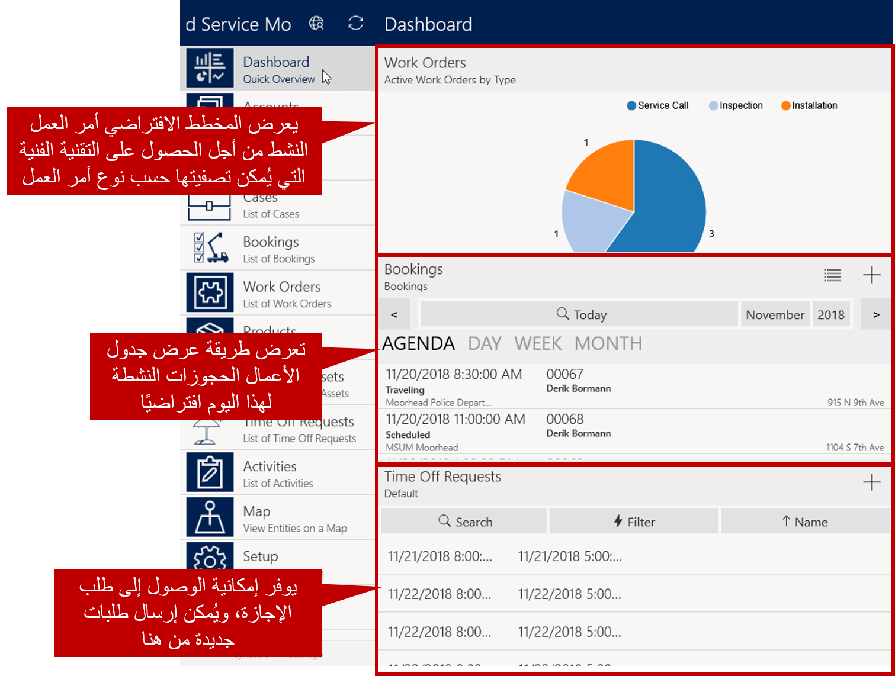
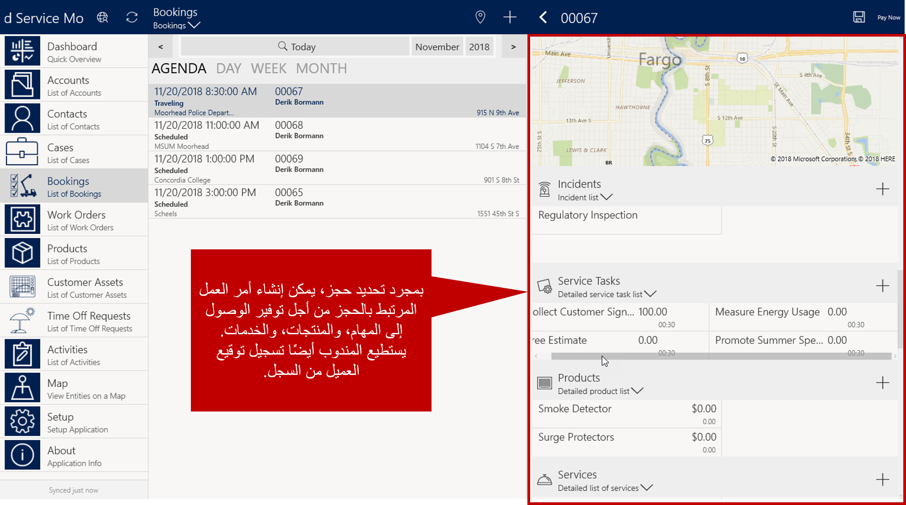

عندما تعمل في هذا المجال، من المهم جداً أن يكون لديك كل المعلومات التي تحتاجها لإكمال المهمة المسندة إليك. بالإضافة إلى ملخص الوظيفة، من المهم أن يكون لديك:

- رموز شريطية قابلة للمسح الضوئي للعناصر التي يتم خدمتها، أو العناصر الجديدة التي يتم تثبيتها.
- ارتباطات إلى أدلة المنتج من العناصر التي يعملون فيها.
- توجيهات مفصلة.
- الماسحات الشريطية الضوئية لالتقاط الأرقام التسلسلية للصنف.

تم تصميم Microsoft Dynamics 365 Field Service Mobileمع وضع عوامل الحقل في الاعتبار. يمكنك بسهولة عرض الجدول الخاص بك واستعراض العملاء وأوامر الأعمال وعمليات الحجز على الخريطة، وكذلك استخدام معلومات GPS للحصول على مواقع العملاء.

يمكنك استخدام Field Service Mobile إما دون اتصال أو عبر الإنترنت. ويمكن للمؤسسة تحديد الوضع المتوفر للمستخدمين، ومتى وكيف يمكنهم استخدام كل وضع.

> [!VIDEO https://www.microsoft.com/videoplayer/embed/RE2Kewt]

### تصفح التطبيق

عند فتح Field Service Mobile، ستشاهد الصفحة الرئيسية الخاصة بك. توفر الصفحة الرئيسية الوصول إلى كل ما لديك إذن لاستخدامه، استناداً إلى تكوين مشروع الجوال.

يتم تضمين العناصر المعروضة في الصفحة الرئيسية على نحو افتراضي

- **لوحة المعلومات:** تقديم معلومات هامة مثل أوامر العمل النشطة وجدول الأعمال اليومي وطلبات الإجازات
- **الحسابات:** عرض قائمة بالحسابات التي يمكن تصفيتها لوضع الرؤية دون اتصال
- **جهات الاتصال:** عرض قائمة بجهات الاتصال التي يمكن تصفيتها لوضع الرؤية دون اتصال
- **الحجوزات:** عرض طريقة عرض جدول الأعمال الذي يعرض حجوزاتك. يمكنك التصفح في أمر العمل المرتبط بكل حجز.
- **أوامر العمل:** تعرض كافة أوامر العمل النشطة والبيانات المتوفرة، ويمكن تكوينها
- **المنتجات:** توفر الوصول إلى المنتجات من كتالوج المنتجات
- **أصول العميل:** تعرض قائمة بجميع أصول العميل
- **طلبات التوقف الزمني:** عرض طلبات التوقف الزمني التي قمت بإرسالها. يمكن إنشاء طلبات التوقف الزمني الجديدة من هنا.
- **الأنشطة:** تعرض الأنشطة النشطة الخاصة بك 
- **المخطط:** توفير وصول تفاعلي إلى الحسابات والحجز وأوامر العمل. ويمكن تصفية البيانات حسب الحاجة.
- **الإعداد:** يوفر الوصول إلى بيانات التكوين للاتصال بالبيئة وتعديل إعدادات التطبيق
- **حول:** توفر معلومات حول الإصدار الحالي من التطبيق

### العمل باستخدام الحجوزات

عند تحديد **حجوزات**، سيظهر عرض جدول الأعمال كافة عمليات الحجز النشطة الخاصة بك. سيتم عرض حجوزات اليوم بشكل افتراضي، ولكن يمكنك استخدام الأسهم للانتقال إلى الحجوزات لأيام أخرى. يوفر عامل التصفية إمكانية العمل مع شهور وسنين مختلفة إذا لزم الأمر.

عندما تقوم بتحديد حجز، ستشاهد تفاصيل حول عمليه الحجز مثل حالة الحجز الحالية والمدة ومعلومات التكلفة. يمكن تعبئة العناصر مثل الأميال المقطوعة تلقائياً أثناء سفرك من موقع عميل إلى آخر.

يمكنك التصفح في أمر العمل المرتبط بكل حجز. عند الانتقال إلى أمر العمل، سيكون لديك حق الوصول إلى كافة المهام والمنتجات والخدمات المقترنة بأمر العمل. يمكنك إنشاء المهام والأصناف حسب الحاجة كما هو الحال في أمر العمل. يمكن استكمال الأصناف الإضافية، مثل التقاط توقيع العميل، من أمر العمل أيضاً.

عند إكمال العمل، يمكنك تغيير حالة الحجز وسيتم تحديث أمر العمل لكي يعكس الحالة. 

### طلبات الإجازات

توفر طلبات إجازات العمل إمكانية الوصول إلى جميع طلبات الإجازات التي قدمتها. يمكنك إنشاء طلبات جديدة بالنقر على **جديد** في أعلى اليسار.

### التعيين

عند تحديد **تعيين**، سيتم عرض الموقع الحالي على خريطة تفاعلية. بشكل افتراضي، ستقوم الخريطة بعرض الحسابات وأوامر العمل والحجوزات الموجودة في المنطقة التي تعمل فيها. يمكنك تصفية العناصر المطلوب عرضها أو البحث عن سجل محدد.

تمثل هذه العناصر التكوين الافتراضي لقالب مشروع Field Service Mobile. يمكن للمؤسسات تعديل مشروع الجوال لإظهار هذه التغييرات في تطبيق الجوال.