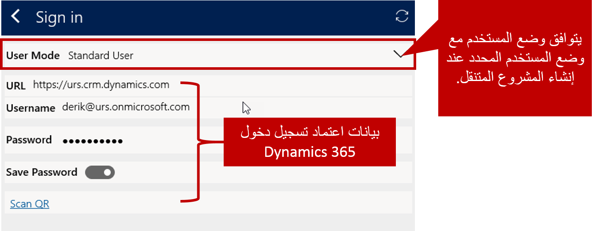

بعد تثبيت حل Resco Mobile CRM Woodford لـ Microsoft Dynamics 365 for Field Service، ونشر مشروع واحد على الأقل من مشاريع Field Service Mobile باستخدام قالب مشروع متنقل، يمكنك نشر Field Service Mobile للوكلاء الذين سيستخدمونها في الحقل.

لنشر تطبيق الأجهزة المحمولة إلى وكلاء الحقل يجب عليك:

- قم بتنزيله على الأجهزة التي يستخدمها وكلاء الحقل.
- قم بتوصيله بمثيل Dynamics 365 حيث يتم تثبيت Field Service وحل Woodford.
- قم بتوفير بيانات اعتماد تسجيل الدخول للعامل الذي سيقوم بالوصول إلى التطبيق.

### العثور على التطبيق

يتوفر تطبيق Field Service Mobile للتنزيل من جميع متاجر التطبيقات الرئيسية. عند البحث عن تطبيق الأجهزة المحمولة، تأكد أنك تحصل على الحل الصحيح. هناك العديد من تطبيقات Dynamics وField Service Mobile المختلفة المتاحة، ويمكن أن يكون مربكاً أيهما يجب استخدامه.

تجنب هذه التطبيقات:

- **Resco Mobile CRM**
  - لم يتم ترخيص Field Service للاستخدام في تطبيق Resco Mobile CRM.
- **Field Service Mobile ‏(2016)**
  - تم استخدام هذا التطبيق مع مثيلات Dynamics 365 التي تقوم بتشغيل Dynamics CRM 2016.
- **Field Service Mobile ‏(2017)**
  - تم استخدام هذا التطبيق مع مثيلات Dynamics 365 قبل إصدار ديسمبر 2018.
- **FieldOne Sky**

تثبيت تطبيق **Field Service Mobile** بدلاً من ذلك.

> [!VIDEO https://www.microsoft.com/videoplayer/embed/RE2KrsU]

### تكوين تطبيق الأجهزة المحمولة

قبل استخدام Field Service Mobile، ستحتاج إلى تكوينه للاتصال ببيئة Field Service. يمكنك تعديل إعدادات العنصر، مثل إعدادات الشبكة والمظهر، في جزء الإعداد. اعتماداً على كيفية تكوين مشروع محمول، قد لا تتوفر إعدادات للمستخدم لتكوينها. 

لتوصيل Field Service Mobile بحساب Dynamics 365 الخاص بمؤسستك، حدد أيقونة **الاتصال** الموجودة بجانب Dynamics 365. ستحتاج إلى إدخال المعلومات التالية:

- **وضع المستخدم:** أدخِل وضع المستخدم الذي تم تحديده عند إنشاء مشروع الأجهزة المحمولة. الوقت الذي يتم تعيينه إلى *المستخدم القياسي*.
- **URL:** أدخِل عنوان URL الخاص بمثيل Field Service الذي تريد الاتصال به. *يجب أن يحتوي المثيل على حل Resco Woodford مثبت ومنشور*.
- **اسم المستخدم:** أدخِل اسم المستخدم للحساب الذي سيتم استخدامه.
- **كلمه المرور:** أدخِل كلمة المرور.
- **حفظ كلمة المرور:** حدد ما إذا كنت تريد حفظ كلمة المرور الخاصة بك أم لا. *قد لا تتمكن من تغيير هذا الإعداد استناداً إلى التكوين الخاص بك.*

بعد إدخال بيانات اعتمادك، حدد أيقونة **إعادة التحميل** للاتصال وإعادة تحميل التطبيق باستخدام مشروعك المتنقل.

إذا كنت قد قمت مسبقاً بتوصيل تطبيق الأجهزة المحمولة بمؤسسة مختلفة، أو إذا كانت هناك تغييرات في التكوين على الخادم، فقد تتم مطالبتك بمسح البيانات المحلية المخزنة على الجهاز واستبدالها بالبيانات المحدثة. لمسحها، حدد **حذف البيانات**.
