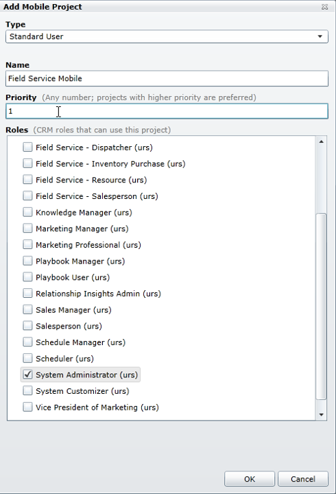

يعتمد تطبيق الأجهزة المحمولة المتاح لـ Microsoft Dynamics 365 for Field Service على Resco Mobile CRM. يوفر Field Service Mobile للمندوبين الميدانيين مجموعة فريدة من القدرات التي لا تتوفر عادةً مع تطبيق Dynamics 365 التقليدي للأجهزة المحمولة. تحتاج المؤسسات التي تقوم بتطبيق Dynamics 365 Field Service إلى نشر تطبيق الأجهزة المحمولة لجميع المندوبين الميدانيين الذين سيقومون بخدمة العملاء. يتضمن نشر Field Service Mobile عدة خطوات للتأكد من أن المندوبين يمكنهم استخدام جميع الميزات وتشغيل التطبيق بنجاح.

للتأكد من أن المندوبين يمكنهم تشغيل واستخدام Field Service Mobile، ستحتاج إلى نشر مشروع محمول لمثيل Dynamics 365 الذي قمت بتثبيت Field Service عليه. ستحتاج أيضاً إلى تنزيله ونشره لكل مندوب ميداني يمكنه الوصول إليه.

لنشر عميل Field Service Mobile:

- وزع مشروع Field Service Mobile وانشره باستخدام حل Resco Woodford.
   - قم بتنزيل حل Woodford.
   - قم باستيراد حل Woodford إلى مثيل Dynamics 365 for Field Service الخاص بك.
   - قم بتنزيل المحرر المستقل.
   - قم بتنزيل قالب مشروع Field Service Mobile.
   - قم باستيراد قالب مشروع Field Service Mobile.
   - تعيين أدوار الأمان لمشروع الأجهزة المحمولة.
   - انشر مشروع Field Service Mobile.
- انشر تطبيق Field Service Mobile على المندوبين الميدانيين.
   - قم بتنزيل العميل المحمول.
   - قم بتوصيل العميل المحمول بمثيل Dynamics 365 حيث تم تثبيت Field Service.

> [!IMPORTANT]
> يعد اتباع الخطوات الموضحة أعلاه أمراً بالغ الأهمية لضمان النشر الناجح لتطبيقات الأجهزة المحمولة. إذا لم يتم اتباع هذه الخطوات، فقد لا يتمكن المندوبين من الوصول إلى التطبيق، أو قد لا يعمل بشكل صحيح.

### تنزيل حل Woodford والمحرر المستقل

يستخدم Field Service mobile حل Woodford لنشر التطبيق وتخصيصه. يوفر الحل الوصول إلى أدوات التخصيص والنشر الضرورية وكذلك يساعد في إنشاء ونشر مشاريع الأجهزة المحمولة.

### أرقام الإصدارات

يعتمد Field Service Mobile على حل Resco Mobile CRM Woodford، الإصدار 11.1.1. في وقت إنشاء هذه الدورة التدريبية، كان حل Woodford في الإصدار 11.2.2. قد تحتوي الإصدارات الأحدث على عناصر غير متوفرة في Field Service Mobile. في حين أنه من الممكن إنشاء وتعديل مشاريع Field Service باستخدام إصدار أعلى، فمن الممكن أن تضيف ميزات غير متوفرة. لهذا السبب، يوصى باستخدام الإصدار 11.1.1 من الحل أو النشر إليه على الأقل عند نشر مشروعات الأجهزة المحمولة.

يمكنك تنزيل إصدار حل Resco Woodford المطلوب لمؤسستك من صفحة [نظرة عامة على Resco Woodford](https://www.resco.net/mobilecrm/woodford.html).

عند الوصول إلى الموقع، من المحتمل أن يستخدم إصدار الحل أحدث إصدار. إذا كنت تفضل استخدام إصدار سابق من الحل، فحدد رابط **محفوظات إصدار Woodford** على الصفحة. سيعرض هذا قائمة بجميع الإصدارات السابقة من الحل. يمكنك تحديد الإصدار المحدد الذي تريد استخدامه. *تذكر: يوصى باستخدام الإصدار 11.1.1 على الأقل.* لتنزيل حل Woodford المُدار والذي يمكن استخدامه مع مثيل Dynamics 365، حدد **تنزيل للأعوام 2013 و2015 و2016**.

### استيراد حل Woodford

بعد تنزيل الحل، يمكن استيراده إلى بيئة Dynamics 365 الخاصة بك.

لاستيراد الحل، انتقل إلى **الإعدادات** \> **الحلول**، وحدد زر الاستيراد. تأكد من تحديد حل Woodford (على سبيل المثال Woodford\_11\_1\_1\_1\_المدار) واتبع المطالبات الموجودة على صفحة حل الاستيراد لإنهاء نشر الحل. بمجرد تثبيت الحل، يمكنك عرض الحل ورقم الإصدار بالانتقال إلى **الإعدادات** \> **الحلول.**

بعد استيراد الحل، سترى العناصر التالية قد تمت إضافتها إلى مثيل Dynamics 365 الخاص بك ضمن الإعدادات:

- **Woodford:** أداة التخصيص المستخدمة لتخصيص ونشر مشاريع الأجهزة المحمولة
- **التدقيق عبر الأجهزة المحمولة:** توفير الوصول إلى أدوات وميزات التدقيق.

اعتماداً على إصدار الحل الذي قمت بنشره، قد يتم عرض عناصر إضافية مثل عمليات الفحص وتعقب الموقع أيضاً.

### استخدام المحرر المستقل

أسهل طريقة لإنشاء ونشر مشاريع الهاتف المحمول هي استخدام محرر Resco Woodford المستقل. المحرر المستقل هو تطبيق سطح مكتب مثبت على جهاز عميل ويتصل بمثيل Dynamics 365 الذي يحتوي على Field Service وحل Woodford المنشور عليه.

لتنزيل المحرر المستقل لأحدث إصدار من حل Woodford، راجع صفحة [نظرة عامة على Resco Woodford](http://www.resco.net/mobilecrm/woodford.html). يمكنك التغيير إلى إصدار سابق باستخدام رابط **محفوظات إصدارات Woodford**.

عند تشغيل المحرر لأول مرة، قد يُطلب منك زيادة الحصة المخصصة لمنطقة التخزين المعزولة لضمان عدم حدوث أخطاء. يوصى بزيادة الحصة إلى 500 ميجا بايت لتكون آمنة.

ستحتاج إلى توصيل المحرر بالمؤسسة التي نشرت فيها حل Woodford، بالإضافة إلى توفير عنوان URL للمثيل ومعلومات تسجيل دخول المستخدم. ستحتاج أيضاً إلى ملء معلومات تسجيل المستخدم قبل أن تتمكن من استخدام المحرر.

> [!Note] 
> عند تحميل المحرر، قد يتم إخطارك بتوفر إصدار أحدث من الحل. لا تقم بالتحديث إلى الإصدار الأحدث. قد يمنع التحديث فتح التطبيق.

> [!IMPORTANT]
> عند استخدام المحرر، يجب أن تتأكد من أن إصدار الحل للمحرر المستقل وإصدار حل Woodford المثبت في مثيل Dynamics 365 لديك متماثلان. إذا لم تتطابق، فمن المحتمل ألا يتم تحميل المحرر بشكل صحيح، ولن تتمكن من نشر الحل.

إذا واجهت مشكلة في فتح المحرر، فقم بأحد الإجراءات التالية:
-  قم بإزالة حل Woodford من مثيل Dynamics 365 الخاص بك واستبدله بالإصدار الذي يستخدمه المحرر. 
-  قم بإزالة المحرر المستقل واستبدله بالإصدار المثبت في Dynamics 365.

### تنشيط تراخيص Field Service Mobile

تحصل المؤسسات التي تستخدم Dynamics 365 for Field Service على حق الوصول إلى Field Service Mobile كجزء من ترخيصها. يجب أن ترسل مؤسستك طلباً لتنشيط تراخيص الهاتف المحمول قبل أن يتمكن المستخدمون من الوصول إلى تطبيق الأجهزة المحمولة.

بالإضافة إلى ذلك، يتوفر حل Woodford في فترة تجريبية مدتها 30 يوماً. لتمديد هذه الفترة أو استعادة بيئة (أو القيام بأي عمل يغير معرّف المؤسسة)، يجب تقديم طلب تنشيط جديد.

للحصول على معلومات إضافية حول تنشيط تراخيص Field Service Mobile، راجع [تمديد تجربة أداة تكوين Field Service Mobile] (‏/dynamics365/customer-engagement/field-service/activate-fs-mobile-app-license)

### استيراد وإعداد مشاريع الأجهزة المحمولة

بعد قيامك بنشر حل Woodford والاتصال بمثيل Dynamics 365 الذي يحتوي على الحل، ستقوم بإنشاء مشاريع أجهزة محمولة. *مشروع الأجهزة المحمولة* هو الملف الذي يقوم المندوبين بتحميله والوصول إليه عند استخدامهم تطبيق الهاتف المحمول للخدمة الميدانية.

للمساعدة في إنشاء مشاريع متنقلة، يتم توفير قالب مشروع Field Service. يساعدك القالب في تكوين الكيانات الضرورية المتعلقة بـ Field Service التي يمكن استخدامها في التطبيق. يمكنك تنزيل النموذج من صفحة [قالب مشروع الأجهزة المحمولة](https://go.microsoft.com/fwlink/p/?linkid=836310).

بعد تنزيل المشروع، ستقوم باستيراده كمشروع محمول. حدد **استيراد**، ثم حدد قالب **CentaurusStoreVersion.woodford** الذي قمت بتنزيله سابقاً.

عند استيراد مشروع، ستحتاج إلى تقديم المعلومات التالية:

- **النوع:** تحديد نوع المستخدم الذي سيصل إلى هذا المشروع. عادةً، ستختار قياسي، ما لم تكن بحاجة إلى مستخدمين خارجيين أو مجهولين للوصول.
- **الاسم:** تحديد اسم المشروع
- **الأولوية:** تحديد أولوية رقمية للمشروع
- **الأدوار:** تحديد أدوار الأمان التي سيكون لها حق الوصول إلى المشروع. تمثل الأدوار أدوار أمان Dynamics 365 الموجودة في مؤسستك.

  
> [!Note]
> ستتم مناقشة أدوار أمان Dynamics 365 وكيفية ارتباطها بمشاريع الأجهزة المحمولة لاحقاً.